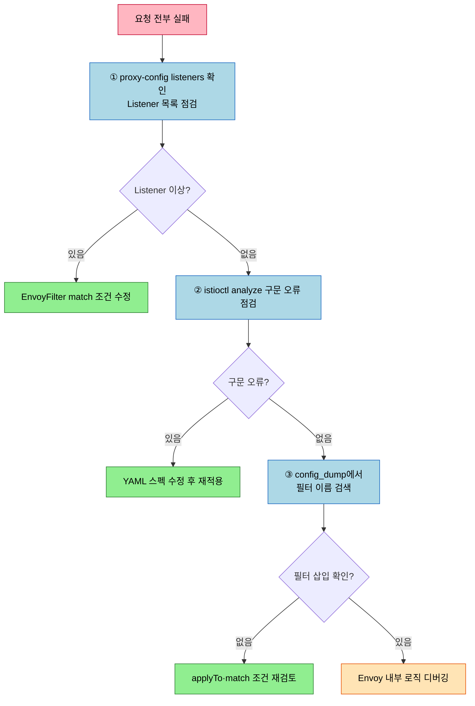

# Istio EnvoyFilter 점검

> 본 장의 심화 점검 질문입니다. LEARN에서 다룬 개념의 경계와 운영 환경에서 주의할 판단 포인트를 Q&A 형태로 정리했습니다.

## Q&A

**EnvoyFilter 적용 후 요청이 전부 실패하면 어디서 시작하는가?**

`istioctl proxy-config listeners <pod>.<ns> -o json`으로 Listener 목록을 확인하고, `istioctl analyze -n <ns>`로 구문 오류를 먼저 점검합니다. 다음으로 config_dump에서 해당 필터 이름을 검색해 실제로 삽입됐는지 확인합니다. 이 세 단계를 순서대로 밟으면 대부분의 원인을 찾을 수 있습니다.

**Istio 업그레이드 후 EnvoyFilter가 조용히 무시되는 이유는 무엇인가?**

match 조건의 `filter.name`이나 `typed_config`의 `@type` 경로가 새 Envoy 버전에서 달라졌기 때문입니다. 업그레이드 전후 config_dump를 비교해 filter 이름이 변경됐는지 확인하고, Istio changelog에서 `EnvoyFilter` 관련 항목을 미리 검토해야 합니다.

**같은 위치에 두 EnvoyFilter가 충돌할 때 어떻게 순서를 제어하는가?**

Istio 1.10+의 `spec.priority` 필드를 사용합니다. 높은 숫자가 나중에 적용됩니다. 기본값은 0이며 음수도 허용됩니다. 소유권이 다른 팀의 EnvoyFilter가 같은 위치를 수정하지 않도록 조직적 합의와 주석(`annotations`)으로 명시하는 것이 근본적인 예방책입니다.
