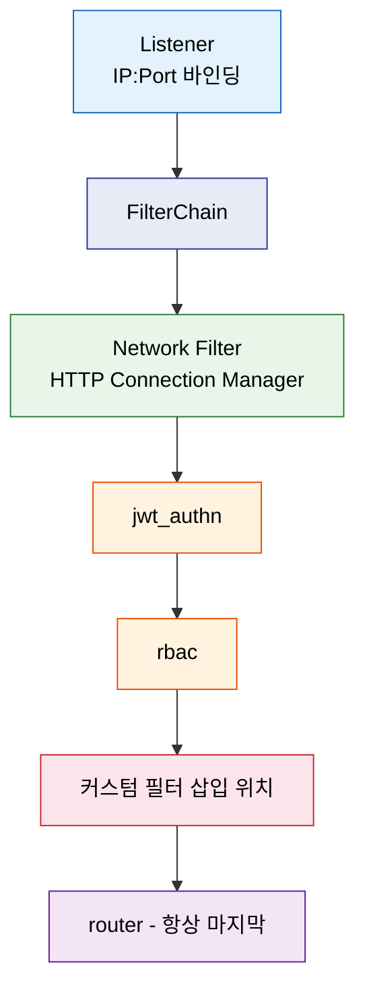

# Istio EnvoyFilter

> 운영 묶음의 마지막은 고수준 API 밖으로 내려가는 탈출구입니다. EnvoyFilter는 Istio가 공식 API로 노출하지 않은 Envoy 내부 동작을 직접 제어하게 해 주지만, 그만큼 마지막 수단으로만 써야 하며 잘못 건드리면 메시 전체 트래픽을 멈출 수 있습니다.


## 학습 목표

> EnvoyFilter의 위치와 역할, `configPatches` 세 필드, Lua 필터, WasmPlugin과의 선택 기준까지 다섯 가지 목표를 다룹니다.

학습 목표는 다섯 가지입니다:

1. EnvoyFilter가 Istio API 체계에서 차지하는 위치와 역할을 설명합니다.
2. `configPatches`의 `applyTo`, `match`, `patch` 세 필드를 구성하고 적용합니다.
3. Lua 필터로 커스텀 응답 헤더를 삽입하고 재시도 상태 코드를 확장합니다.
4. WasmPlugin CRD와 EnvoyFilter의 차이점을 파악해 적절한 도구를 선택합니다.
5. `config_dump`로 EnvoyFilter 적용 여부를 검증하고 충돌을 해결합니다.


## 1. EnvoyFilter의 위치와 역할

> Istio 공식 API가 닿지 않는 Envoy 내부 설정을 xDS 패치로 직접 조작하는 탈출구이며, 필터 체인 구조를 이해하는 것이 안전한 사용의 전제입니다.

### 1.1 Istio API의 한계와 필요성

Istio가 제공하는 공식 트래픽 API(VirtualService, DestinationRule, Gateway 등)는 일반적인 라우팅·로드밸런싱·서킷 브레이커 요구사항을 80% 이상 충족합니다. 그러나 Envoy 프록시는 이보다 훨씬 풍부한 기능을 내장하고 있습니다. 재시도 가능 상태 코드 세밀 조정, 커스텀 Lua 스크립트 실행, 외부 인증 서버 연동, rate limit 서비스 호출 같은 기능이 Istio API 추상화 아래에 숨어 있습니다.

EnvoyFilter는 Pilot이 Envoy에 전달하는 xDS(eXtensible Discovery Service) 설정에 외과적 패치를 적용하는 리소스입니다. Listener, Cluster, Route, Filter 설정을 `configPatches` 배열로 직접 수정할 수 있습니다. 따라서 EnvoyFilter는 Istio API가 지원하지 않는 기능을 활성화하는 마지막 수단으로 간주합니다.

### 1.2 Envoy 필터 체인 구조

Envoy는 요청을 처리할 때 여러 계층의 필터를 순서대로 통과시킵니다. 가장 바깥 계층은 Listener 필터입니다. TCP 연결이 수립된 직후 실행되며, TLS Inspector나 HTTP Inspector처럼 프로토콜을 감지합니다. Listener 아래에는 Filter Chain이 있고, 그 안에 Network Filter가 위치합니다. HTTP 트래픽의 경우 Network Filter 중 가장 중요한 것이 HTTP Connection Manager(HCM)입니다.

HCM 안에는 다시 HTTP Filter 배열이 있습니다. 이 배열에는 Istio가 자동으로 삽입하는 필터들(stats, jwt_authn, rbac, router 등)이 이미 들어 있습니다. EnvoyFilter로 커스텀 Lua 스크립트나 ext_authz, rate_limit 필터를 이 배열에 삽입하는 것이 가장 흔한 패턴입니다. 마지막에 위치하는 `router` 필터는 반드시 맨 끝에 있어야 하므로 커스텀 필터는 항상 `INSERT_BEFORE router` 패턴으로 삽입합니다.



### 1.3 사용 원칙

EnvoyFilter는 Envoy xDS API를 직접 조작하기 때문에 Istio 버전 업그레이드 시 호환성이 깨질 수 있습니다. 다음 원칙을 지켜야 합니다.

1. 표준 Istio API로 목적을 달성할 수 없을 때만 작성합니다.
2. `workloadSelector`를 반드시 지정해 특정 Pod에만 적용하고 메시 전체 적용을 피합니다.
3. 스테이징 환경에서 충분히 검증한 후 프로덕션에 적용합니다.
4. Istio 업그레이드 전에 config_dump를 비교해 EnvoyFilter가 여전히 유효한지 확인합니다.


## 2. EnvoyFilter 리소스 구조

> `configPatches` 배열의 `applyTo`·`match`·`patch` 세 필드가 모두 맞아야 패치가 적용되며, `HTTP_FILTER`를 `router` 앞에 `INSERT_BEFORE`로 삽입하는 패턴이 가장 안전합니다.

### 2.1 configPatches 구조

EnvoyFilter 스펙의 핵심은 `configPatches` 배열입니다. 각 패치 항목은 `applyTo`, `match`, `patch` 세 필드로 구성됩니다.

```yaml
apiVersion: networking.istio.io/v1alpha3
kind: EnvoyFilter
metadata:
  name: custom-header-filter
  namespace: production
spec:
  workloadSelector:
    labels:
      app: order-service
  configPatches:
    - applyTo: HTTP_FILTER
      match:
        context: SIDECAR_INBOUND
        listener:
          filterChain:
            filter:
              name: envoy.filters.network.http_connection_manager
              subFilter:
                name: envoy.filters.http.router
      patch:
        operation: INSERT_BEFORE
        value:
          name: envoy.filters.http.lua
          typed_config:
            "@type": type.googleapis.com/envoy.extensions.filters.http.lua.v3.LuaPerRoute
            inline_code: |
              function envoy_on_response(response_handle)
                response_handle:headers():add("x-powered-by", "envoy-lua")
              end
```

`applyTo`는 패치를 적용할 xDS 객체 유형을 지정하고, `match`는 조건을 정의하며, `patch`는 실제 변경 내용을 담습니다. 세 필드가 모두 맞아야 패치가 적용됩니다.

### 2.2 applyTo 대상

| applyTo 값 | 패치 대상 | 주요 용도 |
|---|---|---|
| `LISTENER` | Listener 전체 | Listener 레벨 설정 변경 |
| `FILTER_CHAIN` | 특정 FilterChain | TLS 설정, 버퍼 크기 조정 |
| `NETWORK_FILTER` | TCP proxy, HCM 등 | HCM 설정 변경 |
| `HTTP_FILTER` | HTTP 필터 배열 | 커스텀 필터 삽입/제거 |
| `CLUSTER` | Upstream Cluster | 연결 풀, 타임아웃 변경 |
| `HTTP_ROUTE` | 특정 Route | 재시도 정책, 헤더 추가 |

HTTP 필터 삽입이 가장 흔한 사용 사례이므로 `HTTP_FILTER`를 가장 자주 사용합니다.

### 2.3 match 조건과 patch operation

`match.context`는 패치를 적용할 사이드카 방향을 결정합니다. `SIDECAR_INBOUND`는 해당 Pod로 들어오는 트래픽, `SIDECAR_OUTBOUND`는 나가는 트래픽, `GATEWAY`는 Ingress/Egress Gateway에만 적용합니다. context를 지정하지 않으면 모든 방향에 적용되어 의도하지 않은 부작용이 생길 수 있습니다.

`patch.operation`은 기존 설정과의 병합 방식을 결정합니다. `MERGE`는 필드를 병합하고, `INSERT_BEFORE`는 매칭된 필터 앞에 삽입하며, `INSERT_FIRST`는 필터 배열 맨 앞에 삽입합니다. `REMOVE`는 삭제하고 `REPLACE`는 완전히 교체합니다. HTTP 필터 삽입 시 `INSERT_BEFORE`에 `subFilter.name: envoy.filters.http.router`를 지정하면 항상 router 앞에 안전하게 삽입됩니다.


## 3. 실전 사용 사례

> Lua 필터로 커스텀 헤더를 주입하고, HTTP_ROUTE 패치로 재시도 상태 코드를 확장하며, 외부 Rate Limit 서비스 연동과 ext_authz 필터 활용까지 네 가지 실전 패턴을 다룹니다.

### 3.1 커스텀 응답 헤더 추가 (Lua 필터)

서비스 응답에 디버그 헤더나 버전 정보를 추가해야 할 때 Lua 필터를 사용합니다. Istio의 Headers API로도 헤더 추가가 가능하지만, 조건부 로직이나 동적 값 계산이 필요한 경우에는 Lua가 유일한 선택지입니다.

```yaml
apiVersion: networking.istio.io/v1alpha3
kind: EnvoyFilter
metadata:
  name: add-response-header
  namespace: production
spec:
  workloadSelector:
    labels:
      app: order-service
  configPatches:
    - applyTo: HTTP_FILTER
      match:
        context: SIDECAR_INBOUND
        listener:
          filterChain:
            filter:
              name: envoy.filters.network.http_connection_manager
              subFilter:
                name: envoy.filters.http.router
      patch:
        operation: INSERT_BEFORE
        value:
          name: envoy.filters.http.lua
          typed_config:
            "@type": type.googleapis.com/envoy.extensions.filters.http.lua.v3.LuaPerRoute
            inline_code: |
              function envoy_on_response(response_handle)
                local pod_name = os.getenv("HOSTNAME") or "unknown"
                response_handle:headers():add("x-served-by", pod_name)
              end
```

Lua 필터는 `envoy_on_request`(요청 단계)와 `envoy_on_response`(응답 단계) 두 함수를 지원합니다. LuaJIT으로 실행되어 퍼포먼스 오버헤드가 낮지만, 복잡한 비즈니스 로직을 넣으면 P99 지연이 올라갈 수 있습니다.

### 3.2 커스텀 재시도 상태 코드 설정

Istio의 VirtualService `retries`는 `retryOn` 필드로 재시도 조건을 지정합니다. 그러나 특정 HTTP 상태 코드(예: `408`)를 재시도 대상에 추가하려면 Envoy의 `retriable_status_codes` 설정이 필요하고 VirtualService만으로는 제어할 수 없습니다.

```yaml
configPatches:
  - applyTo: HTTP_ROUTE
    match:
      context: SIDECAR_OUTBOUND
      routeConfiguration:
        vhost:
          name: inventory-service.production.svc.cluster.local:8080
          route:
            action: ANY
    patch:
      operation: MERGE
      value:
        route:
          retry_policy:
            retry_on: "retriable-status-codes"
            retriable_status_codes: [408, 503]
            num_retries: 3
            per_try_timeout: 2s
```

### 3.3 Rate Limit 필터 설정

Istio는 내장 Rate Limit 기능을 제공하지 않습니다. 외부 Rate Limit 서비스를 연동하려면 `envoy.filters.http.ratelimit` 필터를 삽입하고 해당 서비스를 가리키는 Cluster를 추가합니다. `failure_mode_deny: false`로 설정하면 Rate Limit 서비스가 응답하지 않을 때 요청을 통과시키고, `true`로 설정하면 거부합니다. 가용성을 우선할 때는 `false`, 보안을 우선할 때는 `true`로 설정합니다.

### 3.4 외부 인증 (ext_authz) 필터

외부 인증 서버에 모든 요청의 허용 여부를 위임하는 패턴입니다. Istio의 `AuthorizationPolicy`가 지원하지 않는 복잡한 인가 로직이 필요할 때 사용합니다. Istio 1.9 이후부터는 `ExtensionProvider`와 AuthorizationPolicy의 `CUSTOM` action으로 ext_authz를 구성하는 공식 방법이 생겼습니다. 신규 프로젝트라면 EnvoyFilter 직접 작성보다 이 방식을 우선 고려합니다.


## 4. WASM 확장

> 단순 로직은 Lua, 복잡한 비즈니스 로직은 WASM이 적합하며, Istio 1.12 이후에는 EnvoyFilter 직접 작성 대신 WasmPlugin CRD를 사용하면 호환성 위험이 줄어듭니다.

### 4.1 WASM vs Lua vs Native 필터 비교

| 항목 | Native C++ | Lua | WASM |
|---|---|---|---|
| 성능 | 최고 | 중간 (LuaJIT) | 낮음~중간 (sandbox 오버헤드) |
| 개발 언어 | C++ | Lua | Rust, Go, C++, AssemblyScript |
| 핫 리로드 | 불가 | 가능 | 가능 |
| 격리 | 없음 | 제한적 | 강한 sandbox |
| Istio 지원 | 간접 | EnvoyFilter | WasmPlugin CRD |

단순한 헤더 조작이나 소규모 로직은 Lua가 가장 빠르게 적용할 수 있습니다. 보안 필터나 복잡한 비즈니스 로직은 WASM이 적합합니다.

### 4.2 WasmPlugin 리소스

Istio 1.12에서 도입된 `WasmPlugin` CRD는 WASM 플러그인을 EnvoyFilter보다 안전하고 편리하게 배포합니다. OCI 이미지로 패키징한 WASM 바이너리를 직접 참조하고 Istio가 xDS를 통해 배포합니다.

```yaml
apiVersion: extensions.istio.io/v1alpha1
kind: WasmPlugin
metadata:
  name: coraza-waf
  namespace: production
spec:
  selector:
    matchLabels:
      app: order-service
  url: oci://ghcr.io/corazawaf/coraza-proxy-wasm:latest
  phase: AUTHN
  pluginConfig:
    directives_map:
      default:
        - "Include @coraza.conf-recommended"
        - "SecRuleEngine On"
```

`phase` 필드는 HTTP 필터 체인에서 플러그인이 실행될 단계를 지정합니다. WasmPlugin의 `failStrategy`로 바이너리 로드 실패 시 동작을 제어합니다. 보안 관련 플러그인은 `FAIL_CLOSE`를 사용해야 합니다.

WasmPlugin API는 `extensions.istio.io/v1alpha1`에서 지속적으로 개선되고 있습니다. OCI 이미지 레지스트리 외에 HTTP URL로도 WASM 바이너리를 참조할 수 있어 배포 방식의 유연성이 높습니다. (istio.io/latest/docs/reference/config/proxy_extensions/wasm-plugin/)


## 5. EnvoyFilter 디버깅

> `config_dump`와 `istioctl proxy-config`가 적용 여부 확인의 시작점이며, `match` 조건의 `context` 누락과 Envoy API 버전 변경이 가장 흔한 장애 원인입니다.

### 5.1 config_dump로 적용 확인

EnvoyFilter를 적용한 후 실제로 Envoy 설정에 반영됐는지 확인하는 가장 확실한 방법은 `config_dump`입니다.

```bash
# 특정 Pod의 Envoy 설정 덤프
kubectl exec -n production order-service-pod -- \
  curl -s localhost:15000/config_dump | python3 -m json.tool > /tmp/config_dump.json

# HTTP 필터 확인
istioctl proxy-config listeners order-service-pod.production \
  --port 8080 -o json | grep -A 20 "envoy.filters.http.lua"

# 구문 오류 사전 감지
istioctl analyze -n production
```

적용된 필터를 찾지 못하면 `match` 조건이 잘못됐을 가능성이 높습니다. `context` 값이 실제 Listener 방향과 맞는지, `filter.name`이 현재 Istio 버전에서 사용하는 이름과 일치하는지 확인합니다.

### 5.2 우선순위와 충돌 해결

같은 위치에 여러 EnvoyFilter가 적용될 때 우선순위는 다음 규칙을 따릅니다. 루트 네임스페이스(`istio-system`)의 EnvoyFilter가 워크로드 네임스페이스보다 먼저 적용됩니다. 같은 네임스페이스 내에서는 생성 시각 기준 오래된 것이 먼저 적용됩니다. Istio 1.10+의 `priority` 필드로 명시적 순서를 지정할 수 있습니다.

```yaml
spec:
  priority: 10  # 높은 숫자일수록 나중에 적용 (기본값: 0)
```

### 5.3 버전 호환성 문제

EnvoyFilter가 참조하는 필터 이름과 typed_config의 `@type` 경로는 Envoy API 버전에 따라 달라집니다. Istio 1.10 이후로는 v3 API를 기본으로 사용합니다. v2 `@type`을 사용하는 기존 EnvoyFilter는 업그레이드 후 조용히 무시되거나 파싱 오류가 발생할 수 있습니다. Istio 업그레이드 전후 config_dump를 비교해 EnvoyFilter가 여전히 적용됐는지 검증합니다.


## 핵심 정리

> EnvoyFilter는 표준 Istio API의 마지막 탈출구입니다. `workloadSelector`로 적용 범위를 최소화하고, Istio 업그레이드 전마다 `config_dump`로 호환성을 검증해야 합니다.

EnvoyFilter는 Istio API의 탈출구입니다. 표준 리소스로 달성할 수 없는 요구사항에만 사용하며, `workloadSelector`로 적용 범위를 최소화합니다. `configPatches`의 세 요소 중 `match` 조건의 `context`를 항상 명시해야 의도하지 않은 부작용을 막을 수 있습니다. Istio 1.12 이후에는 복잡한 로직을 EnvoyFilter로 직접 관리하는 대신 WasmPlugin CRD를 사용하면 설정이 단순해지고 호환성 위험이 줄어듭니다. 디버깅의 시작점은 항상 `config_dump`입니다.


## 면접 대비

> EnvoyFilter를 도입·운영할 때 자주 받는 네 가지 질문을 답변 형식으로 정리합니다.

**EnvoyFilter를 마지막 수단이라고 부르는 이유는?**

표준 Istio API(`VirtualService`, `DestinationRule`, `AuthorizationPolicy`)는 Istio 버전 간 호환성이 보장되지만 EnvoyFilter는 Envoy 내부 설정을 직접 패치하므로 Istio·Envoy 업그레이드 시 침묵 실패가 가장 잘 일어납니다. 한 줄 잘못 만지면 메시 전체 트래픽이 멈출 수 있어 표준 API로 해결되지 않는 경우에만 씁니다.

**`configPatches`의 `applyTo`·`match`·`patch` 세 필드는 각각 무엇을 통제하는가?**

`applyTo`는 어느 Envoy 객체 종류(Listener·Cluster·HTTPFilter 등)에 패치를 적용할지, `match`는 그 객체 중 어떤 조건(컨텍스트·이름·포트·필터 이름)에 매치되는 인스턴스만 대상으로 삼을지, `patch`는 무엇을(operation: ADD/MERGE/REMOVE) 어떻게 바꿀지를 표현합니다. 셋 중 `match`의 `context`를 빼면 모든 사이드카·게이트웨이가 영향을 받아 부작용이 폭발합니다.

**EnvoyFilter와 WasmPlugin 중 무엇을 골라야 하는가?**

복잡한 비즈니스 로직(요청 변환·외부 서비스 호출·헤더 가공)은 WasmPlugin이 안전합니다. CRD 모델이 단순하고 Wasm 모듈은 Envoy 버전 변동에도 비교적 안정적이라 호환성 위험이 작습니다. 반대로 Envoy 저수준 필터 체인을 직접 만지거나 표준 API가 없는 새 Envoy 기능을 활성화해야 한다면 EnvoyFilter가 유일한 도구가 됩니다.

**Istio 업그레이드 전 EnvoyFilter를 어떻게 검증하는가?**

업그레이드 전후로 `istioctl proxy-config all <pod>`와 `/config_dump`를 비교해 EnvoyFilter가 의도한 위치에 여전히 적용됐는지 확인합니다. v3 API로 전환된 Istio에서는 typed_config의 `@type`이 v2 경로를 가리키면 조용히 무시될 수 있습니다. 신·구 리비전을 같은 클러스터에 띄우고 한 워크로드를 새 리비전으로 옮겨 비교하는 카나리 검증이 가장 안전합니다.
