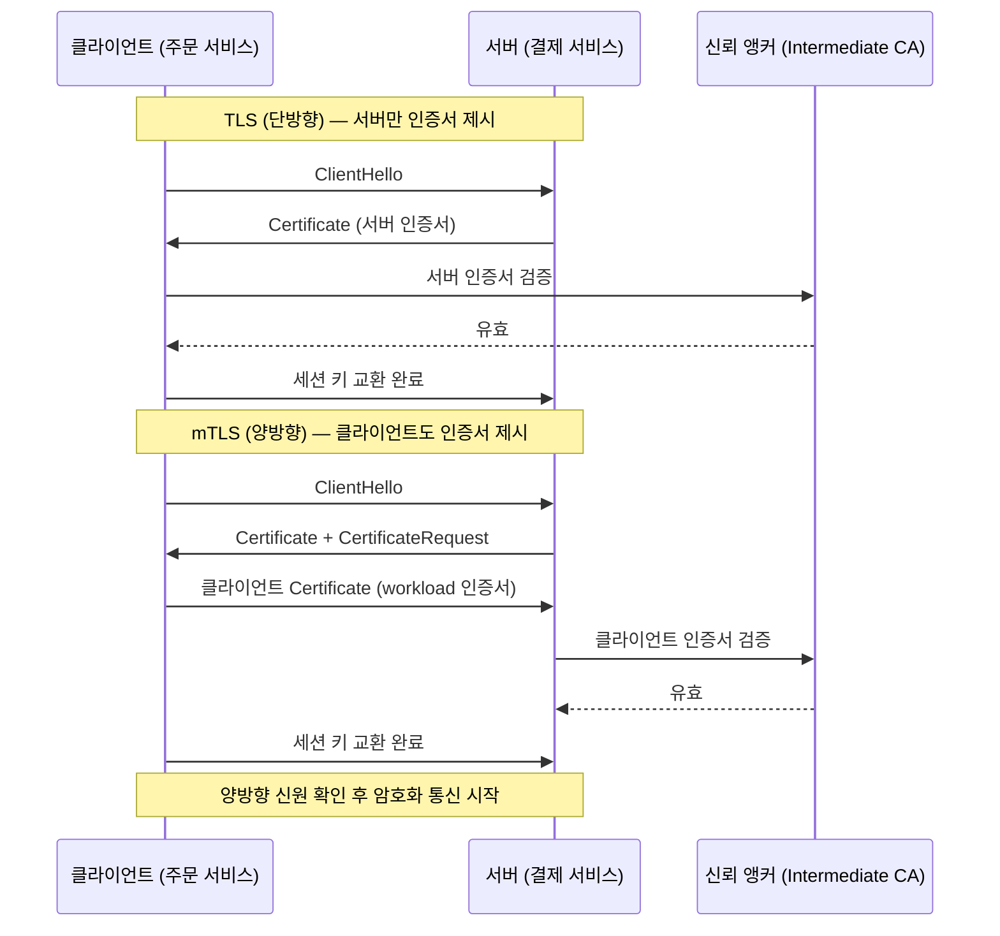
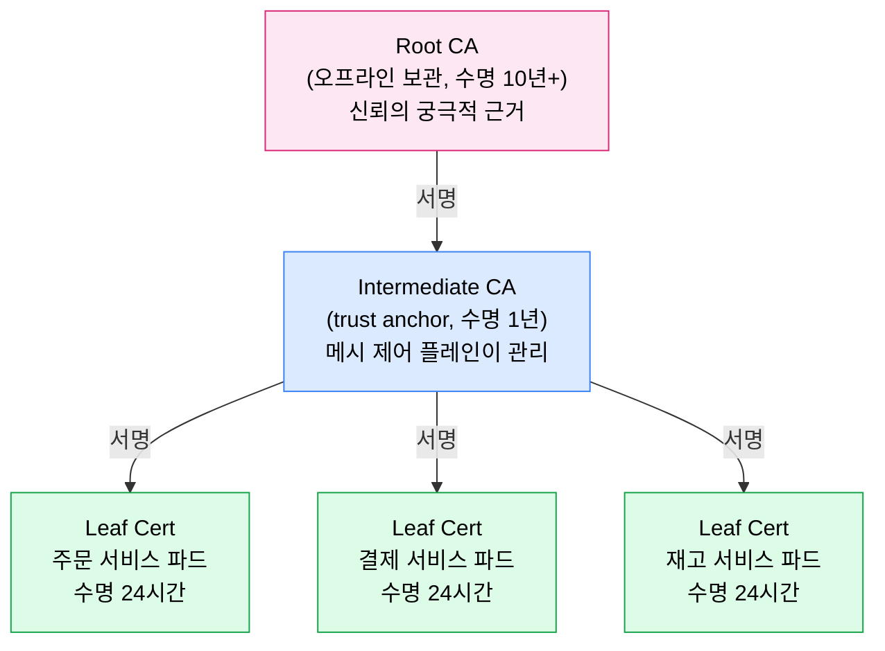
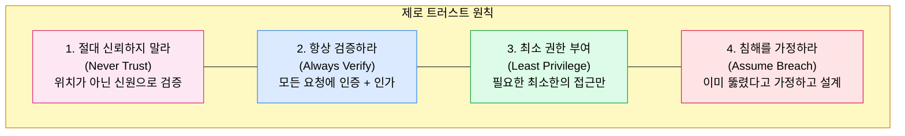

# mTLS와 제로 트러스트

> 서비스 메시에서 mTLS(mutual TLS)는 단순한 암호화를 넘어 워크로드 신원 인증을 담당한다. IP 주소가 아닌 암호학적으로 검증된 SPIFFE ID를 신원으로 삼아, 클러스터 내부에서도 "절대 신뢰하지 말고, 항상 검증하라"는 제로 트러스트 원칙을 실현한다. 2025년 현재 Linkerd 2.19는 포스트 양자 암호화(ML-KEM-768)를 지원해 미래의 양자 컴퓨터 위협에도 대비한다.


## 학습 목표
> TLS vs mTLS 구조, 인증서 계층, SPIFFE/SPIRE, 제로 트러스트 원칙, auto-mTLS 비교, 포스트 양자 암호화까지 여덟 가지 목표를 다룬다.


학습 목표는 여덟 가지다:

1. TLS와 mTLS의 구조적 차이를 핸드셰이크 과정을 통해 설명할 수 있다.
2. 서비스 메시에서 mTLS가 IP 기반 신뢰를 대체해야 하는 이유를 설명할 수 있다.
3. 인증서 계층 구조(Root CA → Intermediate CA → Leaf)와 각 계층의 역할을 이해한다.
4. 단기 인증서(24시간)와 자동 갱신이 보안에서 왜 중요한지 설명할 수 있다.
5. SPIFFE ID 형식과 SPIRE의 역할을 설명할 수 있다.
6. 제로 트러스트의 네 가지 원칙을 서비스 메시 맥락에서 구체적으로 설명할 수 있다.
7. Linkerd와 Istio의 auto-mTLS 동작 방식을 비교할 수 있다.
8. 포스트 양자 암호화가 필요한 이유와 ML-KEM의 기본 개념을 이해한다.


## 1. TLS vs mTLS: 인증의 방향
> 단방향 TLS와 양방향 mTLS의 핸드셰이크 차이, 서비스 메시에서 mTLS가 필요한 세 가지 이유를 설명한다.


### 1.1 TLS: 단방향 인증

TLS(Transport Layer Security)는 인터넷에서 가장 널리 쓰이는 암호화 프로토콜이다. 브라우저로 `https://bank.example.com`에 접속할 때 브라우저는 서버(은행)의 인증서를 검증한다. 반대로 서버는 브라우저(클라이언트)가 누구인지 확인하지 않는다. 은행 웹사이트는 누구나 접속할 수 있어야 하므로 이 설계는 합리적이다.

### 1.2 mTLS: 양방향 인증

mTLS(mutual TLS)는 핸드셰이크에 한 단계를 추가한다. 서버도 클라이언트의 인증서를 요구하고 검증한다. 이름에서 "mutual(상호)"이 의미하는 바가 바로 이것이다.



비유하자면 TLS는 사내 구내식당에서 직원 배지(서버 신원)만 확인하는 것이고, mTLS는 직원도 배지를 보여주면서 동시에 손님의 사원증도 확인하는 것과 같다. 양쪽 모두 신원을 증명해야만 대화가 시작된다.

### 1.3 왜 서비스 메시에서 mTLS인가

쿠버네티스 클러스터 내부에서 서비스 A가 서비스 B를 호출할 때 전통적인 네트워크 보안 모델은 "같은 클러스터 안에 있으면 신뢰한다"고 가정한다. 그러나 이 가정은 세 가지 문제를 안고 있다.

1. 파드 IP는 신뢰할 수 없는 신원이다. 파드가 재시작되면 IP가 바뀐다. 특정 IP를 신뢰하는 서비스는 파드 재시작과 함께 보안 가정이 무너진다.
2. 내부망 침해(lateral movement) 가능성이다. 공격자가 클러스터 내 파드 하나를 장악하면 내부 네트워크 신뢰 모델 하에서 다른 모든 서비스에 자유롭게 접근한다.
3. 암호화 부재다. TLS 없이 통신하면 클러스터 네트워크를 모니터링하는 공격자가 서비스 간 데이터를 평문으로 볼 수 있다. mTLS는 이 세 문제를 동시에 해결한다.


## 2. 인증서 계층 구조
> Root CA → Intermediate CA → Leaf Certificate의 신뢰 사슬과 단기 인증서 자동 갱신의 보안 원리를 다룬다.


### 2.1 신뢰의 사슬(Chain of Trust)



**Root CA**는 신뢰의 출발점이다. 물리적으로 안전한 장소에 오프라인으로 보관하는 것이 권장된다. Root CA가 침해되면 그 아래 모든 인증서가 신뢰를 잃으므로, 가능한 한 사용 빈도를 줄인다. Linkerd와 Istio에서는 `step` CLI나 Vault로 생성해 HSM(Hardware Security Module)에 보관하는 사례가 일반적이다.

**Intermediate CA**는 Root CA의 서명을 받아 생성된다. 서비스 메시의 제어 플레인이 이를 관리하며, Linkerd에서는 `identity` 컴포넌트가, Istio에서는 `istiod`가 Intermediate CA 역할을 수행한다. 수명은 Root CA보다 짧게 1년 정도로 설정한다.

**Leaf Certificate**는 각 파드(워크로드)에 발급되는 최종 인증서다. SPIFFE ID를 포함하며 기본 수명은 24시간이다.

### 2.2 단기 인증서와 자동 갱신

"왜 24시간짜리 인증서를 쓰는가?"라는 질문의 답은 인증서 폐기(revocation)의 어려움에 있다. CRL(Certificate Revocation List)과 OCSP(Online Certificate Status Protocol)는 대규모 마이크로서비스 환경에서 수백 개의 인증서를 실시간으로 폐기 관리하는 운영 부담이 크다.

단기 인증서는 이 문제를 근본적으로 우회한다. 인증서 수명이 24시간이라면 침해된 인증서는 폐기 처리 없이도 하루 안에 자연 만료된다. 공격자가 인증서를 탈취해도 활용할 수 있는 시간이 극도로 제한된다. 메시 제어 플레인(Linkerd의 `identity` 서비스)이 만료 전 자동으로 새 인증서를 각 파드에 배포하며, 이 과정은 앱 개발자에게 완전히 투명하게 이루어진다.


## 3. SPIFFE와 SPIRE: 워크로드 신원 표준
> SPIFFE ID URI 형식의 워크로드 신원 표준과 SPIRE의 Server/Agent 구성을 설명한다.


### 3.1 SPIFFE: 워크로드 신원의 표준화

SPIFFE(Secure Production Identity Framework For Everyone)는 CNCF 프로젝트로, 클라우드 네이티브 환경에서 워크로드 신원을 표준화하기 위해 만들어졌다. 핵심은 **SPIFFE ID**라는 URI 형식의 신원 식별자다.

```
spiffe://{trust-domain}/{workload-identifier}

예시:
spiffe://cluster.local/ns/payments/sa/payment-service
spiffe://prod.mycompany.com/ns/orders/sa/order-processor
```

SPIFFE ID는 인증서의 SAN(Subject Alternative Name) 필드에 URI로 삽입된다. IP 주소와 달리 파드가 재시작되거나 다른 노드에 스케줄링되어도 SPIFFE ID는 변하지 않는다. mTLS 핸드셰이크 시 상대방의 인증서에서 SPIFFE ID를 추출해 올바른 신원을 가지는가를 검증한다.

### 3.2 SPIRE: SPIFFE의 참조 구현

SPIRE(SPIFFE Runtime Environment)는 두 컴포넌트로 구성된다.

**SPIRE Server**는 신원 레지스트리 역할이다. 어떤 파드가 어떤 SPIFFE ID를 받을 수 있는가를 정의하는 등록 항목을 관리하고, Intermediate CA로서 SVID(SPIFFE Verifiable Identity Document)를 발급한다.

**SPIRE Agent**는 각 노드에서 데몬셋으로 실행된다. 파드가 워크로드 API를 통해 자신의 SVID를 요청하면, Agent가 해당 파드의 쿠버네티스 ServiceAccount를 검증하고 SPIRE Server로부터 SVID를 받아 파드에 전달한다.

Linkerd와 Istio는 자체 identity 컴포넌트로 SPIFFE 호환 신원을 발급한다. SPIRE를 별도로 배포하지 않아도 SPIFFE ID가 동작하지만, 멀티클러스터나 멀티클라우드 환경에서 단일 신뢰 앵커가 필요하다면 SPIRE를 공용으로 사용하는 것이 현실적이다.


## 4. 제로 트러스트 아키텍처
> 전통적 경계 보안 모델의 붕괴와 Never Trust·Always Verify·Least Privilege·Assume Breach 네 원칙을 서비스 메시 맥락에서 설명한다.


### 4.1 전통적 경계 보안 모델의 붕괴

전통적인 네트워크 보안은 성벽 모델이다. 방화벽이라는 성벽 안으로 들어오면 신뢰하고 밖에서 오는 것은 차단한다. 이 모델은 내부 네트워크가 안전하다, 사용자는 사무실에서 일한다, 모든 앱이 사내 데이터센터에 있다는 세 가정 위에 세워진다. 클라우드 전환, 원격 근무, 마이크로서비스 도입으로 이 세 가정이 모두 무너졌다.

### 4.2 제로 트러스트의 네 가지 원칙



**Never Trust**: 요청자의 위치(IP, 네트워크 세그먼트)가 아닌 암호학적으로 검증된 신원을 기준으로 신뢰를 결정한다. SPIFFE ID로 검증된 워크로드만 신뢰한다.

**Always Verify**: 모든 요청에 인증(Authentication)과 인가(Authorization)가 따른다. mTLS가 인증을 담당하고, 메시의 AuthorizationPolicy(Istio) 또는 Server(Linkerd)가 인가를 담당한다.

**Least Privilege**: 서비스 A가 서비스 B의 모든 엔드포인트에 접근할 필요가 없다면 `GET /health`만 허용하고 나머지는 차단한다. 정책은 "기본 거부(default deny)" 상태에서 시작해 필요한 것만 명시적으로 허용한다.

**Assume Breach**: 이미 내부가 침해됐다고 가정하고 설계한다. 만약 파드 하나가 침해되더라도 mTLS와 인가 정책 덕분에 공격자는 인증서 없이 다른 서비스를 호출할 수 없다.

중요한 구분이 있다. mTLS는 인증(Authentication)이고, 제로 트러스트는 인가(Authorization)까지 포함한다. 많은 팀이 mTLS를 활성화하고 "제로 트러스트 완료"라고 선언하지만, AuthorizationPolicy가 없으면 mTLS가 있어도 침해된 서비스가 클러스터 내 모든 서비스에 접근할 수 있다. mTLS는 제로 트러스트의 필요조건이지 충분조건이 아니다.


## 5. Linkerd와 Istio의 auto-mTLS
> Linkerd identity 서비스와 Istio istiod의 auto-mTLS 동작 방식을 Permissive/Strict 모드 전환 전략과 함께 비교한다.


### 5.1 Linkerd의 auto-mTLS

Linkerd는 auto-mTLS를 설계 철학의 핵심으로 삼는다. 별도의 설정 없이 메시에 합류한 모든 파드 사이의 트래픽은 자동으로 mTLS가 적용된다. Linkerd 설치 시 생성되는 `identity` 서비스가 Intermediate CA 역할을 하며 파드 시작 시 SPIFFE ID 기반의 24시간 인증서를 자동 발급한다.

```bash
# mTLS 적용 여부 확인
linkerd viz edges deployment -n payments
# NAME               SRC                  DST                  SECURED
# order-service  →   payment-service      ✔ (mTLS)
```

**Permissive 모드 vs Strict 모드**: Permissive 모드에서는 mTLS 클라이언트와 plain HTTP 클라이언트 모두 연결을 허용한다. Strict 모드에서는 mTLS 인증된 클라이언트만 허용한다. 점진적 마이그레이션 시 Permissive로 시작해 모든 서비스가 메시에 합류한 뒤 Strict로 전환하는 전략이 안전하다.

### 5.2 Istio의 auto-mTLS

Istio도 auto-mTLS를 지원한다. `istiod`가 Intermediate CA 역할을 하고 Envoy 사이드카가 인증서를 보유한다. `PeerAuthentication` 리소스로 mTLS 모드를 제어한다.

```yaml
# Istio: 네임스페이스 단위 Strict mTLS 적용
apiVersion: security.istio.io/v1beta1
kind: PeerAuthentication
metadata:
  name: default
  namespace: payments
spec:
  mtls:
    mode: STRICT
```

STRICT 모드에서는 메시 외부(레거시 서비스 등)에서 오는 plain HTTP 요청이 거부된다. PERMISSIVE 모드에서는 mTLS와 plain HTTP를 모두 허용해 마이그레이션 기간에 활용한다.

### 5.3 비교 요약

| 항목 | Linkerd | Istio |
|---|---|---|
| 기본 mTLS 모드 | Permissive (자동 적용) | Permissive |
| 설정 리소스 | (별도 CRD 없음, 자동) | PeerAuthentication |
| 인증서 수명 | 24시간 (기본) | 24시간 (기본) |
| CA 구현 | identity 서비스 | istiod |
| SPIFFE 지원 | 완전 지원 | 완전 지원 |
| 외부 CA 연동 | cert-manager 지원 | cert-manager, Vault 지원 |


## 6. 포스트 양자 암호화
> Harvest Now Decrypt Later 위협 모델과 Linkerd 2.19의 ML-KEM-768 하이브리드 키 교환 지원을 설명한다.


### 6.1 왜 지금 양자 내성 암호화인가

현재 mTLS에서 가장 널리 쓰이는 키 교환 알고리즘은 ECDH(Elliptic Curve Diffie-Hellman)이다. 이 알고리즘의 보안은 타원 곡선 이산 로그 문제의 계산 난이도에 기반한다. 충분히 강력한 양자 컴퓨터가 Shor 알고리즘을 실행하면 이 문제를 효율적으로 풀 수 있어 현재 암호화가 깨질 수 있다.

"현재 양자 컴퓨터는 아직 그 수준이 아닌데 왜 지금 준비하나?"라는 질문에는 **"지금 수집해서 나중에 복호화(harvest now, decrypt later)"** 공격 모델이 있다. 공격자가 오늘의 암호화된 트래픽을 저장해두었다가 10년 후 양자 컴퓨터가 충분히 발달했을 때 복호화하는 시나리오다. 수십 년간 기밀성이 유지되어야 하는 데이터는 지금 양자 내성 암호화로 보호하지 않으면 미래에 노출될 수 있다.

### 6.2 ML-KEM과 Linkerd 2.19

NIST(미국 표준기술연구소)는 2024년에 포스트 양자 암호 표준을 발표했다. 키 캡슐화 메커니즘(KEM)으로 채택된 것이 **ML-KEM**(FIPS 203, 이전 명칭 CRYSTALS-Kyber)이다. ML-KEM은 격자 기반(lattice-based) 암호화로, 격자 문제(Learning With Errors)는 양자 컴퓨터로도 효율적으로 풀 수 없다.

Linkerd 2.19는 TLS 핸드셰이크에서 **X25519 + ML-KEM-768 하이브리드 키 교환**을 지원한다. 하이브리드 방식을 사용하는 이유는 두 가지다:

1. 하위 호환성이다. ML-KEM 단독은 아직 모든 클라이언트가 지원하지 않으므로 X25519와 하이브리드로 결합해 양쪽을 모두 보호한다.
2. 방어 심층화(defense in depth)다. 두 알고리즘 모두를 깨야만 세션 키를 복구할 수 있어 하이브리드가 단독 방식보다 강하다.

```
# Linkerd 2.19 핸드셰이크에서 협상되는 키 교환
TLS_AES_256_GCM_SHA384 with X25519MLKEM768
```

Istio는 2025년 현재 포스트 양자 암호화를 아직 공식 지원하지 않으므로, 양자 내성이 요구사항인 환경에서는 Linkerd가 차별점을 가진다.


## 7. 인증서 관리 실습 관점
> step CLI로 Root CA와 Intermediate CA를 생성하고 Linkerd에 적용하는 절차를 다룬다.


### 7.1 Linkerd 인증서 설정 흐름

```bash
# 1단계: Root CA 생성 (오프라인에서, 한 번만, 10년 수명)
step certificate create root.linkerd.cluster.local ca.crt ca.key \
  --profile root-ca \
  --no-password \
  --insecure \
  --not-after=87600h

# 2단계: Intermediate CA 생성 (Root CA로 서명, 1년 수명)
step certificate create identity.linkerd.cluster.local issuer.crt issuer.key \
  --profile intermediate-ca \
  --not-after=8760h \
  --ca ca.crt \
  --ca-key ca.key \
  --no-password \
  --insecure

# 3단계: Linkerd 설치 시 인증서 지정
linkerd install \
  --identity-trust-anchors-file ca.crt \
  --identity-issuer-certificate-file issuer.crt \
  --identity-issuer-key-file issuer.key \
  | kubectl apply -f -
```

### 7.2 인증서 상태 확인

```bash
# 메시 인증서 상태 전체 확인
linkerd check --proxy

# 인증서 만료 시간 확인
kubectl get secret linkerd-identity-issuer -n linkerd \
  -o jsonpath='{.data.crt\.pem}' \
  | base64 -d | openssl x509 -noout -dates
```

Intermediate CA(`issuer.crt`)의 수명(1년)이 다가오면 cert-manager와 연동해 자동 갱신하도록 설정하는 것이 프로덕션 권장 사항이다.


## 면접 대비

> mTLS와 제로 트러스트를 설계 관점에서 가장 자주 받는 네 가지 질문을 답변 형식으로 정리한다.

**TLS와 mTLS의 차이를 한 문장으로 설명하면?**

TLS는 서버 신원만 검증하는 단방향 인증이고, mTLS는 클라이언트도 인증서를 제시해 양쪽 신원을 모두 검증하는 양방향 인증이다. 브라우저↔은행 같은 공개 서비스는 클라이언트가 누구든 상관없으므로 TLS로 충분하지만, 서비스 메시 내부 통신은 호출자도 검증해야 lateral movement를 막을 수 있어 mTLS가 기본이 된다.

**왜 IP가 아니라 SPIFFE ID로 신원을 표현하는가?**

쿠버네티스에서 파드 IP는 재시작·재스케줄로 수시로 바뀐다. IP를 신뢰 기준으로 쓰면 파드 한 번 죽을 때마다 보안 정책이 흔들린다. SPIFFE ID는 `spiffe://cluster/ns/.../sa/...` 형태의 URI로 워크로드 정체성을 표현하므로 IP가 바뀌어도 동일성을 유지한다. 인증서 SAN에 들어가므로 mTLS 핸드셰이크 시 암호학적으로 검증된다.

**24시간짜리 단기 인증서를 쓰면 인증서 폐기(CRL/OCSP) 문제를 어떻게 해결하는가?**

폐기 자체를 운영하지 않는다. 수백~수천 개 워크로드의 폐기 목록을 실시간으로 동기화하는 비용이 큰 반면, 수명이 24시간이라면 침해된 인증서는 폐기 처리 없이 하루 안에 자연 만료된다. 메시 제어 플레인이 만료 전 자동 갱신을 처리하므로 운영 부담도 늘지 않는다. 폐기 인프라 대신 짧은 수명으로 위험 노출 시간을 좁히는 트레이드오프다.

**mTLS만 켜면 제로 트러스트가 완성되는가?**

아니다. mTLS는 인증(Authentication)이고 제로 트러스트는 인가(Authorization)까지 요구한다. mTLS만 활성화된 상태에서 침해된 워크로드는 자기 인증서로 클러스터 내 다른 모든 서비스에 접근할 수 있다. `AuthorizationPolicy`(Istio) 또는 `Server`/`AuthorizationPolicy`(Linkerd)로 default-deny를 깔고 필요한 호출 쌍만 허용해야 mTLS가 제로 트러스트의 완결 구성요소가 된다.


## 관련 문서
> 본 장과 연관된 문서 목록이다.


- [mTLS와 제로 트러스트 점검](./deepdive/04-01.mTLS와%20제로%20트러스트%20점검.md) — 본 장의 점검 편
- [Gateway API와 트래픽](./03-01.Gateway%20API와%20트래픽.md) — 트래픽 정책 (mTLS 위에서 동작)
- [Linkerd 아키텍처](./05-01.Linkerd%20아키텍처.md) — Linkerd identity 컴포넌트 상세
