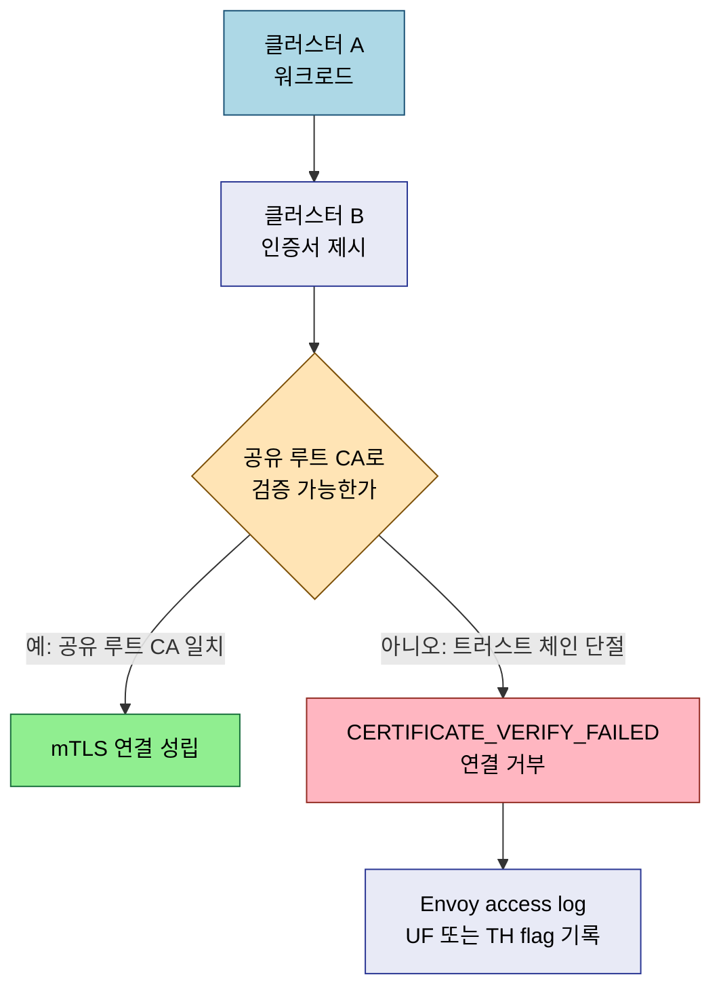

# 멀티클러스터 점검

> 본 장의 심화 점검 질문입니다. LEARN에서 다룬 개념의 경계와 운영 환경에서 주의할 판단 포인트를 Q&A 형태로 정리했습니다.

## Q&A

**멀티클러스터에서 공유 루트 CA가 없으면 어떤 오류가 발생하는가?**

mTLS 핸드셰이크 시 클러스터 B의 인증서를 클러스터 A가 검증할 수 없어 `CERTIFICATE_VERIFY_FAILED` 오류가 발생하고 연결이 거부됩니다. Envoy access log에 `UF`(Upstream connection Failure) 또는 `TH`(Handshake failure) flag로 기록됩니다. `istioctl proxy-config secret <pod> -n <ns>`로 트러스트 체인을 확인하면 원인을 파악할 수 있습니다.

**Istio 멀티-프라이머리와 프라이머리-리모트 중 어떤 기준으로 선택하는가?**

컨트롤 플레인 장애 허용 요구사항이 높으면 멀티-프라이머리를 선택합니다. 각 클러스터가 독립 istiod를 갖기 때문에 컨트롤 플레인 단일 장애점이 없습니다. 운영 단순성을 우선하면 프라이머리-리모트를 선택합니다. 단, 프라이머리가 다운되면 리모트 클러스터는 새 설정을 받지 못하는 점을 감수해야 합니다.

**Flat 네트워크가 아닌 환경에서 Istio 멀티클러스터를 설정하면 어떤 추가 구성이 필요한가?**

East-West Gateway를 각 클러스터에 배포해야 합니다. 파드끼리 직접 통신이 불가능하므로 모든 크로스-클러스터 트래픽이 이 게이트웨이를 경유합니다. `kubectl apply -f samples/multicluster/expose-services.yaml`로 서비스를 노출하고, 클러스터 간 트래픽 경로가 East-West Gateway를 통과하도록 ServiceEntry의 `location`과 네트워크 설정을 맞춰야 합니다.

**Split-Brain 발생 시 서비스 메시는 어떻게 동작하는가?**

Istio는 기본적으로 가용성을 택합니다. 컨트롤 플레인이 원격 클러스터 엔드포인트 업데이트를 받지 못하면 마지막으로 알려진 상태를 유지하며 트래픽을 계속 시도합니다. 데이터 플레인의 Outlier Detection이 연속 실패를 탐지하면 해당 엔드포인트를 제거합니다. 금융 시스템처럼 일관성이 중요한 환경에서는 이 기본 동작을 재검토해야 합니다.
