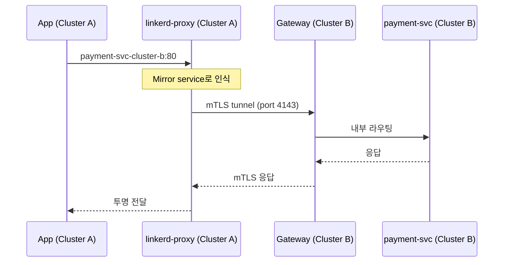
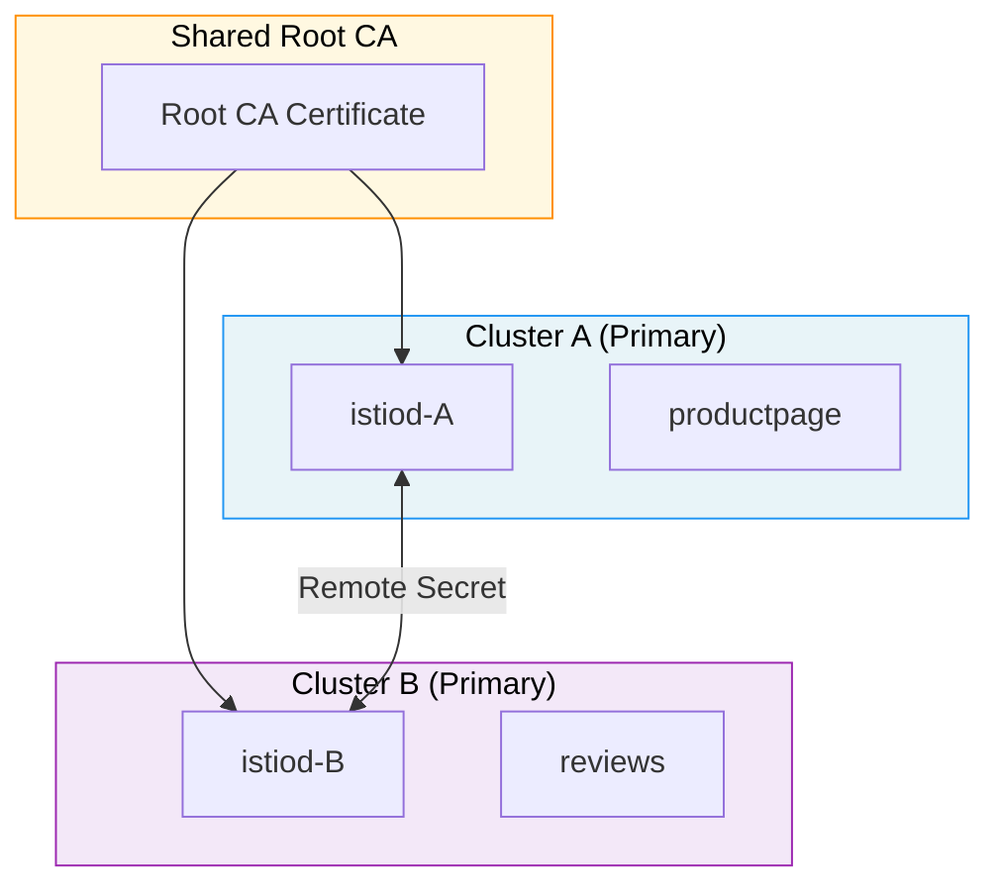
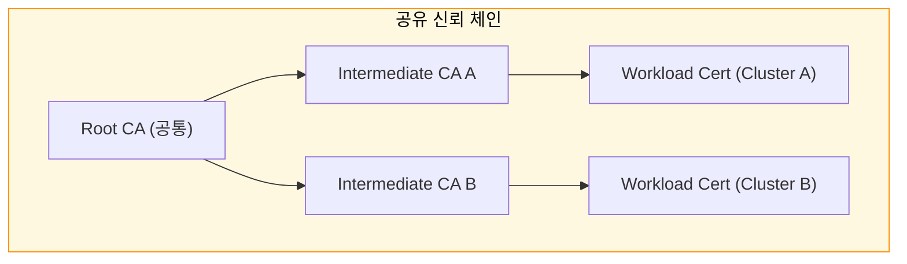

# 멀티클러스터

> 단일 클러스터는 단일 장애점입니다. 멀티클러스터 서비스 메시는 서비스 디스커버리, 상호 TLS, 트래픽 라우팅을 클러스터 경계를 넘어 확장해 고가용성과 지역 분리를 동시에 달성합니다.

## 학습 목표

> 멀티클러스터가 필요한 이유, Linkerd 서비스 미러, Istio 멀티-프라이머리·프라이머리-리모트 토폴로지, 공유 루트 CA의 필요성까지 다섯 가지 목표를 다룹니다.

학습 목표는 다섯 가지입니다:

1. 멀티클러스터가 필요한 네 가지 이유를 설명합니다.
2. Linkerd 서비스 미러 방식의 동작 원리와 구성 요소를 이해합니다.
3. Istio의 멀티-프라이머리와 프라이머리-리모트 토폴로지 차이를 비교합니다.
4. 공유 루트 CA가 크로스-클러스터 mTLS에서 왜 필수인지 설명합니다.
5. Flat 네트워크와 Non-flat 네트워크의 트래픽 흐름 차이를 파악합니다.

## 1. 왜 멀티클러스터인가

> 고가용성·재해 복구·규정 준수·팀 격리 네 가지 관점에서 단일 클러스터의 한계를 넘는 이유를 설명합니다.

단일 Kubernetes 클러스터로 모든 워크로드를 운영하면 구조는 단순하지만, 클러스터 자체가 단일 장애점이 됩니다. 멀티클러스터 아키텍처는 이 문제를 네 가지 관점에서 해소합니다.

고가용성(High Availability)은 두 클러스터에 동일한 서비스를 배포하고 트래픽을 분산합니다. 한 클러스터가 완전히 중단되어도 다른 클러스터가 요청을 처리합니다. 재해 복구(Disaster Recovery)는 DR 클러스터가 평소에 대기 상태를 유지하다가 주 클러스터 장애 시 트래픽을 전환받습니다. 서비스 메시는 이 전환을 DNS 변경이 아닌 트래픽 정책 수정으로 처리해 전환 시간을 단축시킵니다. 규정 준수(Regulatory Compliance)는 GDPR이나 금융 규정이 데이터를 특정 지역 내에만 두도록 요구할 때 클러스터를 리전별로 분리해 데이터 주권을 보장합니다. 팀 격리(Team Isolation)는 팀마다 별도 클러스터를 갖고 팀 단위로 폭발 반경을 제한해 한 팀의 배포 사고가 다른 팀에 영향을 미치지 않도록 합니다.

## 2. 멀티클러스터의 핵심 과제

> 서비스 디스커버리, 크로스-클러스터 mTLS, 레이턴시가 멀티클러스터 구성의 세 가지 근본 과제이며 각 메시가 이를 다르게 해결합니다.

서비스 디스커버리 문제가 첫 번째입니다. 단일 클러스터에서는 Kubernetes DNS가 `svc.cluster.local` 형식으로 서비스를 해석합니다. 클러스터 경계를 넘으려면 클러스터 A의 DNS가 클러스터 B에도 보이거나, 클러스터 B의 DNS에 클러스터 A 서비스를 등록하는 방법이 필요합니다.

크로스-클러스터 mTLS가 두 번째입니다. 클러스터 A와 B가 서로 다른 루트 CA를 사용하면, 클러스터 A의 워크로드는 클러스터 B의 인증서 체인 끝에 있는 루트 CA를 신뢰 목록에서 찾지 못해 연결을 거부합니다.

레이턴시가 세 번째입니다. 리전 간 왕복 시간은 수십 밀리초입니다. 단일 클러스터에서 1ms 미만이던 서비스 호출이 클러스터 경계를 넘으면 50~100ms로 뜁니다.

## 3. Linkerd 멀티클러스터: 서비스 미러

> Linkerd는 원격 서비스를 로컬 DNS에 유령 서비스로 등록하는 서비스 미러 방식을 사용하며, Link CRD와 Service Mirror Controller가 핵심 구성요소입니다.

Linkerd는 멀티클러스터 문제를 서비스 미러(Service Mirror) 방식으로 풉니다. 클러스터 A에서 클러스터 B의 서비스를 유령 서비스로 등록해두는 것입니다. 클러스터 A의 파드는 로컬 서비스를 호출하듯 요청하고, 메시가 그 요청을 클러스터 B로 투명하게 전달합니다.

**Link CRD**는 두 클러스터를 연결하는 선언적 리소스입니다. **Service Mirror Controller**는 소스 클러스터에서 실행되며 `mirror.linkerd.io/exported: true` 레이블이 붙은 서비스를 발견하면, 소스 클러스터에 `{svc}-{cluster-name}` 형식으로 서비스를 생성합니다. **Multi-cluster Gateway**는 각 클러스터에 배포되는 진입점으로, 크로스-클러스터 트래픽은 반드시 이 게이트웨이를 통과합니다.

Linkerd 서비스 미러는 HTTP와 gRPC 트래픽만 지원합니다. TCP 레벨 미러링이 없어 MySQL이나 Redis 같은 비-HTTP 서비스는 크로스-클러스터 라우팅이 불가능합니다.

## 4. Istio 멀티클러스터

> Istio는 멀티-프라이머리(각 클러스터에 독립 istiod)와 프라이머리-리모트(하나의 istiod가 여러 클러스터 제어) 두 토폴로지를 지원하며, 트레이드오프는 가용성과 운영 복잡도입니다.

Istio는 멀티클러스터 토폴로지를 크게 두 가지 방식으로 제공합니다.

### 4.1 멀티-프라이머리 (Multi-Primary)

두 클러스터 각각에 독립 istiod가 실행되되, 공유 루트 CA와 서로의 엔드포인트 정보를 교환하는 구조입니다. 가장 높은 가용성을 제공하지만 설정이 복잡합니다.

각 istiod는 상대 클러스터의 API 서버를 리모트 시크릿으로 등록해 상대 클러스터의 서비스 엔드포인트를 xDS로 배포할 수 있습니다. 이를 위해 두 클러스터의 파드 네트워크가 상호 도달 가능한 Flat 네트워크여야 합니다.

### 4.2 프라이머리-리모트 (Primary-Remote)

하나의 istiod가 여러 클러스터를 제어합니다. 리모트 클러스터에는 istiod가 없고 프라이머리의 istiod를 원격으로 참조합니다. 운영 부담이 적지만 프라이머리 클러스터의 컨트롤 플레인이 단일 장애점이 됩니다. 기존 트래픽은 이어지지만 새 배포나 설정 변경이 불가능해집니다.

## 5. 공유 루트 CA: 크로스-클러스터 mTLS의 핵심

> 두 클러스터가 공통 루트 CA 아래 각자의 중간 CA를 사용할 때만 상호 mTLS 검증이 성공하며, 루트 CA 키는 오프라인에 보관하는 것이 보안 모범 사례입니다.

mTLS 핸드셰이크에서 클라이언트와 서버는 상대방의 인증서를 검증합니다. 검증은 인증서 체인을 따라 신뢰할 수 있는 루트 CA까지 올라가는 방식입니다. 클러스터 A와 B가 서로 다른 루트 CA를 사용하면 검증이 실패해 연결이 거부됩니다.

각 클러스터는 고유한 중간 CA를 사용해 워크로드 인증서를 발급하므로 서로 다릅니다. 그러나 체인 끝의 루트 CA가 동일하기 때문에 상호 검증이 성공합니다. 루트 CA 키는 오프라인에 안전하게 보관하고 클러스터에는 중간 CA만 배포하는 것이 보안 모범 사례입니다.

## 6. Flat vs Non-Flat 네트워크

> Flat 네트워크는 파드 직접 통신으로 레이턴시가 낮지만 IP 주소 계획이 필요하고, Non-Flat 네트워크는 East-West Gateway를 경유해 처리량과 레이턴시에 제약이 생깁니다.

**Flat 네트워크**는 두 클러스터의 파드 CIDR가 겹치지 않고 파드끼리 직접 통신할 수 있는 구성입니다. 워크로드가 직접 대상 파드 IP로 연결하므로 게이트웨이 홉이 없어 레이턴시가 낮습니다. 단, 파드 CIDR 충돌을 피하는 IP 주소 계획이 필요합니다.

**Non-Flat 네트워크**는 파드끼리 직접 통신이 불가능하고 게이트웨이를 경유해야 하는 구성입니다. 서로 다른 클라우드나 리전 간 클러스터가 해당됩니다. IP 충돌 걱정이 없지만 모든 크로스-클러스터 트래픽이 East-West Gateway를 경유하므로 레이턴시와 처리량에 제약이 생깁니다.

Linkerd는 Non-flat 환경에서 항상 게이트웨이를 사용합니다. Istio는 Flat 환경에서 게이트웨이 없이 직접 파드 IP로 연결할 수 있어 레이턴시 측면에서 유리합니다.

## 7. 비용과 복잡성 비교

> Linkerd는 설정이 단순하지만 HTTP/gRPC만 지원하고, Istio는 모든 프로토콜과 토폴로지를 지원하지만 운영 부담이 높습니다.

| 항목 | Linkerd 멀티클러스터 | Istio 멀티-프라이머리 |
|------|---------------------|-----------------------|
| 설정 난이도 | 낮음 (Link CRD 하나) | 높음 (리모트 시크릿 + 네트워크 설정) |
| 지원 프로토콜 | HTTP/gRPC만 | HTTP, gRPC, TCP |
| 게이트웨이 필요 | 항상 필요 | Flat 네트워크에서 선택적 |
| CA 관리 | 단순 (공유 루트 CA) | 중간 CA per 클러스터 관리 필요 |
| 디버깅 도구 | `linkerd multicluster check` | `istioctl remote-clusters` |
| 운영 부담 | 낮음 | 높음 |

멀티클러스터는 기술적 해결책이 명확하더라도 운영 복잡성이 단일 클러스터보다 항상 높다는 점을 인식해야 합니다. Istio의 지역 인식 라우팅은 파드의 노드 레이블을 기반으로 가장 가까운 엔드포인트를 우선 선택하고, 해당 지역의 엔드포인트가 모두 장애 상태일 때만 원격 클러스터로 트래픽을 넘기는 failover를 활성화합니다.

## 핵심 정리

> 공유 루트 CA, 서비스 디스커버리 전략, 네트워크 토폴로지 선택이 멀티클러스터 메시의 세 가지 핵심 결정이며, 단일 클러스터보다 항상 운영 복잡성이 높다는 점을 인식해야 합니다.

멀티클러스터 메시의 핵심 도전은 서비스 디스커버리, 크로스-클러스터 mTLS, 레이턴시 세 가지입니다. 공유 루트 CA 아래에 클러스터별 중간 CA를 두는 구조가 mTLS 상호 검증을 가능하게 합니다. Linkerd는 서비스 미러 방식으로 HTTP/gRPC를 간단하게 연결하고, Istio는 멀티-프라이머리와 프라이머리-리모트 토폴로지로 더 넓은 범위를 지원합니다. Flat 네트워크에서는 직접 파드 통신으로 레이턴시를 최소화하고, Non-flat 환경에서는 East-West Gateway가 중개 역할을 담당합니다.

## 면접 대비

> 멀티클러스터 메시를 설계할 때 자주 받는 네 가지 질문을 답변 형식으로 정리합니다.

**공유 루트 CA가 멀티클러스터 mTLS에서 왜 필수인가?**

mTLS 핸드셰이크는 상대 인증서의 신뢰 체인을 검증합니다. 클러스터 A와 B가 서로 다른 루트 CA를 쓰면 A의 워크로드 인증서가 B에서는 unknown issuer로 거부됩니다. 공유 루트 CA 아래에 클러스터별 중간 CA를 두면 양쪽 모두 같은 root를 신뢰하므로 크로스-클러스터 mTLS가 자동으로 검증됩니다.

**Linkerd 서비스 미러와 Istio 멀티-프라이머리는 어떻게 다른가?**

Linkerd 서비스 미러는 원격 클러스터의 서비스를 로컬에 `*-foreign`처럼 미러링된 Service로 노출해 로컬 호출처럼 사용하게 합니다. 단순하고 빠르게 도입되지만 L7 정책 일부가 클러스터 경계를 넘지 못합니다. Istio 멀티-프라이머리는 두 컨트롤 플레인이 양쪽 클러스터의 엔드포인트를 모두 디스커버해 진짜 단일 메시처럼 동작합니다. 복잡도가 높지만 정책·관측성이 클러스터 경계 너머로 자연스럽게 확장됩니다.

**Flat 네트워크와 Non-Flat 네트워크의 선택 기준은?**

Pod CIDR이 클러스터 간 라우팅 가능하면(Flat) 사이드카가 상대 Pod IP로 직접 통신해 East-West Gateway 홉을 피합니다. 레이턴시·처리량이 가장 좋습니다. AWS VPC peering·GCP VPC interconnect가 가능한 환경에서 채택됩니다. Non-Flat 환경(서로 다른 클라우드, 사설/공용 분리)에서는 East-West Gateway가 클러스터 경계에서 mTLS 중계 역할을 합니다. 추가 홉이 생기지만 네트워크 분리 정책과 양립합니다.

**멀티클러스터를 도입할 때 가장 흔히 과소평가되는 비용은?**

운영 복잡성 증가입니다. 컨트롤 플레인 업그레이드를 두 클러스터에 동시 진행해야 하고, 인증서 갱신·xDS 푸시 부하·관측성 통합 모두 클러스터 수에 비례합니다. 단일 클러스터에서도 풀지 못한 운영 부담을 멀티클러스터에서 풀려고 하면 복잡도가 곱셈으로 늘어납니다. 멀티클러스터의 정당성은 HA·지역 분리 같은 명확한 요구사항이 있을 때만 성립합니다.
