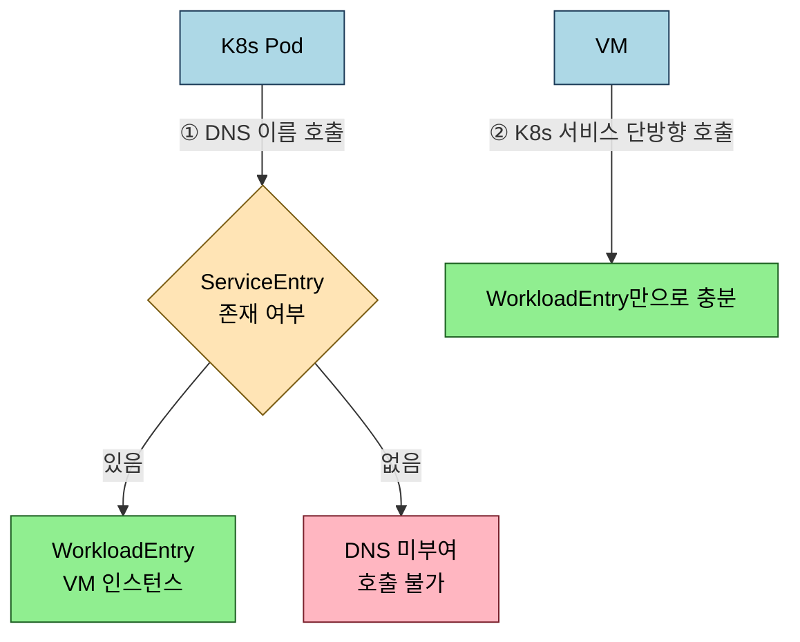

# Istio VM 통합 점검

> 본 장의 심화 점검 질문입니다. LEARN에서 다룬 개념의 경계와 운영 환경에서 주의할 판단 포인트를 Q&A 형태로 정리했습니다.

## Q&A

**WorkloadEntry만 있고 ServiceEntry가 없으면 K8s Pod에서 VM을 호출할 수 있는가?**

없습니다. WorkloadEntry는 VM 인스턴스를 메시에 등록하지만 DNS 이름을 부여하지는 않습니다. K8s Pod가 VM을 `legacy-api.ch21-vm.svc.cluster.local`처럼 DNS 이름으로 호출하려면 `workloadSelector`로 WorkloadEntry를 선택하는 ServiceEntry가 함께 있어야 합니다. VM이 K8s 서비스를 호출하기만 하는 단방향 시나리오에서는 WorkloadEntry만으로 충분합니다.

**VM 인증서 갱신이 실패하면 어떤 현상이 발생하는가?**

mTLS가 STRICT 모드인 경우 VM에서 나가는 모든 outbound 트래픽의 mTLS 핸드셰이크가 실패해 연결이 거부됩니다. VM 인증서 만료까지 남은 시간은 `openssl x509 -in /etc/certs/cert-chain.pem -noout -dates`로 확인하고, `journalctl -u istio | grep -i "cert\|renew\|error"`로 갱신 시도 로그를 확인합니다. istiod 연결 불가, 토큰 만료, root-cert.pem 불일치가 주요 원인입니다.

**autoRegistration 환경에서 보안 위험을 줄이는 가장 중요한 조치는 무엇인가?**

istiod의 15012 포트에 대한 네트워크 접근을 허용된 VM 서브넷만으로 제한하는 것입니다. `cleanupDelay`를 설정해 오프라인 VM의 WorkloadEntry를 자동 정리하고, WorkloadGroup별로 별도의 서비스 계정을 사용해 침해 시 폭발 반경을 최소화합니다. VM shutdown 스크립트에 `systemctl stop istio`를 포함해 정상 종료 신호를 istiod에 전달하는 것도 중요합니다.

**VM의 SPIFFE ID를 확인하는 방법은 무엇인가?**

VM에서 `openssl x509 -in /etc/certs/cert-chain.pem -noout -text | grep "URI:"`를 실행하면 `URI:spiffe://cluster.local/ns/<namespace>/sa/<serviceAccount>` 형식으로 출력됩니다. 이 값이 AuthorizationPolicy의 `source.principals`에 지정한 값과 일치해야 정책이 올바르게 적용됩니다.
