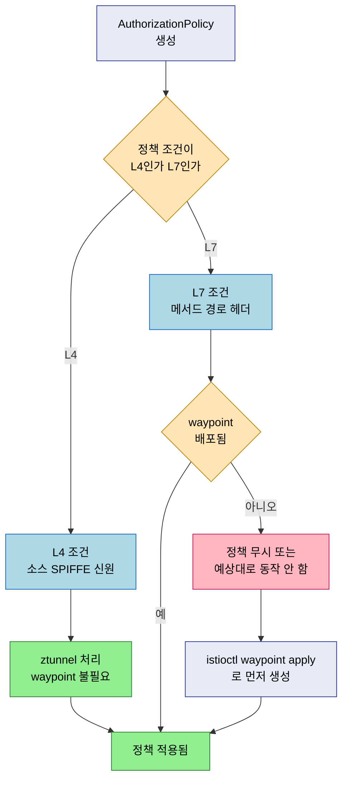

# Istio Ambient Mesh 점검

> 본 장의 심화 점검 질문입니다. LEARN에서 다룬 개념의 경계와 운영 환경에서 주의할 판단 포인트를 Q&A 형태로 정리했습니다.

## Q&A

**Ambient 모드 전환 후 파드를 재시작하지 않아도 되는가?**

아닙니다. `istio.io/dataplane-mode=ambient` 레이블을 추가한 뒤 파드를 재시작해야 합니다. 레이블 추가만으로는 기존에 사이드카가 주입된 파드가 그대로 남아 있습니다. 재시작 후 `kubectl get pods -o jsonpath='{.items[*].spec.containers[*].name}'`에서 `istio-proxy`가 사라졌는지 확인합니다.

**ztunnel 장애 시 그 노드의 모든 Ambient 파드가 영향을 받는가?**

그렇습니다. ztunnel은 노드당 하나가 실행되므로 ztunnel 크래시 시 해당 노드의 모든 Ambient 파드 트래픽이 영향을 받습니다. 사이드카 모델에서 개별 파드 프록시 장애가 해당 파드에만 영향을 주는 것과 대조됩니다. 중요 서비스는 여러 노드에 분산 배치(Pod Anti-Affinity)해 단일 ztunnel 장애로 전체 서비스가 다운되지 않도록 설계해야 합니다.

**waypoint 없이 L7 AuthorizationPolicy를 적용하면 어떻게 되는가?**

HTTP 메서드, 경로, 헤더 기반 L7 인가는 waypoint 없이는 적용되지 않습니다. ztunnel은 L4 인가(소스 SPIFFE 신원)만 처리합니다. waypoint를 배포하지 않은 상태에서 L7 조건이 포함된 AuthorizationPolicy를 생성하면 정책이 무시되거나 예상대로 동작하지 않습니다. L7 정책을 사용하려면 반드시 `istioctl waypoint apply`로 waypoint를 먼저 생성해야 합니다.

**Ambient 모드에서 사이드카 모드로 롤백 시 서비스 중단이 발생하는가?**

파드 재시작 중에 일시적인 중단이 발생합니다. 롤링 재시작(`kubectl rollout restart`)을 사용하면 중단을 최소화할 수 있습니다. 사이드카와 Ambient 모드가 동일 클러스터에서 공존 가능하므로, 롤백 중 다른 네임스페이스의 서비스에는 영향이 없습니다.
