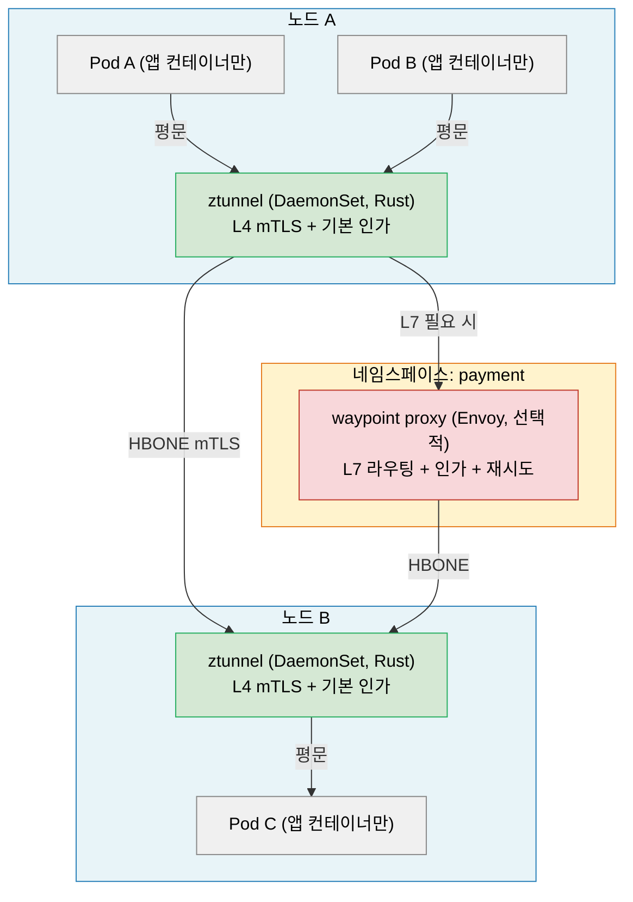
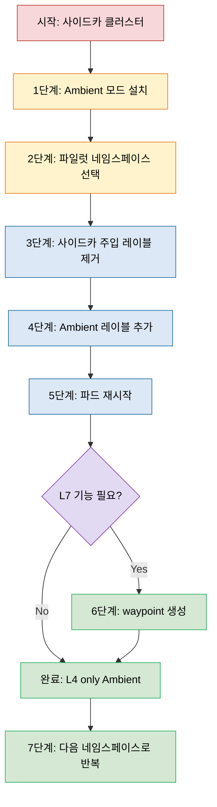

# Istio Ambient Mesh

> Ambient Mesh는 "사이드카 없이 서비스 메시를"이라는 명제에서 출발했다. 노드당 하나의 ztunnel DaemonSet이 L4 mTLS를 처리하고, L7 기능이 필요한 워크로드만 waypoint 프록시를 선택적으로 붙인다. 1000개 파드 기준 메모리 소비가 사이드카 50GB에서 Ambient 300MB로 줄어들며, 2024년 Istio 1.24에서 GA가 됐다.


## 학습 목표

> 사이드카 모델의 구조적 한계, ztunnel 노드당 배치 전략, waypoint L4/L7 분리 아키텍처, 사이드카→Ambient 마이그레이션 절차까지 다섯 가지 목표를 다룬다.

학습 목표는 다섯 가지다:

1. 사이드카 모델의 구조적 한계 네 가지를 실제 장애 시나리오로 설명한다.
2. ztunnel의 역할과 노드당 하나라는 배치 전략이 갖는 의미를 설명한다.
3. waypoint 프록시가 ztunnel과 어떻게 협력하는지 L4/L7 분리 아키텍처를 그릴 수 있다.
4. 사이드카에서 Ambient로의 마이그레이션 절차를 단계별로 수행한다.
5. 사이드카와 Ambient의 리소스 소비를 수치로 비교하고 선택 기준을 제시한다.


## 1. 왜 Ambient Mesh인가: 사이드카의 구조적 한계

> 수년간 대규모 운영에서 드러난 사이드카 모델의 리소스 오버헤드, 수명주기 결합, 권한 충돌, 선형 스케일 문제 네 가지를 다룬다.

사이드카 메시는 "모든 파드 옆에 프록시를 붙인다"는 단순한 아이디어에서 출발했다. 수년간 대규모 운영을 통해 네 가지 근본적인 문제가 드러났으며, Ambient Mesh는 이를 모두 해결하려는 시도다.

**리소스 오버헤드**가 첫 번째다. Envoy 사이드카는 파드 하나당 약 50MB 메모리와 100m CPU를 소비한다. 1000개 파드 클러스터라면 사이드카만으로 50GB 메모리가 추가로 필요하다. 트래픽이 거의 없는 파드에도 동일한 오버헤드가 붙는다는 점이 더 심각하다.

**애플리케이션 수명주기 결합**이 두 번째다. 사이드카는 애플리케이션 컨테이너와 같은 Pod에 속하므로 수명주기가 묶인다. Istio를 업그레이드하려면 모든 파드를 재시작해야 하고, 사이드카가 크래시하면 애플리케이션 파드 전체가 영향을 받는다.

**일부 애플리케이션과의 충돌**이 세 번째다. iptables 기반 트래픽 가로채기는 raw socket을 사용하는 네트워크 도구나 자체 iptables 규칙을 설정하는 애플리케이션과 충돌한다. `istio-init` Init Container에 필요한 `NET_ADMIN` 권한이 보안 정책으로 제한된 환경에서는 사이드카 주입 자체가 불가능하다.

**선형 스케일 문제**가 네 번째다. 파드 수가 늘수록 Envoy 인스턴스 수가 정비례해서 늘고, istiod가 xDS 설정을 푸시해야 하는 대상도 정비례해서 늘어난다. 대규모 클러스터에서 istiod의 메모리 소비와 xDS 업데이트 레이턴시가 문제가 된다.


## 2. Ambient Mesh 아키텍처: 두 계층의 분리

> L4 mTLS를 담당하는 ztunnel과 L7 기능을 선택적으로 처리하는 waypoint의 역할 분리를 다이어그램과 함께 설명한다.

Ambient Mesh는 네트워크 기능을 두 계층으로 분리한다. 모든 파드는 L4 ztunnel을 통과하지만, 목적지에 따라 일부 파드만 L7 waypoint를 거친다.



### 2.1 ztunnel: L4 계층의 수문장

ztunnel(zero-trust tunnel)은 Istio 팀이 Rust로 새로 작성한 경량 프록시다. 모든 노드에 DaemonSet으로 배포되므로 파드 수와 무관하게 노드당 하나만 존재한다. ztunnel이 담당하는 기능은 mTLS 암호화/복호화, L4 인가(소스 SPIFFE 신원 기반), L4 텔레메트리 세 가지로 한정된다. HTTP 헤더나 gRPC 메서드를 파싱하지 않으므로 단순하고 가볍다. 하나의 ztunnel 인스턴스가 노드 위의 모든 파드 트래픽을 처리하며 메모리 소비는 약 10MB 수준이다.

ztunnel은 파드와 파드 사이의 연결을 HBONE(HTTP-Based Overlay Network Environment) 프로토콜로 터널링한다. HBONE은 HTTP/2 위에서 동작하며 CONNECT 메서드를 사용해 mTLS 터널을 수립한다. 표준 HTTP/2 포트를 사용할 수 있어 기존 방화벽 규칙과 호환성이 좋다.

### 2.2 waypoint 프록시: L7 계층의 선택적 확장

waypoint는 기존 Envoy 기반이다. 파드마다 붙는 것이 아니라 네임스페이스 또는 서비스어카운트 단위로 하나가 배포된다는 점이 차이다. waypoint는 HTTP 라우팅, 재시도·타임아웃, 결함 주입, L7 인가, L7 텔레메트리 등 Envoy의 L7 기능 전체를 처리한다. Gateway API를 통해 생성하며, `istio-waypoint` gatewayClassName을 사용하면 istiod가 자동으로 waypoint Deployment를 만들어 준다.

```yaml
apiVersion: gateway.networking.k8s.io/v1
kind: Gateway
metadata:
  name: payment-waypoint
  namespace: payment
spec:
  gatewayClassName: istio-waypoint
  listeners:
  - name: mesh
    port: 15008
    protocol: HBONE
```


## 3. 사이드카 vs Ambient: 리소스 비교

> 1000개 파드·20개 노드 기준으로 사이드카와 Ambient의 메모리·Envoy 인스턴스 수·xDS 업데이트 대상을 수치로 비교한다.

1000개 파드, 10개 네임스페이스, 20개 노드 클러스터를 기준으로 비교한다.

| 항목 | 사이드카 | Ambient (L4만) | Ambient (L4+L7) |
|------|---------|---------------|-----------------|
| Envoy 인스턴스 수 | 1000개 | 0개 | 10개 (waypoint) |
| ztunnel 인스턴스 수 | 0개 | 20개 (노드당) | 20개 (노드당) |
| 총 메모리 (프록시) | ~50GB | ~200MB | ~700MB |
| xDS 업데이트 대상 | 1000개 | 20개 | 30개 |
| 파드 재시작 없는 Istio 업그레이드 | 불가 | 가능 | 가능 |

사이드카에서 Ambient L4로 전환하면 메모리 소비가 약 250배 감소한다.


## 4. 마이그레이션: 사이드카 → Ambient

> 동일 클러스터에서 사이드카와 Ambient를 공존시키는 Istio 설계를 활용해 네임스페이스 단위로 점진적으로 전환하는 7단계 절차를 설명한다.

Istio는 사이드카 모드와 Ambient 모드를 동일 클러스터에서 동시에 운영하도록 설계됐다. 이 공존 설계가 점진적 마이그레이션을 가능하게 한다.



**1단계: Ambient 모드 설치**

```bash
helm install istio-cni istio/cni -n istio-system --set profile=ambient
helm install ztunnel istio/ztunnel -n istio-system
kubectl get daemonset ztunnel -n istio-system
```

**2단계: 네임스페이스 전환**

```bash
kubectl label namespace my-app istio-injection-
kubectl label namespace my-app istio.io/dataplane-mode=ambient
kubectl rollout restart deployment -n my-app
```

**3단계: waypoint 생성 (L7 필요 시)**

```bash
istioctl waypoint apply -n my-app --enroll-namespace
kubectl get gateway -n my-app
```

**4단계: 검증**

```bash
istioctl ztunnel-config workload -n my-app
istioctl x describe pod <pod-name> -n my-app
```

롤백은 Ambient 레이블을 제거하고 사이드카 주입을 재활성화하면 된다.


## 5. 현황과 한계 (2026 기준)

> Istio 1.24 GA 이후 남아 있는 디버깅 복잡도, 일부 L7 기능 미지원, CNI 의존성, Windows 노드 미지원 등 현실적인 제약 사항을 정리한다.

Istio 1.24에서 Ambient Mesh가 정식 출시됐다. Istio 1.27에서는 멀티클러스터 Ambient 지원이 알파 단계로 추가됐다.

현재 제약은 몇 가지 남아 있다. 디버깅 복잡도가 높아졌다. 사이드카는 특정 파드의 Envoy 설정을 직접 확인할 수 있지만, Ambient는 트래픽이 ztunnel → waypoint를 거치므로 어느 구간에서 문제가 발생했는지 파악하기 어렵다. 일부 L7 기능(TCP keepalive, 일부 Envoy 확장 필터)이 waypoint에서 아직 지원되지 않는다. CNI 의존성으로 기존 클러스터 CNI와의 호환성을 검증해야 한다. Windows 노드는 ztunnel이 Linux 커널 네트워킹에 의존하므로 지원하지 않는다.

Ambient가 적합한 경우는 파드 수가 많아 사이드카 메모리 오버헤드가 비용 문제로 이어지는 경우, `NET_ADMIN` 권한을 제한하는 환경, Istio 업그레이드 시 파드 재시작을 피하고 싶은 경우다. WASM 필터를 광범위하게 사용하거나 팀이 사이드카 모델에 익숙한 경우에는 사이드카가 더 나은 선택일 수 있다.


## 핵심 정리

> Ambient Mesh의 핵심 트레이드오프와 도입 판단 기준을 한눈에 정리한다.

Ambient Mesh는 사이드카 모델의 리소스 오버헤드, 수명주기 결합, 권한 충돌, 선형 스케일 문제를 ztunnel과 waypoint의 L4/L7 분리로 해결한다. ztunnel은 Rust로 작성된 노드당 하나의 경량 프록시로 mTLS와 L4 인가를 담당하고, waypoint는 L7 기능이 필요한 경우에만 선택적으로 배포한다. 사이드카와 Ambient가 동일 클러스터에서 공존하므로 네임스페이스 단위로 점진적 전환이 가능하다. 도입 시 새 네임스페이스나 대용량 배치 워크로드부터 시작해 waypoint 없이 L4만으로 먼저 운영하는 전략이 검증된 접근이다.

Ambient를 Cilium CNI와 함께 운영해 정책을 L3/L4/L7로 겹쳐 쓰는 통합 전략은 [Cilium과 Istio Ambient 통합 전략](../05_comparison/05-01.Cilium%EA%B3%BC%20Istio%20Ambient%20%ED%86%B5%ED%95%A9%20%EC%A0%84%EB%9E%B5.md)에서 별도로 다룬다.


## 면접 대비

> Ambient Mesh의 구조·도입 결정에 자주 등장하는 네 가지 질문을 답변 형식으로 정리한다.

**사이드카 모델의 어떤 한계가 Ambient를 만들었는가?**

네 가지가 한꺼번에 누적됐다. Pod당 ~50MB 메모리 오버헤드가 1000 Pod 클러스터에서 수십 GB로 확대되는 리소스 비용, 사이드카·앱 컨테이너의 생명주기 결합으로 인한 시작·종료 순서 함정, init container가 iptables를 잡으면서 다른 보안 컴포넌트와 충돌하는 권한 문제, 그리고 Pod 수에 선형적으로 비례하는 푸시 부하다.

**ztunnel과 waypoint가 L4/L7로 분리된 이유는?**

L4 mTLS와 신원 인증은 모든 트래픽에 무차별로 필요하지만 L7 정책(method/path/header)은 일부 서비스에만 의미가 있기 때문이다. 노드당 하나의 ztunnel이 모든 mTLS를 처리하면 Pod 수와 무관한 일정 오버헤드만 들고, L7이 필요한 namespace에만 waypoint를 붙이면 비용을 실제 필요한 곳에만 지불할 수 있다. "필요한 것만 필요한 위치에"라는 분할 원칙이다.

**사이드카에서 Ambient로 어떻게 점진 전환하는가?**

namespace 단위로 가른다. 사이드카 namespace와 Ambient namespace가 같은 클러스터에 공존할 수 있으므로 새 namespace나 대용량 배치 워크로드부터 Ambient로 시작한다. 처음에는 ztunnel만 켜서 L4 mTLS만 검증하고, L7 정책이 필요한 namespace에 한해 waypoint를 추가한다. 한 namespace의 전환을 끝낸 뒤 다음 namespace로 넘어가야 두 정책이 겹치는 구간을 짧게 유지할 수 있다.

**Ambient를 도입하지 말아야 할 환경은?**

VM 통합이 필수인 환경(ztunnel이 K8s 전용)이나 사이드카 단위로만 표현 가능한 세밀한 정책이 이미 자리잡은 환경이다. 또한 Ambient 1.x 초기 마이너 버전에서는 EnvoyFilter 일부가 적용되지 않거나 멀티클러스터 시나리오에서 사이드카 모드보다 성숙도가 낮을 수 있어, 그 기능이 운영의 핵심이라면 사이드카 유지가 현실적이다.
