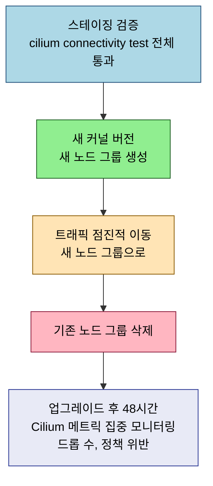

# eBPF와 Cilium 점검

> 본 장의 심화 점검 질문입니다. LEARN에서 다룬 개념의 경계와 운영 환경에서 주의할 판단 포인트를 Q&A 형태로 정리했습니다.

## Q&A

**eBPF Verifier의 한계가 복잡한 프로그램 개발에 어떤 영향을 미치는가?**

Verifier는 DAG 분석으로 프로그램 복잡도를 제한합니다. 커널 5.2 이후 최대 100만 개 인스트럭션을 허용하지만, 반복문은 Verifier가 정적으로 루프 횟수를 파악할 수 있는 경우만 허용됩니다. Cilium은 이를 우회하기 위해 긴 프로그램을 `bpf_tail_call`로 체이닝하거나, 복잡한 로직을 BPF Map 결정 테이블로 저장합니다. `cilium-agent` 로그에서 `verifier error` 메시지가 나타나면 해당 기능의 커널 요구사항을 먼저 확인해야 합니다.

**WireGuard와 mTLS는 동일한 암호화 목적을 달성하는가?**

두 방법 모두 트래픽을 암호화하지만 보안 모델이 다릅니다. WireGuard는 노드 간 암호화 터널을 생성해 "올바른 노드에서 오는 트래픽인가(노드 인증 + 암호화)"를 보장합니다. mTLS는 서비스 수준의 상호 인증으로 "올바른 서비스에서 오는 트래픽인가(서비스 인증 + 암호화)"를 보장합니다. Zero Trust의 "Least Privilege"가 필요하다면 WireGuard만으로는 부족하며, 서비스 아이덴티티 기반 정책 적용이 필요합니다. Cilium은 WireGuard로 노드 간 암호화를 제공하고, Kubernetes 아이덴티티(ServiceAccount, 레이블) 기반 L7 정책으로 서비스 수준 접근을 제어할 수 있습니다.

**프로덕션에서 커널 업그레이드 계획은 어떻게 수립해야 하는가?**

프로덕션 커널 업그레이드의 핵심 도전은 "노드를 재부팅하지 않고 커널을 바꿀 수 없다"는 사실입니다. 클라우드 환경에서는 새 커널 버전의 새 노드 그룹을 만들고 트래픽을 점진적으로 이동한 후 기존 그룹을 삭제하는 방식이 안전합니다. 커널 업그레이드 전 스테이징에서 `cilium connectivity test` 전체 통과를 확인하고, 업그레이드 후 48시간 동안 Cilium 관련 메트릭(드롭 수, 정책 위반)을 집중 모니터링합니다.

