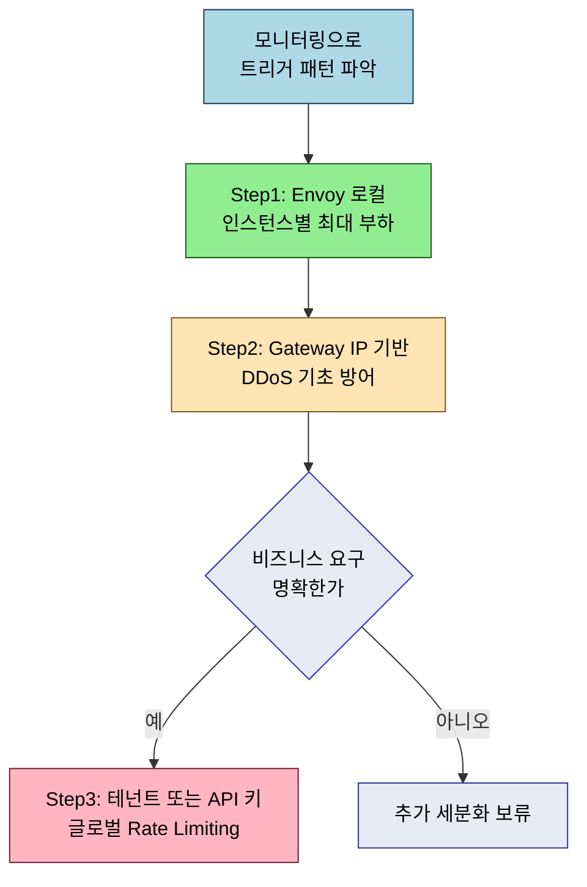

# 프로덕션 패턴 점검

> 본 장의 심화 점검 질문입니다. LEARN에서 다룬 개념의 경계와 운영 환경에서 주의할 판단 포인트를 Q&A 형태로 정리했습니다.

## Q&A

**카나리 분석에서 어떤 메트릭을 선택해야 의미 있는 배포 안전성을 확보할 수 있는가?**

카나리 분석에 흔히 사용하는 에러율, 레이턴시, 처리량의 단순 조합만으로는 중요한 문제를 놓칠 수 있습니다. 트래픽이 적은 시간대에는 에러 샘플이 부족해 통계적으로 의미 없는 결과가 나오므로 절대 에러 수 임계치(`errorCount > 5`)와 에러율을 AND 조건으로 사용하는 것이 낫습니다. 가장 중요한 것은 비즈니스 메트릭을 포함하는 것입니다. 결제 처리 시간이 늘어도 HTTP 200을 반환하면 기술 메트릭은 정상이지만 비즈니스 영향은 큽니다. Flagger의 Custom Metric Webhook으로 Prometheus에서 비즈니스 메트릭을 쿼리하는 방법을 활용합니다.

**Rate Limiting의 세분화 수준을 어떻게 결정하는가?**

세분화 결정의 실용적 기준은 "이 수준의 제한 위반이 얼마나 자주 발생하는가"입니다. 먼저 모니터링으로 실제 Rate Limiting 트리거 패턴을 파악하고, 문제가 되는 차원에 집중적으로 세분화하는 것이 효율적입니다. 권장 순서는 이렇습니다. 1단계로 Envoy 로컬 Rate Limiting으로 인스턴스별 최대 부하를 설정하고, 2단계로 Gateway 레이어에서 IP 기반 Rate Limiting으로 DDoS 기초 방어를 추가합니다. 3단계로 비즈니스 요구가 명확한 경우에만 테넌트/API 키 기반 글로벌 Rate Limiting을 추가합니다.

**타임아웃 계층 구조를 어떻게 설계해야 하는가?**

타임아웃 계층 설계의 기본 원칙은 "하위 서비스의 타임아웃 합계 < 상위 서비스의 타임아웃"입니다. gRPC를 사용하는 경우 Deadline Propagation으로 클라이언트가 설정한 Deadline이 호출 체인 전체에 전파되므로 개별 타임아웃 설정 부담이 줄어듭니다. 서비스 의존성 그래프를 그리고 각 엣지에 현재 설정된 타임아웃을 표시해 "상위 타임아웃 < 하위 타임아웃 + 예상 레이턴시" 조건을 위반하는 엣지를 찾습니다.

Rate Limiting 세분화의 권장 순서를 흐름도로 정리하면 다음과 같습니다.

