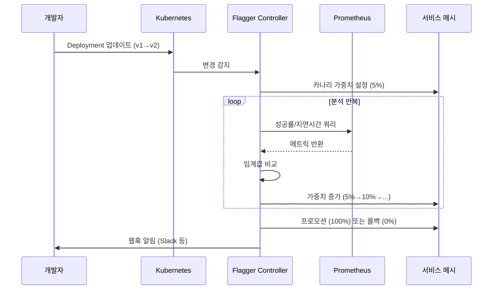
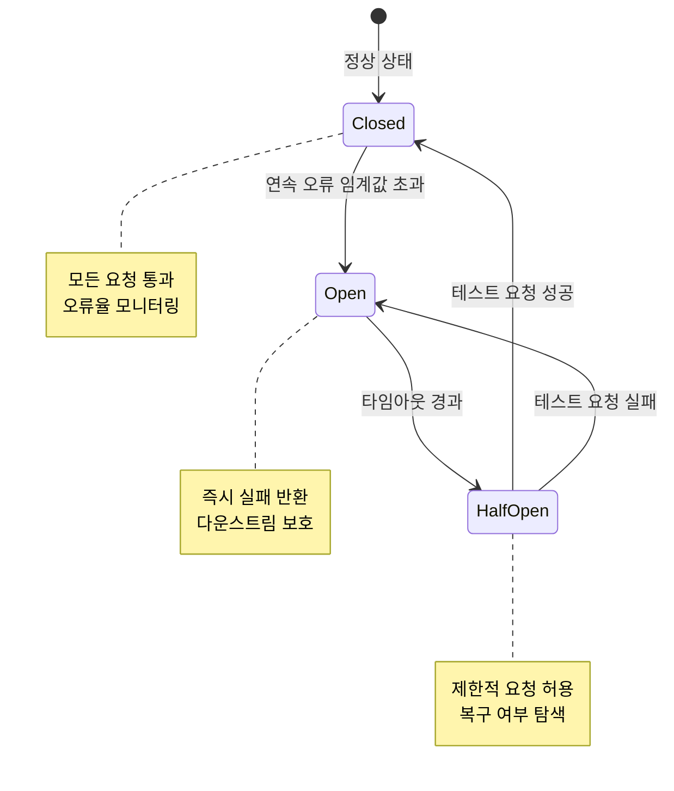

# 프로덕션 패턴

> 프로덕션 서비스 메시는 설치가 끝이 아니라 시작이다. 트래픽을 안전하게 전환하고, 장애를 격리하며, 신뢰성을 지표로 측정하는 패턴들이 메시의 진짜 가치를 만들어낸다. 카나리 배포부터 카오스 엔지니어링까지, 서비스 메시가 프로덕션에서 어떻게 활용되는지를 다룬다.


## 학습 목표

> Progressive Delivery 네 전략, Flagger 자동 카나리, 서킷 브레이커와 타임아웃/재시도, 글로벌·로컬 레이트 리미팅, Istio 폴트 인젝션까지 다섯 가지 목표를 다룬다.

학습 목표는 다섯 가지다:

1. Progressive Delivery의 네 가지 전략(카나리, 블루-그린, A/B 테스트, 다크 런치)을 구별하고 적합한 상황에 선택할 수 있다.
2. Flagger의 자동 카나리 분석 워크플로우를 이해하고 `Canary` CRD를 작성할 수 있다.
3. Istio와 Linkerd에서 서킷 브레이커와 타임아웃/재시도 전략을 설정할 수 있다.
4. 글로벌 레이트 리미팅과 로컬 레이트 리미팅의 차이를 설명하고 구성할 수 있다.
5. Istio 폴트 인젝션으로 카오스 엔지니어링을 수행하고 복원력을 검증할 수 있다.


## 1. Progressive Delivery: 배포를 실험으로 만들기

> 카나리·블루-그린·A/B 테스트·다크 런치 네 가지 전략이 위험을 관리하는 방식의 차이를 설명하고 각 전략에 맞는 상황을 안내한다.

전통적인 배포는 "모 아니면 도"였다. 새 버전을 올리거나 올리지 않거나. 하지만 서비스 메시는 트래픽 분배를 세밀하게 제어할 수 있어서 배포를 하나의 실험 과정으로 바꿀 수 있다. 이 접근을 Progressive Delivery라고 부른다.

각 전략은 위험을 관리하는 방식이 다르다. 다크 런치는 실제 사용자에게 영향을 주지 않으면서 새 버전을 테스트하고, 카나리는 소수 사용자부터 점진적으로 노출을 늘린다. 블루-그린은 순간 전환이 필요할 때, A/B 테스트는 두 버전의 비즈니스 효과를 비교할 때 선택한다.

### 1.1 카나리 배포

카나리는 19세기 광부들이 독가스를 감지하기 위해 탄광에 카나리아 새를 데리고 들어간 데서 유래했다. 소수의 트래픽이 새 버전에 먼저 노출되어 문제를 조기에 발견한다. 트래픽 전환 단계는 보통 `1% → 5% → 25% → 100%`로 진행한다. 각 단계에서 에러율, 지연 시간, 요청 성공률 같은 지표를 관찰한 뒤 임계값을 통과하면 다음 단계로 이동한다.

Istio에서 카나리는 `VirtualService`의 가중치 라우팅으로 구현한다.

```yaml
apiVersion: networking.istio.io/v1beta1
kind: VirtualService
metadata:
  name: payment-service
spec:
  http:
    - route:
        - destination:
            host: payment-service
            subset: stable
          weight: 95
        - destination:
            host: payment-service
            subset: canary
          weight: 5
```

### 1.2 블루-그린 배포

블루-그린은 두 개의 동일한 환경을 유지하고 순간적으로 전환한다. 카나리와 비교하면 블루-그린의 장점은 롤백 속도다. 문제 발생 시 단 몇 초 만에 이전 버전으로 돌아올 수 있다. 반면 두 환경을 동시에 운영해야 하므로 리소스 비용이 두 배가 된다는 단점이 있다.

### 1.3 A/B 테스트

A/B 테스트는 트래픽 비율이 아닌 사용자 특성을 기반으로 라우팅한다. 특정 쿠키를 가진 사용자, 특정 지역의 사용자, 베타 테스터 그룹에게만 새 버전을 보여준다.

```yaml
apiVersion: networking.istio.io/v1beta1
kind: VirtualService
metadata:
  name: checkout-service
spec:
  http:
    - match:
        - headers:
            x-user-group:
              exact: beta
      route:
        - destination:
            host: checkout-service
            subset: v2
    - route:
        - destination:
            host: checkout-service
            subset: v1
```

### 1.4 다크 런치 (트래픽 미러링)

다크 런치는 실제 요청을 새 버전에 복사해서 보내되, 응답은 사용자에게 반환하지 않는 방식이다. 새 버전은 실제 트래픽을 처리하지만 결과는 버려진다. 새 직원을 실제 고객에게 투입하기 전에 베테랑 직원 옆에서 섀도잉하게 하는 것과 같다.

```yaml
apiVersion: networking.istio.io/v1beta1
kind: VirtualService
metadata:
  name: product-service
spec:
  http:
    - route:
        - destination:
            host: product-service
            subset: v1
      mirror:
        host: product-service
        subset: v2
      mirrorPercentage:
        value: 100
```


## 2. Flagger: 자동화된 카나리 분석

> Deployment 변경을 감지해 카나리 가중치를 자동으로 조정하고 메트릭 임계값에 따라 프로모션 또는 롤백을 수행하는 Flagger의 워크플로우와 Canary CRD 설정을 다룬다.

카나리 배포를 수동으로 관리하는 것은 번거롭다. Flagger는 이 과정을 자동화하는 CNCF 졸업 프로젝트다.



Flagger는 Deployment 변경을 감지하면 자동으로 카나리 Deployment를 생성하고, 메시의 라우팅 설정을 업데이트하며, Prometheus에서 메트릭을 수집해 분석을 반복한다.

```yaml
apiVersion: flagger.app/v1beta1
kind: Canary
metadata:
  name: payment-service
  namespace: production
spec:
  targetRef:
    apiVersion: apps/v1
    kind: Deployment
    name: payment-service
  progressDeadlineSeconds: 600
  service:
    port: 8080
    targetPort: 8080
  analysis:
    interval: 60s
    threshold: 5
    maxWeight: 50
    stepWeight: 10
    metrics:
      - name: request-success-rate
        thresholdRange:
          min: 99
        interval: 1m
      - name: request-duration
        thresholdRange:
          max: 500
        interval: 1m
    webhooks:
      - name: notify-slack
        type: event
        url: https://hooks.slack.com/services/...
```

이 설정에 따르면 Flagger는 60초마다 성공률(99% 이상)과 응답 시간(500ms 이하)을 확인하면서 트래픽을 10%씩 늘린다. 5번 실패하면 자동으로 롤백하고 Slack에 알림을 보낸다. Flagger는 Istio, Linkerd, App Mesh, Gateway API를 지원하므로 메시를 교체해도 Canary CRD는 그대로 재사용할 수 있다.


## 3. 레이트 리미팅: 과부하에서 서비스 보호하기

> 인스턴스 단위의 로컬 레이트 리미팅과 Redis를 활용한 글로벌 레이트 리미팅의 차이 및 Linkerd에서의 대안 접근을 설명한다.

레이트 리미팅은 일정 시간 동안 처리할 수 있는 요청 수를 제한하는 패턴이다. 콘서트장 입구에서 한 번에 들어갈 수 있는 인원을 제한하는 것과 같다.

로컬 레이트 리미팅은 각 Envoy 프록시 인스턴스가 독립적으로 제한을 적용한다. 구성이 단순하고 중앙 집중식 서비스가 필요 없다는 장점이 있다. 하지만 Pod가 3개라면 실제로는 설정값의 3배 트래픽을 허용하게 된다는 단점이 있다.

글로벌 레이트 리미팅은 중앙 집중식 레이트 리밋 서비스를 통해 전체 트래픽을 일관되게 제어한다. Envoy의 글로벌 레이트 리미팅은 Redis를 백엔드로 사용하는 `ratelimit` 서비스와 연동한다.

```yaml
apiVersion: v1
kind: ConfigMap
metadata:
  name: ratelimit-config
data:
  config.yaml: |
    domain: production-ratelimit
    descriptors:
      - key: remote_address
        rate_limit:
          unit: minute
          requests_per_unit: 1000
      - key: header_match
        value: premium
        rate_limit:
          unit: minute
          requests_per_unit: 5000
```

Linkerd는 네이티브 레이트 리미팅을 제공하지 않는다. 대신 재시도 예산(Retry Budget)이 간접적인 보호 역할을 하고, 레이트 리미팅이 필요하다면 Ingress Controller 수준에서 적용하거나 애플리케이션 레이어에서 처리해야 한다.


## 4. 서킷 브레이커: 장애 전파 차단

> 닫힘·열림·반열림 세 상태로 동작하는 서킷 브레이커 패턴을 Istio outlierDetection과 connectionPool 설정으로 구현하는 방법을 설명한다.

전기 회로에서 과부하가 걸리면 차단기가 작동해 전체 시스템을 보호하듯, 마이크로서비스에서도 같은 개념을 적용한다. 다운스트림 서비스에 문제가 생겼을 때 무한정 요청을 보내는 대신, 잠시 연결을 끊어 전체 시스템이 연쇄 장애로 빠지는 것을 막는다.



Istio에서 서킷 브레이커는 `DestinationRule`의 `outlierDetection`으로 구현한다.

```yaml
apiVersion: networking.istio.io/v1beta1
kind: DestinationRule
metadata:
  name: order-service
spec:
  host: order-service
  trafficPolicy:
    outlierDetection:
      consecutiveGatewayErrors: 5
      interval: 10s
      baseEjectionTime: 30s
      maxEjectionPercent: 50
    connectionPool:
      tcp:
        maxConnections: 100
      http:
        http1MaxPendingRequests: 50
        http2MaxRequests: 100
```

`outlierDetection`은 Pod 단위로 동작한다. 특정 Pod에서 연속으로 오류가 발생하면 해당 Pod를 로드밸런서 풀에서 일시적으로 제거한다. 고전적인 서킷 브레이커가 서비스 전체를 차단하는 반면, Istio는 개별 비정상 인스턴스만 격리한다.

Linkerd에는 명시적인 서킷 브레이커 설정이 없다. 대신 재시도 예산이 간접적인 보호 역할을 한다. 기본 재시도 예산은 전체 요청의 20%로 제한되어 재시도로 인한 증폭 현상(retry storm)을 방지한다. 또한 Linkerd는 P2C(Power of Two Choices) 알고리즘으로 부하를 분산해 느린 Pod로 요청이 집중되는 것을 자동으로 방지한다.

`connectionPool` 설정의 `http1MaxPendingRequests: 50`이 벌크헤드 역할을 한다. 해당 서비스를 향한 대기 요청이 50개를 초과하는 순간 새 요청은 즉시 거부되어, 한 서비스의 장애가 다른 서비스의 연결을 고갈시키지 못하도록 막는다.


## 5. 타임아웃과 재시도 전략

> 엔드투엔드 타임아웃 예산 개념과 재시도 폭풍을 Linkerd 재시도 예산으로 방지하는 구조를 설명한다.

### 5.1 타임아웃 예산

분산 시스템에서 타임아웃 설정은 생각보다 복잡하다. A → B → C 3단계 체인에서 각 홉의 타임아웃 합산이 전체 엔드투엔드 타임아웃보다 작아야 한다는 것이 타임아웃 예산 개념이다.

```
엔드투엔드 타임아웃: 10초
  └─ A → B 타임아웃: 8초
       └─ B → C 타임아웃: 6초
            └─ C → DB 타임아웃: 4초
```

```yaml
apiVersion: networking.istio.io/v1beta1
kind: VirtualService
metadata:
  name: inventory-service
spec:
  http:
    - timeout: 6s
      retries:
        attempts: 3
        perTryTimeout: 2s
        retryOn: gateway-error,reset,connect-failure,retriable-4xx
      route:
        - destination:
            host: inventory-service
```

### 5.2 재시도 예산과 재시도 폭풍

재시도는 일시적 오류를 자동으로 처리하는 강력한 도구다. 하지만 서비스 A가 B를 3번 재시도하고, B가 다시 C를 3번 재시도하면 C는 원래보다 9배의 요청을 받게 된다. 이를 재시도 폭풍이라고 한다. Linkerd는 이를 재시도 예산으로 해결해, 전체 요청의 20%를 초과하는 재시도는 자동으로 차단된다.


## 6. 카오스 엔지니어링과 서비스 메시

> Istio 폴트 인젝션으로 코드 변경 없이 지연·오류를 주입해 시스템 복원력을 검증하는 카오스 엔지니어링 패턴을 설명한다.

카오스 엔지니어링은 의도적으로 장애를 만들어 시스템의 복원력을 검증하는 방법론이다. 서비스 메시는 애플리케이션 코드를 건드리지 않고 실제와 동일한 조건에서 장애를 주입할 수 있어서 카오스 엔지니어링의 이상적인 도구가 된다.

```yaml
apiVersion: networking.istio.io/v1beta1
kind: VirtualService
metadata:
  name: payment-service-chaos
spec:
  http:
    - fault:
        delay:
          percentage:
            value: 10
          fixedDelay: 5s
        abort:
          percentage:
            value: 5
          httpStatus: 503
      route:
        - destination:
            host: payment-service
```

이 설정 하나로 실제 결제 서비스 코드를 한 줄도 바꾸지 않고 네트워크 지연과 서비스 오류를 시뮬레이션할 수 있다.

카오스 엔지니어링 시나리오로는 결제 서비스에 3초 지연을 주입해 주문 서비스의 타임아웃 설정을 검증하거나, 재고 서비스의 30%에서 500 오류를 주입해 서킷 브레이커 동작을 확인하거나, 사용자 서비스가 완전히 다운됐을 때 의존 서비스들이 격리되는지 확인하는 방식이 있다.


## 7. 프로덕션 준비 체크리스트

> 보안·리소스·관찰가능성·헬스체크·트래픽 관리 다섯 영역의 프로덕션 준비 항목을 점검 목록으로 제공한다.

- 보안: mTLS strict 모드 활성화, PeerAuthentication 전체 네임스페이스 적용, AuthorizationPolicy 최소 권한 설정, 인증서 갱신 주기 확인
- 리소스: 사이드카 프록시 CPU/메모리 limits 설정, HPA 설정 시 프록시 오버헤드 포함, 컨트롤 플레인 컴포넌트 리소스 limits 설정
- 관찰가능성: Prometheus 메트릭 수집 확인(골든 시그널), Grafana 대시보드 구성, 분산 추적 활성화, 알림 규칙 설정
- 헬스체크: Liveness/Readiness 프로브가 메시 초기화 완료 후 시작, `holdApplicationUntilProxyStarts: true` 설정
- 트래픽 관리: 서킷 브레이커 및 outlier detection 설정, 재시도 전략 및 타임아웃 설정, 서비스 간 트래픽 정책 문서화


## 면접 대비

> 프로덕션 패턴 챕터의 핵심 질문을 면접 답변 형식으로 정리한다.

**카나리 배포와 블루-그린 배포의 차이와 선택 기준은?**

카나리는 점진적 트래픽 전환, 블루-그린은 순간 전환이라는 점이 핵심 차이다. 카나리는 리소스를 점진적으로 사용하고 문제를 조기에 발견할 수 있어서 신뢰성이 중요한 서비스에 적합하다. 블루-그린은 리소스가 두 배 필요하지만 롤백 속도가 즉각적이어서 규제상 정확한 배포 시점이 중요하거나 마이그레이션 후 즉시 이전 환경을 복구해야 하는 경우에 선택한다.

**Istio의 outlierDetection과 서킷 브레이커의 관계는?**

Istio의 `outlierDetection`은 Pod(엔드포인트) 단위의 서킷 브레이커다. 특정 Pod에서 연속으로 오류가 발생하면 해당 Pod를 로드밸런서 풀에서 일시적으로 방출(eject)한다. 고전적인 서킷 브레이커가 서비스 전체를 차단하는 반면, Istio는 개별 비정상 인스턴스만 격리해 다른 정상 인스턴스는 계속 트래픽을 받는다.

**재시도 폭풍이란 무엇이고, 서비스 메시에서 어떻게 방지하나?**

재시도 폭풍은 장애 상황에서 각 서비스가 재시도를 수행할 때 요청이 기하급수적으로 증폭되는 현상이다. A→B→C 3단계 체인에서 각각 3번 재시도하면 C는 원래의 최대 27배 요청을 받을 수 있다. Linkerd는 재시도 예산으로 재시도가 전체 요청의 20%를 초과할 수 없도록 구조적으로 차단한다. Istio에서는 `retries.attempts`를 제한하고 `retryOn`으로 실제 재시도해야 할 오류 유형만 선택적으로 처리한다.

**Istio 폴트 인젝션을 카오스 엔지니어링에 활용할 때 고려할 사항은?**

프로덕션에서 폴트를 주입할 때는 반드시 특정 헤더나 사용자 그룹에만 적용되도록 match 조건을 설정해야 한다. 처음에는 1%만 적용해 점진적으로 늘린다. 관찰가능성 인프라가 충분히 갖춰진 상태에서 수행해야 결과를 측정할 수 있으며, 각 테스트 전에 기대 결과를 명시적으로 정의하고 실제 결과와 비교하는 과학적 접근이 필요하다.
