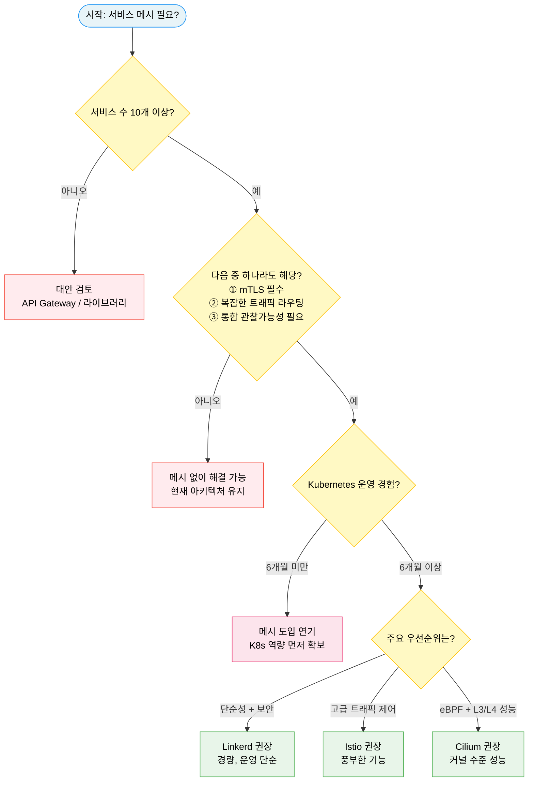

# 도입 전략과 의사결정

> 서비스 메시는 강력한 도구지만, 모든 문제의 해답이 아닙니다. 10개 미만의 서비스를 운영하는 팀이 메시를 도입하면 운영 복잡도만 높아질 수 있습니다. 이 장은 메시를 도입해야 할 시점과 그렇지 않아야 할 시점을 구분하고, 이미 운영 중인 시스템을 무중단으로 마이그레이션하는 전략을 다룹니다.


## 학습 목표

> 메시 도입 적합성 판단 기준, 4단계 의사결정 프레임워크, 단계적 마이그레이션 계획 수립, 비용/이점 손익분기까지 다섯 가지 목표를 다룹니다.

학습 목표는 다섯 가지입니다:

1. 서비스 메시 도입이 적합한 상황과 그렇지 않은 상황을 구체적 기준으로 판단할 수 있습니다.
2. 4단계 의사결정 프레임워크를 적용해 조직에 맞는 메시를 선택할 수 있습니다.
3. 운영 중인 시스템에 서비스 메시를 단계적으로 도입하는 마이그레이션 계획을 수립할 수 있습니다.
4. 서비스 메시의 비용과 이점의 손익분기점을 이해합니다.
5. 일반적인 도입 실수 5가지를 인식하고 사전에 방지할 수 있습니다.


## 1. 언제 서비스 메시가 필요한가

> 서비스 수·보안 요구사항·팀 규모 등 구체적 기준으로 서비스 메시 도입이 적합한 조건과 그렇지 않은 조건을 구분합니다.

2019년 Christian Posta가 "You Probably Don't Need a Service Mesh"라는 제목의 글을 썼습니다. 서비스 메시가 주목받던 시절 모든 마이크로서비스 팀이 메시를 도입해야 한다는 압박이 있었지만, 그는 "대부분의 팀은 메시 없이도 충분하다"고 주장했습니다. 이 주장은 지금도 유효합니다. 서비스 메시는 특정 규모와 복잡도 이상에서 비로소 그 비용을 정당화할 수 있습니다.

### 1.1 도입이 적합한 조건

10개 이상의 마이크로서비스를 운영할 때 적합합니다. 서비스가 많아질수록 서비스 간 통신의 가짓수는 제곱으로 늘어납니다. 10개 서비스라면 최대 90개의 통신 경로가 존재하고, 각 경로마다 mTLS 설정, 재시도, 타임아웃을 라이브러리 수준에서 관리하는 것은 실질적으로 불가능해집니다.

제로 트러스트 보안 요구사항이 있는 경우도 적합합니다. 규제 산업(금융, 의료, 공공)에서 서비스 간 mTLS 인증이 의무화되는 경우가 늘고 있습니다. 각 서비스에 TLS 코드를 직접 구현하는 것보다, 메시가 애플리케이션 코드 변경 없이 자동으로 mTLS를 적용하는 방식이 훨씬 현실적입니다.

여러 팀이 독립적으로 배포하면서 카나리 배포, A/B 테스트, 점진적 전환이 필요한 경우, 그리고 20개 팀이 50개 서비스를 운영하는 다중 팀 환경도 적합한 조건입니다.

### 1.2 도입이 부적합한 조건

모놀리식이나 2~5개의 소수 서비스, 각 Pod마다 메모리 50~100MB 오버헤드가 부담이 되는 리소스 제약 환경, 쿠버네티스 자체에 익숙하지 않은 팀, 모든 트래픽을 새 버전으로 한 번에 전환해도 되는 단순한 배포 요구사항은 부적합한 조건입니다.


## 2. 의사결정 프레임워크

> 서비스 수·기능 필요성·K8s 경험·우선순위 네 단계를 거쳐 Linkerd·Istio·Cilium 중 하나를 선택하는 의사결정 트리와 메시별 적합 기준을 제시합니다.



### Step 1: 메시 기능이 정말 필요한가?

먼저 해결하려는 문제를 명확히 정의합니다. "서비스 메시를 도입하고 싶다"가 아니라 "서비스 간 mTLS가 필요하다" 혹은 "배포 실패율을 줄이고 싶다"처럼 구체적인 문제를 적습니다.

### Step 2: 메시 없이 해결 가능한가?

mTLS가 목적이라면 cert-manager + 각 앱의 TLS 설정으로도 가능합니다. 트래픽 제어가 목적이라면 Ingress Controller로도 어느 정도 해결됩니다. 관찰가능성이 목적이라면 OpenTelemetry SDK를 각 서비스에 추가하는 방법도 있습니다. 메시는 이 모든 것을 코드 변경 없이 제공하지만, 단일 목적이라면 더 가벼운 도구가 나을 수 있습니다.

### Step 3: 어떤 메시가 조직에 맞는가?

| 기준 | Linkerd | Istio | Cilium |
|------|---------|-------|--------|
| 학습 곡선 | 낮음 | 높음 | 중간 |
| L7 기능 | 제한적 | 풍부 | 제한적 |
| 리소스 오버헤드 | 낮음 (Rust 프록시) | 중간 (Envoy) | 최소 (eBPF) |
| 성숙도 | 높음 | 높음 | 성장 중 |
| 사용 사례 | 단순/안정성 | 고급 제어 | 성능/보안 |

### Step 4: 사이드카 vs 사이드카리스?

Istio Ambient Mode는 사이드카 없이 노드 수준 프록시(ztunnel + waypoint)로 동작해 리소스 오버헤드를 크게 줄입니다. ztunnel은 노드마다 DaemonSet으로 배치되어 L4 mTLS를 담당하고, waypoint는 Envoy 기반으로 L7 정책을 처리합니다. Ambient는 Istio 1.24에서 GA로 승격되어 프로덕션 사용이 가능합니다. 하지만 Pod 수준 격리가 필요하거나 L7 정책을 세밀하게 적용해야 한다면 여전히 사이드카 모드가 더 적합합니다.


## 3. 마이그레이션 전략: 운영 중단 없이 메시 도입하기

> PERMISSIVE mTLS 설치부터 관찰가능성 구축, 트래픽 정책 적용, STRICT mTLS 전환, 심화 기능까지 5단계 마이그레이션 로드맵을 설명합니다.

운영 중인 시스템에 메시를 도입하는 것은 고속도로를 달리는 차에 엔진을 교체하는 것과 비슷합니다. 불가능하지는 않지만, 단계별 계획 없이는 사고가 납니다.

### Phase 1: 설치와 초기 주입 (1~4주)

메시를 설치한 뒤 mTLS 정책을 `PERMISSIVE` 모드로 설정합니다. PERMISSIVE는 mTLS와 일반 HTTP 트래픽을 모두 허용해 기존 서비스에 오류가 발생하지 않습니다. 이 상태에서 비중요 서비스에 먼저 사이드카를 주입합니다.

```bash
kubectl label namespace staging istio-injection=enabled
kubectl patch deployment my-app -p '{"spec":{"template":{"metadata":{"labels":{"sidecar.istio.io/inject":"true"}}}}}'
```

### Phase 2: 관찰가능성 구축 (5~8주)

Grafana 대시보드를 구성하고 서비스 토폴로지를 시각화합니다. 이 관찰 결과가 Phase 3~4의 정책 설계 근거가 됩니다. 예상치 못한 발견이 자주 나옵니다. 문서에는 없던 레거시 서비스 간 호출, 비정상적으로 높은 재시도율, 타임아웃 없이 운영 중인 서비스 등이 이 단계에서 드러납니다.

### Phase 3: 트래픽 관리 정책 적용 (9~12주)

Phase 2에서 얻은 베이스라인 데이터를 기반으로 정책을 설계합니다. P99 지연이 800ms인 서비스의 타임아웃을 2초로 설정하는 식입니다. 하나의 서비스부터 시작해 정책을 적용하고 이상 동작이 없는지 확인한 뒤 다음 서비스로 넘어갑니다.

### Phase 4: Strict mTLS와 인가 정책 (13~16주)

이 단계는 가장 주의가 필요합니다. PERMISSIVE에서 STRICT로 전환하면 mTLS 없이 통신하던 기존 클라이언트의 요청이 모두 거부됩니다. 전환 전에 반드시 PERMISSIVE 상태에서 메트릭으로 모든 통신이 mTLS로 이루어지고 있는지 확인합니다.

```yaml
apiVersion: security.istio.io/v1beta1
kind: PeerAuthentication
metadata:
  name: default
  namespace: production
spec:
  mtls:
    mode: STRICT
```

### Phase 5: 심화 기능 (17주~)

Phase 4까지 완료하면 메시의 기초가 완성됩니다. Phase 5는 팀의 필요에 따라 선택적으로 진행합니다. Flagger로 카나리 배포를 자동화하거나, 멀티클러스터 구성으로 지역 간 트래픽을 제어할 수 있습니다. 전체 타임라인은 팀 규모와 서비스 수에 따라 3~6개월이 일반적입니다.


## 4. 비용-편익 분석

> 리소스 오버헤드·인력 비용·학습 곡선 등 비용 항목과 코드 중복 제거·일관 관측성·감사 지원 등 이점 항목을 대비하고 손익분기점을 제시합니다.

### 4.1 비용 항목

리소스 오버헤드로 Envoy 사이드카 하나당 메모리 약 50~100MB, CPU 약 0.1~0.2 코어가 필요합니다. 100개 Pod 클러스터라면 사이드카만으로 5~10GB RAM을 추가로 사용합니다. 메시 자체를 운영하는 인력 비용, CRD를 이해하고 장애 시 Envoy 로그를 읽는 능력을 갖추는 2~3개월의 학습 곡선도 비용입니다.

### 4.2 이점 항목

서비스 간 mTLS, 재시도, 타임아웃을 각 서비스가 직접 구현하지 않아도 됩니다. 50개 서비스라면 수만 줄의 중복 코드가 사라집니다. 메시가 일관된 메트릭과 추적을 자동으로 제공하므로 새 서비스를 배포하면 즉시 대시보드에 나타납니다. mTLS와 AuthorizationPolicy 설정이 Git에 선언적으로 관리되므로 감사자에게 서비스 간 접근 현황을 YAML로 증명할 수 있습니다.

### 4.3 손익분기점

일반적으로 20~50개 서비스가 손익분기점으로 언급됩니다. 이 지점 이하에서는 메시의 비용이 이점을 상회할 수 있고, 이 지점 이상에서는 메시 없이 서비스 간 통신을 관리하는 것 자체가 더 큰 비용이 됩니다.


## 5. 흔한 도입 실수 5가지

> 너무 이른 도입, 과잉 기능 선택, STRICT mTLS 일괄 전환, 프록시 리소스 한도 누락, 업그레이드 계획 부재의 다섯 가지 실수와 예방 방법을 설명합니다.

**실수 1: 너무 이른 도입.** "나중에 필요할 것 같아서" 미리 도입하는 경우, 팀은 메시를 운영하는 데 시간을 쓰면서도 실제 이점을 얻지 못합니다. 예방하려면 구체적인 Pain Point 목록을 먼저 작성해야 합니다.

**실수 2: 가장 기능이 많은 메시 선택.** 사용하지 않는 기능이 90%인 메시를 운영하는 것은 자동차 레이싱 트랙을 출퇴근에 빌리는 것과 같습니다. 현재 필요한 기능만 목록으로 작성하고 그것을 제공하는 가장 단순한 메시를 선택합니다.

**실수 3: Strict mTLS를 한 번에 전환.** PERMISSIVE 모드로 몇 주 운영하다가 클러스터 전체를 STRICT로 바꾸는 경우, 메시 외부에서 들어오는 레거시 트래픽이 일시에 차단됩니다. PERMISSIVE 상태에서 Prometheus 메트릭으로 mTLS 통신 비율이 100%인지 확인한 뒤 STRICT로 전환하고, 네임스페이스별로 단계적으로 진행해야 합니다.

**실수 4: 프록시 리소스 한도 설정 누락.** `resources.limits`를 설정하지 않으면 트래픽 급증 시 Envoy 프록시가 노드의 메모리를 무한정 사용하다 OOMKill이 발생하고, 해당 Pod의 모든 트래픽이 중단됩니다. 메시 설치 시 기본 사이드카 리소스를 IstioOperator에 설정합니다.

**실수 5: 업그레이드 계획 부재.** Istio는 N-1 버전까지만 지원하므로 업그레이드 없이 방치하면 보안 패치도 받을 수 없게 됩니다. 분기별 업그레이드 일정을 캘린더에 등록하고, 카나리 업그레이드(리비전 기반) 방식을 사전에 연습합니다.


## 6. 서비스 메시의 대안

> 라이브러리 접근, API 게이트웨이, Cilium L3/L4 전용, cert-manager+앱 TLS 조합의 네 가지 메시 대안과 각 한계를 설명합니다.

메시를 도입하지 않기로 결정했다면, 목적을 달성하는 다른 방법들이 있습니다.

라이브러리 접근은 Netflix OSS, gRPC 인터셉터, Spring Cloud 같은 라이브러리를 각 서비스에 추가하는 방식입니다. 메시 인프라 없이 바로 사용 가능하지만 언어/프레임워크마다 별도 라이브러리가 필요하고 버전 통일이 어렵습니다.

API 게이트웨이는 노스-사우스 트래픽(외부→내부)을 제어합니다. 이스트-웨스트 트래픽(서비스 간 내부 통신)에는 적용되지 않는다는 한계가 있습니다.

Cilium을 L3/L4 수준에서만 사용하면 사이드카 오버헤드 없이 커널 수준의 네트워크 정책과 관찰가능성을 제공하지만, HTTP 헤더 기반 라우팅이나 카나리 배포가 불가능합니다.

cert-manager와 앱 TLS 조합으로 각 서비스가 직접 mTLS를 구현할 수 있지만, 각 앱이 TLS 코드를 직접 처리해야 하고 인증서 갱신 로직을 직접 구현해야 합니다.


## 면접 대비

> 도입 전략·의사결정 챕터의 핵심 질문을 면접 답변 형식으로 정리합니다.

**30개의 마이크로서비스가 있고 서비스 메시 도입을 검토 중입니다. 의사결정 과정을 설명해주세요.**

먼저 도입 목적을 명확히 정의합니다. 30개 서비스라면 서비스 간 통신 경로가 수백 개에 달하므로 메시 없이 각 서비스가 개별적으로 재시도, 타임아웃, mTLS를 구현하는 것의 비효율이 실질적입니다. 다음으로 팀의 K8s 운영 경험이 6개월 이상인지 확인합니다. 그 다음 어떤 기능이 주요 요구사항인지 파악해 단순 mTLS + 기본 재시도라면 Linkerd를, 고급 트래픽 라우팅과 카나리 배포 자동화가 필요하다면 Istio + Flagger를 권장합니다. 마지막으로 POC를 비프로덕션 환경에서 2주간 진행해 팀의 운영 역량을 검증한 뒤 프로덕션 도입 여부를 결정합니다.

**운영 중인 프로덕션 시스템에 서비스 메시를 무중단으로 도입하려면 어떻게 해야 하나요?**

단계적 접근이 핵심입니다. 1단계는 mTLS를 PERMISSIVE 모드로 설치하고 비중요 서비스에 먼저 사이드카를 주입합니다. 2단계에서는 Prometheus와 Grafana로 서비스별 성공률·지연 시간 베이스라인을 2~3주간 수집합니다. 3단계에서 그 데이터를 기반으로 타임아웃과 재시도 정책을 서비스별로 적용합니다. 4단계에서 STRICT mTLS로 전환하되 반드시 네임스페이스 단위로 순차적으로 전환하고 각 전환 후 24시간 모니터링 기간을 둡니다. 전체 과정에 3~4개월을 할애하는 것이 현실적입니다.

**서비스 메시 없이도 mTLS를 구현할 수 있는데, 메시를 사용하는 이유는?**

기술적으로는 cert-manager와 각 서비스의 TLS 설정으로 mTLS를 구현할 수 있습니다. 하지만 세 가지 현실적 문제가 있습니다.

1. Go, Java, Python, Node.js 서비스가 혼재하면 언어마다 다른 방식으로 구현해야 합니다.
2. 인증서 갱신 로직을 각 서비스가 직접 처리해야 하고 갱신 실패 시 해당 서비스의 통신이 끊깁니다.
3. mTLS가 올바르게 동작하는지 감사할 방법이 없습니다.

메시는 사이드카가 모든 TLS를 투명하게 처리하고 컨트롤 플레인이 인증서를 자동 갱신하며 시각적으로 확인할 수 있습니다. 단순한 기술적 가능성이 아니라 운영 현실성 측면에서 메시가 더 나은 선택입니다.

**서비스 메시 컨트롤 플레인 업그레이드를 어떻게 수행하나요?**

Istio 기준으로 카나리 리비전 방식을 사용합니다. 새 버전의 컨트롤 플레인을 기존과 별도 리비전으로 설치하면, 기존 사이드카는 구버전 컨트롤 플레인에 연결된 채로 정상 동작합니다. 비중요 네임스페이스의 레이블을 변경해 새 리비전으로 재주입하고, Pod를 롤링 재시작해 새 버전 사이드카로 교체합니다. 2~3일간 모니터링 후 문제가 없으면 다음 네임스페이스로 이동하며, 모든 전환이 완료되면 구버전 컨트롤 플레인을 제거합니다. 이 방식은 새 버전에서 문제가 발생하면 레이블을 구버전 리비전으로 되돌려 빠르게 롤백할 수 있습니다.
