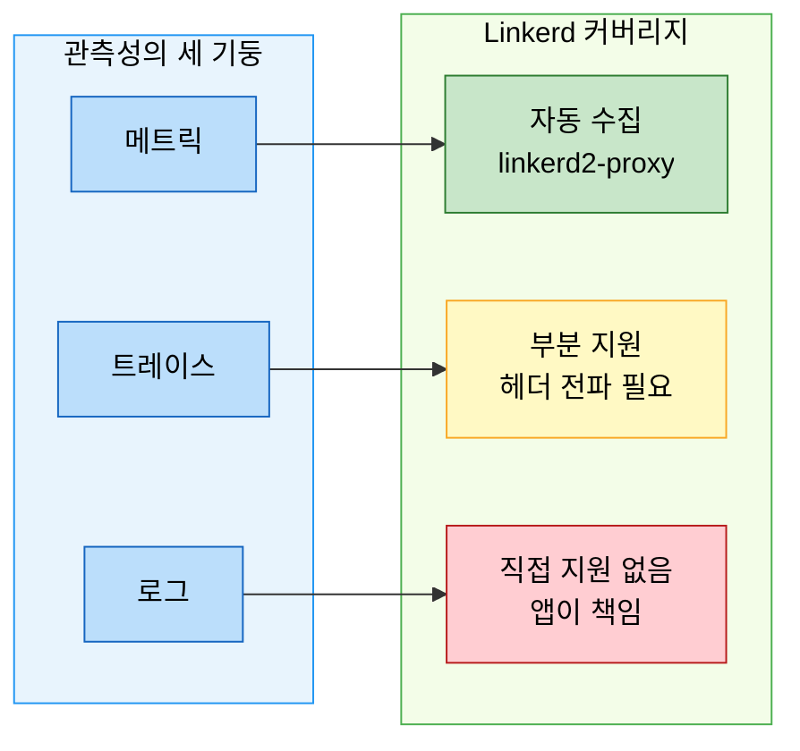
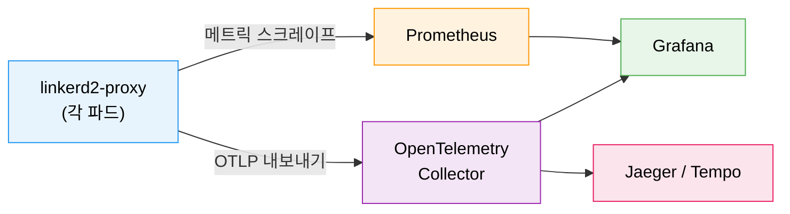

# Linkerd 관측성

> 관측성(Observability)은 시스템 내부 상태를 외부 출력만으로 추론하는 능력이다. Linkerd는 애플리케이션 코드 수정 없이 프록시 수준에서 메트릭을 자동 수집한다. Rate·Error·Duration이라는 세 가지 황금 메트릭(RED Method)을 기반으로, 서비스 메시는 기존 모니터링이 풀지 못한 "서비스 간 통신"의 블랙박스를 투명하게 만든다.


## 학습 목표
> 관측성 세 기둥의 서비스 메시 커버리지, RED Method, Linkerd Viz 명령어, 분산 트레이싱 철학, OpenTelemetry 연동, SLO 알림까지 일곱 가지 목표를 다룬다.


학습 목표는 일곱 가지다:

1. 관측성의 세 기둥(메트릭, 트레이스, 로그)이 서비스 메시에서 어떻게 달라지는지 설명한다.
2. RED Method 각 항목이 무엇을 측정하는지, 왜 황금 메트릭인지 설명한다.
3. Linkerd Viz 확장의 설치 방법과 구성 요소를 열거한다.
4. `linkerd viz stat`, `top`, `tap`, `edges` 명령어의 차이와 용도를 구분한다.
5. Linkerd가 분산 트레이싱을 직접 구현하지 않는 철학적 이유를 설명한다.
6. OpenTelemetry를 통해 Linkerd 메트릭을 다양한 백엔드로 연동하는 구조를 도식화한다.
7. SLO 기반 알림의 개념과 에러 버짓 소진 알림 설정 방법을 이해한다.


## 1. 왜 서비스 메시 관측성인가
> 애플리케이션 코드 수정 없이 프록시 수준에서 일관된 메트릭을 자동 수집하는 서비스 메시 관측성의 핵심 장점을 설명한다.


전통적인 모니터링은 애플리케이션이 스스로 메트릭을 노출하도록 설계됐다. Spring Actuator, Micrometer, Prometheus Java 클라이언트 등이 그 역할을 담당한다. 그러나 이 방식에는 구조적 한계가 있다. 서비스가 50개라면 50곳에 계측 코드를 심어야 하고, 언어가 다르면 라이브러리도 달라지며, 레거시 서비스에는 코드 수정 자체가 불가능할 수 있다.

서비스 메시는 이 문제를 다른 층위에서 해결한다. 모든 트래픽이 사이드카 프록시(linkerd2-proxy)를 통과하기 때문에, 프록시가 통신의 모든 특성을 측정할 수 있다. 애플리케이션은 자신이 관찰되고 있다는 사실조차 모른다. 도로 위의 자동차들이 교통량 센서를 의식하지 않고 달리는 것과 같다. 센서는 차에 아무것도 부착하지 않은 채로 속도, 밀도, 흐름을 측정한다.

이 접근법의 핵심 장점은 **일관성**이다. 언어나 프레임워크에 관계없이 동일한 메트릭 형식과 레이블이 수집된다.


## 2. 관측성의 세 기둥과 서비스 메시의 커버리지
> 메트릭(자동 수집), 분산 트레이스(부분 지원), 로그(앱 책임)에 대한 Linkerd의 커버리지 범위를 설명한다.


관측성을 논할 때 흔히 세 기둥을 이야기한다. 메트릭(Metrics), 트레이스(Traces), 로그(Logs)다.



**메트릭**은 Linkerd가 가장 잘 지원하는 영역이다. linkerd2-proxy가 모든 HTTP/gRPC 요청에 대해 요청 수, 성공/실패 여부, 응답 지연시간을 자동으로 기록한다.

**분산 트레이스**는 부분 지원이다. Linkerd는 서비스 토폴로지를 파악할 수 있지만, 단일 요청이 여러 서비스를 거치는 전체 경로 추적은 별도 작업이 필요하다. 구체적으로 애플리케이션이 `b3` 또는 `traceparent` 헤더를 인바운드에서 아웃바운드로 전파해야 한다.

**로그**는 Linkerd의 관심 밖이다. 각 서비스가 구조화된 로그를 출력하고 이를 Loki나 Elasticsearch로 수집하는 것은 애플리케이션과 운영팀의 책임이다.

Linkerd가 분산 트레이싱을 메시 레이어에서 처리하지 않는 이유는 설계 원칙에서 온다. 프록시가 추적 헤더를 전파할 수 있지만, 새로운 스팬(span)을 생성하려면 요청의 의미론적 경계를 알아야 한다. HTTP 요청 하나가 여러 내부 작업으로 구성된다면, 이 세분화된 정보는 애플리케이션만 알 수 있다. "메시는 골든 시그널을 제공하고, 세부 추적은 애플리케이션이 담당"하는 관심사 분리다.


## 3. RED Method: 황금 메트릭
> Rate, Error, Duration 세 황금 메트릭의 의미와 Prometheus 쿼리 예시를 다룬다.


구글 SRE 핸드북과 Tom Wilkie가 제안한 RED Method는 서비스 상태를 파악하는 세 가지 핵심 질문을 담고 있다.

### 3.1 Rate (요청률)

Rate는 초당 처리되는 요청 수(RPS)다. 갑자기 Rate가 0에 수렴한다면 서비스가 트래픽을 받지 못하는 것이고, 평소보다 10배 높다면 트래픽 급증이나 재시도 폭풍을 의심해볼 수 있다.

```promql
sum(rate(request_total{direction="inbound"}[1m])) by (deployment)
```

### 3.2 Error (오류율)

Error는 전체 요청 중 실패한 요청의 비율이다. HTTP에서는 5xx 응답이 오류로 분류된다. SLO를 99.9%로 정했다면 오류율 0.1%가 한계선이 된다.

```promql
sum(rate(response_total{classification="success"}[1m])) by (deployment)
/
sum(rate(response_total[1m])) by (deployment)
```

### 3.3 Duration (지연시간)

Duration은 요청이 처리되는 데 걸리는 시간이다. 평균이 아닌 백분위수로 봐야 한다. p50(중앙값), p95, p99가 표준적인 관찰 지점이다. p99가 p50보다 10배 이상 높다면 소수의 요청이 극단적으로 느리게 처리되고 있다는 신호다.

```promql
histogram_quantile(0.99,
  sum(rate(response_latency_ms_bucket[1m])) by (le, deployment)
)
```


## 4. Linkerd Viz 확장
> Viz 확장의 설치, 구성 요소, stat·top·tap·edges 네 핵심 명령어의 차이와 tap 보안 주의사항을 설명한다.


### 4.1 설치와 구성 요소

Linkerd Viz는 선택적으로 설치하는 확장 컴포넌트다.

```bash
linkerd viz install | kubectl apply -f -
linkerd viz check
```

기본 설치 시 다음 컴포넌트가 추가된다. Prometheus(기본 1Gi 메모리 요청), Grafana(128Mi 메모리 요청), metrics-api, tap, tap-injector, web 대시보드. viz의 Prometheus는 기본 데이터 보존 기간이 6시간으로 짧다. 장기 메트릭이 필요하다면 외부 Prometheus로 원격 쓰기(remote write)하거나 처음부터 외부 Prometheus를 사용하는 것이 낫다.

이미 클러스터에 Prometheus 스택이 있다면 내장 Prometheus를 비활성화할 수 있다.

```bash
linkerd viz install \
  --set prometheus.enabled=false \
  --set prometheusUrl=<external-prometheus>
```

### 4.2 핵심 명령어 비교

| 명령어 | 용도 | 특징 |
|--------|------|------|
| `linkerd viz stat` | 집계 메트릭 조회 | 일정 시간 윈도우의 요약 통계 |
| `linkerd viz top` | 실시간 요청 스트림 | 엔드포인트별 요청 분포 관찰 |
| `linkerd viz tap` | 실시간 요청 상세 | 헤더·경로·상태 코드 포함 |
| `linkerd viz edges` | mTLS 연결 상태 | 보안 감사에 유용 |

**tap 보안 주의사항**: tap은 실시간으로 서비스 간 요청과 응답의 헤더를 노출한다. `Authorization: Bearer <token>` 헤더가 있다면 이 토큰이 tap 출력에 나타난다. 프로덕션에서 tap 권한은 최소 범위로 제한하고, `config.linkerd.io/tap-ignore-header` 어노테이션으로 민감한 헤더를 제외해야 한다.


## 5. OpenTelemetry 연동
> linkerd2-proxy 메트릭을 Prometheus·OTel Collector를 통해 Grafana·Jaeger로 연동하는 구조를 도식화한다.


Linkerd 메트릭은 OpenTelemetry Collector로 내보낼 수 있으며, 애플리케이션이 OpenTelemetry SDK로 추적을 구현하면 Linkerd 메시와 함께 사용하는 데 기술적 제약이 없다.



Linkerd를 사용하는 환경에서 분산 트레이싱이 필요하다면, OpenTelemetry SDK를 각 서비스에 통합하고 Jaeger 또는 Tempo를 백엔드로 사용하는 방식이 표준이다. Grafana Tempo와 Prometheus를 함께 사용하면 메트릭에서 추적으로, 추적에서 메트릭으로 상호 탐색하는 관측성 환경을 구축할 수 있다.


## 6. SLO 기반 알림
> 에러 버짓 소진 속도 기반의 multi-window multi-burn-rate 알림 전략과 Sloth·pyrra 도구 활용을 설명한다.


SLO(Service Level Objective) 기반 알림은 "지금 사용자에게 영향이 있는가"를 기준으로 알림을 발생시키는 접근이다. 임계값 기반 알림(오류율 > 1%)과 달리, SLO 기반 알림은 에러 버짓 소진 속도를 기준으로 하므로 알림 피로도를 크게 줄일 수 있다.

Linkerd는 `response_latency_ms_bucket`, `response_total` 등의 메트릭을 Prometheus 형식으로 제공한다. SLO를 "99.9%의 요청이 200ms 이내에 성공적으로 응답"으로 정의했다면, 에러 버짓(0.1% 실패 허용)으로 변환하고 현재 소진 속도를 계산하는 알림을 구성한다.

Multi-window, multi-burn-rate 알림 전략이 알림 피로도를 줄이는 핵심이다. 높은 번 레이트에서 짧은 윈도우 알림은 빠른 대응을 위한 긴급 알림이고, 낮은 번 레이트에서 긴 윈도우 알림은 느린 누적 문제를 감지한다.

Linkerd 기반 SLO 알림을 처음 구축한다면 Sloth 또는 pyrra 같은 SLO 알림 생성 도구를 활용하는 것이 좋다. 이 도구들은 SLO 정의를 입력받아 multi-window 알림 규칙을 자동으로 생성한다.


## 7. 메트릭 카디널리티 관리
> authority 레이블로 인한 Prometheus 카디널리티 폭발 원인과 서비스 DNS 이름 사용으로 대응하는 방법을 다룬다.


Prometheus의 성능은 수집하는 메트릭의 카디널리티(고유한 레이블 조합 수)에 민감하다. Linkerd 메트릭의 레이블에는 namespace, deployment, pod, authority(목적지 hostname) 등이 포함된다. 클러스터 규모가 커지면서 Prometheus가 예상치 못하게 메모리를 소비하는 문제가 발생할 수 있다.

가장 흔한 카디널리티 폭발 원인은 `authority` 레이블이다. 클라이언트가 Pod IP를 직접 사용하면 각 IP가 별도 레이블 값이 되어 카디널리티가 선형으로 증가한다. 서비스 DNS 이름을 사용하도록 클라이언트를 구성하는 것이 첫 번째 대응이다.


## 면접 대비

> Linkerd 관측성을 설계·운영할 때 자주 받는 네 가지 질문을 답변 형식으로 정리한다.

**관측성 세 기둥 중 서비스 메시가 가장 강한 영역은?**

메트릭이다. 모든 서비스 간 트래픽이 사이드카 프록시를 통과하므로 RED Method(Rate·Errors·Duration)를 코드 수정 없이 자동 수집한다. 로그는 메시가 직접 생성하지 않고 애플리케이션에 의존하며, 분산 트레이싱은 헤더 전파를 애플리케이션이 책임지므로 메시 자체로는 절반만 해결한다. 메시 도입 첫 1주차에 가장 큰 가치가 나오는 곳도 메트릭이다.

**`linkerd viz stat`·`top`·`tap`·`edges`의 용도 차이는?**

집계 수준이 다르다. `stat`은 시간 윈도우에 대한 통계 요약(성공률·요청률·레이턴시 분위수), `top`은 현재 핫한 경로 순위, `tap`은 개별 요청 단위 실시간 스트림, `edges`는 워크로드 간 호출 그래프와 mTLS 적용 여부다. 장애 진단 순서는 보통 `stat`으로 범위를 좁히고 → `top`으로 의심 경로 찾고 → `tap`으로 개별 요청을 확인하는 흐름이다.

**Linkerd가 분산 트레이싱을 직접 구현하지 않는 이유는?**

트레이싱은 본질적으로 애플리케이션 코드의 헤더 전파(`b3`, `traceparent`)에 의존하므로 메시 단독으로 완결할 수 없다. 사이드카가 헤더를 만들어 줘도 앱이 호출 사이에 전파하지 않으면 끊긴다. Linkerd는 메시가 의미 있게 책임질 수 있는 부분만 다루겠다는 입장에서 OpenTelemetry 연동을 통해 외부 트레이싱 백엔드로 위임한다.

**Prometheus 카디널리티 폭발의 가장 흔한 원인과 대응은?**

클라이언트가 서비스 DNS 이름이 아닌 Pod IP를 호출해 `authority` 레이블 값이 인스턴스 수만큼 증식하는 경우다. 클라이언트가 ClusterIP/DNS를 사용하도록 바꾸는 게 1차 대응이고, 그래도 부족하면 Prometheus `metric_relabel_configs`로 고-카디널리티 레이블을 절단하거나 long-term storage에 다운샘플 후 보관한다.
