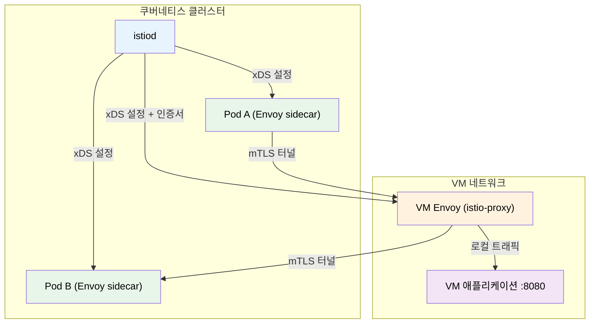
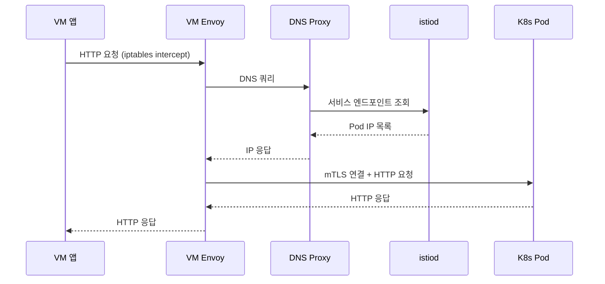

# Istio VM 통합

> 쿠버네티스 클러스터 외부의 가상머신(VM) 워크로드를 Istio 메시에 편입시키면 레거시 서버와 컨테이너 워크로드 사이에 mTLS, 트래픽 관리, 관측성을 일관되게 적용할 수 있다.


## 학습 목표

> WorkloadEntry·WorkloadGroup·ServiceEntry 관계, VM 사이드카 설치와 인증서 프로비저닝, K8s↔VM 양방향 mTLS, VM 워크로드 관측성 검증까지 다섯 가지 목표를 다룬다.

학습 목표는 다섯 가지다:

1. WorkloadEntry, WorkloadGroup, ServiceEntry의 역할과 차이를 설명한다.
2. VM에 Istio sidecar를 설치하고 인증서를 프로비저닝하는 과정을 서술한다.
3. K8s와 VM 양방향 트래픽 라우팅과 mTLS 적용 방법을 구성한다.
4. VM 워크로드의 메트릭·분산 추적·Kiali 표시를 검증한다.
5. autoRegistration의 보안 함의와 운영 리스크를 평가한다.


## 1. VM 통합의 필요성

> K8s와 VM이 공존하는 하이브리드 환경에서 보안 정책과 관측성이 단절되는 문제를 Istio VM 통합이 해결하는 방식을 설명한다.

### 1.1 하이브리드 환경의 현실

엔터프라이즈 환경에서 모든 워크로드를 컨테이너로 전환하는 일은 단기간에 완료되지 않는다. 레거시 Oracle DB, 오래된 Java 애플리케이션, 특수 하드웨어에 묶인 처리 서버 등은 EC2 인스턴스나 물리 서버 위에서 수년째 운영되는 경우가 많다. 현실적으로 K8s 클러스터와 VM이 수년간 공존하는 하이브리드 환경이 된다.

하이브리드 환경에서 가장 자주 발생하는 문제는 보안 정책의 단절이다. K8s 안에서는 mTLS와 AuthorizationPolicy로 세밀한 접근 제어를 구현했더라도, VM에서 K8s Pod를 호출하는 트래픽은 메시 밖에서 일반 TCP로 들어온다. 관측성도 끊긴다. Prometheus가 VM의 메트릭을 수집하지 못하고, Jaeger 추적 스팬이 VM에서 K8s로 넘어가는 순간 단절된다.

### 1.2 VM 통합이 해결하는 문제

Istio VM 통합은 VM 위에 Envoy sidecar를 설치하고 그 sidecar를 istiod의 제어 플레인에 연결한다. 이를 통해 세 가지 문제가 해결된다. 일관된 보안으로 VM과 K8s 트래픽에 mTLS가 자동 적용되고 AuthorizationPolicy로 VM의 서비스 계정 기반 접근 제어가 가능하다. 통합 관측성으로 VM의 Envoy가 메트릭을 노출하면 Prometheus가 수집하고 분산 추적 컨텍스트가 VM을 통과해도 끊기지 않는다. 트래픽 관리로 DestinationRule과 VirtualService를 K8s Pod와 VM 인스턴스 사이에 통일해서 적용한다.


## 2. 핵심 리소스

> WorkloadEntry는 VM 인스턴스를, WorkloadGroup은 인스턴스 집합 템플릿을, ServiceEntry는 서비스 이름을 메시에 등록하며 세 리소스가 함께 동작해야 완전한 VM 통합이 된다.

### 2.1 WorkloadEntry

WorkloadEntry는 K8s 클러스터 외부의 워크로드 인스턴스를 메시에 등록하는 리소스다. Pod가 K8s의 워크로드 단위라면, WorkloadEntry는 VM의 워크로드 단위에 해당한다. 하나의 WorkloadEntry가 하나의 VM 인스턴스를 나타낸다.

```yaml
apiVersion: networking.istio.io/v1beta1
kind: WorkloadEntry
metadata:
  name: vm-legacy-api
  namespace: production
spec:
  address: "10.0.1.100"
  labels:
    app: legacy-api
    version: v1
  serviceAccount: legacy-api-sa
  network: vm-network
```

WorkloadEntry의 `labels`는 Service, VirtualService, DestinationRule의 셀렉터와 매칭된다. `serviceAccount`는 VM에 발급될 SPIFFE ID를 결정하므로 AuthorizationPolicy 작성 시 이 값을 기준으로 잡는다.

### 2.2 WorkloadGroup

WorkloadGroup은 동일한 설정을 공유하는 VM 집합을 위한 템플릿 리소스다. WorkloadEntry가 개별 인스턴스라면, WorkloadGroup은 인스턴스 집합의 공통 설정을 정의한다. autoRegistration 기능을 사용할 때 WorkloadGroup이 기준 템플릿 역할을 한다. VM이 Istio agent를 시작하면 WorkloadGroup을 참조해서 자신의 WorkloadEntry를 자동으로 생성한다.

### 2.3 ServiceEntry와의 관계

ServiceEntry는 K8s 외부의 서비스(도메인 또는 IP)를 메시의 서비스 레지스트리에 추가하는 리소스다. WorkloadEntry만으로는 서비스 이름이 없으므로, Pod에서 VM을 DNS로 호출하려면 ServiceEntry가 함께 있어야 한다.

```yaml
apiVersion: networking.istio.io/v1beta1
kind: ServiceEntry
metadata:
  name: legacy-api-se
  namespace: production
spec:
  hosts:
  - legacy-api.production.svc.cluster.local
  ports:
  - number: 8080
    name: http
    protocol: HTTP
  resolution: STATIC
  workloadSelector:
    labels:
      app: legacy-api
```


## 3. VM 온보딩 아키텍처

> VM의 Envoy는 istiod 15012 포트로 xDS 설정을 받고 SPIFFE 인증서를 자동 갱신하며, DNS Proxy가 K8s 서비스 이름 해석을 담당한다.

### 3.1 전체 아키텍처



VM의 Envoy는 istiod에 직접 연결해서 xDS 프로토콜로 설정을 받는다. 이때 연결 경로는 istiod의 15012 포트(xDS over gRPC with mTLS)다. VM이 클러스터 내부 네트워크에 접근할 수 없는 환경이라면 East-West Gateway를 통해 연결한다.

### 3.2 VM 온보딩 절차

K8s 클러스터에서 VM용 설정 파일을 생성하는 것이 첫 단계다.

```bash
# WorkloadGroup 생성
kubectl apply -f workload-group.yaml

# VM 토큰 및 인증서 파일 생성
istioctl x workload entry configure \
  -f workload-group.yaml \
  -o /tmp/vm-files \
  --clusterID Kubernetes
```

이 명령은 `/tmp/vm-files` 디렉토리에 `cluster.env`(클러스터 접속 정보), `istio-token`(인증서 발급 시 사용), `root-cert.pem`(루트 인증서), `hosts`(K8s DNS 엔트리)를 생성한다. 이후 VM에 파일을 복사하고 sidecar 패키지를 설치해 서비스를 시작한다.

### 3.3 인증서 프로비저닝

VM의 Envoy는 처음 시작 시 istiod의 CA에 인증서를 요청한다. pilot-agent가 `istio-token`을 가지고 istiod의 15012 포트로 CSR을 보내면, istiod가 토큰을 검증하고 SVID를 발급한다. 발급된 인증서는 SPIFFE 형식의 SAN을 포함한다.

```
spiffe://cluster.local/ns/production/sa/legacy-api-sa
```

기본 TTL은 24시간이며 만료 2/3 시점에 자동 갱신을 시도한다.

### 3.4 DNS 해석 (Istio DNS Proxy)

VM에서 K8s 서비스 DNS를 해석하려면 DNS Proxy가 필요하다. Istio 1.8+에서 pilot-agent에 내장된 DNS Proxy가 `*.svc.cluster.local` 형식의 쿼리를 가로채서 istiod로부터 받은 서비스 레지스트리 정보로 응답한다. 이 DNS Proxy가 없으면 VM에서 K8s 서비스 이름으로 직접 호출할 수 없다.


## 4. 트래픽 관리

> ServiceEntry와 WorkloadEntry가 함께 있으면 K8s Pod와 VM 인스턴스를 동일한 DestinationRule·VirtualService 정책 아래 통합 관리할 수 있다.

### 4.1 K8s → VM 트래픽 라우팅

Pod에서 VM의 서비스를 호출하는 경우, ServiceEntry와 WorkloadEntry가 함께 있으면 K8s Service와 동일한 방식으로 동작한다. 여러 VM 인스턴스 간의 로드밸런싱은 DestinationRule로 제어한다.

```yaml
apiVersion: networking.istio.io/v1beta1
kind: DestinationRule
metadata:
  name: legacy-api-dr
  namespace: production
spec:
  host: legacy-api.production.svc.cluster.local
  trafficPolicy:
    loadBalancer:
      simple: LEAST_CONN
    outlierDetection:
      consecutive5xxErrors: 3
      interval: 30s
      baseEjectionTime: 30s
```

### 4.2 VM → K8s 트래픽 라우팅



### 4.3 mTLS와 AuthorizationPolicy 적용

`STRICT` mTLS 모드에서는 VM의 Envoy가 없는 클라이언트에서 오는 plaintext 연결을 거부한다. 전환 단계에서는 `PERMISSIVE`로 시작해서 모든 클라이언트가 mTLS를 사용하게 된 후 `STRICT`로 전환하는 것이 안전하다.

VM의 SPIFFE ID를 기반으로 세밀한 접근 제어를 구현한다. WorkloadEntry의 `serviceAccount`가 `legacy-api-sa`라면 AuthorizationPolicy에서 다음과 같이 VM을 출처로 지정한다.

```yaml
rules:
- from:
  - source:
      principals:
      - "cluster.local/ns/production/sa/legacy-api-sa"
  to:
  - operation:
      methods: ["POST"]
      paths: ["/charge"]
```

K8s Pod와 VM을 동일한 정책 프레임워크로 관리할 수 있다는 점이 VM 통합의 핵심 가치다.


## 5. 관측성

> VM의 Envoy가 노출하는 메트릭을 Prometheus가 수집하고, 분산 추적 헤더를 자동으로 전파해 K8s → VM → K8s 경로의 전체 스팬이 하나의 trace로 연결된다.

VM의 Envoy는 15090 포트에서 Prometheus 형식의 메트릭을 노출한다. WorkloadEntry에 어노테이션을 추가하면 Prometheus가 VM 메트릭을 수집한다. 수집되는 메트릭은 K8s Pod의 Envoy 메트릭과 동일하다. VM의 Envoy는 Zipkin/Jaeger 헤더를 자동으로 주입하고 전파하므로, VM 애플리케이션이 헤더를 upstream 요청에 전달하면 K8s Pod → VM → K8s Pod 경로의 전체 추적 스팬이 하나의 trace로 연결된다. Kiali는 WorkloadEntry를 인식해서 서비스 그래프에 VM 워크로드를 표시한다.


## 6. 운영 고려사항

> WorkloadGroup의 probe로 VM 헬스체크를 설정하고, autoRegistration은 최소 권한 서브넷 제한과 cleanupDelay 설정으로 보안 위험을 통제해야 한다.

VM 헬스체크는 WorkloadGroup의 `probe` 설정으로 구현한다. istiod가 VM의 Envoy를 통해 주기적으로 헬스체크를 수행하고 실패하면 해당 VM을 엔드포인트 목록에서 제거한다. `maxEjectionPercent`를 적절히 설정하지 않으면 VM 인스턴스 절반 이상이 동시에 장애를 겪을 때 연쇄적으로 제외되는 상황이 발생할 수 있다.

autoRegistration을 사용할 때는 istiod의 15012 포트에 대한 네트워크 접근을 VM 서브넷만 허용하고, WorkloadGroup별로 별도의 서비스 계정을 사용하며, `cleanupDelay` 설정으로 오프라인 VM의 WorkloadEntry를 자동 정리해야 한다.

Ambient 모드의 VM 지원은 2024년 기준 아직 실험적 단계다. ztunnel은 K8s 노드에서만 동작하므로 VM에 직접 설치할 수 없다. 현재로서는 기존 sidecar 기반 VM 통합을 계속 사용하고 Ambient의 VM 지원 GA를 기다리는 것이 현실적인 선택이다.


## 핵심 정리

> WorkloadEntry·ServiceEntry·WorkloadGroup 세 리소스가 함께 VM을 메시의 일급 구성원으로 편입시키며, DNS Proxy와 SPIFFE 인증서 자동화가 투명한 통합의 핵심이다.

VM 통합의 핵심은 클러스터 밖의 워크로드를 메시의 일급 구성원으로 편입시키는 것이다. WorkloadEntry로 VM 인스턴스를 등록하고, ServiceEntry로 서비스 이름을 부여하며, WorkloadGroup으로 인스턴스 집합의 공통 설정을 관리한다. VM의 Envoy는 Kubernetes ServiceAccount 토큰으로 인증서를 발급받아 SPIFFE ID 기반의 mTLS를 수립한다. DNS Proxy가 K8s 서비스 이름 해석을 담당하므로 VM 애플리케이션의 코드 변경 없이 K8s 서비스를 DNS로 호출할 수 있다.


## 면접 대비

> VM을 Istio 메시에 편입시킬 때 자주 받는 네 가지 질문을 답변 형식으로 정리한다.

**WorkloadEntry·WorkloadGroup·ServiceEntry는 각각 무엇을 담는가?**

WorkloadEntry는 개별 VM 인스턴스 한 대를 메시에 등록하는 리소스로 IP·label·서비스어카운트를 가진다. WorkloadGroup은 같은 역할의 VM 집합에 공통 설정·헬스 프로브를 부여하는 템플릿이라 오토스케일링 환경에서 인스턴스를 동적으로 추가할 때 쓴다. ServiceEntry는 그 VM 집합을 메시 안에서 호출할 서비스 이름(DNS)으로 노출한다. 셋이 함께 K8s `Pod + Deployment + Service`의 VM 등가물을 이룬다.

**VM이 Pod와 같은 SPIFFE 신원을 받는 흐름은?**

VM의 Envoy는 부트스트랩 시점에 Kubernetes ServiceAccount 토큰을 사용해 istiod에 인증서 요청을 보낸다. istiod가 토큰을 검증한 뒤 `spiffe://.../sa/<sa>` 형태의 워크로드 인증서를 발급한다. 인증서는 K8s 사이드카와 동일한 24시간 수명으로 자동 갱신된다. 결과적으로 mTLS·AuthorizationPolicy 측에서는 VM과 Pod를 구분할 필요 없이 SPIFFE ID로 권한을 표현할 수 있다.

**DNS Proxy가 왜 필요한가?**

VM은 클러스터 DNS를 직접 사용하지 못한다(보통 K8s 외부에서 ClusterDNS가 접근 불가). DNS Proxy가 VM 사이드카에서 K8s 서비스 이름 해석을 가로채 istiod의 서비스 디스커버리로 대응시키므로, VM 애플리케이션은 코드를 한 줄도 바꾸지 않고 `payment.payments.svc.cluster.local` 같은 K8s 서비스 이름을 그대로 호출할 수 있다.

**VM 통합을 Ambient 모드로 넘기는 게 가능한가?**

2026년 현재 ztunnel이 K8s 노드 전용이라 VM에 직접 설치할 수 없어서 Ambient 기반 VM 통합은 실험적 단계다. 당분간은 사이드카 기반 VM 통합을 유지하고, Ambient 진영의 VM 지원이 GA되기 전까지는 마이그레이션을 미루는 것이 현실적이다.
