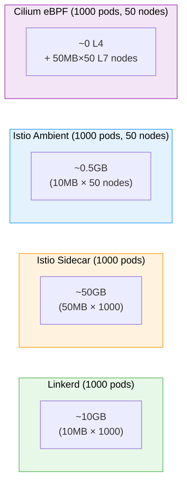
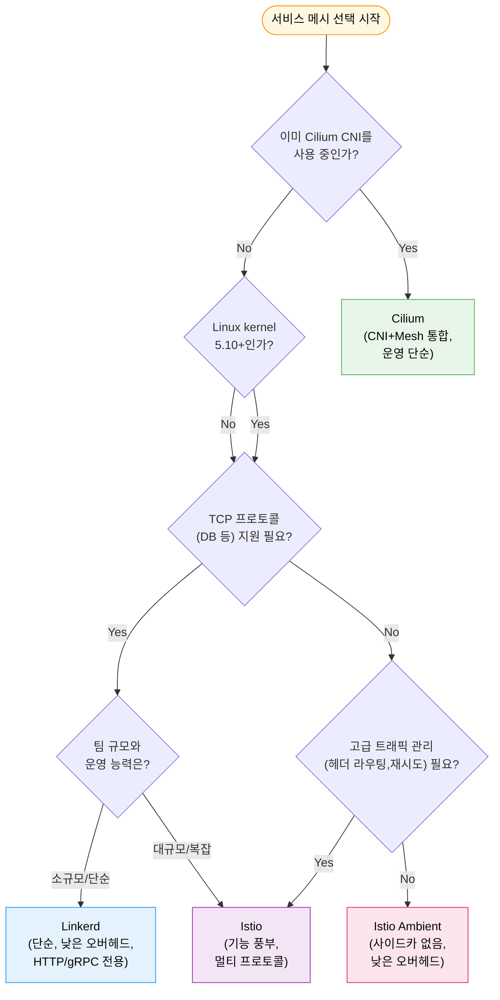

# 비교 매트릭스

> 세 가지 서비스 메시는 같은 문제를 서로 다른 방향에서 풀어낸다. Linkerd는 Rust 기반 마이크로프록시로 단순함을 추구하고, Istio는 Envoy의 풍부한 기능과 Ambient 모드로 유연성을 제공하며, Cilium은 eBPF로 커널 레벨 처리를 통해 사이드카 없는 성능을 달성한다. 올바른 선택은 "가장 좋은 것"이 아니라 "우리 팀과 인프라에 맞는 것"이다.

## 학습 목표

> 사이드카·Ambient·eBPF 프록시 아키텍처 비교, 성능 지표 차이의 원인, Day-0/1/2 운영 복잡성, BEL·Apache 라이선스 비용까지 다섯 가지 목표를 다룬다.

학습 목표는 다섯 가지다:

1. 세 메시의 프록시 아키텍처(사이드카, Ambient, eBPF)를 비교 설명할 수 있다.
2. 성능 지표(레이턴시, 메모리, CPU) 차이와 그 원인을 이해한다.
3. Day-0/1/2 운영 복잡성 관점에서 각 메시의 장단점을 평가한다.
4. 라이선스 비용 차이(BEL, Apache 2.0)를 파악하고 의사결정에 활용한다.
5. 세 메시 중 특정 상황에 어울리는 메시를 근거와 함께 추천할 수 있다.

## 1. 비교 매트릭스 한눈에 보기

> Linkerd·Istio·Cilium의 프록시 종류, mTLS 방식, 관측성, 라이선스, 메모리 오버헤드, 커널 요구사항을 단일 표로 조망한다.

| 항목 | Linkerd 2.19 | Istio 1.29 | Cilium 1.16 |
|------|-------------|-----------|-------------|
| 프록시 | linkerd2-proxy (Rust) | Envoy (C++) / ztunnel (Rust) | eBPF + Envoy (선택적) |
| 아키텍처 | 사이드카 전용 | 사이드카 + Ambient | 사이드카 없음 (eBPF) |
| mTLS | 자동, 기본 활성화 | 자동, 설정 가능 | 자동 (WireGuard 또는 mTLS) |
| 트래픽 관리 | HTTPRoute (Gateway API) | VirtualService + Gateway API | CiliumNetworkPolicy + Envoy |
| 관측성 | Viz (tap/top/stat) | Kiali + Jaeger | Hubble |
| 멀티클러스터 | 서비스 미러 | 멀티-프라이머리/리모트 | Cluster Mesh |
| CNCF 졸업 | 2024년 | 2023년 | 2024년 |
| 라이선스 | Apache 2.0 + BEL | Apache 2.0 | Apache 2.0 |
| 메모리 오버헤드 | ~10MB/프록시 | ~50MB/프록시(사이드카), ~10MB/노드(Ambient) | ~0(eBPF L4), ~50MB(L7 Envoy) |
| 커널 요구사항 | 없음 | 없음 | Linux 5.10+ |
| CNI 의존성 | 없음 | 없음 | Cilium CNI 필수 |

이 표만으로 결론을 내리기는 어렵다. 숫자 뒤에 있는 트레이드오프를 이해해야 실제 의사결정에 쓸 수 있다.

## 2. 프록시 아키텍처 상세 비교

> Rust 마이크로프록시(Linkerd), Envoy·ztunnel 이중 계층(Istio), eBPF·공유 Envoy(Cilium) 세 가지 아키텍처의 설계 철학과 트레이드오프를 설명한다.

### 2.1 Linkerd: linkerd2-proxy (Rust)

Linkerd의 핵심은 Rust로 작성된 linkerd2-proxy다. Envoy와 달리 HTTP/1.1, HTTP/2, gRPC에 특화되어 있어 코드 크기가 작고 메모리 사용량이 낮다. 범용 프록시가 아닌 서비스 메시 전용 프록시이기 때문에 불필요한 기능을 처음부터 넣지 않았다. Rust의 메모리 안전성 덕분에 C++로 작성된 Envoy에서 발생할 수 있는 메모리 오류 클래스가 원천 차단된다.

프록시 당 메모리가 약 10MB로 Envoy의 약 50MB에 비해 작다는 점은 파드 수가 수백 개를 넘어가는 환경에서 의미 있는 차이다. 1,000개 파드를 기준으로 단순 계산하면 Linkerd는 10GB, Istio 사이드카는 50GB의 프록시 메모리가 필요하다.

단점은 제한된 프로토콜 지원이다. TCP 레벨의 기본 프록시는 가능하지만 고급 L7 기능(Lua 확장, WebAssembly 플러그인, HTTP/3)은 지원하지 않는다.

### 2.2 Istio: Envoy + ztunnel

Istio 사이드카 모드에서는 Envoy가 각 파드에 주입된다. Envoy는 C++로 작성된 범용 프록시로, gRPC, HTTP/3, WebSocket, TCP, TLS 종료 등 사실상 모든 프로토콜을 지원한다. xDS API로 동적 설정을 받아 재시작 없이 라우팅 규칙을 변경할 수 있다.

Istio 1.22부터 GA가 된 Ambient 모드에서는 두 계층이 있다. 노드 레벨의 ztunnel(Rust)이 mTLS와 L4 정책을 처리하고, L7 기능이 필요한 트래픽만 waypoint proxy(Envoy)를 경유한다. 이 덕분에 L7 기능이 필요 없는 서비스는 사이드카 없이 노드당 약 10MB로 운영할 수 있다.

### 2.3 Cilium: eBPF + 선택적 Envoy

Cilium은 Linux 커널의 eBPF 프로그램으로 L3/L4 네트워킹과 보안을 처리한다. iptables를 완전히 우회해 커널에서 직접 패킷을 처리하므로 L4 오버헤드가 사실상 없다. L7 기능이 필요한 경우에만 노드 레벨 공유 Envoy를 사용하며, 이 Envoy는 사이드카가 아니라 노드당 하나 실행되므로 파드 수가 늘어도 L7 Envoy 인스턴스 수는 노드 수만큼만 증가한다.

결정적인 제약은 Linux 커널 5.10 이상이 필요하다는 점이다. 일부 관리형 Kubernetes에서는 커널 버전을 직접 선택할 수 없어 Cilium을 도입하기 전 커널 버전 확인이 필수다.

## 3. 성능 벤치마크

> 레이턴시·메모리·CPU 세 축에서 세 메시의 성능 경향을 데이터로 설명하고 그 원인을 분석한다.

성능 비교는 테스트 환경과 워크로드에 따라 다르기 때문에 절대값보다 경향을 이해하는 것이 중요하다.

### 3.1 레이턴시

메시 없이 파드 간 직접 통신 대비 추가되는 레이턴시(p50 기준):

| 메시 | p50 추가 레이턴시 | p99 추가 레이턴시 |
|------|-----------------|-----------------|
| 메시 없음 | 기준(0) | 기준(0) |
| Linkerd 사이드카 | ~0.5ms | ~1.5ms |
| Istio 사이드카 | ~1ms | ~3ms |
| Cilium eBPF (L4만) | <0.1ms | ~0.3ms |
| Cilium (L7 Envoy) | ~1ms | ~3ms |

Cilium의 eBPF L4 처리는 커널 내에서 실행되므로 유저스페이스 프록시보다 레이턴시가 압도적으로 낮다. 그러나 HTTP 헤더 기반 라우팅처럼 L7 기능을 사용하는 순간 Envoy가 끼어들어 Istio와 비슷한 수준이 된다. Linkerd가 Istio보다 낮은 레이턴시를 보이는 이유는 Rust의 비동기 런타임과 더 단순한 프록시 코드베이스 때문이다.

### 3.2 메모리

Istio Ambient와 Cilium은 파드 수가 아닌 노드 수에 비례하는 오버헤드를 갖기 때문에 파드 밀도가 높을수록 유리하다. 노드당 20개 파드를 운영하는 환경이라면 사이드카 대비 20배 메모리 절감이 가능하다.

### 3.3 CPU

CPU 사용은 트래픽 볼륨에 비례한다. idle 상태에서는 세 메시 모두 낮지만, 초당 1만 요청 이상의 고부하에서는 사이드카 프록시의 CPU 소비가 유의미해진다. Cilium eBPF는 L4 처리를 커널에서 하므로 유저스페이스 컨텍스트 스위치가 없어 CPU 효율이 높다.

## 4. 운영 복잡성: Day-0, Day-1, Day-2

> 설치(Day-0), 설정(Day-1), 운영·업그레이드·디버깅(Day-2) 단계별로 세 메시의 복잡성을 비교한다.

소프트웨어 선택은 설치 당일만의 결정이 아니다. 6개월, 1년 후 운영 팀이 겪을 복잡성도 함께 평가해야 한다.

### 4.1 Day-0: 설치

Linkerd는 `linkerd check --pre` 사전 점검 후 `linkerd install | kubectl apply`로 설치가 완료된다. CLI 하나로 모든 과정이 진행되며 커널 요구사항이 없어 어떤 Kubernetes 환경에서도 실행된다.

Istio는 `istioctl install --set profile=default` 명령 하나로 설치 가능하지만 이후 설정 커스터마이징이 복잡하다. Ambient 모드는 CNI 플러그인 설치를 추가로 요구한다.

Cilium은 CNI 플러그인으로 설치되는 경우가 많아 네트워크 플러그인 교체가 수반된다. 기존 클러스터에 다른 CNI가 있으면 마이그레이션이 필요하고 커널 5.10+ 사전 확인이 필수다.

### 4.2 Day-1: 설정

CRD 수 기준으로 Linkerd는 약 10개, Istio는 50개 이상, Cilium은 25개 수준이다. Istio의 CRD 수는 기능의 다양성을 반영하지만 그만큼 학습 곡선이 가파르다. 정책 표현력 측면에서 Istio가 가장 강력하다. VirtualService의 헤더 기반 라우팅, 재시도 정책, 트래픽 미러링은 Linkerd나 Cilium이 따라오기 어렵다.

### 4.3 Day-2: 운영

업그레이드는 Linkerd가 가장 단순하고, Istio는 주요 버전 업그레이드 시 CRD 변경 확인과 Canary 업그레이드가 필요하다. Cilium은 DaemonSet 업데이트 방식으로 진행되며 커널 모듈 의존성 때문에 노드 재시작이 필요할 수 있다.

디버깅 측면에서 Linkerd의 `linkerd tap`은 실시간 트래픽을 즉시 볼 수 있어 직관적이다. Istio는 명령이 많고 해석에 경험이 필요하다. Cilium의 `cilium monitor`와 Hubble UI는 eBPF 레벨 패킷 흐름을 시각화해 네트워크 문제 추적에 강점이 있다.

## 5. 라이선스 비용 분석

> Linkerd BEL, Istio Apache 2.0, Cilium Apache 2.0의 라이선스 조건과 실질적 비용 영향을 분석한다.

### 5.1 Linkerd의 BEL 라이선스

2023년 Buoyant는 Linkerd의 바이너리 릴리스에 BEL(Business Source License의 변형)을 적용했다. 핵심 규정은 직원 50인 이상의 영리 기업이 Buoyant가 제공하는 안정 릴리스를 상업적 목적으로 사용하면 라이선스 비용이 발생한다는 것이다. 비용 기준은 클러스터당 약 $2,000/월(공개 가격 기준)이다. 소규모 팀이나 개인은 영향이 없지만, 중대형 기업이 공식 릴리스를 사용하려면 비용을 계산에 넣어야 한다.

### 5.2 Istio: Apache 2.0 완전 무료

Istio는 Apache 2.0 라이선스로 기업 규모와 무관하게 무료다. 단, "무료"는 소프트웨어 라이선스 비용이 없다는 의미다. 대형 클러스터에서 Envoy 사이드카의 추가 컴퓨팅 비용과 숙련된 SRE 인력 비용은 별개이므로, 실제 TCO는 라이선스 비용이 있는 솔루션보다 높을 수 있다.

### 5.3 Cilium: Apache 2.0, 단 커널 요구사항

Cilium 자체도 Apache 2.0으로 무료다. 비용은 Linux 5.10+ 커널을 지원하지 않는 관리형 Kubernetes를 쓰는 경우 클러스터 교체나 마이그레이션에서 발생한다. 또한 Cilium CNI에 종속되기 때문에 나중에 CNI를 변경하면 서비스 메시도 함께 재설계해야 한다.

## 6. 어떤 메시를 선택할까

> 조직 상황에 따른 메시 선택 의사결정 트리와 각 메시가 적합한 유스케이스를 정리한다.

Linkerd는 "서비스 메시의 쉬운 버전"을 원할 때 가장 적합하다. 마이크로서비스가 주로 HTTP와 gRPC를 사용하고, 팀이 Kubernetes는 익숙하지만 서비스 메시는 처음인 경우에 빠르게 도입할 수 있다. 단, 직원 50인 이상 기업이라면 BEL 라이선스 비용을 고려해야 한다.

Istio는 프로토콜 다양성이 중요하거나, 세밀한 트래픽 관리(카나리, A/B 테스트, 서킷 브레이커, 헤더 기반 라우팅)가 필요한 환경에 적합하다. 운영 복잡성이 높아 숙련된 SRE 팀이 뒷받침되어야 한다.

Cilium은 이미 Cilium을 CNI로 사용 중이라면 별도 서비스 메시를 도입하는 대신 L7 기능을 활성화하는 것이 가장 단순한 경로다. 성능이 최우선이고 L4 레벨 정책만으로 충분한 환경에도 Cilium의 eBPF가 최선의 선택이다.

## 7. 보안 모델 비교

> 인증서 발급·수명 주기 관리와 mTLS 기본값(자동·PERMISSIVE·WireGuard) 차이를 세 메시 기준으로 비교한다.

### 7.1 인증서 발급과 수명 주기

Linkerd는 각 파드의 linkerd-proxy가 SPIFFE/SPIRE 호환 방식으로 짧은 수명(기본 24시간)의 x.509 인증서를 발급받는다. 인증서 갱신은 프록시가 자동으로 처리한다.

Istio는 istiod 내부의 Citadel 컴포넌트가 CA 역할을 한다. 외부 CA(AWS ACM PCA, Google Cloud CA Service, HashiCorp Vault)와의 통합이 Linkerd보다 성숙해 있어 엔터프라이즈 PKI 환경에 편입하기 쉽다.

Cilium은 WireGuard 기반 암호화를 선택하면 인증서 없이 노드 간 공개키 교환으로 암호화를 처리한다. 다만 노드 단위 인증이므로 파드 레벨 세분성이 낮다.

### 7.2 mTLS 기본값 비교

Linkerd는 메시에 주입된 파드 간 트래픽에 대해 mTLS를 자동으로 활성화한다. 별도 설정 없이 설치만 해도 암호화가 적용된다. Istio는 기본이 `PERMISSIVE` 모드로 mTLS와 평문을 모두 허용하므로, `STRICT` 모드로 전환하지 않으면 평문 통신이 이루어질 수 있다. Cilium은 WireGuard를 활성화하면 노드 간 트래픽 전체가 암호화되지만 파드 수준의 세분성은 두 메시보다 낮다.

## 8. 실제 마이그레이션 시나리오

> 사이드카 없는 환경에서 Linkerd 점진 도입, Linkerd→Istio 이전, 사이드카→Ambient 전환의 세 가지 실제 마이그레이션 경로를 설명한다.

### 8.1 사이드카 없는 환경에서 Linkerd 점진 도입

네임스페이스 단위로 순차 도입하는 것이 안전하다. 해당 네임스페이스에 주입을 활성화하고, 파드 재시작 후 `linkerd check`로 확인하며 `linkerd viz stat deploy`로 관측성을 검증한다. 문제 발생 시 해당 네임스페이스만 롤백할 수 있다.

### 8.2 Linkerd에서 Istio로 마이그레이션

기능 요구사항이 늘어 Linkerd에서 Istio로 이동하는 경우가 현실에서 발생한다. 두 메시를 동시에 운영하는 기간이 필수적으로 생기므로, 네임스페이스 단위로 Linkerd를 비활성화하고 Istio를 활성화하며 한 번에 하나의 서비스를 전환하는 것이 안전하다.

### 8.3 Istio 사이드카에서 Ambient 모드로 전환

같은 Istio 내에서 사이드카 모드를 Ambient 모드로 전환하는 경우도 증가하고 있다. Ambient 모드 CNI를 설치하고 네임스페이스에 `istio.io/dataplane-mode=ambient` 레이블을 붙인 뒤 파드를 재시작하면 사이드카가 제거된다. L7 기능이 필요한 서비스만 waypoint proxy를 추가한다.

## 면접 대비

> 비교 매트릭스 챕터의 핵심 질문을 면접 답변 형식으로 정리한다.

**Linkerd2-proxy와 Envoy의 핵심 차이점은?**

Linkerd2-proxy는 Rust로 작성된 서비스 메시 전용 프록시다. HTTP/1.1, HTTP/2, gRPC만 지원하고 약 10MB 메모리를 사용하며 Lua나 WASM 확장이 없다. Envoy는 C++로 작성된 범용 프록시로 TCP, UDP, WebSocket, HTTP/3, gRPC, Kafka 프로토콜까지 지원한다. 기능이 많은 만큼 약 50MB를 소비하고 수백 개의 설정 옵션을 갖는다. 단순성과 낮은 오버헤드가 필요하면 Linkerd, 프로토콜 다양성과 고급 L7 기능이 필요하면 Istio가 적합하다.

**Istio Ambient 모드가 사이드카 모드와 다른 점은?**

사이드카 모드는 파드마다 Envoy 컨테이너를 주입해 파드 당 약 50MB 메모리를 사용한다. Ambient 모드는 노드 레벨의 ztunnel(Rust)이 mTLS와 L4 정책을 처리하고, L7 기능이 필요할 때만 waypoint proxy(Envoy)를 사용한다. ztunnel은 노드당 하나 실행되므로 파드 밀도가 높을수록 절약 효과가 크다.

**Cilium이 iptables를 대체하는 방식과 그 이점은?**

전통적인 kube-proxy는 iptables 규칙으로 서비스 트래픽을 관리한다. 서비스가 수천 개가 되면 iptables 규칙도 수만 개가 되어 규칙 평가 시간이 선형적으로 증가한다. Cilium은 eBPF 해시 맵을 사용해 서비스 수에 무관한 O(1) 조회를 달성한다. 결과적으로 서비스 수가 많을수록 Cilium의 성능 이점이 커진다.

**세 메시의 멀티클러스터 구현 방식을 비교하면?**

Linkerd는 서비스 미러 방식으로 원격 서비스를 로컬 DNS에 등록한다. HTTP/gRPC만 지원하고 설정이 단순하다. Istio는 멀티-프라이머리와 프라이머리-리모트 토폴로지를 지원하며 TCP 포함 모든 프로토콜의 크로스-클러스터 라우팅이 가능하다. Cilium Cluster Mesh는 eBPF 레벨에서 클러스터 간 서비스 디스커버리와 로드 밸런싱을 제공한다.
