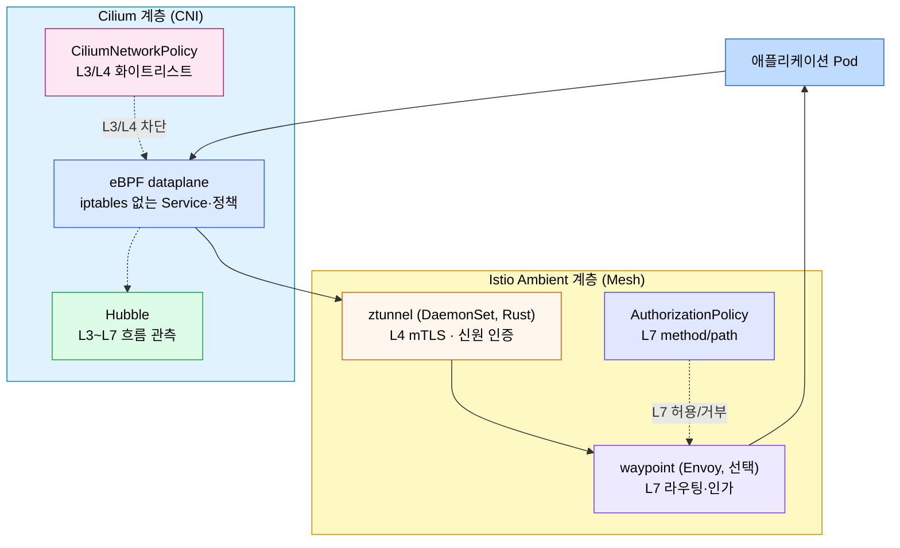
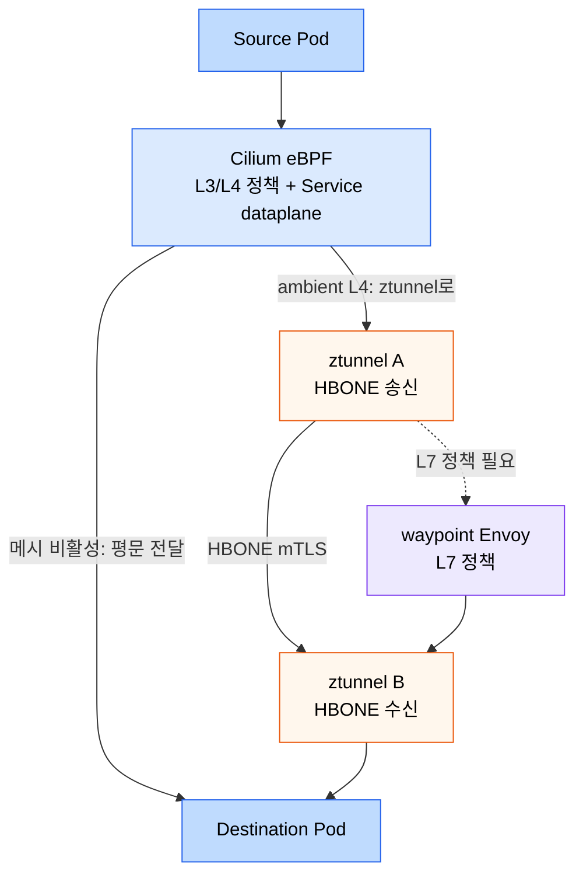
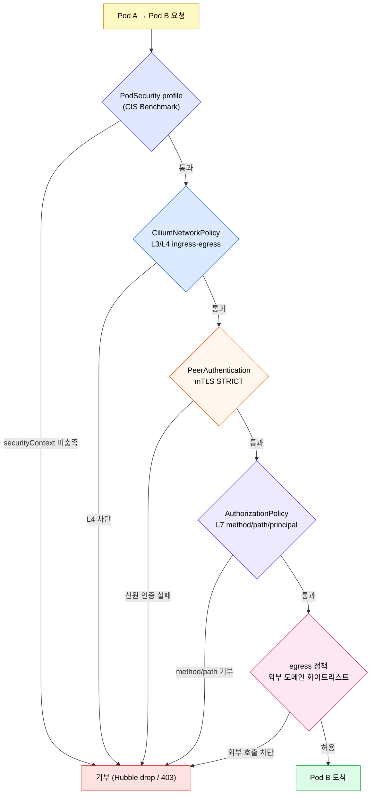
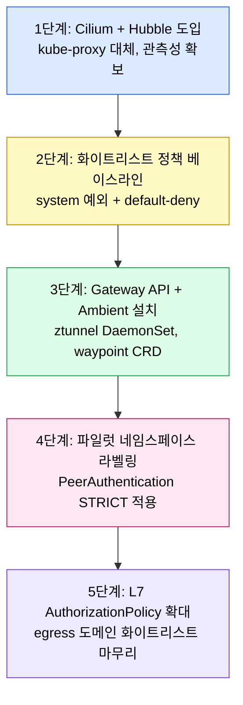

# Cilium과 Istio Ambient 통합 전략

---

> Cilium과 Istio Ambient는 보통 "둘 중 하나"로 비교되지만, 실제 운영에서는 두 도구가 다른 계층을 책임지도록 쌓아 쓰는 구성이 점점 늘어난다. 이 문서는 어디서 책임을 가르고, 어떻게 보안 정책을 세 겹으로 겹치며, 어떤 순서로 도입하는지 정리한다.

[인터랙티브 시각화](./14-05-mesh-integration.html)에서 같은 흐름을 단계별로 따라갈 수 있다.


## 학습 목표

> Cilium·Ambient 책임 분담, CNP·AuthorizationPolicy·egress 3중 화이트리스트, ztunnel·waypoint 패킷 경로, CIS Benchmark 환경 함정, 사이드카→Ambient 단계적 전환까지 다섯 가지 목표를 다룬다.

학습 목표는 다섯 가지다:

1. Cilium CNI와 Istio Ambient를 함께 쓸 때 각 계층이 책임지는 범위를 그릴 수 있다.
2. CiliumNetworkPolicy(L3/L4) · Istio AuthorizationPolicy(L7) · egress 정책을 겹쳐 화이트리스트 보안을 세우는 방법을 설명할 수 있다.
3. ztunnel과 waypoint가 Cilium 위에서 어떤 패킷 경로로 동작하는지 추적할 수 있다.
4. CIS Benchmark 프로파일·기본 차단 정책 위에서 워크로드를 띄울 때 자주 부딪히는 함정을 알아챌 수 있다.
5. 사이드카 → Ambient 전환을 단계적으로 진행하는 로드맵을 그릴 수 있다.


## 1. 왜 둘을 섞어 쓰는가
> 두 도구는 비교 대상으로 자주 등장하지만, 실제 책임 영역이 완전히 겹치지는 않는다. 겹치는 부분만 정리해 놓으면 같이 쓰는 그림이 자연스럽게 보인다.

Cilium은 CNI 계층을 책임진다. eBPF로 Pod 네트워크와 Service dataplane을 만들고, kube-proxy를 대체하며, Hubble로 L3~L7 흐름을 관측한다. CNI를 통째로 갈아 끼우는 결정이라 한 번 도입하면 클러스터 네트워크의 기반이 된다.

Istio Ambient는 메시 계층을 책임진다. ztunnel(노드당 하나, Rust)이 L4 mTLS와 SPIFFE 신원 기반 인가를 처리하고, waypoint(네임스페이스/서비스 단위 Envoy)가 필요할 때만 L7 트래픽 정책을 적용한다. 사이드카처럼 모든 Pod에 프록시가 붙지 않으므로 1000개 Pod 환경에서 메모리가 사이드카 대비 약 70~80% 줄어든다.

겹치는 부분은 두 가지다. mTLS와 L7 정책이다. Cilium도 WireGuard나 Envoy 기반 L7 처리를 제공하고, Ambient도 L4 mTLS와 L7 정책을 모두 다룬다. 같은 클러스터에서 두 도구를 같이 쓰려면 이 겹치는 자리에 누가 들어갈지 명시적으로 정해야 한다. 일반적인 분담은 다음과 같다:

- Cilium: CNI · Service dataplane · 노드 간 underlay 정책 · Hubble 관측성
- Ambient ztunnel: 워크로드 신원 기반 mTLS와 L4 권한 정책
- Ambient waypoint: HTTP method/path/header 기반 L7 정책과 트래픽 라우팅
- Cilium L7 Envoy: 사용하지 않거나, Cilium만 쓰는 네임스페이스에서만 사용

이 그림을 한 줄로 보면 다음과 같다:



Ambient 자체 구조 디테일은 [Istio Ambient Mesh](./13-03.Istio%20Ambient%20Mesh.md), eBPF·Hubble 디테일은 [eBPF와 Cilium](./14-02.eBPF%EC%99%80%20Cilium.md) 문서를 따로 본다. 본 장은 두 계층이 만나는 지점과 정책 겹치기 전략에 집중한다.


## 2. 패킷이 두 계층을 통과하는 경로
> 같은 워크로드라도 정책 모드(메시 비활성, ztunnel만, waypoint 추가)에 따라 패킷 경로가 달라진다. 이 차이를 머릿속에 잡아 두면 디버깅 진입점이 분명해진다.

기본 시나리오는 세 가지다.

첫 번째는 Cilium만 적용된 네임스페이스다. Pod에서 떠난 패킷은 노드의 eBPF TC 훅에서 정책 검사를 받고, Service dataplane이 eBPF 맵으로 endpoint를 찾아 곧장 다른 Pod로 전달한다. mTLS 없이 평문이 전송된다(Cilium 자체 WireGuard나 IPsec 옵션은 별도 켜야 한다).

두 번째는 `istio.io/dataplane-mode=ambient` 라벨이 붙은 네임스페이스다. 패킷은 같은 노드의 ztunnel로 가로채여 HBONE(HTTP/2 CONNECT 위 mTLS)으로 감싸지고, 목적지 노드의 ztunnel이 풀어서 Pod에 전달한다. Cilium이 만든 underlay와 Service VIP는 그대로 쓰지만, 그 위에 ztunnel이 한 겹을 더 얹는다.

세 번째는 waypoint가 붙은 네임스페이스다. ztunnel이 패킷을 같은 클러스터의 waypoint Envoy로 보내고, waypoint가 L7 정책(method, path, header)을 평가한 뒤 다시 ztunnel을 통해 목적지 Pod로 전달한다. L4 인증/암호화는 ztunnel이, L7 정책은 waypoint가 책임지는 분리 구조다.

세 시나리오를 한 그림에 겹치면 다음과 같다:



Cilium kube-proxy 대체 모드(`kubeProxyReplacement: true`)를 켜 둔 클러스터에서는 Service VIP 해석이 ztunnel에 가기 전 eBPF에서 끝난다. 즉 Service abstraction은 Cilium이, mTLS와 L7 정책은 Ambient가 처리하는 깔끔한 분담이 된다.


## 3. 보안 정책 세 겹 쌓기
> CIS profile + CiliumNetworkPolicy(L3/L4) + Istio AuthorizationPolicy(L7) + egress 차단을 겹쳐 화이트리스트 클러스터를 만든다. 한 겹이 뚫려도 다음 겹에서 막힌다는 점이 핵심이다.

운영 발표에서 거듭 강조되는 메시지는 단순하다. 클러스터 내부 통신을 더 이상 블랙리스트로 관리하지 말고 화이트리스트로 뒤집으라는 것이다. 그러기 위해 세 종류의 정책을 같이 쓴다.



각 계층의 책임을 더 풀어 두면 다음과 같다.

**PodSecurity와 CIS profile**이 가장 바깥 막이다. RKE2처럼 CIS Benchmark profile을 켠 배포본은 namespace에 `pod-security.kubernetes.io/enforce=restricted` 같은 라벨을 강제하고, `securityContext.runAsNonRoot`, `seccompProfile`, `allowPrivilegeEscalation: false` 등을 만족하지 못하는 Pod를 처음부터 거부한다. 이게 막혀 있으면 그 아래 정책은 평가될 일조차 없다.

**CiliumNetworkPolicy**는 L3/L4 화이트리스트다. 기본 `default-deny`를 켜고, 필요한 출발지·목적지·포트만 허용한다. CoreDNS(53/UDP, TCP), 메시 컨트롤플레인(15010/15014), 메트릭 포트(9090, 10250) 같은 시스템 통신은 명시적으로 열어 줘야 한다. 정책 누락은 Hubble UI에서 빨간색 drop으로 즉시 보이므로 빠르게 보강할 수 있다.

```yaml
apiVersion: cilium.io/v2
kind: CiliumNetworkPolicy
metadata:
  name: allow-checkout-to-payment
  namespace: payment
spec:
  endpointSelector:
    matchLabels:
      app: payment
  ingress:
    - fromEndpoints:
        - matchLabels:
            io.kubernetes.pod.namespace: checkout
            app: checkout
      toPorts:
        - ports:
            - port: "8080"
              protocol: TCP
```

**PeerAuthentication과 mTLS**는 ztunnel이 알아서 처리한다. 네임스페이스에 ambient 라벨을 붙이면 24시간 단위 인증서 갱신·SPIFFE 신원 검증·HBONE 터널 수립이 자동으로 동작한다. STRICT 모드를 명시하면 평문 트래픽을 거부하므로 메시 안에 비메시 워크로드가 섞여 들어오지 못한다.

```yaml
apiVersion: security.istio.io/v1
kind: PeerAuthentication
metadata:
  name: default
  namespace: payment
spec:
  mtls:
    mode: STRICT
```

**AuthorizationPolicy**는 waypoint가 평가하는 L7 정책이다. method, path, source identity 단위로 허용 또는 거부 규칙을 만든다. 발표에서 자주 등장한 패턴은 "GET·POST만 허용, PUT·DELETE는 차단"과 같이 메서드를 화이트리스트로 한정하는 방식이다.

```yaml
apiVersion: security.istio.io/v1
kind: AuthorizationPolicy
metadata:
  name: payment-api-allow
  namespace: payment
spec:
  targetRef:
    kind: Gateway
    name: payment-waypoint
  rules:
    - from:
        - source:
            principals: ["cluster.local/ns/checkout/sa/checkout"]
      to:
        - operation:
            methods: ["GET", "POST"]
            paths: ["/api/v1/pay"]
```

**Egress 정책**은 클러스터 안에서 바깥으로 나가는 통신을 잠그는 마지막 막이다. 발표에서 인용된 사례처럼, 스테이징 네임스페이스가 운영 네임스페이스나 외부 서비스로 우발적으로 트래픽을 보낼 때 가장 흔히 사고가 난다. CiliumNetworkPolicy의 `egress`로 도메인이나 CIDR을 화이트리스트로 두고, ServiceEntry/Sidecar 기반 모델을 쓰는 경우 Istio 쪽에서도 외부 도메인을 명시적으로 등록한다.

```yaml
apiVersion: cilium.io/v2
kind: CiliumNetworkPolicy
metadata:
  name: egress-allowlist
  namespace: payment
spec:
  endpointSelector: {}
  egress:
    - toFQDNs:
        - matchName: api.partner.example.com
      toPorts:
        - ports:
            - port: "443"
              protocol: TCP
    - toEndpoints:
        - matchLabels:
            io.kubernetes.pod.namespace: kube-system
            k8s-app: kube-dns
      toPorts:
        - ports:
            - port: "53"
              protocol: UDP
```

다섯 막을 모두 통과해야 통신이 성립한다. 한 겹이 잘못 풀려도 다음 겹에서 막히는 다층 방어가 핵심이다.


## 4. 자주 부딪히는 함정
> 화이트리스트 보안과 Ambient 라벨링은 처음 도입할 때 같은 종류의 함정을 반복적으로 만든다. 발표에서 공유된 함정 목록은 도입 단계에서 그대로 체크리스트로 쓸 수 있다.

**기본 차단 환경에서 시스템 컴포넌트가 먼저 죽는다.** Prometheus의 node-exporter, ArgoCD의 Application controller, ingress controller처럼 노드 포트나 hostNetwork를 쓰는 컴포넌트는 CIS profile + CiliumNetworkPolicy의 default-deny 조합 아래서 가장 먼저 막힌다. 해결책은 `kube-system`, `monitoring`, `istio-system`, `cilium` 같은 시스템 네임스페이스에 적용할 PodSecurity 라벨을 `privileged` 또는 `baseline`으로 따로 두고, NetworkPolicy 예외도 명시적으로 작성하는 것이다.

**열어야 할 포트 목록을 한 번에 알 수 없다.** 처음 default-deny를 켜면 무엇이 막혔는지 보이지 않으므로 Hubble UI 또는 `hubble observe --verdict DROPPED`로 드롭된 흐름을 추적해 가며 한 포트씩 추가한다. 발표에서도 "기본으로 알고 있던 포트 외에 누락된 포트가 늘 있다"는 설명이 반복된다. 이 단계는 한 번에 끝내려 하지 말고 일주일 정도 모니터링하며 보강한다.

**Ambient 라벨을 붙였는데 트래픽이 ztunnel로 가지 않는다.** 라벨은 네임스페이스 레벨이지만, Pod는 라벨 변경 시점에 이미 생성된 상태라면 자동으로 ztunnel에 흡수되지 않는다. `kubectl rollout restart deployment -n <ns>`로 Pod를 재생성해야 ztunnel 큐에 들어간다. 또한 사이드카 주입 라벨(`istio-injection`)이 남아 있으면 충돌하므로 먼저 제거해야 한다.

**Cilium kube-proxy 대체와 Ambient의 충돌.** Cilium이 kube-proxy를 대체하면 Service VIP가 eBPF에서 처리되므로 ztunnel이 보는 경로가 달라진다. Cilium 1.16+ 와 Istio 1.24+ 조합에서는 호환되지만, 그 이전 버전 조합은 NodePort 트래픽이 흐르지 않는 사례가 보고됐다. 새 클러스터로 시작할 수 있다면 Cilium 1.17+ / Istio 1.27+ 조합을 권장한다.

**ztunnel이 대량 Pod에서 병목이 된다.** ztunnel 1개가 노드 위 모든 메시 트래픽을 처리하므로, 한 노드에 수천 개 Pod가 뜨는 워크로드(대형 배치, 함수형 워커)에서는 ztunnel이 CPU/메모리 한계에 부딪힐 수 있다. 노드당 Pod 수를 적정 수준(100~300 정도)으로 유지하거나, 그 시나리오에서는 사이드카 모드를 유지하는 절충이 필요하다.

**Gateway API CRD 미설치로 waypoint 생성 실패.** Ambient의 waypoint는 Gateway API의 `Gateway` 리소스로 만들어지므로 표준 Gateway API CRD가 클러스터에 먼저 설치돼 있어야 한다. RKE2 같은 일부 배포본은 표준 CRD를 자동 설치하지 않으므로 별도로 깔아야 한다.


## 5. 단계적 도입 로드맵
> "전부 한 번에"는 거의 항상 실패한다. 발표에서 제시된 5단계 로드맵은 보수적이지만 검증된 순서다.



1단계가 가장 큰 결정이다. 기존 CNI를 Cilium으로 바꾸는 작업이라 클러스터 전체 영향이 있다. 새 노드 그룹을 Cilium으로 띄우고 워크로드를 옮긴 뒤 옛 노드를 제거하는 롤링 마이그레이션이 가장 안전하다. Hubble UI는 1단계와 함께 반드시 설치한다. 다음 단계의 화이트리스트 정책 디버깅이 Hubble 없이는 거의 불가능하다.

2단계에서 화이트리스트 베이스라인을 만든다. system 네임스페이스 예외, DNS·메시 컨트롤플레인·메트릭 포트 허용을 먼저 작성하고, 워크로드 네임스페이스에는 default-deny만 깐다. 이 상태에서 Hubble drop을 일주일 모니터링하며 누락 포트를 채운다.

3단계는 Ambient 인프라 설치다. Gateway API CRD, `istio-cni`, `ztunnel` DaemonSet, `istiod` 컨트롤플레인을 차례로 설치한다. 워크로드는 아직 라벨링하지 않으므로 트래픽 동작은 그대로다.

4단계에서 첫 네임스페이스를 ambient 모드로 옮긴다. 작은 트래픽의 비핵심 워크로드부터 시작해 `dataplane-mode=ambient` 라벨을 붙이고 Pod를 재시작한다. Hubble과 Kiali에서 트래픽이 정상으로 보이고 ztunnel 메트릭이 안정적이면 다음 네임스페이스로 넘긴다. PeerAuthentication STRICT는 같은 시점에 적용해 메시 외부에서의 평문 진입을 막는다.

5단계가 마무리다. L7 정책이 필요한 네임스페이스만 waypoint를 추가하고 AuthorizationPolicy로 method/path를 화이트리스트로 잠근다. 동시에 외부 호출이 일어나는 네임스페이스에 egress 화이트리스트를 추가해 사고 반경을 좁힌다.


## 6. 로컬 실습 환경 패턴
> 클라우드 없이 노트북 한 대에서 실험하려면 Vagrant + RKE2 + CIS profile 구성이 가장 가볍다. 발표에서 공개된 lab 구조를 표준 패턴으로 정리해 둔다.

발표자가 공개한 GitHub lab은 다음 패턴으로 구성된다.

- VirtualBox + Vagrant로 master 3 + worker 3 = 6대 VM 생성 (Ubuntu 20.04 ARM/x86 모두 가능)
- RKE2 + CIS profile로 보안 기본값을 강제한 K8s 설치
- Cilium 1.17 (kube-proxy 대체 + Hubble 활성화)
- Gateway API CRD 표준 버전 설치
- Istio Ambient (ztunnel + istiod + waypoint용 GatewayClass)
- MetalLB(LoadBalancer) + NFS provisioner(PV/PVC) 같은 보조 인프라
- Prometheus + Grafana + Kiali 관측 스택

이 구성에서 자주 보이는 실패 두 가지를 미리 알아 두면 시간을 아낄 수 있다.

첫째, Apple Silicon(M1/M2/M3) Mac에서 Vagrant 박스의 ARM 이미지 메타데이터가 깨져 있는 경우가 있다. `Vagrantfile`에서 박스 URL의 잘못된 `s` 한 글자를 수정해야 부팅이 된다.

둘째, Istio 게이트 설치 시 `--skip-confirmation` 옵션을 빠뜨리면 비대화형 환경에서 멈춘다. `istioctl install -y` 또는 helm install 흐름에서 confirm 단계를 명시적으로 자동화한다.

셋째, VM을 재부팅한 뒤 etcd가 잘못된 인터페이스를 잡아 클러스터가 살아나지 않는 경우가 있다. 처음 설치 시 강제 IP 옵션으로 인터페이스를 고정해 두고, 재부팅 이후에는 그 옵션을 주석 처리하면 두 번째 부팅부터 정상 동작한다는 보고가 있다.

이 lab은 학습·정책 검증·POC 시연 목적이고, 실제 프로덕션은 별도 클러스터에서 검증한다. 특히 ztunnel의 부하 한계와 Cilium L7 Envoy 활성화 영향은 노드 사양과 트래픽 패턴에 따라 결과가 달라지므로 lab 결과를 그대로 일반화하지 않는다.


## 7. 의사결정 정리
> 두 도구를 같이 쓸지, Cilium만 쓸지, Ambient만 쓸지에 대한 결정 기준을 한 표로 정리한다.

| 조건 | 추천 구성 | 이유 |
|------|-----------|------|
| L4 mTLS만 필요, L7 정책 거의 없음 | Cilium + WireGuard 또는 Ambient L4 | 가장 단순, ztunnel만으로 충분 |
| L7 정책(method/path)과 신원 기반 인증 필요 | Cilium + Ambient(ztunnel + waypoint) | 본 장의 표준 조합 |
| 이미 Istio 사이드카로 운영 중 | 사이드카 유지 + 점진적 Ambient 마이그레이션 | 14-04 도입 전략 참조 |
| CNI를 바꾸기 어려운 환경 | Calico + Istio Ambient | Cilium 대신 기존 CNI 유지 |
| 대량 Pod 노드(노드당 1000+ Pod) | 사이드카 또는 노드 분할 | ztunnel 단일 인스턴스 한계 |
| 메시 자체가 과한 소규모 클러스터 | Cilium 단독 + CiliumNetworkPolicy | 메시 복잡도 회피 |

표는 출발점이고, 실제 결정은 [도입 전략과 의사결정](./14-04.%EB%8F%84%EC%9E%85%20%EC%A0%84%EB%9E%B5%EA%B3%BC%20%EC%9D%98%EC%82%AC%EA%B2%B0%EC%A0%95.md) 문서의 평가 항목(팀 역량, 운영 모델, 규모, 보안 요구)을 같이 본다.


## 다음 단계
> 본 장 위에서 더 파고들 주제를 안내한다.

- Ambient 내부 구조: [Istio Ambient Mesh](./13-03.Istio%20Ambient%20Mesh.md)
- eBPF·Hubble 디테일: [eBPF와 Cilium](./14-02.eBPF%EC%99%80%20Cilium.md)
- 비교 매트릭스: [비교 매트릭스](./14-01.%EB%B9%84%EA%B5%90%20%EB%A7%A4%ED%8A%B8%EB%A6%AD%EC%8A%A4.md)
- 도입 결정: [도입 전략과 의사결정](./14-04.%EB%8F%84%EC%9E%85%20%EC%A0%84%EB%9E%B5%EA%B3%BC%20%EC%9D%98%EC%82%AC%EA%B2%B0%EC%A0%95.md)
- 단계별 패킷 흐름을 직접 따라가려면: [14-05 인터랙티브 시각화](./14-05-mesh-integration.html)


## 면접 대비

> Cilium과 Ambient를 함께 운영할 때 가장 자주 받는 질문 네 가지를 답변 형식으로 정리한다.

**Cilium CNI와 Istio Ambient를 같이 쓸 때 mTLS와 L7 정책 책임은 어디서 가르는가?**

mTLS는 Ambient ztunnel이, L7 method/path 정책은 Ambient waypoint가 맡고, Cilium은 CNI·Service dataplane·L3/L4 underlay 정책·Hubble 관측성만 책임지는 것이 표준 분담이다. Cilium도 WireGuard 암호화와 L7 Envoy를 제공하지만, 같은 자리에서 두 도구가 정책을 동시에 적용하면 디버깅이 어려워지므로 명시적으로 한쪽으로 몰아 준다. 신원 기반 인증과 SPIFFE ID를 활용하려면 Ambient 쪽이 더 자연스럽다.

**CiliumNetworkPolicy·AuthorizationPolicy·egress 정책 세 겹을 어떤 순서로 쌓는가?**

가장 바깥의 L3/L4 화이트리스트(`CiliumNetworkPolicy`)를 먼저 기본 차단으로 깔고, 그 위에 Ambient `AuthorizationPolicy`로 SPIFFE 신원 기반 L7 method/path를 허용한 뒤, 외부로 나가는 egress 규칙을 가장 마지막에 좁힌다. 안쪽 정책이 바깥쪽보다 엄격해야 의미가 있고, 반대로 안쪽이 더 헐거우면 화이트리스트가 깨진 효과를 낸다. 실제로는 namespace 단위에서 default-deny를 먼저 적용하고 필요한 경로만 열어 가는 방식이 안전하다.

**ztunnel→waypoint 패킷 경로가 모드별로 어떻게 갈리는가?**

세 가지 모드로 나뉜다. 메시 비활성 모드에서는 패킷이 Cilium eBPF dataplane만 거쳐 평문으로 전달된다. ztunnel-only 모드에서는 Cilium 이후 노드의 ztunnel이 L4 mTLS로 감싸 상대 노드 ztunnel까지 운반한다. waypoint 추가 모드에서는 ztunnel이 받은 트래픽을 다시 namespace/서비스용 waypoint Envoy로 보내 L7 라우팅·인가를 거친 뒤 목적지 Pod로 전달한다. 디버깅 때는 어느 모드에 해당하는지를 먼저 확정해야 다음 진단 단계를 정할 수 있다.

**사이드카에서 Ambient로 전환하는 단계적 로드맵의 가장 흔한 실패 지점은?**

CIS Benchmark 프로파일이나 기본 차단 정책이 깔린 환경에서 ztunnel DaemonSet이 필요한 host port·capability를 못 받아 죽는 케이스가 첫 번째다. 두 번째는 사이드카와 Ambient가 같은 namespace에서 공존하는 과도기에 동일 워크로드에 두 mTLS가 동시에 걸려 503이 뜨는 경우다. 전환은 namespace 단위로 작게 나누고, ztunnel 정상화 → waypoint 도입 → 사이드카 제거 순서를 한 namespace에서 끝낸 뒤 다음으로 넘어가야 두 정책이 겹치는 구간을 짧게 가져갈 수 있다.


## 관련 문서
> 본 장과 같이 읽으면 좋은 보안·트래픽·관측성 문서를 함께 둔다.

- [mTLS와 제로 트러스트](./04-01.mTLS%EC%99%80%20%EC%A0%9C%EB%A1%9C%20%ED%8A%B8%EB%9F%AC%EC%8A%A4%ED%8A%B8.md) — ztunnel이 자동화하는 mTLS의 배경
- [Gateway API와 트래픽](./03-01.Gateway%20API%EC%99%80%20%ED%8A%B8%EB%9E%98%ED%94%BD.md) — waypoint 생성에 쓰는 Gateway API 표준
- [Istio Ambient Mesh](./13-03.Istio%20Ambient%20Mesh.md) — 본 장이 전제하는 Ambient 구조
- [eBPF와 Cilium](./14-02.eBPF%EC%99%80%20Cilium.md) — 본 장이 전제하는 Cilium 구조
- [프로덕션 패턴](./14-03.%ED%94%84%EB%A1%9C%EB%8D%95%EC%85%98%20%ED%8C%A8%ED%84%B4.md) — 다른 운영 검증 사례
- [도입 전략과 의사결정](./14-04.%EB%8F%84%EC%9E%85%20%EC%A0%84%EB%9E%B5%EA%B3%BC%20%EC%9D%98%EC%82%AC%EA%B2%B0%EC%A0%95.md) — 조직 단위 결정 프레임
