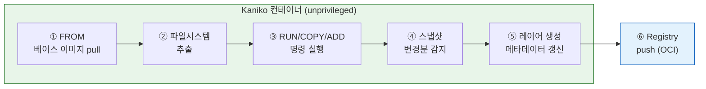

# 컨테이너 이미지 빌드
---
> Jenkins Pipeline에서 Docker 이미지를 빌드하려면 Docker daemon 접근 방식을 선택해야 한다.

## 1. DinD vs DooD vs Daemonless 비교

> 세 방식의 차이는 "누가 Docker daemon 역할을 하는가"에서 비롯된다. 어떤 방식을 선택하느냐에 따라 보안 모델과 Kubernetes 호환성이 달라진다.
>
> - **DinD**: Jenkins 컨테이너 안에 별도 Docker daemon을 실행 — 완전 격리지만 `--privileged` 필요
> - **DooD**: 호스트 Docker socket을 마운트해 호스트 daemon을 공유 — 성능은 좋지만 socket = root 수준 접근
> - **Daemonless**: Docker daemon 자체를 사용하지 않고 userspace에서 이미지를 조립 — Kubernetes PSS 준수 가능

| 방식 | 격리 | 보안 | 캐시 | 성능 | 적합한 환경 |
|------|------|------|------|------|------------|
| DinD | 완전 격리 | `--privileged` 필요 | 호스트와 분리 | 오버헤드 있음 | 격리가 최우선인 환경 |
| DooD | 호스트 공유 | socket = root 수준 | 호스트와 공유 | 거의 없음 | 성능 중심 개발/스테이징 |
| Daemonless (Kaniko 등) | 컨테이너 격리 | 비privileged 가능 | 원격 캐시 필요 | 설정에 따라 다름 | Kubernetes, 보안 요구사항이 높은 환경 |

```mermaid
flowchart TB
    subgraph DinD["DinD (Docker in Docker)"]
        H1["Host"] --> D1["Jenkins Container"]
        D1 --> D1a["내부 Docker Daemon"]
        D1a --> I1["이미지 빌드"]
    end
    subgraph DooD["DooD (Docker outside of Docker)"]
        H2["Host Docker Daemon"]
        D2["Jenkins Container"] -->|"/var/run/docker.sock<br/>마운트"| H2
        H2 --> I2["이미지 빌드"]
    end
    subgraph Daemonless["Daemonless (Kaniko)"]
        D3["Jenkins Container"]
        D3 --> K["Kaniko Executor"]
        K -->|"Docker Daemon 없이"| I3["이미지 빌드"]
    end
    style DinD fill:#e3f2fd,stroke:#1565c0,color:#333
    style DooD fill:#fff3e0,stroke:#ef6c00,color:#333
    style Daemonless fill:#e8f5e9,stroke:#2e7d32,color:#333
```



DinD와 DooD는 모두 보안 관점에서 완전하지 않다.

- DinD의 `--privileged`는 컨테이너에 호스트 커널 기능 대부분을 부여해 컨테이너 탈출 공격에 취약하다.
- DooD의 socket 마운트는 사실상 호스트 root 접근과 동등하다.
- Kubernetes 환경에서는 Pod Security Standards가 두 방식 모두 제한하므로, 신규 구성이라면 Daemonless 방식을 우선 검토하는 것이 맞다.


## 2. Kaniko 동작 원리

> Kaniko는 Google이 개발한 Daemonless 빌드 도구로, Docker daemon 없이 Dockerfile에서 컨테이너 이미지를 빌드한다. 핵심 아이디어는 Kaniko 컨테이너 내부에서 직접 Dockerfile을 해석하고 레이어를 조립하는 것이다.
>
> - Docker daemon 소켓(`/var/run/docker.sock`)을 사용하지 않는다.
> - `--privileged` 권한도 필요 없다.
> - Kubernetes의 Pod Security Standards를 준수하면서 이미지를 빌드할 수 있다는 것이 핵심 가치다.

동작 흐름은 다음과 같다:



1. `FROM`에 지정된 베이스 이미지를 레지스트리에서 pull한다.
2. 베이스 이미지의 파일시스템을 Kaniko 컨테이너 내부에 추출한다.
3. Dockerfile의 `RUN`, `COPY`, `ADD` 명령을 순서대로 실행한다.
4. 각 명령 실행 후 변경된 파일을 userspace에서 스냅샷한다.
5. 변경분으로 새 레이어를 만들고 이미지 메타데이터를 갱신한다.
6. 최종 이미지를 OCI 표준 형식으로 레지스트리에 push한다.

핵심은 이 모든 과정이 **Docker daemon 없이, unprivileged 컨테이너 안에서** 완료된다는 점이다.

Kaniko의 스냅샷 모드는 성능과 정확도의 trade-off가 있다.

- `full`: 가장 안전하지만 느리다 — 기본값
- `redo`: `full`보다 빠르며 대부분의 경우 안전하다
- `time`: 가장 공격적이지만 변경 감지에 한계가 있다

기본값인 `full`로 시작해서 빌드 시간이 문제가 될 때 조정하는 것을 권장한다.

### Kaniko의 레지스트리 인증

Kaniko는 `docker login` 세션을 사용하지 않으므로 레지스트리 인증을 별도로 구성해야 한다. 방법은 세 가지다.

**방법 1: Docker config Secret 마운트 (가장 일반적)**

Kubernetes Secret으로 Docker 인증 정보를 만들고, Kaniko 컨테이너의 `/kaniko/.docker/config.json`에 마운트한다.

```bash
# 1단계: Docker config Secret 생성
kubectl create secret docker-registry registry-cred \
  --docker-server=registry.example.com \
  --docker-username=deploy-user \
  --docker-password=my-password \
  -n jenkins
```

```yaml
# 2단계: Pod YAML에서 Secret을 Kaniko 컨테이너에 마운트
spec:
  containers:
  - name: kaniko
    image: gcr.io/kaniko-project/executor:latest
    volumeMounts:
    - name: docker-config
      mountPath: /kaniko/.docker/          # Kaniko가 이 경로에서 인증 정보를 읽는다
  volumes:
  - name: docker-config
    secret:
      secretName: registry-cred
      items:
      - key: .dockerconfigjson
        path: config.json                  # Secret의 키를 config.json으로 매핑
```

```groovy
// Jenkinsfile에서 Kaniko + Secret 마운트 사용
pipeline {
    agent {
        kubernetes {
            yaml '''
            apiVersion: v1
            kind: Pod
            spec:
              containers:
              - name: kaniko
                image: gcr.io/kaniko-project/executor:debug
                command: ['sleep', 'infinity']
                volumeMounts:
                - name: docker-config
                  mountPath: /kaniko/.docker/
              volumes:
              - name: docker-config
                secret:
                  secretName: registry-cred
                  items:
                  - key: .dockerconfigjson
                    path: config.json
            '''
        }
    }
    stages {
        stage('Build & Push') {
            steps {
                container('kaniko') {
                    sh '''
                    /kaniko/executor \
                      --dockerfile=Dockerfile \
                      --context=dir:///workspace \
                      --destination=registry.example.com/myapp:${BUILD_NUMBER}
                    '''
                }
            }
        }
    }
}
```

**방법 2: Jenkins Credentials + 환경변수**

Jenkins Credentials에 레지스트리 인증 정보를 저장하고, 빌드 시 `config.json`을 동적으로 생성하는 방식이다.

```groovy
pipeline {
    agent { kubernetes { /* ... */ } }
    environment {
        REGISTRY_CRED = credentials('docker-registry')
    }
    stages {
        stage('Build & Push') {
            steps {
                container('kaniko') {
                    sh '''
                    # config.json을 동적 생성
                    mkdir -p /kaniko/.docker
                    echo '{"auths":{"registry.example.com":{"username":"'$REGISTRY_CRED_USR'","password":"'$REGISTRY_CRED_PSW'"}}}' \
                      > /kaniko/.docker/config.json

                    /kaniko/executor \
                      --dockerfile=Dockerfile \
                      --context=dir:///workspace \
                      --destination=registry.example.com/myapp:${BUILD_NUMBER}
                    '''
                }
            }
        }
    }
}
```

- 이 방식은 Secret을 미리 만들 필요 없이 Jenkins Credentials만으로 동작한다.
- 다만 `config.json`에 평문 비밀번호가 일시적으로 파일로 기록되므로, Pod 삭제 후 자동 정리되는 임시 에이전트에서 사용하는 것이 안전하다.

**방법 3: 클라우드 네이티브 인증 (비밀번호 없는 방식)**

| 클라우드 | 방식 | 특징 |
|---------|------|------|
| GKE | Workload Identity | GCP IAM 역할을 K8s ServiceAccount에 바인딩 |
| EKS | IRSA (IAM Roles for Service Accounts) | AWS IAM 역할을 K8s ServiceAccount에 바인딩 |
| 범용 | imagePullSecrets | K8s ServiceAccount에 Secret 연결 |

- 정적 비밀번호 없이 인증하므로 가장 안전하다.
- Kaniko가 실행되는 ServiceAccount에 레지스트리 접근 권한을 부여하면, `config.json` 마운트 없이도 push가 가능하다.

세 방식의 선택 기준은 다음과 같다:

- **팀 내 K8s 관리 가능** → 방법 1 (Secret 마운트)이 가장 깔끔하다.
- **K8s Secret 관리 없이 Jenkins만으로** → 방법 2 (Jenkins Credentials)가 편리하다.
- **클라우드 환경 + 보안 중시** → 방법 3 (Workload Identity / IRSA)이 가장 안전하다.


## 3. 멀티스테이지 빌드와 캐시

> 멀티스테이지 빌드는 빌드에 필요한 도구와 런타임에 필요한 것을 분리해 최종 이미지 크기를 줄이는 기법이다. Node.js 빌드 이미지는 1GB 이상이지만, 멀티스테이지 빌드로 정적 파일만 nginx에 복사하면 최종 이미지가 30~50MB 수준으로 줄어든다.
>
> - 이미지가 작을수록 레지스트리 전송 시간이 줄어든다.
> - 컨테이너 시작 시간과 공격 표면도 함께 줄어든다.

```dockerfile
# Stage 1: 빌드 환경 (최종 이미지에 포함되지 않음)
FROM node:18-alpine AS builder
WORKDIR /app
COPY package*.json ./
RUN npm ci
COPY . .
RUN npm run build

# Stage 2: 런타임 환경 (최종 이미지)
FROM nginx:alpine
COPY --from=builder /app/dist /usr/share/nginx/html
EXPOSE 80
CMD ["nginx", "-g", "daemon off;"]
```

레이어 캐시를 효과적으로 활용하려면 변경 빈도가 낮은 명령을 앞에 배치해야 한다.

- `COPY package*.json ./` 후 `RUN npm ci`를 실행하면, `package.json`이 변경되지 않는 한 `npm ci` 결과가 캐시된다.
- 소스 코드를 복사하는 `COPY . .`는 가장 마지막에 배치하는 것이 원칙이다.


## 4. Kubernetes 환경 빌드 파이프라인

> Kubernetes 환경에서 Jenkins를 운영한다면 동적 Agent Pod 안에서 Kaniko로 이미지를 빌드하는 패턴이 가장 일반적이다. 하나의 Agent Pod에 빌드 컨테이너와 kaniko 컨테이너를 함께 구성하고 공유 볼륨으로 산출물을 전달한다.
>
> - `jnlp`, 빌드 컨테이너(`maven` 또는 `node`), `kaniko` 컨테이너를 함께 선언한다.
> - 각 컨테이너는 같은 Pod 내 공유 볼륨을 통해 빌드 산출물을 주고받는다.

```groovy
pipeline {
    agent {
        kubernetes {
            yaml '''
                apiVersion: v1
                kind: Pod
                spec:
                  containers:
                  - name: maven
                    image: maven:3.9-eclipse-temurin-17
                    command: ['sleep']
                    args: ['infinity']
                  - name: kaniko
                    image: gcr.io/kaniko-project/executor:debug
                    command: ['sleep']
                    args: ['infinity']
                    volumeMounts:
                    - name: docker-config
                      mountPath: /kaniko/.docker
                  volumes:
                  - name: docker-config
                    secret:
                      secretName: registry-credentials
            '''
        }
    }
    stages {
        stage('Build App') {
            steps {
                container('maven') {
                    sh 'mvn -B -ntp clean package -DskipTests'
                }
            }
        }
        stage('Build Image') {
            steps {
                container('kaniko') {
                    sh '''
                        /kaniko/executor \
                          --context=dir:///home/jenkins/agent \
                          --dockerfile=Dockerfile \
                          --destination=registry.example.com/myapp:${BUILD_NUMBER} \
                          --cache=true \
                          --cache-repo=registry.example.com/myapp/cache
                    '''
                }
            }
        }
    }
}
```

`container('maven')`과 `container('kaniko')`는 같은 Pod 안에 선언된 컨테이너를 선택하는 지시어다. Jenkins Controller에 도구를 설치하는 것이 아니라, Pod 스펙에 컨테이너 이미지를 선언하고 Kubernetes가 해당 이미지를 pull해 실행한다.

`--cache=true`와 `--cache-repo`를 지정하면 Kaniko가 중간 레이어를 지정한 레지스트리에 저장한다.

- 다음 빌드에서 동일한 레이어는 레지스트리에서 pull해 재사용하므로 빌드 시간이 크게 줄어든다.
- 캐시 전략 없이 Kaniko를 도입하면 매 빌드마다 베이스 이미지와 의존성을 새로 내려받아 오히려 Docker daemon 방식보다 느려질 수 있다.

레지스트리 인증 설계 시 주의할 점은 Jenkins Credentials만으로 충분하지 않다는 것이다.

- 실제로 이미지를 push하는 주체는 Jenkins Controller가 아니라 Kubernetes 위의 Kaniko 컨테이너다.
- "Jenkins UI에 Credential이 있다"와 "빌드 Pod가 레지스트리 push 권한을 가진다"는 별개의 문제다.
- Pod 권한 기준으로 인증 구조를 따로 설계해야 한다.
