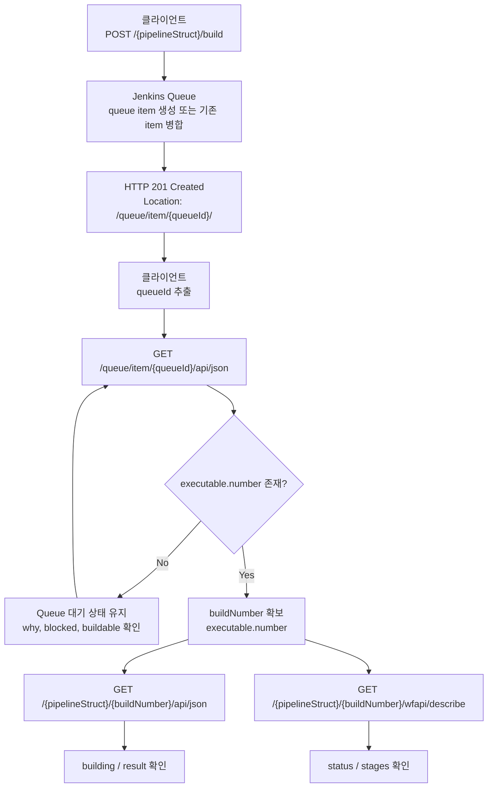

# 젠킨스 큐-빌드 전환 흐름과 실행기 환경
---
> 이 문서는 Jenkins `build` 요청이 queue에 적재된 뒤 실제 Job 실행으로 이어지는 흐름과, 그 과정에서 실행기 환경이 어떻게 영향을 미치는지 설명한다.
>
> - `queueId`와 `buildNumber`의 차이, queue 적재 이후 상태 변화, 데이터 추적 흐름을 다룬다.
> - VM 정적 에이전트와 K8s 동적 에이전트의 executor 해석 차이를 다룬다.
> - 빌드 실행 API 자체는 `05-04`, TPS 운영 패턴 전반은 `05-04a`에서 별도로 다룬다.
> - 큐 내부 메커니즘(상태 전이, maintain 루프, 실행 순서)은 `05-04c`에서 별도로 다룬다.


## 1. 실행은 개념적으로는 두 단계다

> `build` 호출이 `201`을 반환했다고 해서 곧바로 Jenkins build 번호가 생기는 것은 아니다. 
>
> - 실제로는 `queueId`가 먼저 생기고, 이후 executor가 잡히는 시점에 `buildNumber`가 연결된다.

빌드 실행 요청 이후 Jenkins 내부 흐름은 크게 두 단계로 나뉩니다.

1. Queue 단계

   - `POST /build` 또는 `POST /buildWithParameters`

   - 응답 `Location`에서 `queueId` 확보

   - `/queue/item/{queueId}/api/json`에서 대기 이유와 실행기 배정 여부 확인

2. Build 단계

   - queue item에 `executable.number`가 채워짐

   - 이 값이 실제 Jenkins `buildNumber`

   - 이후 `/{pipelineStruct}/{buildNumber}/api/json`, `wfapi/describe`로 넘어감

즉 `queueId`와 `buildNumber`는 서로 다른 식별자다.

- `queueId`
  - Jenkins controller 전체 Queue에서 쓰는 전역 식별자다.
  - `Location: .../queue/item/{id}/`에서 얻는다.
- `buildNumber`
  - 특정 Job 안에서만 증가하는 실행 번호다.
  - `/queue/item/{queueId}/api/json`의 `executable.number`에서 얻는다.
  
  


## 2. 실제 데이터가 어떻게 이어지는가

가장 자주 보는 필드 연결은 다음과 같다:

| 단계 | API | 핵심 필드 | 다음 단계에서 쓰는 값 |
|------|------|------|------|
| 1 | `POST /{pipelineStruct}/build` | `Location: /queue/item/{queueId}/` | `queueId` |
| 2 | `GET /queue/item/{queueId}/api/json` | `why`, `blocked`, `buildable`, `stuck` | 대기 상태 해석 |
| 3 | `GET /queue/item/{queueId}/api/json` | `executable.number`, `executable.url` | `buildNumber` |
| 4 | `GET /{pipelineStruct}/{buildNumber}/api/json` | `building`, `result` | 빌드 전체 상태 |
| 5 | `GET /{pipelineStruct}/{buildNumber}/wfapi/describe` | `status`, `stages[]` | 파이프라인/스테이지 상태 |

즉 API 소비 관점의 최소 흐름은 다음 한 줄로 요약할 수 있다:

```text
Location -> queueId -> executable.number -> buildNumber -> build api / wfapi
```


## 3. 상태 변화 순서는 이렇게 읽는 편이 맞다

queue item이 실제 build로 전환되기 전에는 보통 이런 상태 변화를 거친다:

1. `POST /build` 호출
2. Jenkins가 queue item 생성 또는 기존 item 병합
3. `Location`으로 `queueId` 반환
4. `/queue/item/{queueId}/api/json` 조회
5. `why=Waiting for next available executor` 같은 대기 사유 확인
6. executor가 잡히면 `executable.number`가 생김
7. 그 시점부터 `/{pipelineStruct}/{buildNumber}/api/json` 조회 가능
8. 이후 `building=true -> building=false, result=...`로 종료 상태 확인

중요한 점은 `buildNumber`가 트리거 직후 즉시 보장되지 않을 수 있다는 것이다.

- executor가 아직 배정되지 않았으면 `executable`이 비어 있을 수 있다.
- 이 구간에서는 build API보다 queue item API가 더 정확하다.
- 그래서 TPS나 외부 오케스트레이터는 보통 `queueId -> executable.number` 해석 단계를 한 번 둔다.


## 4. Mermaid로 보면 이런 흐름이다



이 다이어그램의 핵심은 다음 두 줄이다:

- Queue 단계에서는 `queueId`가 중심이다.
- 실행 단계로 넘어간 뒤에는 `buildNumber`가 중심이다.


## 5. 실무에서 왜 이 흐름이 필요한가

실무에서는 "빌드를 눌렀다"와 "실제 Job이 실행 중이다"를 같은 사건으로 보면 오해가 생긴다.

대표적인 오해는 다음과 같다:

- `201`이 왔으니 이미 실행 중일 것이라고 생각한다.
- `Location`의 숫자를 build 번호로 착각한다.
- `queueId`가 2씩 증가하는 것처럼 보이면 build 번호도 그렇게 증가한다고 생각한다.

하지만 실제 해석은 다음이 맞다:

- `201`은 queue 적재 성공이다.
- `Location`의 숫자는 `queueId`다.
- 실제 build 번호는 나중에 `executable.number`로 생긴다.
- 같은 Job을 짧은 간격으로 여러 번 호출하면 queue item 병합 때문에 같은 `queueId`가 반복될 수도 있다.


## 6. TPS 기준으로 저장해야 하는 최소 데이터

TPS나 외부 실행 관리 서비스가 최소한으로 저장해야 하는 값은 다음과 같다:

| 저장 값 | 확보 시점 | 이유 |
|------|------|------|
| `pipelineStruct` | 트리거 전 | 어떤 Job인지 식별 |
| `queueId` | `POST /build` 직후 | queue 추적 시작점 |
| `buildNumber` | `/queue/item/{queueId}` 조회 후 | 실제 실행 추적 시작점 |
| `result` 또는 `status` | build API / wfapi 조회 후 | 완료 여부와 후속 처리 판단 |

즉 queue 적재 이후 데이터 흐름의 핵심은 "queueId로 시작해서 buildNumber로 넘어간다"는 한 줄이다.


## 7. VM / K8s 실행기 환경과 큐-빌드 전환 차이

> 에이전트 유형에 따라 executor 해석 방식이 달라진다. VM 정적 에이전트는 숫자가 비교적 고정이지만, K8s 동적 에이전트는 Pod 생명주기 때문에 응답이 시점마다 달라진다.

먼저 큰 그림은 다음처럼 잡으면 된다:

- VM 정적 에이전트: `/computer/api/json`의 노드와 executor 수가 평소에도 계속 보인다.
- K8s 동적 에이전트: 평소에는 안 보이다가, 빌드 요청 시 Pod가 뜨면서 노드와 executor가 잠시 나타난다.
- 따라서 K8s에서는 `totalExecutors` 하나만 보면 오판하기 쉽다.

### 7-1. 왜 `totalExecutors`만으로 부족한가

K8s 동적 Pod는 빌드가 시작되기 전에는 `/computer/api/json`에 executor가 거의 보이지 않을 수 있다. 그래서 `busyExecutors < totalExecutors`만으로는 "지금 빌드를 더 받을 수 있는가"를 정확히 설명하지 못한다.

| 환경 | `totalExecutors` | `busyExecutors` | 실제 의미 |
|------|-----------------|-----------------|-----------|
| VM 정적 | 2 | 0 | 이미 떠 있는 노드가 바로 실행 준비 완료 |
| K8s 동적 (유휴) | 0 | 0 | Pod가 없고, 큐 등록 후 프로비저닝이 시작됨 |

### 7-2. VM과 K8s: 같은 API, 다른 해석

| 관점 | VM 정적 | K8s 동적 |
|------|---------|----------|
| `computer[]` | VM 노드가 평소에도 계속 보임 | 유휴 시 built-in node만 보일 수 있음 |
| `totalExecutors` | 빌드 없어도 1 이상 | 유휴 시 `0`이어도 "실행 불가"가 아님 |
| `offline` | `false`인 노드가 고정적으로 존재 | Pod가 뜨기 전에는 노드 자체가 없음 |
| 큐 비었을 때 | 바로 실행 가능한 정적 슬롯 있음 | 큐 등록 후 Pod 프로비저닝부터 시작 |

어떤 API와 어떤 필드로 판단하는지는 다음과 같다:

| API | 핵심 필드 | K8s에서의 해석 주의점 |
|-----|----------|----------------------|
| `/computer/api/json` | `busyExecutors`, `totalExecutors`, `computer[]._class`, `offline` | 유휴 시 `totalExecutors=0`이어도 실행 불가가 아님. `KubernetesComputer` 클래스로 식별 |
| `/queue/api/json` | `items[].why`, `items[].stuck` | "Waiting for next available executor"는 K8s에서 프로비저닝 진행 중일 수 있음 |
| `/label/{label}/api/json` | `clouds` | `KubernetesCloud`가 보이면 동적 프로비저닝 가능 |

### 7-3. K8s Pod 생명주기가 큐-빌드 전환에 주는 영향

K8s 동적 환경에서는 Pod 생명주기(큐 등록 → Pod 생성 → agent 연결 → 실행 → Pod 삭제) 때문에 조회 시점마다 해석이 달라진다:

| 단계 | `/computer` 상태 | `/queue` 상태 | 해석 |
|------|-----------------|---------------|------|
| 큐 등록 직후 | K8s 노드 안 보일 수 있음. `totalExecutors=0` 가능 | item 보임 | "실행기 없음"이 아니라 "프로비저닝 전" |
| Pod 기동, agent 연결 전 | `KubernetesComputer` 보이기 시작. `offline=true` 가능 | item 대기 중 | "노드가 보인다" ≠ "executor 즉시 사용 가능" |
| 실행 중 | `offline=false`, `busyExecutors≥1` | `executable.number` 채워짐 | executor가 잡혔다고 확실히 말할 수 있음 |
| 빌드 종료 후 | `KubernetesComputer` 사라짐. `totalExecutors` 다시 `0` | item 없음 | 실행 실패가 아니라 동적 에이전트 회수 |

`executable.number`가 보인다고 해서 pipeline stage가 실행 중이라고 단정할 수 없다. 실제 실행 여부는 `building=true`나 `wfapi` 상태로 확인해야 한다.

### 7-4. 실무 판단 규칙

- `totalExecutors=0`만으로 "실행 불가"라고 단정하지 않는다.
- `KubernetesComputer`가 잠깐 보였다가 사라지는 것은 정상 생명주기일 수 있다.
- K8s에서는 `/queue/api/json`의 `why`와 `/computer/api/json`의 `offline` 변화를 같이 본다.
- "현재 VM인가 K8s인가"는 controller 배포 위치가 아니라 `computer[]._class`, `label.clouds`, 동적 생성 여부로 판단한다.


### 7-5. K8s 동적 Pod인지 VM인지 판단하는 경우의 수

> Jenkins가 Kubernetes 위에 배포돼 있다는 사실만으로 빌드가 K8s 동적 Pod에서 돈다고 결론 내리면 안 된다. 실제 판단은 controller 위치가 아니라 Jenkins가 노출하는 노드 상태와 queue 상태를 함께 읽어야 한다.

판단은 보통 다음 필드 조합으로 한다:

- `/computer/api/json`
  - `computer[]._class`
  - `displayName`
  - `numExecutors`
  - `offline`
- `/queue/api/json`
  - `items[].why`
  - `items[].stuck`

핵심 분류 기준은 다음과 같다:

| 신호 | K8s 동적 Pod 가능성 | 정적 VM 가능성 |
|------|---------------------|----------------|
| `computer[]._class` | `KubernetesComputer` 계열이 보임 | `hudson.slaves.SlaveComputer` 계열이 계속 보임 |
| 노드 존재 시점 | 빌드 시점에만 잠깐 나타났다 사라짐 | 평상시에도 계속 보임 |
| `totalExecutors` | 유휴 시 `0`일 수 있음 | 유휴 시에도 1 이상인 경우가 많음 |
| `offline` | Pod 연결 전 `true`로 흔들릴 수 있음 | 고정 노드라면 상태 변화가 상대적으로 적음 |
| queue `why` | `Waiting for next available executor`가 프로비저닝 대기일 수 있음 | 실제로 고정 executor 부족일 가능성이 큼 |

### 7-6. 경우의 수별 해석

실무에서는 다음 경우의 수로 나누어 읽는 편이 안전하다:

| 경우 | 관측 신호 | 해석 |
|------|-----------|------|
| 1 | `KubernetesComputer`가 보이고, 빌드 종료 후 사라짐 | K8s 동적 Pod로 보는 편이 맞다 |
| 2 | `SlaveComputer` 또는 고정 노드가 평소에도 계속 보임 | 정적 VM 또는 고정 agent로 보는 편이 맞다 |
| 3 | `totalExecutors=0`, queue item 존재, 곧 `KubernetesComputer`가 나타남 | K8s 동적 프로비저닝 대기 상태일 가능성이 높다 |
| 4 | `totalExecutors>0`, 고정 노드가 항상 보이고 queue 대기가 줄어듦 | 정적 VM 슬롯으로 처리 중일 가능성이 높다 |
| 5 | Jenkins가 K8s에 배포돼 있지만 `Built-In Node`나 고정 VM만 보임 | Jenkins는 K8s 위에 있지만 빌드는 동적 Pod를 안 쓰는 상태일 수 있다 |
| 6 | `agent any`인데 동적 Pod가 안 보이고 실행은 됨 | K8s 강제가 아니라 built-in node 또는 정적 VM에서 실행됐을 가능성이 높다 |

### 7-7. 빠른 판단 규칙

빠르게 결론 내려야 할 때는 다음처럼 보면 된다:

- `KubernetesComputer`가 실제로 보이고, 생성/소멸이 빌드 생명주기와 함께 움직이면 K8s 동적 Pod로 본다.
- 고정 이름의 노드가 평소에도 계속 보이고 `numExecutors`가 유지되면 VM 또는 정적 agent로 본다.
- Jenkins 자체가 K8s에 떠 있다는 사실은 빌드 실행기가 K8s라는 근거가 아니다.

특히 다음 오해를 피해야 한다:

- "Jenkins가 K8s에 있으니 빌드도 K8s Pod다"는 성립하지 않는다.
- "`agent any`면 자동으로 K8s Pod를 쓴다"도 성립하지 않는다.
- `totalExecutors=0`은 K8s 환경에서 "실행 불가"가 아니라 "아직 Pod가 안 떴다"일 수 있다.

### 7-8. 운영 관점의 최소 판단 조합

실무에서 가장 단순하게는 이 조합이면 충분하다:

1. `/computer/api/json`에서 `computer[]._class`, `displayName`, `offline` 확인
2. `/queue/api/json`에서 `why` 확인
3. 빌드 시작/종료 시점 전후로 노드가 생겼다가 사라지는지 비교

이 조합만으로도 다음 정도는 구분할 수 있다:

- 현재 Jenkins가 정적 VM 슬롯 중심인지
- K8s 동적 Pod 프로비저닝을 실제로 쓰는지
- queue 대기가 단순 슬롯 부족인지, 동적 agent 기동 대기인지

## 8. 관련 문서

- `05-04. 젠킨스 빌드 실행·큐 API 스펙.md`
- `05-04a. 젠킨스 빌드 실행·큐 모델과 TPS 패턴 (2.222+).md`
- `05-04c. 젠킨스 큐 내부 흐름과 실행 순서.md`
- `05-05. 젠킨스 빌드 상태 추적 API 스펙.md`
