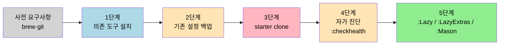

# LazyVim 설치와 디렉토리 구조 — 맥북 기준
---
> 이 절은 "복붙으로 돌아가는 매뉴얼"을 목표로 한다. 6개월 뒤 새 맥북에서 같은 순서로 따라가도 같은 환경이 떠야 한다. 실패하는 단계가 있으면 본인이 다시 와서 갱신한다.



## 왜 LazyVim인가

Neovim은 기본 상태로는 IDE 흉내를 내지 못한다. 파일 트리, fuzzy finder, LSP, 자동완성, git 사인 같은 IntelliJ 사용자에게 당연한 기능이 모두 별도 플러그인이다. 직접 init.lua를 짜면 한 달이 가도 디버깅이 끝나지 않는다.

LazyVim은 이 묶음을 "이미 통합·테스트된 기본값"으로 제공하는 배포판이다. `lazy.nvim`이라는 플러그인 매니저 위에 LSP·Telescope·neo-tree·nvim-cmp·gitsigns·which-key 같은 핵심 스택이 lazy-load 구조로 미리 묶여 있다. 본인은 그 위에 *덮어쓰는* 설정만 작성한다.

다른 선택지(AstroNvim, LunarVim)는 추상화 레이어가 한 겹 더 있어 동작이 막힐 때 디버깅 경로가 길다. kickstart.nvim은 학습용으로는 좋지만 매번 직접 수선해야 한다. 본 가이드는 LazyVim 한 가지로 통일한다.

## 사전 요구사항

먼저 본인 맥북 상태를 확인한다.

```bash
sw_vers           # macOS 버전 확인 (12 이상 권장)
brew --version    # Homebrew 설치 여부
git --version     # git 2.x 이상
```

Homebrew가 없으면 먼저 설치한다(자세한 절차는 Homebrew 공식 사이트). 본 절은 `brew` 명령이 이미 동작한다는 전제로 진행한다.

## 1단계 — 의존 도구 설치

Neovim 본체와 LazyVim이 권장하는 외부 도구를 한 번에 받는다.

```bash
brew install neovim ripgrep fd lazygit fzf
brew install --cask font-jetbrains-mono-nerd-font
```

각 도구가 왜 필요한지 짚는다.

| 패키지 | 역할 | 빠지면 생기는 증상 |
|--------|------|------------------|
| `neovim` | 본체 (nvim 0.9 이상 권장) | LazyVim이 아예 안 뜸 |
| `ripgrep` | Telescope의 `live_grep` 백엔드 | 프로젝트 전체 검색이 작동 안 함 |
| `fd` | Telescope의 `find_files` 백엔드 | 파일 찾기가 느리거나 빈 결과 |
| `lazygit` | TUI git 클라이언트, LazyVim에서 `<leader>gg`로 호출 | git UI 단축키가 죽음 |
| `fzf` | 보조 fuzzy 매처 | 일부 picker가 동작 안 함 |
| Nerd Font | 아이콘 글리프 (devicons 등) | 파일 트리·상태줄에 깨진 사각형이 보임 |

설치 후 iTerm2 또는 macOS Terminal의 폰트를 *JetBrainsMono Nerd Font*로 바꾼다. 이 단계를 건너뛰면 LazyVim이 멀쩡히 떠도 화면이 깨져 보여서 "뭐가 잘못됐나" 한참 헤맨다.

## 2단계 — 기존 설정 백업

이미 nvim을 한 번 깔아본 적이 있다면 충돌을 막기 위해 기존 디렉토리를 다른 이름으로 옮긴다. 처음 설치라면 이 단계는 결과가 비어 있겠지만 *명령은 그대로 실행해도 안전하다*.

```bash
mv ~/.config/nvim       ~/.config/nvim.bak       2>/dev/null
mv ~/.local/share/nvim  ~/.local/share/nvim.bak  2>/dev/null
mv ~/.local/state/nvim  ~/.local/state/nvim.bak  2>/dev/null
mv ~/.cache/nvim        ~/.cache/nvim.bak        2>/dev/null
```

네 디렉토리를 모두 옮기는 이유는 nvim이 설정(`~/.config`), 플러그인 데이터(`~/.local/share`), 런타임 상태(`~/.local/state`), 캐시(`~/.cache`)를 분리해서 쓰기 때문이다. 한 군데만 비우면 옛 lazy.nvim 락 파일이 남아 충돌한다.

## 3단계 — LazyVim starter 클론

LazyVim은 starter 레포를 그대로 받아 그 위에 본인 설정을 얹는 방식이다.

```bash
git clone https://github.com/LazyVim/starter ~/.config/nvim
rm -rf ~/.config/nvim/.git
```

`.git`을 지우는 이유는, 본인 dotfiles 리포로 옮겨 별도 관리할 것이기 때문이다. starter의 히스토리를 그대로 둘 필요는 없다.

이제 한 번 실행한다.

```bash
nvim
```

첫 실행 시 lazy.nvim이 LazyVim core + extras 플러그인을 자동으로 받는다. 화면 하단에 진행 막대가 뜨고 끝나면 Mason이 LSP 서버·formatter·linter를 추가로 받는다. 1~3분 정도 걸린다. 네트워크가 막혀 있으면 여기서 멈추므로 회사 프록시 환경이면 git/HTTPS 프록시를 먼저 통과시킨다.

설치가 끝나면 `:q`로 빠져나간 뒤 다시 `nvim`을 열어 정상 부팅을 확인한다.

## 4단계 — 자가 진단

LazyVim은 두 가지 진단 명령을 제공한다.

```vim
:LazyHealth
:checkhealth
```

`:LazyHealth`는 LazyVim 기준의 빠른 점검이고 `:checkhealth`는 nvim 본체와 모든 플러그인의 헬스 리포트를 한 화면에 모은다. 첫 설치 직후에는 다음 정도의 경고가 *정상 범위*다.

- "Python 3 provider not configured" — Python 플러그인을 안 쓰면 무시
- "Node.js provider not configured" — coc.nvim을 안 쓰면 무시
- "Perl provider not configured" — 거의 항상 무시

빨간색 ERROR가 뜨는 항목은 그 줄에 적힌 명령(주로 `brew install <tool>`)을 그대로 실행하면 대부분 해결된다.

## 디렉토리 구조 이해

설치가 끝나면 `~/.config/nvim` 아래는 다음 구조를 가진다.

```text
~/.config/nvim/
├── init.lua             # 진입점. LazyVim을 로드하고 끝남
├── lua/
│   ├── config/
│   │   ├── autocmds.lua # 자동 명령 (파일 종류별 설정)
│   │   ├── keymaps.lua  # 내가 추가하는 키 매핑
│   │   ├── lazy.lua     # lazy.nvim 부트스트랩
│   │   └── options.lua  # vim 옵션 (set number, tabstop 등)
│   └── plugins/         # 플러그인 추가·덮어쓰기. 파일 하나 = 플러그인 하나
└── lazyvim.json         # LazyExtras 활성 목록 (자동 관리, 수동 편집 금지)
```

본인이 손대는 파일은 `lua/config/keymaps.lua`, `lua/config/options.lua`, 그리고 `lua/plugins/` 아래 새 파일들이다. 나머지는 LazyVim이 관리한다.

플러그인 추가의 기본 패턴은 `lua/plugins/<name>.lua` 파일에 다음을 적는 것이다.

```lua
return {
  "owner/repo",
  opts = {
    -- 옵션 테이블 (플러그인 setup() 함수로 전달됨)
  },
}
```

기존 LazyVim 기본 플러그인의 옵션을 *덮어쓰고* 싶다면 같은 이름으로 새 파일을 두고 `opts`만 정의한다. lazy.nvim이 자동으로 머지한다.

## 5단계 — 자주 쓰는 LazyVim 명령

설치 직후 외워둘 명령 셋만 적는다. 자세한 키 매핑은 다음 절(10-03)에서 IntelliJ 동작과 함께 정리한다.

| 명령 | 기능 |
|------|------|
| `:Lazy` | 플러그인 상태창 — 업데이트·설치·로그 확인 |
| `:LazyExtras` | 언어별 extra 활성/비활성 (Java, Go 등) |
| `:Mason` | LSP/포매터/린터 설치 관리 |
| `:Telescope find_files` 또는 `<leader>ff` | 파일 찾기 |
| `<leader>` | 리더 키 = `Space`. 누르면 which-key가 가능한 후속 키를 안내 |

`<leader>`(공백 키)를 누르고 1초 기다리면 현재 모드에서 가능한 모든 단축키 그룹이 화면 하단에 뜬다. 이 화면이 LazyVim 학습의 가장 강력한 자가 학습 도구다 — 외울 필요 없이 매번 본다.

## 이걸 모르면 막히는 지점

- Nerd Font 미설치 또는 터미널 폰트 미적용 → 화면이 깨진 것을 설정 오류로 오해해 다 지우게 됨. 첫 의심은 항상 폰트다.
- `:checkhealth` 결과를 안 보고 "왜 안 되지"부터 검색하면 시간 낭비. 첫 부팅 후 한 번은 끝까지 스크롤한다.
- `lazyvim.json`을 직접 편집해서 깨뜨리는 사람이 많다 — 이 파일은 `:LazyExtras` 명령으로만 갱신한다.
