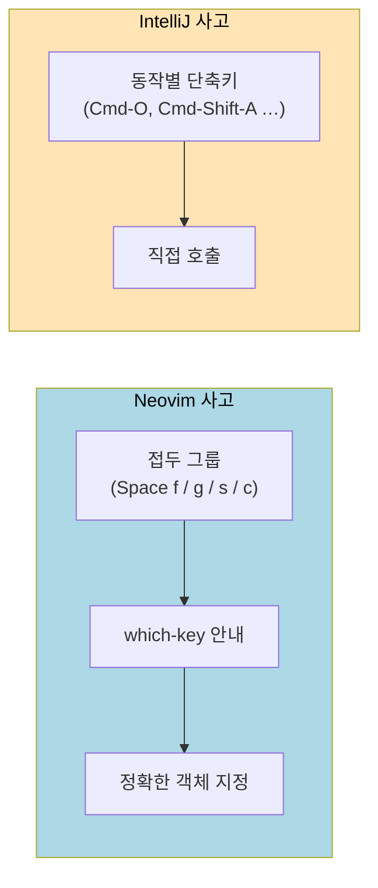

# IntelliJ 사용자를 위한 키맵·기능 매핑표
---
> 이 절의 목표는 "IntelliJ에서 손에 익은 동작을 Neovim에서 어떻게 짜는가"를 한 표로 정리하는 것이다. 매핑이 1:1로 떨어지는 경우도 있고, 아예 사고방식이 달라야 하는 경우도 있다. 둘을 구분해서 적는다.

## 전제 — LazyVim 리더 키와 which-key

LazyVim의 리더 키는 `Space`다. IntelliJ의 *Find Action* (`Cmd-Shift-A`)에 해당하는 자리다. `Space`를 누르고 가만히 있으면 화면 하단에 가능한 후속 키가 그룹별로 표시된다(`f` files, `g` git, `c` code, `s` search …). 매핑을 외우는 시간보다 *which-key를 매번 보는* 습관이 더 빠르다.

본 절의 단축키는 모두 LazyVim 기본값 기준이다. 본인이 `lua/config/keymaps.lua`에서 덮어썼다면 그쪽이 우선이다.



## 1. 파일·심볼 탐색

IntelliJ의 네비게이션 단축키들은 LazyVim에서 Telescope picker로 대체된다.

| IntelliJ | Neovim (LazyVim) | 비고 |
|---------|----------------|------|
| `Cmd-Shift-A` Find Action | `<leader>` 후 which-key 탐색 | 모든 명령이 키 트리에 있다 |
| `Cmd-O` Go to Class | `<leader>ss` (LSP document symbols) | 현재 파일 한정 |
| `Cmd-Shift-O` Go to File | `<leader>ff` | Telescope find_files |
| `Cmd-Alt-O` Go to Symbol | `<leader>sS` (workspace symbols) | LSP가 켜져 있어야 동작 |
| `Cmd-E` Recent Files | `<leader>fr` | |
| `Cmd-Shift-F` Find in Files | `<leader>/` 또는 `<leader>sg` | live_grep, ripgrep 백엔드 |
| `Cmd-F` Find in current file | `/` (forward), `?` (backward) | nvim 내장 검색, `n`/`N`으로 이동 |
| `Cmd-G` Find next | `n` | `N`은 역방향 |
| `Cmd-B` Go to Declaration | `gd` | LSP goto_definition |
| `Cmd-Alt-B` Go to Implementation | `gI` | |
| `Alt-F7` Find Usages | `gr` | LSP references |
| `Cmd-U` Go to Super Method | `gy` | type definition로 대체되는 경우가 잦음 |
| `Ctrl-H` Type Hierarchy | `<leader>ch` (jdtls extra 필요) | Java에서만 |

핵심 변화: IntelliJ는 *동작별 단축키*를 외우게 하지만 LazyVim은 *접두 그룹*(`<leader>f` files, `<leader>s` search, `<leader>g` git)을 외우고 뒤를 which-key가 채워준다. 외워야 할 절대량이 적다.

## 2. 코드 편집

| IntelliJ | Neovim (LazyVim) | 비고 |
|---------|----------------|------|
| `Alt-Enter` Show Context Actions | `<leader>ca` | LSP code action |
| `Shift-F6` Rename | `<leader>cr` | LSP rename |
| `Cmd-Alt-L` Reformat Code | `<leader>cf` | conform.nvim |
| `Cmd-/` Toggle Line Comment | `gcc` (1줄), `gc` + 모션 (여러 줄) | Comment.nvim, `gcip`는 문단 전체 |
| `Cmd-D` Duplicate Line | `yyp` | yank line + paste |
| `Cmd-Y` Delete Line | `dd` | 단순 |
| `Alt-Shift-↑/↓` Move Line | `<Alt-j>` / `<Alt-k>` | LazyVim 기본 매핑 |
| `Ctrl-Shift-J` Join Lines | `J` | 자주 쓴다 |
| `Cmd-Shift-↑/↓` Move Statement | (직접 매핑 없음) | 텍스트 오브젝트로 잘라 붙임 |
| `Tab` / `Shift-Tab` Indent | `>>` / `<<` (Normal), `>` / `<` (Visual) | 모션과 결합도 가능 (`>ip`) |
| `Cmd-W` Extend Selection | `vi(`, `va{`, `vip` 등 | 텍스트 오브젝트로 대체 (10-01 참고) |

`Cmd-W`(Extend Selection)는 IntelliJ 고유 기능이라 1:1 매핑이 없다. 대신 *텍스트 오브젝트*로 의도를 *직접* 표현한다. "이 함수 호출의 인자 안쪽"이 필요하면 `vi(`, "이 메서드 전체"가 필요하면 `vaf`(treesitter 확장). 사고가 "점점 넓혀가는 게 아니라 *정확한 객체를 한 번에 지정*"으로 바뀐다.

## 3. 멀티커서 — 사고방식이 다르다

IntelliJ의 `Cmd-Alt-G` (Select All Occurrences)는 nvim에서 *없다*. 대신 두 갈래 길이 있다.

첫째, `:%s/old/new/g` 같은 정규식 치환. 명확하고 검증 가능하다.

둘째, `*`(현재 단어 검색) + `cgn` + `.` 반복. `*`로 단어를 검색하고 `cgn`(change next match)으로 첫 매치를 바꾼 뒤, `.`로 다음 매치도 같은 변경을 반복한다. 한 매치씩 확인 가능해서 IntelliJ 멀티커서보다 안전한 경우가 많다.

멀티커서가 정말 필요한 작업(예: 여러 줄 끝에 동시에 같은 글자 삽입)은 비주얼 블록(`Ctrl-v`) + `I` 또는 `A`로 처리한다.

```
Ctrl-v        # 비주얼 블록 모드 진입
j j j         # 아래 3줄 선택
$             # 줄 끝까지
A ,           # 각 줄 끝에 ',' 삽입 (Esc 후 반영)
```

## 4. 창·터미널·파일 트리

| IntelliJ | Neovim (LazyVim) | 비고 |
|---------|----------------|------|
| Project Tool Window | `<leader>e` | neo-tree |
| Terminal Tool Window | `<leader>ft` (root) / `<leader>fT` (cwd) | toggleterm |
| Split Editor Right | `<C-w>v` | vertical split |
| Split Editor Down | `<C-w>s` | horizontal split |
| Switch between splits | `<C-h>` / `<C-j>` / `<C-k>` / `<C-l>` | hjkl 방향 |
| Close split | `<C-w>q` | 또는 `:q` |
| 탭 다음/이전 | `]b` / `[b` (buffer) 또는 `<S-h>` / `<S-l>` | nvim의 "탭"은 *버퍼* 개념이 다름 (아래 설명) |

nvim의 *탭*과 *버퍼*는 IntelliJ의 *탭*과 의미가 다르다. nvim에서 열린 파일은 모두 *버퍼*고, *탭*은 "여러 split 묶음"을 통째로 전환하는 더 큰 단위다. IntelliJ식 "여러 파일 열어둠 = 탭 줄"은 nvim에서는 *버퍼 목록*이다. LazyVim의 상단 bufferline이 IntelliJ 탭 줄에 해당한다.

## 5. Git

| IntelliJ | Neovim (LazyVim) | 비고 |
|---------|----------------|------|
| Git Tool Window | `<leader>gg` | lazygit 호출, 풀 TUI |
| Commit | `<leader>gg` 후 lazygit 안에서 | nvim에 머무르며 처리 |
| Annotate / Blame | `<leader>gB` | LazyVim 기본 |
| Show Diff | `<leader>gd` (현재 파일) | diffview.nvim 추천 추가 |
| Stage Hunk | `<leader>ghs` | gitsigns |
| Reset Hunk | `<leader>ghr` | gitsigns |

lazygit 한 번 띄우는 게 IntelliJ의 git 패널 대부분을 대체한다. commit/push/rebase/cherry-pick까지 모두 한 화면에서 끝난다.

## 6. 디버깅 — 대체는 되지만 등가는 아니다

LazyVim의 디버깅 스택은 `nvim-dap` + `nvim-dap-ui`다. 자세한 Java 디버깅 설정은 다음 절(10-04)에서 다룬다. 여기서는 키 매핑만 정리한다.

| IntelliJ | Neovim (LazyVim) | 비고 |
|---------|----------------|------|
| `Cmd-F8` Toggle Breakpoint | `<leader>db` | |
| `Shift-F9` Debug | `<leader>dc` 또는 `<F5>` | 시작/계속 |
| `F8` Step Over | `<F10>` | |
| `F7` Step Into | `<F11>` | |
| `Shift-F8` Step Out | `<S-F11>` | |
| Variables/Watches panel | `<leader>du` | dap-ui 토글 |

UI 자체의 *시각적 풍부함*은 IntelliJ가 압도적이다. 변수 호버, 인라인 표시, 표현식 평가 창의 자동완성 같은 디테일은 nvim-dap-ui가 따라가지 못한다. 본 가이드의 입장: *간단한 디버깅*은 nvim에서, *복잡한 상태 추적*은 IntelliJ를 켠다.

## 7. 끝까지 1:1 대체가 안 되는 것

다음 기능은 nvim 측 대안이 *현저히* 약하다. 솔직하게 인정하고 IntelliJ를 같이 쓰는 게 시간을 아낀다.

| 영역 | nvim 한계 | 대체 |
|------|-----------|------|
| Spring 빈 의존성 그래프 / 빈 네비게이션 | `@Autowired` 클릭으로 구현체로 점프하는 동작이 jdtls 에서는 정확도가 낮음. 인터페이스 - 구현체가 여러 개일 때 특히. | IntelliJ 병용 |
| HTTP Client (`.http` 파일) | IntelliJ 의 환경 변수·인증 처리·응답 히스토리를 따라갈 플러그인이 없음. `rest.nvim` 은 기본형만 가능 | IntelliJ 병용 |
| JPA Console / Database Tool Window | 쿼리 실행과 결과 표 보기, ER 다이어그램은 nvim 측에 거의 없음 | DBeaver 또는 IntelliJ |
| 시각적 리팩토링 미리보기 | Extract Method 같은 큰 리팩토링의 *변경 미리보기* 가 jdtls 에서는 빈약. 작은 리팩토링(rename, inline)은 LSP 로 충분 | 큰 리팩토링은 IntelliJ |
| 빌드 도구의 그래픽 의존성 그래프 | Gradle/Maven 의존성 트리 시각화는 IDE 고유 | `./gradlew dependencies` CLI |

## 이걸 모르면 막히는 지점

- 모든 동작에 키를 외우려 들면 며칠 안에 포기한다. *접두 키 + which-key*로 탐색하는 흐름이 학습 곡선의 핵심이다.
- "멀티커서가 없어서 못 하겠다" 단계에서 멈추는 사람이 많다. 대안은 `*` + `cgn` + `.` 또는 비주얼 블록 — 사고방식 자체를 바꾸기 전엔 답답함이 풀리지 않는다.
- 디버깅과 Spring 특화 기능은 *대체하려 들지 말고* 도구를 갈라 쓴다. 억지 대체 시도는 nvim에 대한 인상만 나빠진다.
