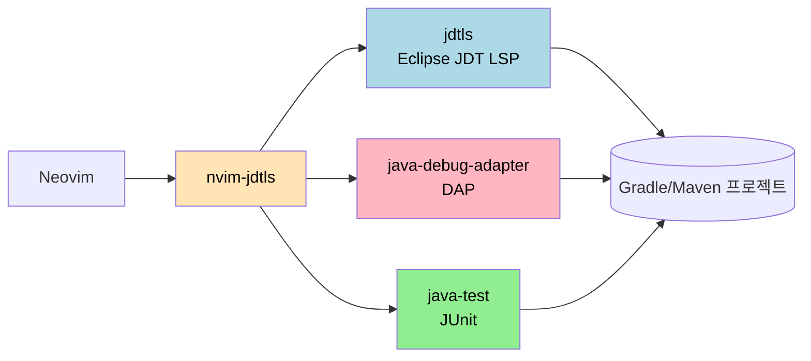

# Java·Spring 개발 환경 — jdtls·nvim-dap·gradle 연동
---
> 이 절의 결론을 미리 적는다. Neovim은 *읽기·소규모 수정*에서 IntelliJ를 대체할 수 있지만, *Spring 특화 기능과 큰 리팩토링*은 따라가지 못한다. 본 가이드는 두 도구를 갈라 쓰는 *하이브리드 전략*을 권한다.

## 무엇을 깔고 무엇을 포기하는가

LazyVim에서 Java를 다루려면 `lang.java` extra를 켠다. 이 한 줄이 jdtls(Eclipse Java LSP), java-debug-adapter, java-test, nvim-jdtls 플러그인을 한 번에 묶어준다.

```vim
:LazyExtras
```

화면이 뜨면 `/java`로 검색해 `lang.java`에 커서를 두고 `x`로 활성화한다. 저장(`:w`)하면 LazyVim이 `lazyvim.json`을 자동 갱신하고 재시작 후 Mason이 필요한 바이너리를 받는다. 첫 받기는 3~5분 걸린다.

활성화 결과로 들어오는 것은 다음이다.

| 컴포넌트 | 역할 |
|----------|------|
| jdtls | Eclipse JDT 기반 Java LSP. 정의 이동, 참조 찾기, rename, 코드 액션, 오류 마커 |
| java-debug-adapter | DAP 프로토콜 어댑터. main/test 디버깅 |
| java-test | JUnit 테스트 실행 어댑터 |
| nvim-jdtls | 위 셋을 nvim 에서 묶어주는 글루 플러그인 |



이 묶음으로 *되는 일*은 IntelliJ Community Edition의 90% 정도다. *안 되는 일*은 본 절 마지막에 정리한다.

## JDK 확인

jdtls는 Java 17 이상이 필요하다. 시스템 PATH에 Java가 여러 개 깔려 있으면 어떤 JDK로 jdtls가 뜨는지 헷갈린다.

```bash
/usr/libexec/java_home -V          # 설치된 JDK 전체 목록
echo $JAVA_HOME                    # 현재 JAVA_HOME
java -version                      # PATH에서 잡히는 java
```

본인 프로젝트가 Java 21이면 `JAVA_HOME`을 21로 맞춘다. `~/.zshrc`에 다음을 둔다.

```bash
export JAVA_HOME="$(/usr/libexec/java_home -v 21)"
export PATH="$JAVA_HOME/bin:$PATH"
```

jdtls는 *자신을 실행할 JDK*와 *프로젝트를 컴파일할 JDK*를 따로 받을 수 있다. 단순 케이스에서는 둘을 같은 값으로 두면 충분하다. 여러 프로젝트가 서로 다른 JDK를 요구하면 `nvim/lua/plugins/jdtls.lua`에서 `runtimes` 옵션으로 매핑한다 — 이 깊은 설정은 본 가이드 범위 밖이라 `:help nvim-jdtls`로 본다.

## 프로젝트 첫 진입 — 인덱싱 시간

Spring Boot 프로젝트를 처음 nvim으로 열면 jdtls가 *전체 클래스패스를 인덱싱*한다. IntelliJ의 "Indexing…" 막대와 같은 작업이다.

```bash
cd ~/path/to/spring-project
nvim build.gradle.kts          # 또는 pom.xml, 아무 Java 파일
```

상태줄 우측에 `Indexing` 표시가 뜬다. 중간 규모(클래스 1000개) 프로젝트 기준 1~3분. 인덱싱이 *끝나기 전*에 `gd`(go to definition)를 누르면 "no result"가 뜨거나 빈 응답이 온다. 인내심을 갖고 기다린다. 이 단계가 끝나야 LSP 기능이 정상 동작한다.

인덱싱 데이터는 `~/.cache/jdtls/<project-hash>` 아래 캐시된다. 두 번째부터는 훨씬 빠르다.

## 자주 쓰는 Java 전용 키 매핑

`nvim-jdtls`가 추가하는 명령 중 IntelliJ 동등물을 정리한다.

| IntelliJ | Neovim (jdtls) | 비고 |
|---------|----------------|------|
| Optimize Imports | `<leader>co` (organize imports) | |
| Extract Variable | `<leader>cxv` | 비주얼 선택 후 호출 |
| Extract Method | `<leader>cxm` | 비주얼 선택 후 호출 |
| Extract Constant | `<leader>cxc` | |
| Test class 실행 | `<leader>tc` | java-test |
| Test method 실행 (커서 위치) | `<leader>tr` | 메서드 위에서 호출 |
| Test 디버그 (커서 위치) | `<leader>tT` | DAP 세션 시작 |

`<leader>cx`(eXtract) 그룹이 IntelliJ의 가장 자주 쓰는 리팩토링을 커버한다. Rename(`<leader>cr`)과 Code Action(`<leader>ca`)은 일반 LSP 매핑을 그대로 쓴다.

## 빌드 — gradle/maven 연동

LazyVim은 빌드 도구를 *직접* 통합하지 않는다. nvim 안에서 `:!./gradlew build` 같은 셸 명령을 그대로 친다. 더 나은 워크플로는 다음 두 가지다.

첫째, `<leader>ft`로 터미널을 띄우고 그 안에서 빌드한다. 터미널은 일반 nvim 버퍼라 출력에서 파일:라인을 `gf`로 점프할 수 있다.

둘째, `overseer.nvim` 같은 태스크 러너를 깐다. `lua/plugins/overseer.lua`에 다음을 둔다.

```lua
return {
  "stevearc/overseer.nvim",
  opts = {},
  keys = {
    { "<leader>ob", "<cmd>OverseerRun build<cr>", desc = "Gradle build" },
    { "<leader>ot", "<cmd>OverseerRun test<cr>",  desc = "Gradle test" },
  },
}
```

본인 프로젝트 루트에 `.overseer.json` 같은 태스크 정의 파일을 두면 IntelliJ의 Run Configurations 흉내가 가능하다. 본 가이드는 깊이 들어가지 않는다 — 처음에는 `:!./gradlew test`로 충분하다.

## 디버깅 — nvim-dap로 Spring Boot 시작 클래스 실행

`lang.java` extra가 켜져 있으면 java-debug-adapter가 자동 설치된다. 가장 단순한 시작 방법은 *현재 파일의 main 함수*를 디버그하는 것이다.

1. main 클래스 파일을 연다.
2. 중단점을 두려는 줄에서 `<leader>db`.
3. `<F5>` 또는 `<leader>dc`로 디버그 세션 시작.
4. nvim-dap이 launch 구성을 물으면 "Launch current main"을 선택한다.
5. 중단점에서 멈추면 `<leader>du`로 dap-ui를 띄운다 — 변수·스택·watch가 좌우 분할로 뜬다.

테스트 디버깅은 더 단순하다. 테스트 메서드 위에서 `<leader>tT`. java-test가 알아서 DAP 세션을 구성한다.

Spring Boot의 *원격 디버깅*(JVM `-agentlib:jdwp=...` 옵션)도 nvim-dap의 `attach` 구성으로 가능하다. 호스트·포트만 정해서 launch.json 비슷한 형식으로 본인 `~/.config/nvim/lua/plugins/dap.lua`에 추가한다.

```lua
return {
  "mfussenegger/nvim-dap",
  opts = function()
    local dap = require("dap")
    table.insert(dap.configurations.java or {}, {
      type = "java",
      request = "attach",
      name = "Attach to remote (5005)",
      hostName = "127.0.0.1",
      port = 5005,
    })
  end,
}
```

## 무엇이 안 되는가 — 솔직한 평가

다음 작업은 IntelliJ가 *명백히* 더 잘한다. 억지로 nvim에서 시도하면 시간만 버린다.

| 기능 | nvim 한계 |
|------|-----------|
| Spring 빈 네비게이션 | `@Autowired` 인터페이스에서 실제 주입되는 구현체로 점프. jdtls 는 일반 LSP `goto_implementation` 만 알고 Spring 컨텍스트는 모름. 구현체가 여러 개거나 `@Qualifier` 가 섞이면 정답을 못 찾음 |
| `application.yml` 자동완성 | Spring Boot 의 properties 키 자동완성(IntelliJ Ultimate 기능)을 따라갈 LSP 가 없음. `yaml-language-schema` 로 일부 검증은 되지만 한계가 명확 |
| JPA 쿼리·엔티티 네비게이션 | `@Query` 의 JPQL 검증, 엔티티 필드와 DB 컬럼 매핑 검사는 IntelliJ Ultimate 고유 |
| HTTP Client (`.http`) | IntelliJ 의 환경 변수·인증·응답 히스토리 워크플로를 대체할 만한 nvim 플러그인이 없음. `rest.nvim` 은 단순 호출만 가능 |
| 시각적 리팩토링 미리보기 | Extract Class 같은 대규모 변경에서 *변경 파일 트리 미리보기* 후 일부 적용 같은 동작이 jdtls 는 빈약. 작은 rename·inline 은 LSP 로 충분 |
| Database Tool Window·Diagram | JPA Console, ER 다이어그램. nvim 은 시도하지 않는 게 답 |

## 하이브리드 전략

본인 프로젝트(TPS, 그 외 Spring Boot 작업)에 대한 권장 분할:

| 작업 종류 | 도구 |
|----------|------|
| 읽기 (코드 리딩, 정의 이동, 참조 찾기, 빠른 patch) | Neovim |
| 간단한 신규 코드 (메서드 추가, 작은 클래스) | Neovim |
| rename·inline 같은 작은 리팩토링 | Neovim |
| 대형 리팩토링 (Extract Class, 패키지 이동, 의존성 그래프 분석) | IntelliJ |
| Spring 빈 디버깅 (주입 그래프, 컨텍스트 확인) | IntelliJ |
| DB·HTTP Client 실험 | IntelliJ |

같은 프로젝트를 *동시에* 열어도 jdtls와 IntelliJ는 충돌하지 않는다. 다만 한쪽이 인덱싱 중이면 디스크 IO 경합으로 둘 다 느려질 수 있다 — 큰 인덱싱은 한쪽씩 끝내고 다른 쪽을 연다.

## 이걸 모르면 막히는 지점

- `JAVA_HOME` 잘못 잡고 jdtls가 8 또는 11로 떠서 모듈 시스템 사용 프로젝트에서 무한 오류 발생. 첫 의심은 항상 JDK 버전이다.
- 인덱싱이 끝나기 전에 `gd`를 누르고 "역시 안 되네"라며 포기하는 사례. 첫 5분은 인덱싱에 양보한다.
- Spring 특화 기능을 nvim에서 해결하려고 플러그인 5개를 깔다 설정이 꼬임. 위 "무엇이 안 되는가" 목록을 받아들이고 IntelliJ를 같이 쓴다.
