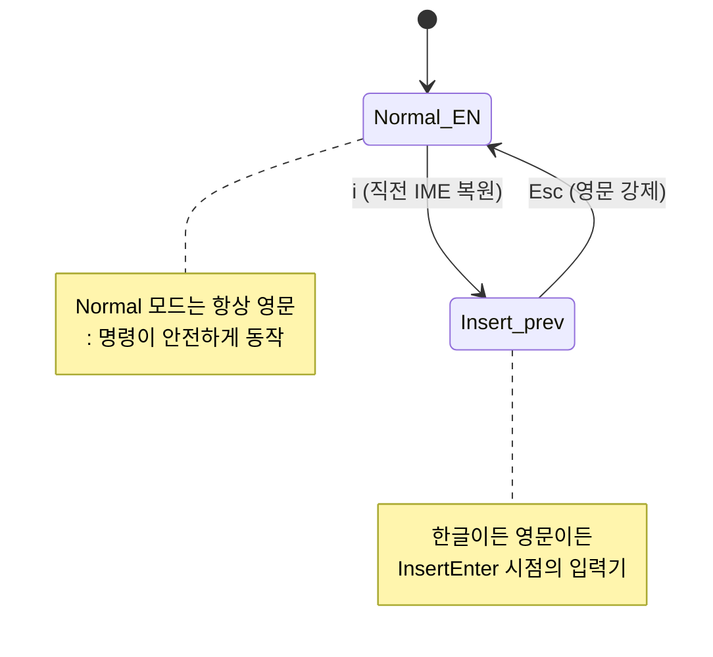

# 마크다운 글쓰기 환경 — 한글 IME·프론트매터·미리보기
---
> 이 절은 `write/` 디렉토리에서 글을 쓸 때를 전제로 한다. 1순위는 `_meta/conventions.md` 준수다. nvim 설정은 그 컨벤션을 *깨지 않게* 거드는 보조 도구일 뿐이다.

## 한글 IME — nvim 글쓰기의 첫 번째 장벽

Neovim에서 한글로 글을 쓰면 가장 자주 마주치는 문제는 *모드 전환과 IME가 따로 노는* 현상이다. Insert 모드에서 한글을 치다가 `Esc`로 Normal로 빠지면, 다음에 다시 `i`로 들어왔을 때 한글 입력 상태가 *남아 있는* 경우가 있다. 그 상태에서 `:` 같은 명령 키를 누르면 한글 자모가 입력되거나 명령이 안 먹는다.

해결책은 *모드 전환 시 강제로 영문으로 돌리는* 것이다. macOS에서는 `im-select`(또는 `macism`)를 깔아 입력 소스를 nvim이 직접 조작한다.

```bash
brew tap daipeihust/tap
brew install im-select
im-select               # 현재 입력 소스 ID 출력
# 예: com.apple.keylayout.ABC
# 또는: com.apple.inputmethod.Korean.2SetKorean
```

본 ID를 본인 환경에서 확인한 뒤 `lua/plugins/ime.lua`에 다음을 둔다.

```lua
return {
  "keaising/im-select.nvim",
  event = "InsertLeave",
  opts = {
    default_im_select       = "com.apple.keylayout.ABC",
    default_command         = "im-select",
    set_default_events      = { "VimEnter", "InsertLeave", "CmdlineLeave" },
    set_previous_events     = { "InsertEnter" },
  },
}
```

이 설정의 의미: Insert 모드에서 빠질 때마다 영문으로 강제 전환, 다시 Insert로 들어가면 *직전에 쓰던 입력기*를 복원. 결과적으로 본인은 *모드 변경*만 신경 쓰면 되고 입력기는 자동이다.



이 한 가지 설정이 한글 글쓰기 경험의 절반을 결정한다.

## 컨벤션 강제 — 무엇을 *하지 않는가*

`write/_meta/conventions.md`가 정한 규칙을 nvim이 *깨면 안 된다*. 특히 두 가지가 자동화 유혹이 큰 부분이다.

첫째, **Obsidian wiki-link(`[[...]]`) 금지**. 컨벤션이 명시한 사항이고 Typora가 못 읽는다. 따라서 `obsidian.nvim` 같이 wiki-link를 *기본형*으로 가정하는 플러그인은 설치하지 않는다. 일반 마크다운 링크(`[제목](상대경로)`)만 쓴다.

둘째, **파일명 날짜 prefix 금지**. 컨벤션에 적힌 대로 날짜는 프론트매터 `updated`에만 있다. 새 파일을 만들 때 본인이 직접 `{장}-{절}.{제목}.md` 형식을 친다. 자동 날짜 삽입 스니펫은 *프론트매터의 updated 필드만* 채우게 한다.

## 프론트매터 자동 삽입 스니펫

새 마크다운 파일을 만들 때마다 5개 필드를 손으로 치는 건 낭비다. LazyVim 기본에 포함된 `LuaSnip`을 활용한다.

`lua/snippets/markdown.lua`(파일을 새로 만든다):

```lua
local ls = require("luasnip")
local s = ls.snippet
local t = ls.text_node
local i = ls.insert_node
local f = ls.function_node

local function today()
  return os.date("%Y-%m-%d")
end

ls.add_snippets("markdown", {
  s("fm", {
    t({ "---", "title: " }), i(1, "제목"),
    t({ "", "tags: [" }), i(2, ""),
    t({ "]", "status: draft", "related:", "  - " }), i(3, "./README.md"),
    t({ "", "updated: " }), f(today, {}),
    t({ "", "---", "", "# " }), i(4, "제목"),
    t({ "", "---", "", "" }), i(0),
  }),
})
```

빈 `.md` 파일에서 `fm`을 치고 `<Tab>`을 누르면 프론트매터가 펼쳐진다. `<Tab>` 반복으로 title → tags → related → 본문 제목 순으로 점프한다. `updated`는 자동으로 오늘 날짜다.

이 스니펫이 컨벤션 5개 필드를 모두 채우므로 *프론트매터 없는 커밋*이 발생할 여지를 구조적으로 줄인다.

## 미리보기 — Typora 대체

`markdown-preview.nvim`이 가장 무난한 선택이다. 브라우저에 라이브 프리뷰를 띄운다.

`lua/plugins/markdown-preview.lua`:

```lua
return {
  "iamcco/markdown-preview.nvim",
  cmd = { "MarkdownPreview", "MarkdownPreviewStop", "MarkdownPreviewToggle" },
  ft = { "markdown" },
  build = function() vim.fn["mkdp#util#install"]() end,
  keys = {
    { "<leader>mp", "<cmd>MarkdownPreviewToggle<cr>", desc = "Markdown preview" },
  },
}
```

`<leader>mp`로 토글. 브라우저 탭이 자동으로 뜨고 nvim에서 수정할 때마다 갱신된다. Typora와 시각 품질이 비슷하고 *외부 프로그램 의존이 적다*(브라우저만 있으면 된다)는 점이 장점이다.

대안: `peek.nvim`(deno 의존), `glow.nvim`(터미널 안에서 렌더링). 본 가이드는 `markdown-preview.nvim`으로 통일한다 — 의존성이 가장 적다.

## 하이라이트 — treesitter 마크다운 파서

LazyVim 기본에 `nvim-treesitter`가 들어 있다. 마크다운 파서를 추가로 받는다.

```vim
:TSInstall markdown markdown_inline
```

설치 후에는 코드 블록 안의 언어별 하이라이트, 헤더 레벨별 색, 표 정렬이 자동으로 잡힌다. 컬러 테마는 LazyVim 기본 `tokyonight`을 그대로 쓰면 한글 글쓰기에 충분히 가독성이 나온다.

## write/ 안에서만 검색하기 — 워크플로

본인의 일상 글쓰기 워크플로는 *write/ 디렉토리 안*에서 시작한다. 매번 fuzzy finder가 홈 전체를 뒤지면 잡음이 많다.

```bash
cd "/Users/simbohyeon/Library/CloudStorage/GoogleDrive-tscofet@gmail.com/내 드라이브/study/runners-high/write"
nvim
```

또는 nvim 안에서 `:cd <write 경로>`로 작업 디렉토리를 바꾼다. 이후 `<leader>ff`(파일 찾기)와 `<leader>/`(grep)는 모두 *현재 디렉토리* 기준으로 동작한다. write/ 안 마크다운만 후보가 된다.

탭 자동화: `~/.zshrc`에 alias를 둔다.

```bash
alias wnv='cd "/Users/simbohyeon/Library/CloudStorage/GoogleDrive-tscofet@gmail.com/내 드라이브/study/runners-high/write" && nvim'
```

`wnv` 한 번에 write 모드 진입.

## 클라우드 동기화 폴더 주의 — atomic write

`write/` 디렉토리는 Google Drive CloudStorage 아래에 있다. 메모리에 기록된 대로(`onedrive_atomic_write` 메모와 같은 원리) 클라우드 동기화 폴더에서는 *원자적 쓰기*가 깨지기 쉽다. nvim은 기본적으로 `writebackup` 옵션으로 임시 파일 + rename 패턴을 쓰는데, Drive 동기화가 중간 임시 파일을 잡아채면 *원본이 깨지는* 사고가 발생할 수 있다.

`lua/config/options.lua`에 다음을 추가해 동기화 폴더에서 안전하게 만든다.

```lua
-- Google Drive 동기화 폴더에서 안전한 저장
vim.opt.backup = false
vim.opt.writebackup = false
vim.opt.swapfile = false      -- 또는 swap 디렉토리를 ~/.local/state/nvim으로 강제
```

스왑 파일을 끄는 게 부담스러우면 끄는 대신 `directory` 옵션으로 *Drive 밖*에 두는 것도 가능하다.

```lua
vim.opt.directory = vim.fn.expand("~/.local/state/nvim/swap//")
```

같은 이유로 *대량 mv/rename*은 메모리에 적힌 규칙을 따른다 — Drive 동기화를 일시 중지하고 작업 후 재개한다.

## 글쓰기 모드 보조 — 시야 정리

화면을 글에 집중시키는 두 명령을 외워둔다.

- `:set wrap linebreak` — 긴 줄을 단어 경계에서 줄바꿈해 표시(파일 자체는 안 바뀜)
- `<leader>uz` — Zen 모드(LazyVim 기본), 좌우 여백 + 상태줄 숨김

Zen 모드는 *발표 화면*에 가까운 단순함이라 일상 글쓰기 흐름에 잘 맞는다.

## 이걸 모르면 막히는 지점

- IME 강제 설정 없이 한글 글쓰기를 시도하면 며칠 안에 nvim을 포기한다. 첫 설치 직후 `im-select`부터 잡는다.
- `obsidian.nvim`처럼 wiki-link를 기본으로 가정하는 플러그인을 깔면 write/ 컨벤션과 충돌해 Typora 호환이 깨진다 — 안 깐다.
- Google Drive 동기화 폴더의 스왑 파일이 동기화 충돌을 일으키면 원본이 손상될 수 있다. swap·backup 설정을 먼저 정리한다.
