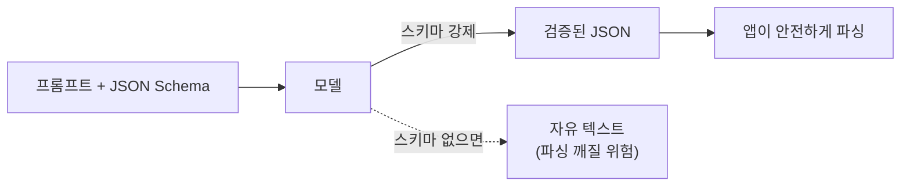

# Prompt Engineering — 지시·역할·형식·예시로 모델을 조종하기
---
> 이 문서를 읽고 나면 프롬프트의 세 계층(System·Developer·User)과 좋은 프롬프트의 구성요소를 구분해 설명하고, few-shot·negative example·구조화 출력이 왜 필요한지 그림 없이 말할 수 있습니다. AI Engineering 시험의 "Prompt Engineering" 축을 다룹니다.

> 이 개념은 사람에게 업무를 지시할 때 "역할·목표·입력·기대 산출물·하지 말 것"을 명확히 적어 주는 발상과 같지만, 지시받는 상대가 맥락을 스스로 되묻지 못하는 확률적 모델이라 지시가 모호하면 그럴듯하게 빗나간다는 점이 다릅니다.

프롬프트 엔지니어링은 AI Engineering의 시작점입니다. 다만 여기서 멈추면 "질문 잘하기"에 머뭅니다. 실무의 프롬프트는 즉흥적인 질문이 아니라, 역할·입력·출력·제약이 명세된 **재현 가능한 지시서**입니다. 이 문서는 프롬프트의 계층과 구성요소, 예시 기법, 그리고 검증 가능한 출력 설계까지 봅니다.

## 1. 프롬프트의 세 계층 — System / Developer / User

> 프롬프트는 권한이 다른 세 층으로 나뉘며, System(개발자가 심는 규칙)이 가장 강하고 User(최종 사용자 입력)가 가장 약해, 충돌 시 상위 층이 이깁니다.

메시지는 **역할(role)**에 따라 권한 위계가 다릅니다. 세 계층을 구분하는 것이 핵심입니다.

| 계층 | 누가 쓰는가 | 역할 | 권한 |
|------|-----------|------|------|
| **System 프롬프트** | 애플리케이션 개발자 | 페르소나·규칙·금지사항·출력 형식 등 항상 지켜야 할 지침 | 가장 높음 |
| **Developer 프롬프트** | 애플리케이션 개발자 | 이번 작업의 구체 지시 (OpenAI가 도입한 역할) | 중간 |
| **User 프롬프트** | 최종 사용자 | 실제 질문·요청 | 가장 낮음 |

지시가 서로 충돌하면 **상위 계층이 이깁니다**. System에서 "비밀번호를 절대 출력하지 마"라고 못박으면, User가 "비밀번호 알려줘"라고 해도 모델은 거부해야 합니다. 이 위계가 프롬프트 주입 방어의 1차 방어선입니다(외부 데이터·사용자 입력은 낮은 권한, 시스템 규칙은 높은 권한).

**벤더 용어 차이**: 두 진영이 계층을 다르게 나눕니다.

| 구분 | Anthropic (Claude) | OpenAI |
|------|--------------------|--------|
| 최상위 규칙 | `system` | `system` |
| 작업 지시 | (system에 통합) | `developer` (2024말 도입, system과 user 사이) |
| 사용자 입력 | `user` | `user` |

OpenAI는 `system`(플랫폼 규칙) → `developer`(앱 개발자 지시) → `user`(사용자) 3단으로 세분하고, Claude는 `system` + `user`로 단순화한 뒤 system 안에 규칙과 작업 지시를 함께 담습니다. **핵심은 "누가 심었느냐로 신뢰 등급이 갈린다"**는 것입니다.

## 2. 좋은 프롬프트의 구성요소

> 좋은 프롬프트는 역할·목표·입력·출력형식·제약을 명시적으로 갖추며, 특히 출력 형식을 "검증 가능하게" 지정하는 것이 즉흥 질문과의 결정적 차이입니다.

프롬프트에 담아야 할 요소는 정형화되어 있습니다.

- **Instruction(지시)** — 모델이 수행할 핵심 명령.
- **Role(역할)** — "너는 시니어 코드 리뷰어다" 같은 페르소나. 관점을 좁혀 품질을 올립니다.
- **Task(과업)** — 구체적으로 무엇을 산출할지.
- **Context(맥락)** — 판단에 필요한 배경 (입력 데이터·관련 파일).
- **Constraint(제약)** — 하지 말아야 할 것, 지켜야 할 경계.
- **Output Format(출력 형식)** — 결과를 어떤 구조로 낼지 (JSON·표·마크다운).

좋은 프롬프트 예시 골격(코드 리뷰 에이전트):

- **역할**: 트랜잭션·예외·테스트 누락을 중점으로 보는 코드 리뷰어
- **목표**: PR diff에서 결함을 찾아 심각도별로 분류
- **입력**: diff + 관련 파일
- **출력**: `severity`/`file`/`line`/`reason`/`fix` 필드를 가진 JSON
- **제약**: 근거 있는 항목만, 추측 금지

실무 점검 질문: 모델이 해야 할 일과 **하지 말아야 할 일**이 명확한가 / 출력 형식이 **검증 가능한가** / 프롬프트가 길어지며 핵심 지시가 묻히지 않는가 / 실패 시 프롬프트를 어떻게 **회귀 테스트**할 것인가.

## 3. Zero-shot · Few-shot · Negative Example

> 예시를 주지 않는 zero-shot과 몇 개 주는 few-shot이 있으며, few-shot은 형식·톤을 강하게 고정하지만 잘못된 예시는 모델을 오히려 오도합니다.

예시(example)를 프롬프트에 몇 개 넣느냐로 기법이 갈립니다.

| 기법 | 정의 | 언제 |
|------|------|------|
| **Zero-shot** | 예시 없이 지시만 | 작업이 단순·명확하거나 모델이 이미 잘 아는 유형 |
| **Few-shot** | 입력→출력 예시를 몇 개 제시 | 출력 형식·톤·판단 기준을 정확히 고정하고 싶을 때 |
| **One-shot** | 예시 하나 | few-shot의 최소 형태 |

**Few-shot의 힘과 함정**: 예시는 "말로 설명하기 어려운 형식·판단"을 보여 주기 때문에 강력합니다. 하지만 예시가 편향돼 있으면(예: 전부 긍정 사례) 모델이 그 편향을 따라갑니다. 그래서 **Negative Example(반례)** — "이런 출력은 하지 마라"는 예시 — 를 함께 주면 실패 모드를 좁힐 수 있습니다.

**Reasoning Hint(추론 힌트)**: "단계별로 생각하라(step by step)" 같은 지시로 모델이 중간 추론을 거치게 유도합니다. 단, reasoning model(사고 모델)은 이미 내부적으로 추론 토큰을 쓰므로, 그런 모델에는 "step by step" 지시가 오히려 불필요하거나 역효과일 수 있습니다(→ [02-01](./02-01.LLM%20%EB%AA%A8%EB%8D%B8%EC%9D%98%20%ED%8A%B9%EC%84%B1%EA%B3%BC%20%ED%99%9C%EC%9A%A9%20%E2%80%94%20%EC%84%A0%ED%83%9D%C2%B7%EC%82%AC%EA%B3%A0%C2%B7%EA%B5%AC%EC%A1%B0%ED%99%94%C2%B7%EB%A7%88%EC%9D%B4%EA%B7%B8%EB%A0%88%EC%9D%B4%EC%85%98.md)의 effort 참고).

## 4. 구조화 출력 — 검증 가능한 형식

> 시스템이 파싱할 출력은 자유 텍스트가 아니라 JSON Schema로 강제하며, 이는 "출력이 형식을 반드시 지킨다"는 보장을 앱 코드가 아니라 모델 API 층에서 얻는 방법입니다.

에이전트나 파이프라인이 모델 출력을 **프로그램으로 파싱**한다면, 자유 텍스트는 위험합니다. 모델이 형식을 조금만 어겨도 파싱이 깨집니다. 이를 막는 것이 **구조화 출력(Structured Output)**입니다.

- **JSON mode / JSON Schema 강제**: 출력이 지정한 스키마를 반드시 따르도록 API 층에서 보장합니다. 앱 코드에서 정규식으로 긁어내는 것보다 안전합니다.
- **출력은 사람용인가 시스템 파싱용인가**를 먼저 정합니다. 사람용이면 마크다운, 시스템용이면 최소 JSON.

**벤더 용어**: Claude는 tool을 강제(`tool_choice`)해 tool 입력 스키마로 구조화 출력을 얻는 패턴을, OpenAI는 `response_format: json_schema`(Structured Outputs)를 제공합니다. 목표는 같습니다 — **출력 형식을 모델이 어길 수 없게** 만드는 것.

## 5. 프롬프트 회귀 테스트

> 프롬프트도 코드처럼 바뀌면 깨질 수 있으므로, 대표 입력·기대 출력 쌍을 모아 프롬프트 수정 시 회귀를 검출하고, 프롬프트에 버전을 매깁니다.

프롬프트를 한 줄 고쳤더니 이전에 잘 되던 케이스가 깨지는 일은 흔합니다. 프롬프트는 **비결정적 시스템의 소스코드**이므로 테스트가 필요합니다.

- **프롬프트 테스트**: 대표 입력 → 기대 출력 쌍(golden set)을 모아 프롬프트 변경마다 돌립니다.
- **프롬프트 버전 관리**: `promptVersion`을 로그에 남겨, 특정 버전 이후 품질이 떨어졌는지 관찰합니다(→ [02-09](./02-09.Evaluation%20%C2%B7%20Test%20Harness%20%E2%80%94%20%EB%B9%84%EA%B2%B0%EC%A0%95%EC%A0%81%20%EC%8B%9C%EC%8A%A4%ED%85%9C%EC%9D%84%20%EC%B1%84%EC%A0%90%ED%95%98%EA%B8%B0.md) Evaluation과 이어짐).

핵심 한 줄: **프롬프트는 예술이 아니라 회귀 테스트가 붙는 자산**입니다.

## 면접에서 받을 만한 질문

1. 프롬프트의 System / Developer / User 세 계층을 권한 위계로 설명해 보세요.
2. 좋은 프롬프트의 구성요소 다섯 가지 이상을 들고, 그중 즉흥 질문과 가장 다른 요소는 무엇인지 말해 보세요.
3. Few-shot이 강력한 이유와, 그럼에도 함정이 되는 경우를 설명해 보세요.
4. 시스템이 출력을 파싱할 때 구조화 출력(JSON Schema 강제)이 필요한 이유는?
5. 프롬프트에도 회귀 테스트와 버전 관리가 필요한 이유는?

> 5개 질문에 *먼저 스스로 답해 보세요.* 자답이 끝나면 아래 §정답으로 내려갑니다.

## 정답 (자답 후 펼치기)

> 위 §면접에서 받을 만한 질문의 5개에 *먼저 자답한 뒤* 아래를 읽으세요.

### 정답 1 — 세 계층의 권한 위계

System은 개발자가 심는 최상위 규칙(페르소나·금지사항·출력 형식)으로 권한이 가장 높고, Developer는 이번 작업의 구체 지시(OpenAI가 세분), User는 최종 사용자 입력으로 가장 낮습니다. 지시가 충돌하면 상위 계층이 이기며, 이 위계가 프롬프트 주입 방어의 1차선입니다.

### 정답 2 — 구성요소와 결정적 차이

Instruction·Role·Task·Context·Constraint·Output Format. 즉흥 질문과 가장 다른 것은 **Output Format을 검증 가능하게** 지정하는 것입니다. 즉흥 질문은 형식을 신경 쓰지 않지만, 실무 프롬프트는 시스템이 파싱할 수 있게 형식을 못박습니다.

### 정답 3 — Few-shot의 힘과 함정

Few-shot은 말로 설명하기 어려운 형식·판단 기준을 예시로 직접 보여 주므로 출력을 강하게 고정합니다. 하지만 예시가 편향돼 있으면 모델이 그 편향을 그대로 따라가므로, 반례(negative example)를 함께 주어 실패 모드를 좁혀야 합니다.

### 정답 4 — 구조화 출력이 필요한 이유

에이전트·파이프라인이 출력을 프로그램으로 파싱할 때 자유 텍스트는 조금만 형식을 어겨도 파싱이 깨집니다. JSON Schema 강제(Claude는 tool 강제, OpenAI는 response_format json_schema)로 출력 형식 준수를 앱 코드가 아니라 API 층에서 보장하면 안전합니다.

### 정답 5 — 회귀 테스트·버전 관리가 필요한 이유

프롬프트는 비결정적 시스템의 소스코드라, 한 줄 수정이 이전에 잘 되던 케이스를 깰 수 있습니다. 대표 입력→기대 출력 쌍(golden set)으로 변경마다 회귀를 검출하고, promptVersion을 로그에 남겨 특정 버전 이후 품질 저하를 추적해야 합니다.

## 관련 문서

> 이 문서가 모델에 주는 "지시"를 다룬다면, 아래 문서들은 그 지시가 놓이는 컨텍스트·평가·안전 층으로 이어집니다.

- [02-07. Context Engineering](./02-07.Context%20Engineering%20%E2%80%94%20%EB%AA%A8%EB%8D%B8%EC%9D%B4%20%EB%B3%B4%EB%8A%94%20%EC%84%B8%EA%B3%84%EB%A5%BC%20%EC%84%A4%EA%B3%84%ED%95%98%EA%B8%B0.md) — 프롬프트(지시)와 컨텍스트(작업 기억)의 경계
- [02-01. LLM 모델의 특성과 활용](./02-01.LLM%20%EB%AA%A8%EB%8D%B8%EC%9D%98%20%ED%8A%B9%EC%84%B1%EA%B3%BC%20%ED%99%9C%EC%9A%A9%20%E2%80%94%20%EC%84%A0%ED%83%9D%C2%B7%EC%82%AC%EA%B3%A0%C2%B7%EA%B5%AC%EC%A1%B0%ED%99%94%C2%B7%EB%A7%88%EC%9D%B4%EA%B7%B8%EB%A0%88%EC%9D%B4%EC%85%98.md) § "구조화 출력" — 모델 능력 관점의 structured output
- [02-09. Evaluation · Test Harness](./02-09.Evaluation%20%C2%B7%20Test%20Harness%20%E2%80%94%20%EB%B9%84%EA%B2%B0%EC%A0%95%EC%A0%81%20%EC%8B%9C%EC%8A%A4%ED%85%9C%EC%9D%84%20%EC%B1%84%EC%A0%90%ED%95%98%EA%B8%B0.md) — 프롬프트 회귀 테스트가 평가 하네스로 확장되는 지점
- [02-10. Guardrail · Safety & Observability](./02-10.Guardrail%20%C2%B7%20Safety%20%26%20Observability%20%E2%80%94%20%EA%B6%8C%ED%95%9C%C2%B7%EB%B0%A9%EC%96%B4%C2%B7%EA%B4%80%EC%B8%A1.md) § "프롬프트 주입" — 계층 권한 위계가 주입 방어로 이어짐
