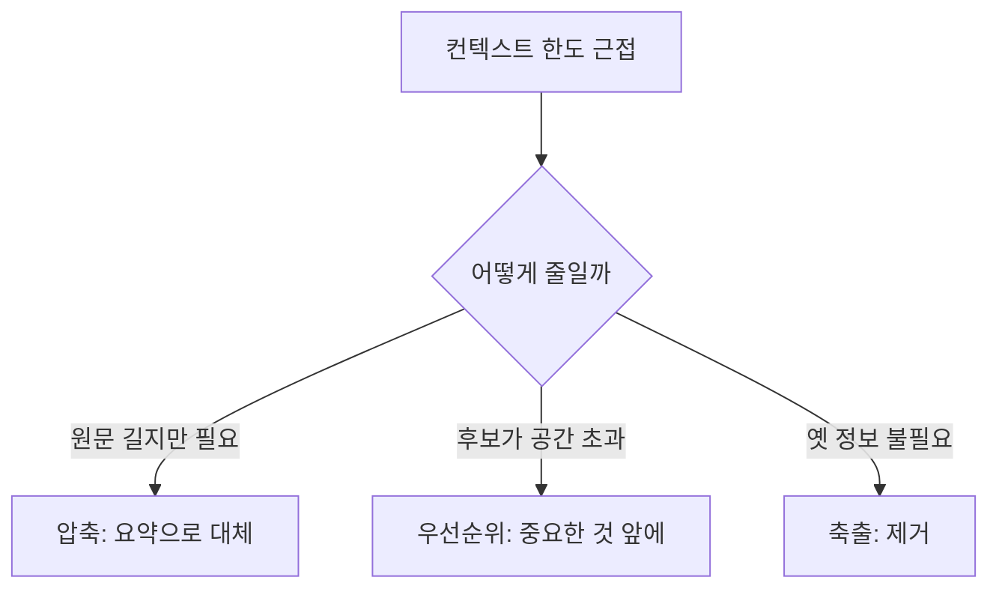

# Context Engineering — 모델이 보는 세계를 설계하기
---
> 이 문서를 읽고 나면 프롬프트와 컨텍스트의 차이를 설명하고, 컨텍스트 윈도우의 구성·메모리 두 층·압축/우선순위/축출 세 동작·reasoning token이 차지하는 공간을 그림 없이 말할 수 있습니다. AI Engineering 시험의 "Context Engineering" 축을 다룹니다.

> 이 개념은 사람이 회의에 들어가기 전 "무슨 자료를 책상에 올려둘까"를 고르는 발상과 같지만, 책상 넓이(컨텍스트 윈도우)가 유한하고 자료를 많이 올릴수록 비용과 산만함(context rot)이 커진다는 점이 다릅니다.

프롬프트가 "지시"라면 컨텍스트는 모델이 **지금 작업하기 위해 보는 세계 전체**입니다. 같은 프롬프트라도 어떤 정보를 함께 넣느냐에 따라 결과가 달라집니다. Context Engineering은 "무엇을 넣고, 무엇을 빼고, 무엇을 우선할지"를 설계하는 기술입니다.

## 1. 프롬프트 vs 컨텍스트

> 프롬프트는 "무엇을 하라"는 지시이고 컨텍스트는 "지금 작업하는 데 필요한 정보(작업 기억)"이며, 둘은 역할이 다릅니다.

혼동하기 쉬운 두 개념을 먼저 가릅니다.

| 구분 | 프롬프트 | 컨텍스트 |
|------|---------|---------|
| 성격 | 지시(instruction) | 작업 기억(working memory) |
| 예시 | "이 코드를 리뷰하라" | 리뷰 대상 diff, 관련 파일, 이전 대화 |
| 비유 | 명령서 | 책상에 올려둔 참고 자료 |

프롬프트를 아무리 잘 써도 필요한 자료가 컨텍스트에 없으면 모델은 지어냅니다(환각). 반대로 자료를 과하게 넣으면 핵심이 묻힙니다. 그래서 둘은 함께 설계합니다.

## 2. 컨텍스트 윈도우의 구성

> 컨텍스트 윈도우는 모델이 한 번에 볼 수 있는 토큰의 총량이며, system·user·대화 히스토리·검색 결과·도구 결과가 그 한정된 공간을 나눠 씁니다.

**컨텍스트 윈도우(Context Window)**는 모델이 한 요청에서 처리할 수 있는 토큰의 상한입니다. 이 유한한 공간에 여러 종류의 컨텍스트가 함께 들어갑니다.

- **System Context** — 시스템 프롬프트·규칙 (항상 존재)
- **User Context** — 사용자의 현재 입력
- **Conversation History** — 이전 대화 턴들
- **Retrieved Context** — RAG로 검색해 넣은 문서 (→ [02-08](./02-08.RAG%20%C2%B7%20Retrieval%20%EC%84%A4%EA%B3%84%20%E2%80%94%20%EC%9E%84%EB%B2%A0%EB%94%A9%C2%B7%EA%B2%80%EC%83%89%C2%B7%EA%B7%BC%EA%B1%B0%EB%A1%9C%20%EB%8B%B5%EC%9D%84%20%EB%B6%99%EB%93%A4%EA%B8%B0.md))
- **Tool Result Context** — 도구 실행 결과

핵심은 이들이 **하나의 유한한 공간을 나눠 쓴다**는 점입니다. 대화가 길어지면 히스토리가 공간을 잠식하고, RAG 결과를 많이 넣으면 다른 정보가 밀려납니다.

## 3. 작업 기억 vs 장기 기억

> 세션 안에서만 필요한 정보는 컨텍스트(작업 기억)에 두고, 세션을 넘겨 유지해야 하는 정보는 파일에 저장하는 장기 기억(메모리)에 둡니다.

메모리는 두 층으로 나뉩니다.

| 구분 | Working Memory (작업 기억) | Long-term Memory (장기 기억) |
|------|---------------------------|------------------------------|
| 위치 | 컨텍스트 윈도우 안 | 파일·외부 저장소 |
| 수명 | 현재 세션 | 세션·프로세스 재시작 초월 |
| 예시 | 지금 대화의 흐름 | 사용자 선호, 누적 학습, 프로젝트 규칙 |

세션 안에서만 쓰는 정보(지금 대화 맥락)는 컨텍스트로 충분하지만, 다음 세션에도 써야 하는 정보(사용자 선호)는 장기 기억에 둡니다. 장기 기억은 보통 버전 관리·감사를 지원하고, 에이전트가 파일 도구로 읽고 씁니다(→ [02-05](./02-05.AI%20Agentization%20%E2%80%94%20%EC%9B%8C%ED%81%AC%ED%94%8C%EB%A1%9C%EC%9A%B0%EC%99%80%20%EC%97%90%EC%9D%B4%EC%A0%84%ED%8A%B8%20%EC%82%AC%EC%9D%B4.md) §4와 이어짐).

## 4. 컨텍스트 관리 세 동작 — 압축·우선순위·축출

> 유한한 윈도우를 다루는 세 동작은 압축(요약해 줄임)·우선순위(중요한 것 먼저)·축출(오래된 것 제거)이며, 서로 역할이 다릅니다.

컨텍스트가 넘칠 때 쓰는 동작 셋을 구분합니다.

| 동작 | 무엇을 하는가 | 언제 |
|------|-------------|------|
| **Context Compression(압축)** | 긴 히스토리·문서를 요약으로 대체 | 정보는 필요하나 원문이 길 때 |
| **Context Prioritization(우선순위)** | 무엇을 먼저·앞에 둘지 결정 | 넣을 후보가 공간보다 많을 때 |
| **Context Eviction(축출)** | 오래되어 불필요한 항목을 제거 | 옛 정보가 더는 쓸모없을 때 |

이는 [02-02](./02-02.Harness%20Engineering%20%E2%80%94%20%EB%AA%A8%EB%8D%B8%EC%9D%84%20%EA%B0%90%EC%8B%B8%EB%8A%94%20%EC%98%A4%EC%BC%80%EC%8A%A4%ED%8A%B8%EB%A0%88%EC%9D%B4%EC%85%98%20%EC%B8%B5.md) §7의 하네스 패턴(Context Editing=축출, Compaction=압축, Memory=영속)과 대응합니다. Context Engineering이 "무엇을" 다룰지 원칙이라면, 하네스는 그것을 실행하는 메커니즘입니다.

## 5. Reasoning Token이 차지하는 공간

> 사고 모델의 내부 추론 토큰(reasoning token)도 컨텍스트 윈도우 공간을 차지하고 비용에 반영되므로, 추론용 공간과 최종 출력용 공간을 함께 계산해야 합니다.

시험에서 자주 헷갈리는 포인트입니다. Reasoning model(사고 모델)은 답을 내기 전 **내부 추론 토큰**을 소비합니다. 이 토큰은:

1. **컨텍스트 윈도우 공간을 차지**합니다. 입력 + 추론 + 출력이 모두 같은 윈도우 안에 들어갑니다.
2. **비용에 반영**됩니다. 출력 토큰처럼 과금됩니다.
3. 보통 **최종 응답에는 보이지 않습니다**(요약본만 노출되기도 함).

그래서 사고 모델을 쓸 때는 "입력 + reasoning + visible output"의 총합이 윈도우에 맞는지 계산해야 합니다. reasoning을 위한 공간을 남기지 않으면 출력이 잘립니다. effort/reasoning 강도를 낮추면 추론 토큰이 줄어 공간·비용이 함께 절약됩니다(→ [02-03](./02-03.Token%20Optimization%20%E2%80%94%20%EB%B9%84%EC%9A%A9%C2%B7%EC%A7%80%EC%97%B0%C2%B7context%20rot%EB%A5%BC%20%EC%A4%84%EC%9D%B4%EB%8A%94%20%EB%B2%95.md) §4 출력 토큰 제어).

## 6. Context Rot — 길다고 좋은 게 아니다

> 컨텍스트가 길수록 옛 정보가 현재 판단을 흐리는 context rot이 생기므로, 1M 윈도우여도 "필요한 것만" 넣는 것이 원칙입니다.

**Context Rot(컨텍스트 부패)**는 컨텍스트가 길어질수록 관련성 낮은 옛 정보가 모델의 현재 판단을 흐리는 현상입니다. 윈도우가 커졌다고(예: 1M 토큰) 무한정 채우면 오히려 품질이 떨어집니다.

원칙은 **"모델에게 필요한 정보만 공급한다"**입니다. 좋은 순서는: 1차 관련 후보 검색 → 2차 필요한 함수/문서만 추출 → 3차 최근 에러만 압축 → 변경 범위와 검증 기준만 전달. 컨텍스트는 크게가 아니라 **정확하게** 채웁니다.

## 면접에서 받을 만한 질문

1. 프롬프트와 컨텍스트의 차이를 지시 vs 작업 기억으로 설명해 보세요.
2. 컨텍스트 윈도우 안에서 여러 종류의 컨텍스트가 "공간을 나눠 쓴다"는 말의 의미는?
3. Working Memory와 Long-term Memory의 구분 기준은?
4. 압축·우선순위·축출 세 동작의 차이를 말해 보세요.
5. Reasoning token이 컨텍스트 엔지니어링에서 왜 중요한 고려 대상인가요?

> 5개 질문에 *먼저 스스로 답해 보세요.* 자답이 끝나면 아래 §정답으로 내려갑니다.

## 정답 (자답 후 펼치기)

> 위 §면접에서 받을 만한 질문의 5개에 *먼저 자답한 뒤* 아래를 읽으세요.

### 정답 1 — 프롬프트 vs 컨텍스트

프롬프트는 "무엇을 하라"는 지시(instruction)이고, 컨텍스트는 모델이 지금 작업하는 데 필요한 정보, 즉 작업 기억(working memory)입니다. 프롬프트가 아무리 좋아도 필요한 자료가 컨텍스트에 없으면 모델은 지어냅니다.

### 정답 2 — 공간을 나눠 쓴다는 의미

컨텍스트 윈도우는 유한한 토큰 상한입니다. system·user·대화 히스토리·검색 결과·도구 결과가 이 하나의 공간을 나눠 쓰므로, 히스토리가 길어지거나 RAG 결과를 많이 넣으면 다른 정보가 밀려납니다. 무엇을 넣을지는 곧 무엇을 뺄지의 문제입니다.

### 정답 3 — 작업 기억 vs 장기 기억

작업 기억은 컨텍스트 윈도우 안에 있고 현재 세션에서만 유효합니다. 장기 기억은 파일·외부 저장소에 저장돼 세션과 프로세스 재시작을 초월해 살아남습니다. 지금 대화 맥락은 작업 기억, 사용자 선호·누적 학습은 장기 기억에 둡니다.

### 정답 4 — 압축·우선순위·축출

압축(Compression)은 긴 원문을 요약으로 대체하고, 우선순위(Prioritization)는 넣을 후보가 공간보다 많을 때 무엇을 먼저 둘지 정하며, 축출(Eviction)은 오래되어 불필요한 항목을 제거합니다. 압축은 줄이고, 우선순위는 고르고, 축출은 버립니다.

### 정답 5 — Reasoning token의 중요성

사고 모델의 내부 추론 토큰도 컨텍스트 윈도우 공간을 차지하고 비용에 반영됩니다. 입력 + reasoning + visible output이 모두 같은 윈도우에 들어가므로, 추론용 공간을 남기지 않으면 출력이 잘립니다. 그래서 컨텍스트 설계 시 reasoning 공간까지 계산해야 합니다.

## 관련 문서

> 이 문서가 모델이 보는 컨텍스트를 설계한다면, 아래 문서들은 그 컨텍스트를 채우는 검색·아끼는 토큰·감싸는 하네스로 이어집니다.

- [02-08. RAG · Retrieval 설계](./02-08.RAG%20%C2%B7%20Retrieval%20%EC%84%A4%EA%B3%84%20%E2%80%94%20%EC%9E%84%EB%B2%A0%EB%94%A9%C2%B7%EA%B2%80%EC%83%89%C2%B7%EA%B7%BC%EA%B1%B0%EB%A1%9C%20%EB%8B%B5%EC%9D%84%20%EB%B6%99%EB%93%A4%EA%B8%B0.md) — Retrieved Context를 채우는 검색 파이프라인
- [02-03. Token Optimization](./02-03.Token%20Optimization%20%E2%80%94%20%EB%B9%84%EC%9A%A9%C2%B7%EC%A7%80%EC%97%B0%C2%B7context%20rot%EB%A5%BC%20%EC%A4%84%EC%9D%B4%EB%8A%94%20%EB%B2%95.md) — 컨텍스트를 줄여 비용·지연·context rot를 관리하는 기법
- [02-02. Harness Engineering](./02-02.Harness%20Engineering%20%E2%80%94%20%EB%AA%A8%EB%8D%B8%EC%9D%84%20%EA%B0%90%EC%8B%B8%EB%8A%94%20%EC%98%A4%EC%BC%80%EC%8A%A4%ED%8A%B8%EB%A0%88%EC%9D%B4%EC%85%98%20%EC%B8%B5.md) § "컨텍스트 관리" — 압축·축출·영속을 실행하는 메커니즘
- [02-06. Prompt Engineering](./02-06.Prompt%20Engineering%20%E2%80%94%20%EC%A7%80%EC%8B%9C%C2%B7%EC%97%AD%ED%95%A0%C2%B7%ED%98%95%EC%8B%9D%C2%B7%EC%98%88%EC%8B%9C%EB%A1%9C%20%EB%AA%A8%EB%8D%B8%EC%9D%84%20%EC%A1%B0%EC%A2%85%ED%95%98%EA%B8%B0.md) — 컨텍스트에 놓이는 지시(프롬프트)의 설계
