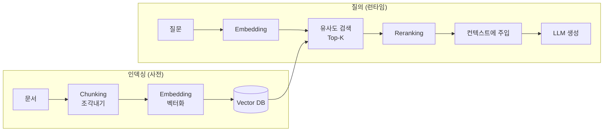

# RAG · Retrieval 설계 — 임베딩·검색·근거로 답을 붙들기
---
> 이 문서를 읽고 나면 RAG 파이프라인(임베딩→벡터DB→검색→생성)을 설명하고, 시맨틱·키워드·하이브리드 검색과 recall·precision, reranking, grounding·citation을 그림 없이 말할 수 있습니다. AI Engineering 시험의 "RAG / Retrieval" 축을 다룹니다.

> 이 개념은 시험 볼 때 "외우지 말고 필요할 때 참고서를 펴서 근거를 찾아 답하라"는 오픈북 방식과 같지만, 참고서가 방대해 무엇을 펼칠지 자동으로 골라야 하고 잘못 고르면 엉뚱한 근거로 답한다는 점이 다릅니다.

LLM은 학습 시점 이후의 지식이나 사내 문서를 모릅니다. 파라미터에 없는 정보를 답하게 하려면, 질문에 맞는 문서를 **검색해서 컨텍스트에 넣어 준 뒤** 답하게 해야 합니다. 이것이 **RAG(Retrieval-Augmented Generation, 검색 증강 생성)**입니다. RAG는 모델을 재학습하지 않고도 최신·비공개 지식을 다루게 하는 표준 기법입니다.

## 1. RAG 파이프라인 — 왜, 무엇을

> RAG는 질문에 관련된 문서를 검색해 프롬프트에 붙여 생성하는 구조이며, 재학습 없이 최신·사내 지식을 답에 반영하고 답의 근거를 남길 수 있게 합니다.

기본 흐름은 **인덱싱(사전 준비)**과 **질의(런타임)** 두 단계입니다.

RAG를 쓰는 이유: 파인튜닝보다 **싸고 빠르게** 지식을 갱신하고(문서만 다시 넣으면 됨), 답변에 **근거(citation)**를 남길 수 있으며, 모델이 모르는 것을 **지어내지 않게(grounding)** 붙듭니다.

## 2. Embedding과 Vector Database

> 임베딩은 텍스트를 의미가 가까우면 거리도 가까운 벡터로 변환한 것이고, 벡터 DB는 그 벡터들을 저장해 질문 벡터와 가장 가까운 것을 빠르게 찾는 저장소입니다.

- **Embedding(임베딩)**: 텍스트를 고차원 실수 벡터로 변환합니다. 핵심 성질은 **의미가 비슷하면 벡터 거리가 가깝다**는 것. "강아지"와 "개"는 벡터 공간에서 가까이 놓입니다. 이 변환은 전용 **embedding model**이 합니다(생성 모델과 별개).
- **Vector Database(벡터 DB)**: 임베딩 벡터를 저장하고, 질문 벡터와 가장 가까운 벡터를 빠르게 찾는 특화 저장소입니다(예: 근사 최근접 이웃, ANN). 코사인 유사도 등으로 거리를 잽니다.

**Reranker model**은 embedding model과 다릅니다. embedding은 "대략 가까운 후보"를 빠르게 뽑고, reranker는 그 후보를 질문과 하나씩 정밀 대조해 순서를 다시 매깁니다(§4).

## 3. 검색 방식 — Semantic · Keyword · Hybrid

> 시맨틱 검색은 의미로, 키워드 검색은 정확한 단어로 찾으며, 하이브리드는 둘을 합쳐 각자의 약점을 보완합니다.

검색 방식 세 가지를 구분하는 것이 시험 포인트입니다.

| 방식 | 무엇으로 찾는가 | 강점 | 약점 |
|------|---------------|------|------|
| **Semantic Search(의미 검색)** | 임베딩 벡터 유사도 | 동의어·의역·개념 매칭 | 정확한 코드·ID·고유명사에 약함 |
| **Keyword Search(키워드 검색)** | 정확한 단어 일치 (BM25 등) | 정확한 용어·에러코드·함수명 | 동의어·의역 못 잡음 |
| **Hybrid Search(하이브리드)** | 둘을 결합해 점수 병합 | 양쪽 강점 | 구현·튜닝 복잡 |

예: "결제 실패 로그"를 시맨틱으로 찾으면 "payment declined"도 잡지만 `ERR_4012` 같은 정확한 코드는 키워드 검색이 낫습니다. 그래서 실무는 **하이브리드**로 둘을 합칩니다.

## 4. Chunking · Top-K · Reranking

> 문서는 검색 단위로 잘라(chunking) 임베딩하고, 질의 시 상위 K개(Top-K)를 뽑은 뒤 reranker로 정밀 재정렬해 컨텍스트에 넣습니다.

- **Chunking(청킹)**: 문서를 검색 단위로 자릅니다. 너무 크면 한 청크에 여러 주제가 섞여 정밀도가 떨어지고, 너무 작으면 맥락이 끊깁니다. 코드는 함수 단위, 문서는 문단·섹션 단위가 흔합니다.
- **Metadata(메타데이터)**: 각 청크에 출처·날짜·작성자 등을 붙여, 검색 시 필터링(예: "최근 30일 문서만")하거나 citation에 씁니다.
- **Top-K**: 유사도 상위 K개를 가져옵니다. K가 크면 recall은 오르지만 컨텍스트가 커지고 노이즈가 늡니다.
- **Reranking(재정렬)**: 1차로 뽑은 Top-K 후보를 reranker model이 질문과 하나씩 정밀 비교해 순서를 다시 매깁니다. 임베딩 검색의 "빠르지만 거친" 순위를 "느리지만 정확한" 순위로 보정합니다.

전형적 2단계: **임베딩으로 후보 100개를 빠르게 → reranker로 상위 5개를 정밀하게** 골라 컨텍스트에 넣습니다.

## 5. Recall vs Precision

> Recall은 "찾아야 할 것을 얼마나 놓치지 않았나", Precision은 "찾아온 것 중 진짜가 얼마나 되나"이며, 둘은 보통 트레이드오프 관계입니다.

검색 품질의 두 축을 반드시 구분합니다.

| 지표 | 정의 | 질문 |
|------|------|------|
| **Recall(재현율)** | 관련 문서 중 실제로 검색된 비율 | "놓친 게 없나?" |
| **Precision(정밀도)** | 검색된 문서 중 실제로 관련된 비율 | "가져온 게 다 쓸모 있나?" |

Top-K를 늘리면 **recall은 오르지만 precision은 떨어집니다**(관련 없는 문서도 딸려 옴). 반대로 K를 줄이면 precision은 오르나 관련 문서를 놓칠(recall 하락) 수 있습니다. RAG에서는 recall로 후보를 넉넉히 잡은 뒤 reranking으로 precision을 끌어올리는 조합을 씁니다.

## 6. Grounding과 Citation

> Grounding은 모델이 검색된 근거에만 기대어 답하게 붙드는 것이고, Citation은 답의 각 주장에 출처를 다는 것으로, 둘 다 환각을 줄이고 검증을 가능하게 합니다.

- **Grounding(근거 기반)**: 모델이 파라미터 기억이나 추측이 아니라 **검색된 문서에 기반해** 답하도록 만드는 것. "제공된 문서에 없으면 모른다고 답하라"는 지시가 대표적입니다.
- **Citation(인용)**: 답의 각 문장·주장에 어느 문서의 어느 부분에서 나왔는지 출처를 붙입니다. 사용자가 근거를 검증할 수 있고, 틀린 답을 추적할 수 있습니다.

이 둘이 없으면 RAG도 그럴듯한 환각을 냅니다. **검색은 잘했는데 모델이 검색 결과를 무시하고 지어내는 것**을 grounding으로 막고, **그 답이 맞는지 확인할 길**을 citation으로 엽니다.

보조 기법: **Query Rewriting(질의 재작성)** — 사용자의 모호한 질문을 검색에 유리하게 다시 씀. **Document Refresh(문서 갱신)** — 오래된 문서를 주기적으로 재인덱싱해 stale한 근거를 막음.

## 7. RAG vs 롱컨텍스트 주입

> 검색해 필요한 조각만 넣는 RAG와, 문서 전체를 긴 컨텍스트에 통째로 넣는 방식은 트레이드오프이며, 문서 규모·갱신 빈도·비용으로 선택합니다.

윈도우가 커지면서 "그냥 문서를 다 넣으면 되지 않나?"라는 질문이 생깁니다. 둘을 대조합니다.

| 방식 | 장점 | 단점 |
|------|------|------|
| **RAG(검색 주입)** | 관련 조각만 넣어 토큰 절약, 대규모 코퍼스 확장 가능, 갱신 쉬움 | 검색 품질에 의존, 파이프라인 복잡 |
| **롱컨텍스트 전체 주입** | 검색 실패 없음, 단순 | 토큰 비용·지연 큼, 코퍼스가 윈도우보다 크면 불가, context rot |

문서가 수만 건이면 RAG가 유일한 선택이고, 문서가 몇 개뿐이고 매번 전체가 필요하면 통째 주입이 단순합니다. 실무는 자주 **하이브리드** — RAG로 후보를 좁힌 뒤 넉넉히 주입 — 를 씁니다(→ [02-07](./02-07.Context%20Engineering%20%E2%80%94%20%EB%AA%A8%EB%8D%B8%EC%9D%B4%20%EB%B3%B4%EB%8A%94%20%EC%84%B8%EA%B3%84%EB%A5%BC%20%EC%84%A4%EA%B3%84%ED%95%98%EA%B8%B0.md) context rot).

## 면접에서 받을 만한 질문

1. RAG 파이프라인을 인덱싱과 질의 두 단계로 설명해 보세요.
2. 임베딩의 핵심 성질과 벡터 DB의 역할은?
3. 시맨틱·키워드·하이브리드 검색의 차이와 각각이 강한 경우를 말해 보세요.
4. Recall과 Precision의 차이, 그리고 Top-K를 늘릴 때 둘이 어떻게 움직이는지 설명해 보세요.
5. Grounding과 Citation이 RAG에서 환각을 줄이는 방식은?

> 5개 질문에 *먼저 스스로 답해 보세요.* 자답이 끝나면 아래 §정답으로 내려갑니다.

## 정답 (자답 후 펼치기)

> 위 §면접에서 받을 만한 질문의 5개에 *먼저 자답한 뒤* 아래를 읽으세요.

### 정답 1 — RAG 파이프라인

인덱싱(사전): 문서를 청킹→임베딩→벡터 DB에 저장. 질의(런타임): 질문을 임베딩→벡터 DB에서 Top-K 유사 검색→reranking→컨텍스트에 주입→LLM 생성. 재학습 없이 최신·사내 지식을 답에 반영하고 근거를 남깁니다.

### 정답 2 — 임베딩과 벡터 DB

임베딩은 텍스트를 벡터로 바꾸되 "의미가 가까우면 거리도 가깝게" 만든 표현입니다. 벡터 DB는 이 벡터들을 저장하고 질문 벡터와 가장 가까운 것을 빠르게(근사 최근접 이웃) 찾는 특화 저장소입니다.

### 정답 3 — 세 검색 방식

시맨틱 검색은 임베딩 유사도로 의미를 매칭해 동의어·의역에 강하고, 키워드 검색은 정확한 단어 일치로 에러코드·함수명 같은 고유 용어에 강합니다. 하이브리드는 둘을 결합해 각자의 약점(시맨틱은 정확 용어, 키워드는 동의어)을 보완합니다.

### 정답 4 — Recall vs Precision

Recall은 관련 문서 중 실제 검색된 비율("놓친 게 없나"), Precision은 검색된 문서 중 관련된 비율("가져온 게 쓸모 있나")입니다. Top-K를 늘리면 recall은 오르지만 관련 없는 문서도 딸려 와 precision은 떨어집니다. 보통 트레이드오프라 recall로 넉넉히 잡고 reranking으로 precision을 올립니다.

### 정답 5 — Grounding과 Citation

Grounding은 모델이 파라미터 기억·추측이 아니라 검색된 문서에만 기대어 답하게 붙들어(없으면 모른다고) 환각을 줄입니다. Citation은 답의 각 주장에 출처를 달아 사용자가 근거를 검증하고 틀린 답을 추적하게 합니다. 검색을 잘해도 모델이 무시하고 지어내는 것을 grounding이 막고, 검증 경로를 citation이 엽니다.

## 관련 문서

> 이 문서가 외부 지식을 검색해 붙이는 법을 다룬다면, 아래 문서들은 그 결과가 놓이는 컨텍스트·평가·연결 표준으로 이어집니다.

- [02-07. Context Engineering](./02-07.Context%20Engineering%20%E2%80%94%20%EB%AA%A8%EB%8D%B8%EC%9D%B4%20%EB%B3%B4%EB%8A%94%20%EC%84%B8%EA%B3%84%EB%A5%BC%20%EC%84%A4%EA%B3%84%ED%95%98%EA%B8%B0.md) — 검색 결과(Retrieved Context)가 채우는 컨텍스트 윈도우
- [02-09. Evaluation · Test Harness](./02-09.Evaluation%20%C2%B7%20Test%20Harness%20%E2%80%94%20%EB%B9%84%EA%B2%B0%EC%A0%95%EC%A0%81%20%EC%8B%9C%EC%8A%A4%ED%85%9C%EC%9D%84%20%EC%B1%84%EC%A0%90%ED%95%98%EA%B8%B0.md) — RAG 평가(groundedness·answer relevance)로 이어짐
- [02-04. MCP 설계](./02-04.MCP%20%EC%84%A4%EA%B3%84%20%E2%80%94%20%EC%99%B8%EB%B6%80%20%EB%8F%84%EA%B5%AC%C2%B7%EB%8D%B0%EC%9D%B4%ED%84%B0%EB%A5%BC%20%ED%91%9C%EC%A4%80%EC%9C%BC%EB%A1%9C%20%EC%97%B0%EA%B2%B0%ED%95%98%EA%B8%B0.md) § Resources — 문서 검색을 표준 프로토콜로 노출하는 방법
- [02-03. Token Optimization](./02-03.Token%20Optimization%20%E2%80%94%20%EB%B9%84%EC%9A%A9%C2%B7%EC%A7%80%EC%97%B0%C2%B7context%20rot%EB%A5%BC%20%EC%A4%84%EC%9D%B4%EB%8A%94%20%EB%B2%95.md) — 검색 결과 개수·중복 제거가 토큰에 주는 영향
