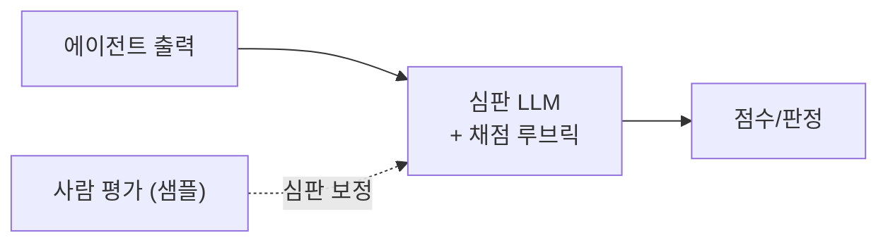

# Evaluation · Test Harness — 비결정적 시스템을 채점하기
---
> 이 문서를 읽고 나면 골든 데이터셋·회귀 테스트로 LLM 시스템을 평가하는 법과, groundedness·faithfulness·answer relevance의 차이, LLM-as-a-judge와 CI gate를 그림 없이 말할 수 있습니다. AI Engineering 시험의 "Evaluation / Test Harness" 축을 다룹니다.

> 이 개념은 답이 하나로 딱 떨어지지 않는 서술형 시험을 채점하는 발상과 같지만, 채점 대상이 매번 다르게 답하는 확률적 시스템이라 "정답 일치"가 아니라 "기준 충족"으로 채점해야 한다는 점이 다릅니다.

일반 소프트웨어는 입력이 같으면 출력이 같아 `assert output == expected`로 테스트합니다. LLM은 같은 입력에도 다르게 답하는 **비결정적 시스템**이라 이 방식이 통하지 않습니다. 그래서 평가(Evaluation)는 "정답 일치"가 아니라 "**기준을 충족하는가**"를 채점합니다. 평가 없이는 AI를 운영할 수 없습니다 — 프롬프트를 고쳤을 때 좋아졌는지 나빠졌는지 알 방법이 없기 때문입니다.

## 1. 골든 데이터셋과 회귀 테스트

> 골든 데이터셋은 대표 입력과 기대 기준을 모은 평가 기준집이고, 회귀 테스트는 프롬프트·모델 변경 시 이 데이터셋으로 품질이 떨어지지 않았는지 확인하는 것입니다.

- **Golden Dataset(골든 데이터셋)**: 대표적인 입력과 그에 대한 기대 출력·채점 기준을 모은 셋. LLM 평가의 기준선입니다. "정답"이 하나가 아닐 수 있으므로, 정확한 문자열이 아니라 **충족해야 할 기준**을 담기도 합니다.
- **Regression Test(회귀 테스트)**: 프롬프트·모델·검색 방식을 바꿨을 때 골든 데이터셋을 다시 돌려 이전보다 나빠진 케이스가 없는지 확인합니다.
- **Prompt Test**: 프롬프트 단위의 회귀 테스트 (→ [02-06](./02-06.Prompt%20Engineering%20%E2%80%94%20%EC%A7%80%EC%8B%9C%C2%B7%EC%97%AD%ED%95%A0%C2%B7%ED%98%95%EC%8B%9D%C2%B7%EC%98%88%EC%8B%9C%EB%A1%9C%20%EB%AA%A8%EB%8D%B8%EC%9D%84%20%EC%A1%B0%EC%A2%85%ED%95%98%EA%B8%B0.md) §5).

핵심: **비결정적 시스템일수록 평가의 울타리가 더 단단해야** 합니다. 손으로 몇 번 돌려보고 "잘 되네"는 평가가 아닙니다.

## 2. 무엇을 재는가 — RAG 품질 3지표

> Groundedness는 답이 근거 문서에 실제로 기반하는가, Faithfulness는 근거를 왜곡 없이 반영하는가, Answer Relevance는 질문에 실제로 답하는가로, 서로 다른 실패를 잡습니다.

특히 RAG 시스템에서 헷갈리는 세 지표를 구분합니다.

| 지표 | 무엇을 재는가 | 잡아내는 실패 |
|------|-------------|-------------|
| **Groundedness(근거성)** | 답이 검색된 문서에 기반하는가 | 문서에 없는 걸 지어냄 |
| **Faithfulness(충실성)** | 근거를 왜곡·과장 없이 반영하는가 | 근거는 있으나 내용을 비틀어 해석 |
| **Answer Relevance(답변 적합성)** | 질문에 실제로 답하는가 | 근거는 맞으나 질문과 동떨어진 답 |

셋은 독립적입니다. 근거에 기반하지만(groundedness ✓) 질문과 상관없는 답(relevance ✗)일 수 있고, 근거는 있으나 왜곡(faithfulness ✗)할 수도 있습니다. 그래서 하나만 재면 다른 실패를 놓칩니다.

## 3. 시스템 지표 — 성공률·지연·비용

> 품질뿐 아니라 Task Success Rate(작업 완료율)·Latency(지연)·Cost(비용)를 함께 재야 하며, "답만 그럴듯하고 작업은 실패"를 성공률이 잡아냅니다.

품질 지표만으로는 부족합니다. 운영 지표를 함께 봅니다.

- **Task Success Rate(작업 성공률)**: 에이전트가 실제로 업무를 완료한 비율. "답변이 그럴듯한가"가 아니라 "일이 됐는가". 가장 중요한 최종 지표입니다.
- **Latency(지연)**: 응답까지 걸린 시간.
- **Cost(비용)**: 요청·작업당 토큰 비용.

에이전트의 가장 교묘한 실패는 **틀렸는데 맞다고 보고하는 것**이라, 답변 텍스트만 보면 속습니다. Task Success Rate는 결과를 실제로 검증하므로 이 함정을 잡습니다(→ [02-05](./02-05.AI%20Agentization%20%E2%80%94%20%EC%9B%8C%ED%81%AC%ED%94%8C%EB%A1%9C%EC%9A%B0%EC%99%80%20%EC%97%90%EC%9D%B4%EC%A0%84%ED%8A%B8%20%EC%82%AC%EC%9D%B4.md) §6 환각 통제).

## 4. LLM-as-a-Judge

> LLM-as-a-judge는 다른(또는 같은) LLM에게 출력을 채점 기준으로 평가시키는 기법으로, 사람 평가보다 싸고 빠르게 확장되지만 판정 편향을 관리해야 합니다.

서술형 출력은 정규식으로 채점할 수 없습니다. **LLM-as-a-judge(심판 LLM)**는 채점을 LLM에게 맡깁니다.

- 채점 기준(루브릭)과 출력을 심판 모델에 주고 "이 기준을 충족하는가"를 판정하게 합니다.
- 사람 평가(Human Evaluation)보다 **싸고 빠르게 대량 확장**됩니다.
- 주의: 심판도 편향이 있습니다 — 긴 답을 선호하거나, 자기 계열 모델을 후하게 보거나, 위치에 따라 편향될 수 있습니다. 그래서 루브릭을 명확히 하고 사람 평가로 심판을 **보정**합니다.

이 방식은 [02-05](./02-05.AI%20Agentization%20%E2%80%94%20%EC%9B%8C%ED%81%AC%ED%94%8C%EB%A1%9C%EC%9A%B0%EC%99%80%20%EC%97%90%EC%9D%B4%EC%A0%84%ED%8A%B8%20%EC%82%AC%EC%9D%B4.md) §5의 "채점 가능한 루브릭으로 완료를 정의"와 짝을 이룹니다 — 완료 기준을 루브릭으로 만들면 그대로 심판 LLM의 채점 기준이 됩니다.

## 5. CI Gate — 평가를 파이프라인에 걸기

> CI Gate는 평가 점수가 기준 미달이면 배포를 막는 관문으로, 프롬프트·모델 변경이 품질을 떨어뜨리는 것을 릴리스 전에 차단합니다.

평가를 한 번 돌리고 마는 게 아니라 **CI 파이프라인에 상시 관문**으로 겁니다.

- 프롬프트·모델·검색 설정을 바꾼 PR에서 골든 데이터셋 평가를 자동 실행.
- Task Success Rate·groundedness 등이 **임계값 아래로 떨어지면 머지·배포 차단**.
- 일반 소프트웨어의 테스트 게이트와 같은 역할을, 비결정적 시스템에 적용합니다.

Evaluation Harness의 전형적 구성:

| 구성 | 내용 |
|------|------|
| test_cases/ | 시나리오별 입력·기대 기준 (JSON) |
| runner/ | 프롬프트 실행·도구 mock 주입·응답 수집·심판 실행·점수 저장 |
| metrics/ | accuracy·groundedness·tool_success_rate·cost·latency |

## 면접에서 받을 만한 질문

1. LLM 시스템을 `assert output == expected`로 테스트할 수 없는 이유는?
2. 골든 데이터셋과 회귀 테스트의 관계를 설명해 보세요.
3. Groundedness·Faithfulness·Answer Relevance가 각각 잡아내는 실패의 차이는?
4. LLM-as-a-judge의 장점과, 반드시 관리해야 할 편향은?
5. 평가를 CI Gate로 거는 것이 왜 중요한가요?

> 5개 질문에 *먼저 스스로 답해 보세요.* 자답이 끝나면 아래 §정답으로 내려갑니다.

## 정답 (자답 후 펼치기)

> 위 §면접에서 받을 만한 질문의 5개에 *먼저 자답한 뒤* 아래를 읽으세요.

### 정답 1 — 정답 일치로 테스트 못 하는 이유

LLM은 같은 입력에도 다르게 답하는 비결정적 시스템이라, 정확한 문자열 일치(assert)는 정상 출력도 실패로 판정합니다. 그래서 "정답 일치"가 아니라 "채점 기준(루브릭)을 충족하는가"로 평가해야 합니다.

### 정답 2 — 골든 데이터셋과 회귀 테스트

골든 데이터셋은 대표 입력과 기대 기준을 모은 평가 기준집입니다. 회귀 테스트는 프롬프트·모델·검색을 바꿀 때마다 이 데이터셋을 다시 돌려, 변경이 이전보다 품질을 떨어뜨리지 않았는지 확인하는 것입니다. 데이터셋이 기준선, 회귀 테스트가 그 기준선 대비 검증입니다.

### 정답 3 — 세 지표가 잡는 실패

Groundedness는 답이 근거 문서에 기반하는가(없는 걸 지어냄을 잡음), Faithfulness는 근거를 왜곡 없이 반영하는가(근거를 비틀어 해석을 잡음), Answer Relevance는 질문에 실제로 답하는가(근거는 맞지만 동떨어진 답을 잡음)를 봅니다. 셋은 독립적이라 하나만 재면 다른 실패를 놓칩니다.

### 정답 4 — LLM-as-a-judge

장점은 서술형 출력을 사람보다 싸고 빠르게 대량 채점할 수 있다는 것입니다. 관리할 편향은 긴 답 선호·자기 계열 모델 편애·위치 편향 등이며, 루브릭을 명확히 하고 사람 평가 샘플로 심판을 보정해야 합니다.

### 정답 5 — CI Gate의 중요성

프롬프트·모델을 고쳤을 때 품질이 떨어지는 것을 릴리스 전에 자동으로 막기 때문입니다. 평가를 한 번 돌리고 마는 게 아니라 CI 관문으로 상시 걸면, Task Success Rate·groundedness가 임계값 아래로 내려간 변경이 배포되지 못하게 차단합니다.

## 관련 문서

> 이 문서가 에이전트를 채점하는 법을 다룬다면, 아래 문서들은 채점 대상인 프롬프트·에이전트·검색 품질로 이어집니다.

- [02-05. AI Agentization](./02-05.AI%20Agentization%20%E2%80%94%20%EC%9B%8C%ED%81%AC%ED%94%8C%EB%A1%9C%EC%9A%B0%EC%99%80%20%EC%97%90%EC%9D%B4%EC%A0%84%ED%8A%B8%20%EC%82%AC%EC%9D%B4.md) § "완료 검증" — 루브릭 기반 완료 정의가 평가 기준으로 직결
- [02-08. RAG · Retrieval 설계](./02-08.RAG%20%C2%B7%20Retrieval%20%EC%84%A4%EA%B3%84%20%E2%80%94%20%EC%9E%84%EB%B2%A0%EB%94%A9%C2%B7%EA%B2%80%EC%83%89%C2%B7%EA%B7%BC%EA%B1%B0%EB%A1%9C%20%EB%8B%B5%EC%9D%84%20%EB%B6%99%EB%93%A4%EA%B8%B0.md) — groundedness·relevance로 RAG 품질을 평가
- [02-06. Prompt Engineering](./02-06.Prompt%20Engineering%20%E2%80%94%20%EC%A7%80%EC%8B%9C%C2%B7%EC%97%AD%ED%95%A0%C2%B7%ED%98%95%EC%8B%9D%C2%B7%EC%98%88%EC%8B%9C%EB%A1%9C%20%EB%AA%A8%EB%8D%B8%EC%9D%84%20%EC%A1%B0%EC%A2%85%ED%95%98%EA%B8%B0.md) § "프롬프트 회귀 테스트" — 평가 하네스의 출발점
- [02-10. Guardrail · Safety & Observability](./02-10.Guardrail%20%C2%B7%20Safety%20%26%20Observability%20%E2%80%94%20%EA%B6%8C%ED%95%9C%C2%B7%EB%B0%A9%EC%96%B4%C2%B7%EA%B4%80%EC%B8%A1.md) — 평가 지표를 운영 중 관측하는 observability로 이어짐
