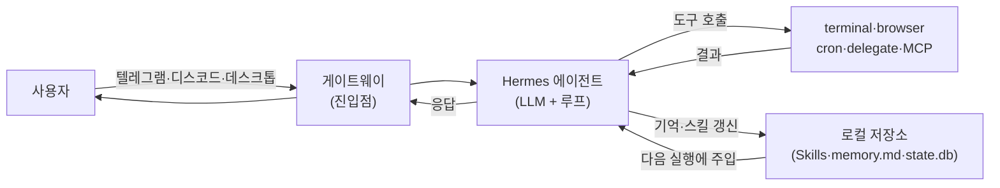
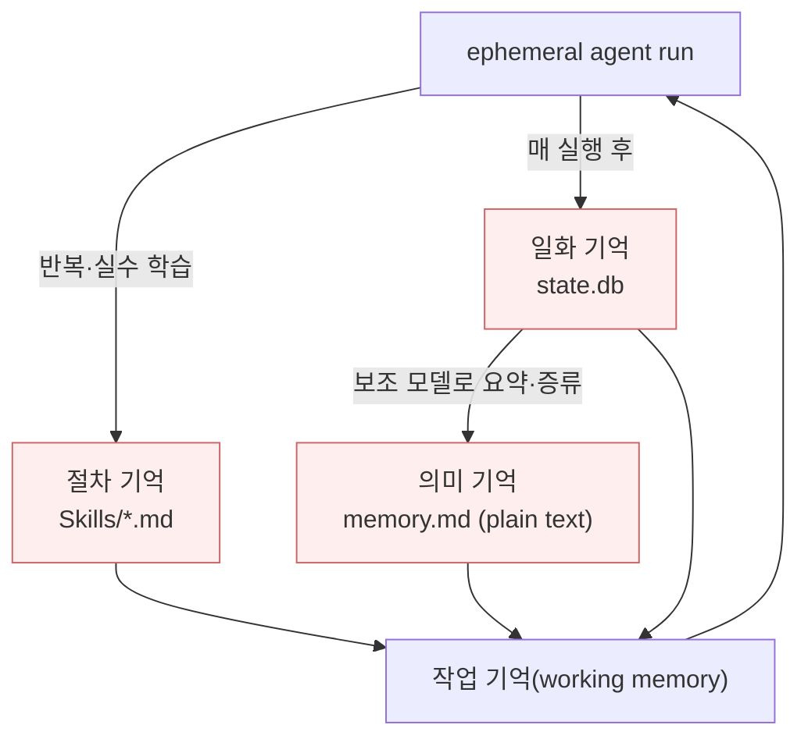

# Hermes 에이전트 하네스 — 자기개선 로컬 에이전트와 나에게의 효율
---
> 이 문서를 읽고 나면 Hermes가 무엇인지(로컬 상주 자기개선 에이전트), 그 하네스·루프·3종 메모리가 어떻게 맞물리는지, Claude Code·Open Claw와 무엇이 다른지, 그리고 **내 실제 작업(AI 학습노트·인프라 실습·비용 최적화·Claude Code 병행)에 어떤 효율을 주고 어디서 한계가 있는지**를 근거를 들어 말할 수 있습니다. `11_AI`의 Harness·Agentization·Context Engineering 개념을 **하나의 오픈소스 구현으로 관통해 보는 케이스 스터디**입니다.

> 이 시스템은 24시간 켜진 서버에서 도는 개인 비서 프로세스라는 점에서 cron 데몬과 같지만, 실행 대상이 고정된 스크립트가 아니라 *스스로 스킬과 기억을 쌓아 가는 LLM 에이전트*라는 점이 다릅니다.

Hermes는 Nous Research가 만든 **오픈소스 자기개선 AI 에이전트**입니다. 강의들이 공통으로 강조하는 한 문장은 "이건 채팅봇이 아니다"입니다. GPT·Claude처럼 질문을 받고 답을 주는 도구가 아니라, 내 로컬 머신(또는 VPS)에 상주하면서 내 생활·업무의 병목을 찾아 자동화하고, 그 과정에서 배운 것을 로컬 파일에 영구히 축적하는 **시스템**이라는 것입니다.

핵심 특징은 세 가지입니다 — ① 로컬/서버 상주(클라우드에 아무것도 저장하지 않음), ② 사용할수록 스스로 스킬·기억을 쌓는 자기개선 루프, ③ 텔레그램·디스코드·WhatsApp·데스크톱을 게이트웨이로 쓰는 상시 접근성. 이 문서는 이 세 축을 `11_AI` 노트의 개념 틀(하네스·에이전트 루프·메모리)로 해부한 뒤, 마지막에 **나에게 실제로 도움이 되는가**를 냉정하게 따집니다.

> ⚠️ 소스 주의: 근거로 삼은 자막은 대부분 유튜버 해설(2차 자료)이며 일부는 호스팅·모델 업체 협찬 강의입니다. 그래서 "GitHub 20만 스타" 같은 수치나 홍보성 단정은 *강의의 주장*으로 완충해 읽어야 합니다.

## 1. Hermes란 무엇인가 — 상주 에이전트와 게이트웨이

> Hermes는 로컬 머신·Docker·VPS 위에서 도는 스케줄러형 에이전트이며, 사용자는 좋아하는 메신저(텔레그램/디스코드/WhatsApp)나 데스크톱 앱을 게이트웨이 삼아 상시로 지시하고 결과를 받습니다.

Hermes의 실행 위치는 "어디서나 작업하게 하려면 24시간 켜진 컴퓨터가 필요하다"는 전제에서 출발합니다. 그래서 로컬 PC, 전용 미니 PC, 또는 VPS 중 하나에 올립니다. 상호작용은 두 경로입니다 — **메신저 게이트웨이**(텔레그램에 봇을 만들어 토큰 연결, 또는 디스코드/​WhatsApp)와 **데스크톱 앱**입니다. 데스크톱은 작업마다 세션이 시각적으로 분리돼 관리가 쉽고, 메신저는 핸드폰에서도 "아침 브리핑 줘" 같은 지시를 바로 내릴 수 있습니다.

즉 사용자 입장에서 표면은 Claude Code와 비슷한 "지시 → 실행 → 응답" 챗 인터페이스지만, 그 뒤에 상주 프로세스 + 자기개선 저장소가 붙어 있다는 것이 본질입니다.

## 2. 하네스와 루프 엔지니어링 — SOUL.md와 도구셋

> Hermes의 하네스는 시스템 프롬프트(SOUL.md)와 도구셋(terminal·browser·delegate task·cron·skill management·MCP)으로 구성되며, 에이전트는 매 요청마다 짧은 "ephemeral run" 안에서 필요한 도구를 스스로 골라 호출하다 end-loop 가드레일로 종료합니다.

`11_AI`의 [02-02 Harness Engineering](../02-02.Harness%20Engineering%20%E2%80%94%20%EB%AA%A8%EB%8D%B8%EC%9D%84%20%EA%B0%90%EC%8B%B8%EB%8A%94%20%EC%98%A4%EC%BC%80%EC%8A%A4%ED%8A%B8%EB%A0%88%EC%9D%B4%EC%85%98%20%EC%B8%B5.md)에서 정의한 그대로, 하네스는 *모델(말)을 감싸 통제하는 마구*입니다. Hermes는 이 개념을 거의 교과서적으로 구현합니다.

**SOUL.md** — 시스템 프롬프트를 담은 파일입니다(`.hermes/SOUL.md`). Claude Code의 `CLAUDE.md`에 정확히 대응합니다. 강의에서 Sean은 SOUL.md를 편집해 에이전트를 "피카츄처럼 말하게" 만들어 보이는데, 요지는 *전체 에이전트 실행에 걸쳐 적용되는 페르소나·규칙 층*이라는 점입니다.

**도구셋(loop engineering의 재료)** — 에이전트가 스스로 호출하는 도구들입니다:

| 도구 | 하는 일 | 대응 개념 |
|------|---------|-----------|
| terminal | 로컬 셸 명령 실행(OS 확인, 스크립트 실행 등) | bash tool |
| browser | 웹 탐색·클릭·스텔스 스크래핑 | 브라우저 자동화 |
| delegate task | 서브에이전트 스폰(병렬), Claude CLI(headless) 호출 포함 | 멀티에이전트 |
| cron | 정해진 시각에 무인 반복 실행 | 스케줄러 |
| skill management | 스킬(절차 기억) 생성·갱신 | 스킬 시스템 |
| MCP | 외부 서비스 연결 | [02-04 MCP](../02-04.MCP%20%EC%84%A4%EA%B3%84%20%E2%80%94%20%EC%99%B8%EB%B6%80%20%EB%8F%84%EA%B5%AC%C2%B7%EB%8D%B0%EC%9D%B4%ED%84%B0%EB%A5%BC%20%ED%91%9C%EC%A4%80%EC%9C%BC%EB%A1%9C%20%EC%97%B0%EA%B2%B0%ED%95%98%EA%B8%B0.md) |

**루프와 종료** — 매 요청은 "ephemeral(일회성) agent run"입니다. 사용자 프롬프트 + 현재 채팅 기록 + 시스템 프롬프트가 작업 기억(working memory)으로 들어가고, LLM이 루프를 돌며 도구를 호출하다가, 더 부를 도구가 없으면 **end-loop 가드레일**이 루프를 끝내고 답을 보냅니다. 강의의 실제 예시 — "cron으로 10분간 매분 농담 보내줘", "터미널로 내 OS 버전 확인", "브라우저로 내 유튜브 채널 조회 후 새 제목 제안", "delegate task로 서브에이전트 2개 스폰" — 는 전부 이 루프의 변주입니다.

## 3. 3종 메모리 시스템 — 자기개선의 실체

> Hermes는 절차 기억(Skills), 의미 기억(memory.md), 일화 기억(state.db) 세 축으로 학습하며, 특히 의미 기억을 임베딩/RAG가 아니라 **plain text 키워드**로 다루고, 일화 기억은 저렴한 보조 모델로 요약·증류해 의미 기억으로 넘깁니다.

이 절이 Hermes를 여느 챗봇과 가르는 핵심이고, [02-07 Context Engineering](../02-07.Context%20Engineering%20%E2%80%94%20%EB%AA%A8%EB%8D%B8%EC%9D%B4%20%EB%B3%B4%EB%8A%94%20%EC%84%B8%EA%B3%84%EB%A5%BC%20%EC%84%A4%EA%B3%84%ED%95%98%EA%B8%B0.md)의 working ↔ long-term memory 구분이 실물로 나타나는 곳입니다.

- **절차 기억(Procedural)** — "어떻게 행동하는가". `.hermes/Skills/*.md`에 저장됩니다. 예: "코딩 작업은 Claude Code CLI에 위임한다(설치·인증·실행 방법 포함)"는 스킬. Claude Code의 스킬과 같은 개념이되, Hermes는 이를 자기 저장소에 쌓아 갑니다.
- **의미 기억(Semantic)** — "지속되는 사실". `.hermes/memory.md`에 저장됩니다. "사용자가 선호하는 테스트 프레임워크는 pytest", "유튜브 스크래핑 시 이런 실수를 조심" 같은 내구성 있는 사실·사용자 프로필입니다. **흥미로운 점: Hermes는 임베딩·RAG 대신 그냥 plain text로 저장하고 키워드로 다룹니다.** 로컬 단순성·투명성을 택한 설계로 보입니다.
- **일화 기억(Episodic)** — "언제 무슨 일이 있었나". 채팅 기록·날짜 이벤트를 `state.db`(로컬 DB)에 담습니다. 매 실행 후 정보가 여기로 흘러가고, 시간이 지나면 **저렴한 보조 모델**이 오래된 대화를 요약·증류해 의미 기억(memory.md)으로 넘깁니다. 클라우드가 아니라 로컬 파일에 봉인된다는 점이 Hermes의 차별점입니다.

주의할 성숙도 문제: 강의 실측에서 Hermes는 **의미 기억(memory.md)은 자율적으로 갱신**했지만 **스킬은 자율 저장하지 못하고 명시 요청이 있어야** 만들었습니다. Sean이 "왜 스킬을 스스로 안 만들었냐"고 묻자 에이전트는 "5회 이상 도구를 부른 어려운 반복 작업 뒤엔 스킬 저장을 먼저 제안했어야 한다"고 답했습니다. 자기개선 루프가 지향점은 맞지만 아직 완전 자율은 아니라는 신호입니다.

## 4. Claude Code / Open Claw와의 차이

> Hermes와 Claude Code는 경쟁이 아니라 역할 분담입니다 — Claude Code·Codex는 코드 저장소 안에서 코딩에 특화되고, Hermes는 서버에 상주하며 리서치·브리핑·자동화 등 그 외 작업을 맡습니다. Open Claw와는 설계 철학(중앙 게이트웨이 라우팅 vs 에이전트 중심 학습 루프)이 다릅니다.

| 축 | Claude Code / Codex | Hermes | Open Claw |
|----|--------------------|--------|-----------|
| 위치 | 코드 저장소 안(로컬) | 서버·VPS 상주 | 서버 상주 |
| 강점 | 소프트웨어 개발·코드 편집 | 리서치·자동화·상시 브리핑 | 다채널 라우팅·에이전트 관리 |
| 학습 루프 | 스킬 수동 작성 | 문제 해결 시 스킬로 자동 축적(지향) | 스킬 수동 관리 |
| 설계 중심 | 세션·저장소 | 에이전트 자체(성장 사이클) | 중앙 게이트웨이(컨트롤 센터) |
| 결론 | 개발은 여기 | 그 외 상시 업무는 여기 | Hermes와 유사, 라우팅 지향 |

강의의 요지는 명확합니다 — **"둘 다 쓰는 게 최선"**. 소프트웨어 개발은 Claude Code/Codex, 리서치·모니터링·모닝 브리핑·생활 자동화는 Hermes. 그리고 Hermes는 `delegate task`로 **Claude CLI를 headless로 호출**할 수 있어, 코딩이 필요하면 Hermes가 Claude Code에 위임하는 협업 구도가 자연스럽습니다.

한 강의는 카파시(Karpathy)의 "맥락이 새로운 코드다(context is the new code)"와 "내가 루프 안의 병목이 되면 안 된다 — 루프 밖으로 나와야 한다"를 인용하며, Hermes가 바로 그 자율 루프를 지향한다고 정리합니다. 이는 [02-05 AI Agentization](../02-05.AI%20Agentization%20%E2%80%94%20%EC%9B%8C%ED%81%AC%ED%94%8C%EB%A1%9C%EC%9A%B0%EC%99%80%20%EC%97%90%EC%9D%B4%EC%A0%84%ED%8A%B8%20%EC%82%AC%EC%9D%B4.md)의 "워크플로우 vs 에이전트" 논의와 직결됩니다.

## 5. 어디서 돌리나 + 세팅 요약

> 실행 위치는 로컬 PC·전용 미니 PC·VPS 중 선택이며, 보안·상시성·비용을 저울질하면 VPS가 무난합니다. Hostinger 등은 원클릭 설치를 지원해 터미널 명령 없이 세팅이 끝납니다.

- **로컬 PC**: 무료지만 24시간 켜 두기 부담 + 메인 PC는 보안 리스크(강의도 비권장).
- **전용 미니 PC(맥미니 등)**: 안정적이나 초기 비용이 큼.
- **VPS**: 월 9~20달러 수준으로 24시간 상주, 메인 PC와 격리돼 리스크가 낮음. 강의들의 공통 추천.

세팅 흐름(개념만): VPS 생성 → (원클릭 또는 공식 문서 명령으로) Hermes 설치 → **퀵 셋업에서 모델 선택**(가장 중요) → 메신저 게이트웨이 연결(텔레그램 봇 토큰 / 디스코드 봇+스코프) → `게이트웨이 재시작`으로 연결 활성화. 개발 환경까지 쓰려면 GitHub CLI·Vercel 연동으로 에이전트에 코드 저장소와 배포 서버 접근 권한을 부여합니다. 모델 교체는 `/model`(또는 터미널 `hermes model`)로 언제든 바꿉니다.

> 강조점: 강의들이 반복해 말하는 실패 원인 1위는 "성능 낮은 모델 선택"입니다. Opus·Codex·GPT-5.5 같은 프론티어 모델을 핵심에 두고, 반복·코딩 루틴만 가성비 모델로 내리는 구성을 권합니다.

## 6. [핵심] 나(심보현)에게 어떤 효율을 주는가

> 네 가지 실제 맥락 — AI 학습노트 제작, 인프라/DevOps 실습, 비용/토큰 최적화, Claude Code 병행 — 각각에서 이득과 한계를 함께 봅니다. 결론부터: **"내 데이터를 넣고 상시로 굴리는 세컨드 브레인·모니터링" 용도엔 강하지만, 안전 가드레일이 중요한 실습과 검증 파이프라인엔 아직 보완이 필요**합니다.

### 6-1. AI 학습노트 제작 — 가장 잘 맞는 용도
`11_AI`의 노트·`roadmap.md`, 그리고 그동안 Claude와 나눈 대화를 통째로 임포트하면 Hermes가 **세컨드 브레인**이 됩니다. Hermes에는 카파시의 **LM Wiki가 빌트인**이라, 소스를 지정하면 상호 링크된 마크다운 위키로 알아서 정리합니다(옵시디언 연결 시 지식 그래프가 자동 갱신되는 걸 시각적으로 확인 가능). 학습 루프 덕에 "매일 아침 특정 분야 핵심 3개를 세 줄 요약" 같은 모닝 브리핑의 품질이 2주·한 달이 지나며 복리로 좋아집니다. → **이 문서 체계를 유지·확장하는 작업과 정확히 정렬**됩니다.

### 6-2. 인프라/DevOps 실습(infra_ai = GitAIOps) — 조건부 이득
cron 기반 헬스체크·모니터링, Sentry/로그 오류 실시간 감지 후 수정 제안, GitHub 이슈 자동 처리 등 **상시 오케스트레이션**은 GitAIOps 실습과 잘 맞습니다. 자는 동안 어떤 에러가 났고 어떻게 고쳤는지 아침에 보고받는 식입니다.
- **⚠️ 리스크**: `infra_ai/CLAUDE.md`의 kubectl 안전 규칙(모든 명령에 `--context gke-...` 고정) 같은 **프로젝트 가드레일이 Hermes에는 내장돼 있지 않습니다.** VPS 상주 에이전트가 잘못된 클러스터에 명령을 날릴 위험이 있으므로, 실습 클러스터를 맡기려면 SOUL.md/스킬에 안전 규칙을 직접 이식해야 합니다. 무인 cron + write 권한 조합은 특히 신중히.

### 6-3. 비용/토큰 최적화 — 철학이 정합
Hermes는 작업별로 모델을 라우팅합니다 — 깊은 사고는 상위 모델(GPT/Claude), 코딩·대량 반복은 **Kimi 같은 가성비 모델**. 한 강의 실측: 프로토타입 1건에 12.6만 토큰/약 0.2달러, 같은 작업을 Opus로 돌리면 ~6배. Kimi는 Opus의 약 1/5~1/7 가격대라 대량 반복일수록 격차가 벌어집니다. 모든 기억을 **로컬 저장**하는 점도 `TOKEN_HYGIENE.md`의 로컬·저비용 지향과 결이 같습니다. → 내 비용 감수성과 정합하지만, **모델 라우팅을 직접 설계·관리**해야 이득이 실현됩니다.

### 6-4. Claude Code / OMC 병행 — 역할 분담이 자연스러움
코딩·리팩터·리뷰는 지금처럼 Claude Code + OMC(executor 등)에 두고, **그 외 상시 업무**(리서치 스윕, X/Reddit/Hacker News/Product Hunt 모니터링을 메일 리포트로, 이메일 자동 초안, 유튜브 스튜디오 분석)를 Hermes에 위임하면 라인이 깔끔합니다. Hermes가 `delegate task`로 Claude CLI(headless)를 호출하므로, "Hermes가 오케스트레이터, Claude Code가 코딩 실행기" 구도도 가능합니다.

### 6-5. 한계·주의(냉정한 판단)
- **LLM Ops/eval 부재**: trajectory export·로그(trace)는 있으나 LangSmith/LangFuse 같은 **평가 시스템이 없습니다**([02-09 Evaluation](../02-09.Evaluation%20%C2%B7%20Test%20Harness%20%E2%80%94%20%EB%B9%84%EA%B2%B0%EC%A0%95%EC%A0%81%20%EC%8B%9C%EC%8A%A4%ED%85%9C%EC%9D%84%20%EC%B1%84%EC%A0%90%ED%95%98%EA%B8%B0.md) 관점에서 공백). 품질을 수치로 채점하려면 직접 붙여야 합니다.
- **자율 스킬 저장 미성숙**(§3): 아직 명시 요청이 필요.
- **상주 보안**: VPS에 코드 저장소·배포·메신저 권한이 몰리므로 최소 권한·승인 게이트 설계가 필수([02-10 Guardrail](../02-10.Guardrail%20%C2%B7%20Safety%20%26%20Observability%20%E2%80%94%20%EA%B6%8C%ED%95%9C%C2%B7%EB%B0%A9%EC%96%B4%C2%B7%EA%B4%80%EC%B8%A1.md)).
- **소스 편향**: 근거 자막이 홍보성 강의라 "한 달 쓰면 다른 동반자"류 서술은 기대치 관리 필요.
- **투자 대비**: 진짜 가치는 세팅이 아니라 "내 데이터를 얼마나 넣고 무엇을 자동화하느냐"에서 나옵니다. 한 달 이상 실제 반복 작업 하나를 맡겨 보고 판단하라는 게 강의들의 공통 결론.

**한 줄 판단**: 학습노트 세컨드 브레인 + 상시 모니터링/브리핑 용도로는 지금 도입 가치가 있고, 실습 클러스터 조작·품질 검증이 걸린 파이프라인은 가드레일·eval을 직접 보강한 뒤에 맡기는 게 안전합니다.

## 면접에서 받을 만한 질문

1. Hermes의 "하네스"와 "에이전트"를 각각 무엇이 담당하는지, SOUL.md는 어디에 해당하는지 설명해 보세요.
2. Hermes의 3종 메모리(절차·의미·일화)를 저장 위치와 함께 구분하고, 각 데이터가 어디로 흐르는지 말해 보세요.
3. Hermes가 의미 기억을 임베딩/RAG가 아니라 plain text로 다루는 선택의 득실은?
4. Hermes와 Open Claw의 설계 철학 차이는? 그리고 Claude Code와는 왜 경쟁이 아니라고 하나요?
5. 내 GitAIOps 실습 클러스터를 Hermes에 맡기기 전에 반드시 보강해야 할 것 두 가지는?

> 5개 질문에 *먼저 스스로 답해 보세요.* 자답이 끝나면 아래 §정답으로 내려갑니다.

## 정답 (자답 후 펼치기)

> 위 §면접에서 받을 만한 질문의 5개에 *먼저 자답한 뒤* 아래를 읽으세요.

### 정답 1 — 하네스 vs 에이전트, SOUL.md
에이전트는 LLM 본체로 *무엇을 할지*(어떤 도구를 부를지) 결정합니다. 하네스는 그 둘레의 통제 층으로 도구셋(terminal·browser·delegate·cron·skill·MCP) 실행, 루프 관리, end-loop 종료를 담당합니다. SOUL.md는 하네스가 매 실행에 주입하는 **시스템 프롬프트/페르소나 층**으로, Claude Code의 CLAUDE.md에 대응합니다.

### 정답 2 — 3종 메모리와 데이터 흐름
절차 기억 = `.hermes/Skills/*.md`(행동 방식), 의미 기억 = `.hermes/memory.md`(지속 사실·프로필), 일화 기억 = `state.db`(채팅·이벤트). 매 실행 후 정보는 일화 기억으로 흐르고, 보조 모델이 이를 요약·증류해 의미 기억으로 승격합니다. 세 기억 모두 다음 실행의 작업 기억으로 주입됩니다.

### 정답 3 — plain text 선택의 득실
득: 로컬에서 단순·투명하고 사람이 직접 읽고 편집하기 쉬우며 임베딩 인프라가 불필요합니다. 실: 의미 기반 검색이 약해 기억이 커지면 관련 사실을 정확히 불러오는 정밀도가 떨어질 수 있습니다(키워드 매칭 한계). 규모가 커지면 RAG 계층 보강이 필요합니다.

### 정답 4 — 설계 철학 차이 / Claude Code와 비경쟁
Open Claw는 **중앙 게이트웨이**를 축으로 여러 채널·에이전트를 라우팅하는 컨트롤 센터형입니다. Hermes는 **에이전트 자체**를 축으로 작업→학습→성장 사이클을 도는 형입니다. Claude Code/Codex는 코드 저장소 안 코딩 전용이고 Hermes는 서버 상주 범용 업무형이라, 영역이 달라 경쟁이 아니라 분담(Hermes가 코딩은 Claude CLI에 위임)입니다.

### 정답 5 — 실습 클러스터 위임 전 보강 2가지
① **안전 가드레일 이식**: kubectl `--context` 고정, 파괴적 명령 승인 게이트 등 프로젝트 규칙을 SOUL.md/스킬에 명시(Hermes 기본엔 없음). ② **관측·평가 보강**: eval/LLM Ops가 없으므로 배포·조작 결과를 검증할 체크와 최소 권한·감사 로그를 붙여야 합니다.

## 관련 문서

> 이 문서가 Hermes라는 *하나의 오픈소스 구현*을 해부한다면, 아래 개념 노트들은 그 구현이 딛고 선 원리를 다룹니다.

- [02-02. Harness Engineering](../02-02.Harness%20Engineering%20%E2%80%94%20%EB%AA%A8%EB%8D%B8%EC%9D%84%20%EA%B0%90%EC%8B%B8%EB%8A%94%20%EC%98%A4%EC%BC%80%EC%8A%A4%ED%8A%B8%EB%A0%88%EC%9D%B4%EC%85%98%20%EC%B8%B5.md) § "에이전트 루프" — Hermes의 ephemeral run·end-loop 가드레일의 원리
- [02-05. AI Agentization](../02-05.AI%20Agentization%20%E2%80%94%20%EC%9B%8C%ED%81%AC%ED%94%8C%EB%A1%9C%EC%9A%B0%EC%99%80%20%EC%97%90%EC%9D%B4%EC%A0%84%ED%8A%B8%20%EC%82%AC%EC%9D%B4.md) § "상태·메모리" — 워크플로우 vs 에이전트, "루프 밖으로" 논의와 직결
- [02-07. Context Engineering](../02-07.Context%20Engineering%20%E2%80%94%20%EB%AA%A8%EB%8D%B8%EC%9D%B4%20%EB%B3%B4%EB%8A%94%20%EC%84%B8%EA%B3%84%EB%A5%BC%20%EC%84%A4%EA%B3%84%ED%95%98%EA%B8%B0.md) § "working ↔ long-term memory" — Hermes 3종 메모리의 개념적 뿌리
- [02-09. Evaluation · Test Harness](../02-09.Evaluation%20%C2%B7%20Test%20Harness%20%E2%80%94%20%EB%B9%84%EA%B2%B0%EC%A0%95%EC%A0%81%20%EC%8B%9C%EC%8A%A4%ED%85%9C%EC%9D%84%20%EC%B1%84%EC%A0%90%ED%95%98%EA%B8%B0.md) — Hermes에 빠진 eval 계층을 무엇으로 메울지
