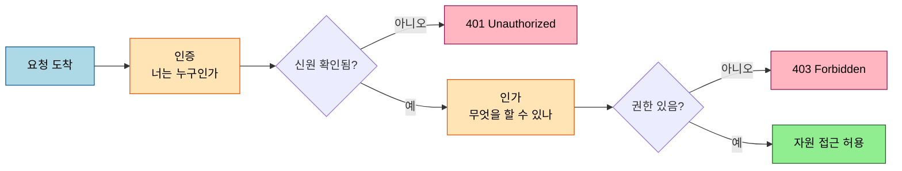
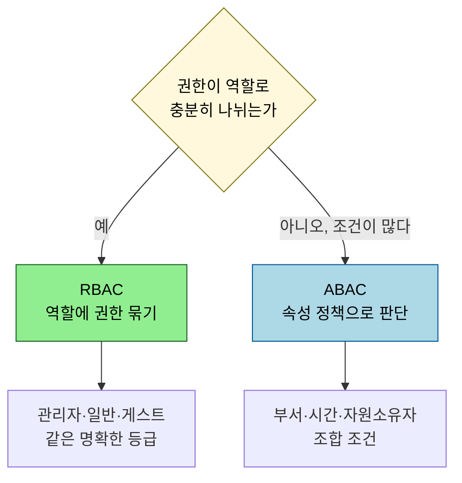

# 인증과 인가 — Authentication vs Authorization

---

> 보안 설계의 첫 갈림길은 "너는 누구인가"(인증)와 "너는 무엇을 할 수 있나"(인가)를 분리하는 것입니다. 둘을 한 덩어리로 보면 권한 버그가 인증 코드에 섞여 추적이 어려워집니다. 본 문서는 프레임워크와 무관한 이론으로 두 개념을 가르고, RBAC·ABAC 두 모델과 HTTP 401/403 의 차이까지 정리합니다.

## 0. 학습 목표

이 문서를 읽고 나면 인증과 인가를 한 문장씩으로 구분하고, RBAC 와 ABAC 가 각각 언제 맞는지 결정 트리로 답하며, HTTP 401 과 403 이 왜 다른 코드인지 설명할 수 있습니다. 구현(Spring Security Filter Chain)은 [`../02_spring-security/01-01`](../02_spring-security/01-01.Spring%20Security%20개념과%20Filter%20Chain.md) 으로 위임하고, 여기서는 이론만 봅니다.

## 1. 한 줄 정의 — 순서가 중요하다

인증(Authentication)은 *주체가 누구인지* 를 확인하는 일이고, 인가(Authorization)는 *그 주체가 특정 자원에 무엇을 할 수 있는지* 를 결정하는 일입니다. 둘은 항상 이 순서로 일어납니다. 누구인지 모르면 무엇을 허용할지 정할 수 없기 때문입니다.

이 순서를 코드로 분리하면 권한 결정 로직을 인증 방식과 독립적으로 바꿀 수 있습니다. 로그인 수단을 비밀번호에서 OAuth2 로 바꿔도 "관리자만 삭제 가능" 같은 인가 규칙은 그대로 둘 수 있습니다.

## 2. 401 vs 403 — 자주 헷갈리는 자리

HTTP 상태 코드가 두 개념을 그대로 반영합니다. `401 Unauthorized` 는 이름과 달리 *인증* 실패입니다 — 신원을 증명하지 못했으니 자격 증명을 제시하라는 뜻이고, RFC 7235 가 `WWW-Authenticate` 헤더로 인증 방식을 알리도록 규정합니다. `403 Forbidden` 은 *인가* 실패입니다 — 신원은 확인됐지만 그 자원에 대한 권한이 없다는 뜻입니다.

| 상황 | 코드 | 의미 |
|------|------|------|
| 토큰 없음·만료·위조 | 401 | 신원 증명 실패 (인증) |
| 로그인했지만 권한 부족 | 403 | 권한 없음 (인가) |

401 을 받으면 클라이언트는 "다시 로그인하라" 로 안내하고, 403 은 "권한이 없다" 로 안내해야 사용자 경험이 정확해집니다.

## 3. 인가 모델 — RBAC vs ABAC

인가 규칙을 어떻게 표현할지가 RBAC 와 ABAC 의 갈림입니다. RBAC(Role-Based Access Control)는 사용자에게 *역할* 을 부여하고 역할에 권한을 묶습니다. ABAC(Attribute-Based Access Control)는 사용자·자원·환경의 *속성* 을 조합한 정책으로 그때그때 판단합니다.

RBAC 는 NIST 가 표준화한 모델로, 역할 수가 관리 가능한 수준일 때 단순하고 감사가 쉽습니다. 그러나 "본인이 작성한 글만 수정 가능", "근무 시간에만 접근 가능" 처럼 *조건* 이 들어가면 역할이 폭발합니다. 이때 ABAC 가 맞습니다 — 속성(소유자 id, 현재 시각, 부서)을 정책 함수로 평가하기 때문입니다. 실무에서는 RBAC 로 큰 등급을 나누고, 세밀한 조건만 ABAC 식 정책으로 보완하는 혼합이 흔합니다.

## 4. 분리가 설계에 주는 이득

인증과 인가를 분리하면 변경의 파급이 줄어듭니다. 인증은 *입구* 에서 한 번 일어나 주체(principal)를 확립하고, 인가는 *각 자원 접근 지점* 에서 그 주체의 권한을 확인합니다. 이 둘이 코드에서 섞이면 — 예를 들어 로그인 핸들러 안에 "그리고 이 사용자가 관리자면…" 같은 분기가 들어가면 — 권한 규칙이 흩어져 한 곳에서 감사할 수 없게 됩니다. 그래서 Spring Security 같은 프레임워크도 인증 필터와 인가 결정(`AccessDecisionManager` 계열)을 별도 단계로 둡니다. 구현은 [`../02_spring-security/01-01`](../02_spring-security/01-01.Spring%20Security%20개념과%20Filter%20Chain.md) 에서 확인합니다.

## 5. 자주 어긋나는 자리 — 인가 누락과 IDOR

실무에서 가장 흔한 보안 사고는 인증은 멀쩡한데 *인가를 빠뜨린* 경우입니다. 로그인은 확인했지만 "이 사용자가 이 자원의 주인인가" 를 검사하지 않으면, 다른 사용자의 데이터에 접근하는 IDOR(Insecure Direct Object Reference)가 생깁니다. 예를 들어 `GET /orders/{id}` 에서 토큰만 검증하고 그 주문이 *요청자의 것인지* 확인하지 않으면, 로그인한 누구나 id 만 바꿔 남의 주문을 조회합니다. OWASP 가 Broken Access Control 을 상위 위험으로 꼽는 이유가 이것입니다.

이 사고의 뿌리는 "인증을 통과했으니 됐다" 는 착각입니다. 인증은 *누구인지* 만 확립할 뿐, *그 자원에 대한 권한* 은 인가가 따로 봐야 합니다. 그래서 자원 접근 지점마다 소유자·권한 검사를 명시적으로 두는 것이 IDOR 방어의 핵심이고, 이는 §4 의 "인가는 각 자원 접근 지점에서" 원칙과 정확히 같은 말입니다. 공격 관점의 카탈로그는 [`../03_vulnerabilities/README.md`](../03_vulnerabilities/README.md) 에서 다룹니다.

## 6. 면접 대비 체크리스트

> 이 문서를 다 읽은 뒤 다음 질문에 답할 수 있어야 합니다.

1. 인증과 인가는 왜 항상 이 순서로 일어납니까? 둘을 코드에서 분리하면 무엇이 쉬워집니까?
2. HTTP 401 과 403 은 각각 인증·인가 중 무엇의 실패입니까? 401 에 `WWW-Authenticate` 헤더가 붙는 이유는?
3. RBAC 로 표현하기 어려워 ABAC 가 필요해지는 대표적인 규칙은 무엇입니까?
4. 인증은 통과했는데 인가를 빠뜨리면 어떤 사고(IDOR)가 생깁니까? 자원 접근 지점에서 무엇을 추가로 검사해야 합니까?
