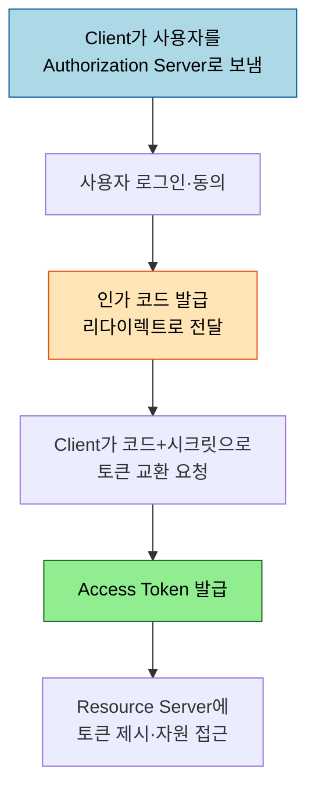
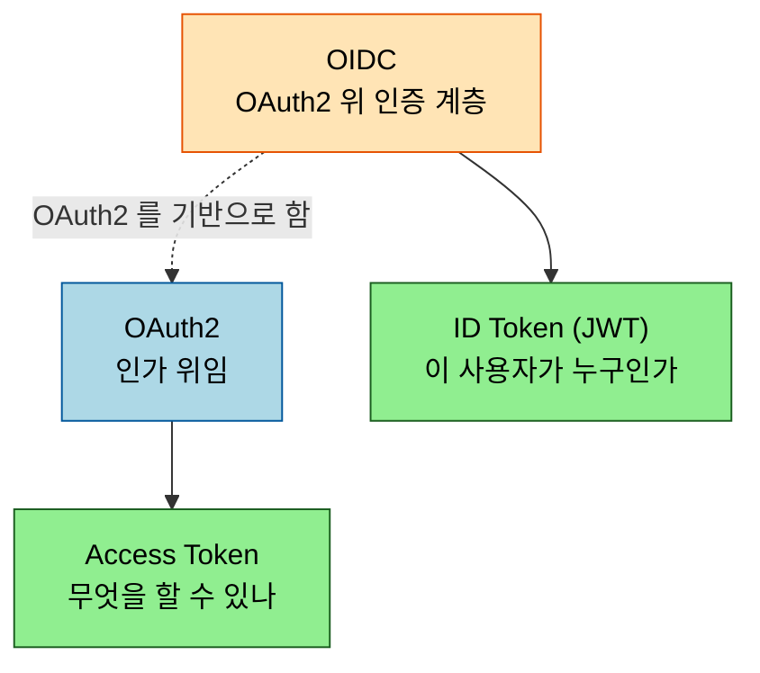

# OAuth2와 OIDC — 위임 인가와 그 위의 인증

---

> OAuth2 는 본질적으로 *인가 위임* 프로토콜입니다. "내 비밀번호를 주지 않고도 이 앱이 내 자원에 접근하게 허락한다" 가 핵심입니다. 그런데 많은 서비스가 이걸 *로그인* 에 쓰면서 혼란이 생겼고, 그 빈 자리를 메우려고 OIDC 가 OAuth2 위에 인증 계층을 얹었습니다. 본 문서는 프로토콜 이론으로 둘을 가릅니다. Spring 구현은 [`../02_spring-security/02-01`](../02_spring-security/02-01.OAuth2%20개념과%20흐름.md) 으로 위임합니다.

## 0. 학습 목표

이 문서를 읽고 나면 OAuth2 의 네 역할과 Authorization Code Flow 를 설명하고, PKCE 가 무엇을 막는지, OIDC 의 ID Token 이 OAuth2 의 Access Token 과 무엇이 다른지 답할 수 있습니다.

## 1. OAuth2 는 인가 위임이지 인증이 아니다

OAuth2(RFC 6749)가 푸는 문제는 "비밀번호를 건네지 않고 제3자 앱에 제한된 권한을 주는 것" 입니다. 사진 인쇄 앱이 내 구글 포토에 접근하려 할 때, 내 구글 비밀번호를 그 앱에 주는 대신 구글이 발급한 *Access Token* 만 줍니다. 그래서 OAuth2 자체는 "이 토큰을 가진 자가 이 자원에 접근해도 된다" 는 인가만 다루고, "이 사람이 누구인가" 라는 인증은 원래 범위가 아닙니다. 이 구분을 놓치면 OAuth2 로 로그인을 구현하다 보안 구멍이 생깁니다 — 그 빈 자리가 §4 의 OIDC 입니다.

## 2. 네 역할

OAuth2 는 책임을 네 주체로 나눕니다. 이 분리 덕에 자원 서버는 인증을 직접 하지 않고 토큰만 검증하면 됩니다.

| 역할 | 설명 |
|------|------|
| Resource Owner | 자원의 주인 (보통 사용자) |
| Client | 자원에 접근하려는 앱 |
| Authorization Server | 인가하고 토큰을 발급하는 서버 |
| Resource Server | 토큰을 검증하고 자원을 내주는 서버 |

## 3. Authorization Code Flow 와 PKCE

가장 표준적인 흐름은 Authorization Code Grant 입니다. 토큰을 브라우저에 직접 노출하지 않고, *인가 코드* 를 한 번 거쳐 서버 뒤에서 토큰으로 교환하기 때문입니다.

문제는 모바일 앱·SPA 같은 *공개 클라이언트* 입니다. 이들은 클라이언트 시크릿을 안전하게 보관할 수 없어, 탈취된 인가 코드가 토큰으로 교환될 위험이 있습니다. PKCE(RFC 7636)가 이를 막습니다. 클라이언트가 매 요청마다 무작위 `code_verifier` 를 만들고 그 해시인 `code_challenge` 를 인가 요청에 실어 보냅니다. 나중에 토큰 교환 때 원본 `code_verifier` 를 제시해야 하므로, 코드만 가로챈 공격자는 토큰을 받지 못합니다. 오늘날 PKCE 는 공개 클라이언트뿐 아니라 모든 Authorization Code Flow 에 권장됩니다.

## 4. OIDC — OAuth2 위에 얹은 인증 계층

OIDC(OpenID Connect)는 OAuth2 의 인가 위에 *인증* 을 표준화해 얹은 계층입니다. 핵심 추가물은 **ID Token** 입니다. Access Token 이 "이 토큰으로 자원에 접근하라" 는 인가 증표라면, ID Token 은 "이 사용자는 이러이러한 사람이다" 라는 인증 결과를 담은 JWT 입니다. ID Token 에는 발급자(iss), 대상(aud), 사용자 식별자(sub), 발급·만료 시각이 표준 클레임으로 들어갑니다.

그래서 "구글로 로그인" 같은 소셜 로그인은 정확히는 OAuth2 가 아니라 OIDC 입니다. Access Token 만으로 로그인을 구현하면 "이 토큰이 정말 이 사용자를 위한 것인가" 를 보장할 수 없어, ID Token 의 `aud`·`iss` 검증이 그 구멍을 막습니다. ID Token 이 JWT 라는 점은 [`03_jwt-design`](03_jwt-design.md) 과 직접 이어집니다.

## 5. 토큰 수명 전략 — Access 짧게, Refresh 회전

OAuth2 는 보통 두 토큰을 함께 발급합니다. Access Token 은 자원 접근에 매번 쓰여 노출이 잦으므로 수명을 짧게(분 단위) 두고, Refresh Token 은 Access Token 을 갱신하는 데만 쓰여 수명을 길게(일 단위) 가져갑니다. 이렇게 나누면 Access Token 이 탈취돼도 곧 만료되어 피해 창이 좁아집니다.

Refresh Token 자체가 탈취되면 더 위험하므로, 갱신할 때마다 Refresh Token 을 새로 발급하고 옛것을 폐기하는 *rotation* 을 적용합니다. 이때 이미 폐기된 Refresh Token 이 다시 쓰이면 탈취 신호로 보고 해당 세션 전체를 무효화하는 방어가 표준적입니다. 토큰 수명을 무한정 늘려 "한 번 로그인하면 영원히" 로 만들면 편하지만, 그만큼 탈취 시 노출이 커진다는 트레이드오프를 의식해야 합니다. 갱신 흐름의 Spring 구현은 [`../02_spring-security/03-01`](../02_spring-security/03-01.JWT%20인증%20구현.md) 의 Refresh Token 절에서 다룹니다.

## 6. 면접 대비 체크리스트

> 이 문서를 다 읽은 뒤 다음 질문에 답할 수 있어야 합니다.

1. OAuth2 는 인증 프로토콜입니까, 인가 프로토콜입니까? 로그인에 OAuth2 만 쓰면 무엇이 부족합니까?
2. PKCE 는 어떤 공격을 막습니까? `code_verifier` 와 `code_challenge` 의 관계를 설명할 수 있습니까?
3. Access Token 과 ID Token 은 각각 무엇을 증명합니까? OIDC 가 OAuth2 위에 더한 것은 무엇입니까?
4. Access Token 을 짧게, Refresh Token 을 길게 두는 이유는 무엇입니까? Refresh Token rotation 은 어떤 위험을 줄입니까?
