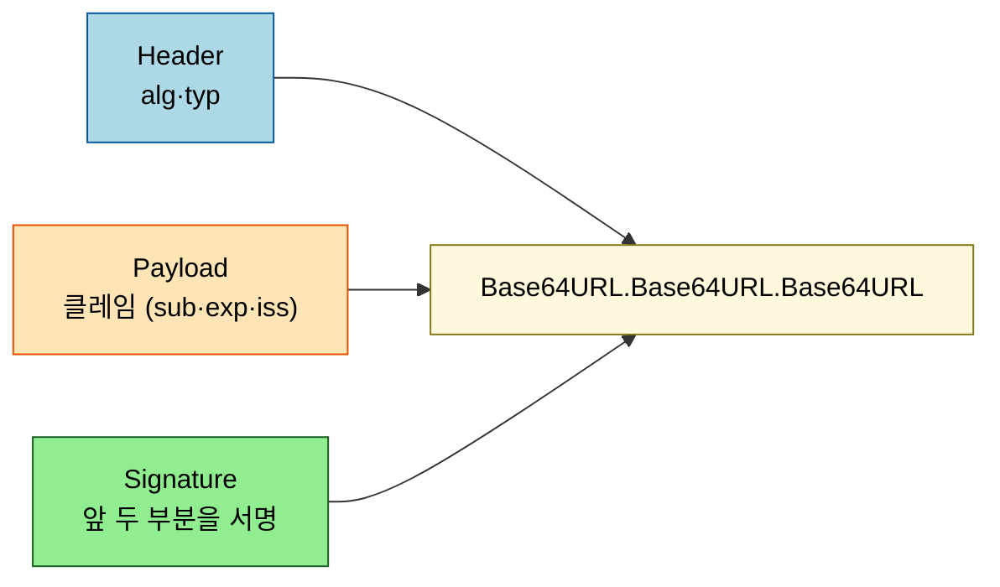
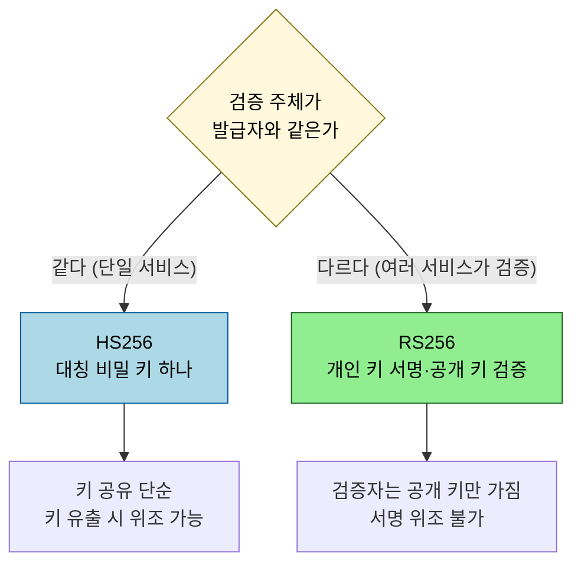

# JWT 설계 — 구조·서명·저장과 폐기의 딜레마

---

> JWT 는 "서버에 저장하지 않고도 신뢰할 수 있는 정보를 토큰 자체에 담는다" 는 발상입니다. 서명으로 위조를 막기 때문에 자가 검증이 가능하지만, 그 무상태성 때문에 *발급한 토큰을 도중에 취소하기 어렵다* 는 근본 딜레마가 따라옵니다. 본 문서는 구조·서명·저장 위치·폐기를 이론으로 다룹니다. Spring 구현은 [`../02_spring-security/03-01`](../02_spring-security/03-01.JWT%20인증%20구현.md) 으로 위임합니다.

## 0. 학습 목표

이 문서를 읽고 나면 JWT 세 부분의 역할을 설명하고, HS256 과 RS256 을 언제 고르는지, 토큰을 쿠키와 localStorage 중 어디에 두는 게 어떤 위험을 지는지, 그리고 무상태 토큰의 폐기가 왜 어려운지 답할 수 있습니다.

## 1. 구조 — header.payload.signature

JWT(RFC 7519)는 점(`.`)으로 구분된 세 부분이 Base64URL 로 인코딩된 문자열입니다. 앞 두 부분은 *암호화가 아니라 인코딩* 일 뿐이라, 누구나 디코딩해 내용을 볼 수 있습니다. 비밀을 담는 그릇이 아니라는 점이 첫 번째 오해 지점입니다.

Header 는 서명 알고리즘(`alg`)을, Payload 는 클레임(주체 `sub`, 만료 `exp`, 발급자 `iss` 등)을 담습니다. Signature 는 앞 두 부분을 비밀로 서명한 값이라, 내용이 한 글자라도 바뀌면 서명 검증이 깨집니다. 그래서 JWT 의 신뢰는 *기밀성이 아니라 무결성* 에서 옵니다.

## 2. 서명 — HS256 vs RS256

서명 방식은 JWS(RFC 7515)가 규정하며, 크게 대칭(HS256)과 비대칭(RS256)으로 갈립니다. HS256 은 하나의 비밀 키로 서명하고 같은 키로 검증합니다. RS256 은 개인 키로 서명하고 공개 키로 검증합니다.

단일 서비스가 발급과 검증을 모두 하면 HS256 이 단순합니다. 그러나 여러 서비스(또는 외부 검증자)가 토큰을 검증해야 하면 RS256 이 맞습니다 — 검증자에게는 공개 키만 주면 되고, 그 키로는 위조가 불가능하기 때문입니다. OIDC ID Token([`02_oauth2-oidc`](02_oauth2-oidc.md))이 RS256 을 즐겨 쓰는 이유가 이것입니다.

## 3. 저장 위치 — 쿠키 vs localStorage

발급받은 토큰을 브라우저 어디에 둘지는 *서로 다른 공격* 사이의 트레이드오프입니다. localStorage 는 자바스크립트로 읽을 수 있어 XSS 공격에 토큰이 탈취될 수 있습니다. httpOnly 쿠키는 자바스크립트 접근을 막아 XSS 에 강하지만, 자동 전송되는 성질 때문에 CSRF 에 노출됩니다.

| 저장 위치 | 강한 점 | 약한 점 |
|----------|--------|--------|
| localStorage | CSRF 영향 적음 | XSS 로 토큰 탈취 가능 |
| httpOnly 쿠키 | XSS 로 못 읽음 | CSRF 대비(SameSite·토큰) 필요 |

정답이 하나로 정해지지 않으므로, httpOnly + `SameSite` 쿠키에 CSRF 토큰을 더하는 조합이 자주 권장됩니다. 어느 쪽이든 XSS 자체를 막는 것(입력 새니타이즈·CSP)이 선행 방어입니다.

## 4. 무상태의 대가 — 폐기가 어렵다

JWT 의 장점인 무상태성이 그대로 약점이 됩니다. 서버가 토큰을 저장하지 않으므로, 한 번 발급한 토큰은 만료(`exp`) 전까지 *유효한 채로 살아 있습니다*. 비밀번호를 바꾸거나 로그아웃해도 이미 나간 토큰은 그대로 통과합니다. 그래서 실무는 두 가지로 절충합니다. 첫째, Access Token 의 수명을 짧게(분 단위) 두고 Refresh Token 으로 갱신해 탈취 시 노출 창을 줄입니다. 둘째, 즉시 폐기가 필요한 경우를 위해 블랙리스트(폐기 목록)를 서버에 두지만, 이는 "무상태" 를 일부 포기하는 것입니다. 이 트레이드오프 전체가 [`04_session-vs-token`](04_session-vs-token.md) 의 핵심 주제로 이어집니다.

## 5. 검증의 함정 — alg none과 알고리즘 혼동

JWT 의 신뢰는 서명 검증에 달렸는데, 그 검증을 우회하는 두 고전 공격이 있습니다. 첫째는 `alg: none` 공격입니다. Header 의 `alg` 를 `none` 으로 바꾸고 서명을 비워 보내면, 서명 검증을 건너뛰도록 구현된 라이브러리가 토큰을 통과시킵니다. 그래서 검증 측은 *허용할 알고리즘을 명시적으로 고정* 하고 `none` 을 거부해야 합니다.

둘째는 알고리즘 혼동(key confusion) 공격입니다. 서버가 RS256(공개 키 검증)을 기대하는데, 공격자가 `alg` 를 HS256 으로 바꿔 *공개 키를 HMAC 비밀 키로 악용* 하는 토큰을 만듭니다. 공개 키는 누구나 알 수 있으므로, 검증 코드가 알고리즘을 토큰의 `alg` 값에 따라 무비판적으로 고르면 위조가 통과합니다. 방어는 동일합니다 — 검증 시 알고리즘을 토큰이 아니라 *서버 설정으로* 고정합니다. 두 공격 모두 "토큰이 말하는 대로 검증하지 말고, 서버가 정한 규칙으로 검증하라" 는 원칙으로 귀결됩니다.

## 6. 면접 대비 체크리스트

> 이 문서를 다 읽은 뒤 다음 질문에 답할 수 있어야 합니다.

1. JWT 의 Payload 에 비밀번호 같은 민감 정보를 담으면 안 되는 이유는 무엇입니까?
2. HS256 과 RS256 은 각각 언제 고릅니까? 여러 서비스가 토큰을 검증해야 할 때 무엇이 맞습니까?
3. JWT 가 로그아웃·비밀번호 변경 즉시 무효화되지 않는 이유는 무엇이고, 실무는 어떻게 절충합니까?
4. `alg: none` 공격과 알고리즘 혼동 공격은 각각 무엇을 노립니까? 둘 다 막는 공통 원칙은 무엇입니까?
