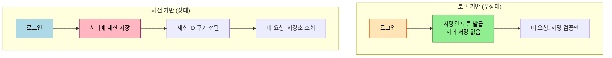
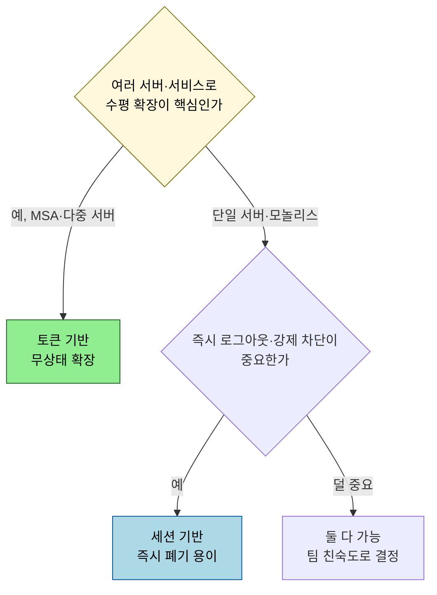

# 세션 vs 토큰 — 상태 기반과 무상태 인증의 트레이드오프

---

> 로그인 상태를 어떻게 기억할지에는 두 갈래가 있습니다. 서버가 세션을 저장하고 클라이언트는 식별자만 들고 다니는 *상태 기반*, 그리고 토큰 자체에 정보를 담아 서버가 저장하지 않는 *무상태* 입니다. 어느 쪽도 절대적으로 낫지 않고, 확장성·폐기·저장 비용 사이의 트레이드오프입니다. 본 문서는 그 트레이드오프를 이론으로 정리합니다.

## 0. 학습 목표

이 문서를 읽고 나면 세션 기반과 토큰 기반 인증의 동작을 각각 설명하고, 확장성·즉시 폐기·저장 비용 세 축에서 둘이 어떻게 갈리는지, 언제 무엇을 고르는지 답할 수 있습니다.

## 1. 두 방식의 동작

세션 기반은 로그인 성공 시 서버가 세션을 *저장* 하고, 클라이언트에는 그 세션을 가리키는 식별자(세션 ID)만 쿠키로 줍니다. 매 요청마다 서버는 세션 ID 로 저장소를 조회해 누구인지 확인합니다. 토큰 기반은 로그인 시 서명된 토큰(보통 JWT)을 발급하고, 서버는 *저장하지 않습니다*. 매 요청마다 토큰의 서명만 검증하면 신원이 확립됩니다.

## 2. 세 축의 트레이드오프

| 축 | 세션 기반 | 토큰 기반 |
|-----|----------|----------|
| 확장성 | 세션 저장소 공유·복제 필요 (sticky session 또는 외부 저장소) | 서버가 무상태라 수평 확장 쉬움 |
| 즉시 폐기 | 저장소에서 세션 지우면 즉시 무효 | 만료 전까지 유효, 폐기는 별도 장치 필요 |
| 저장 비용 | 활성 사용자 수만큼 서버 저장 | 서버 저장 0, 토큰 크기만큼 네트워크 비용 |

핵심 긴장은 *확장성과 폐기가 서로 반대로 작동* 한다는 점입니다. 세션은 즉시 폐기가 쉽지만(저장소에서 지우면 끝) 확장 시 저장소를 공유해야 합니다. 토큰은 무상태라 확장이 쉽지만 발급한 토큰을 도중에 취소하기 어렵습니다([`03_jwt-design`](03_jwt-design.md) §4). 한쪽의 장점이 다른 쪽의 약점입니다.

## 3. 언제 무엇을

MSA 처럼 여러 서비스가 토큰을 독립적으로 검증해야 하면 토큰(특히 RS256 JWT)이 자연스럽습니다. 반대로 관리자가 특정 사용자를 즉시 차단해야 하는 요구가 강하면 세션의 즉시 폐기가 유리합니다. 실무에서는 짧은 수명 Access Token + 서버 측 Refresh Token 저장처럼 두 방식을 섞어, 무상태 검증의 확장성과 폐기 통제를 부분적으로 함께 얻기도 합니다.

## 4. 쿠키는 두 방식 모두의 운반 수단

세션 ID 든 토큰이든 쿠키로 운반할 수 있고, 이때 쿠키 보안 속성(RFC 6265 + `Secure`·`HttpOnly`·`SameSite`)이 공통으로 중요합니다. `HttpOnly` 는 자바스크립트 접근을 막아 XSS 탈취를 줄이고, `SameSite` 는 교차 사이트 요청에 쿠키가 따라가는 것을 제한해 CSRF 를 완화합니다. 저장 방식 선택과 별개로, 운반 계층의 이 속성들은 어느 쪽이든 적용해야 합니다.

## 5. 세션을 확장하는 두 길 — sticky vs 외부 저장소

세션 기반을 여러 서버로 확장할 때 부딪히는 구체적 문제는 "사용자의 세션이 A 서버에 있는데 다음 요청이 B 서버로 가면 어떻게 하나" 입니다. 해법은 둘로 갈립니다. *sticky session* 은 로드 밸런서가 같은 사용자를 항상 같은 서버로 보내 세션 위치를 보장합니다. 단순하지만, 그 서버가 죽으면 세션이 사라지고 부하 분산이 한쪽으로 쏠립니다.

*외부 세션 저장소* 는 세션을 Redis 같은 공유 저장소에 두고 모든 서버가 거기서 조회합니다. 어느 서버로 요청이 가도 같은 세션을 보므로 서버 추가·제거가 자유롭지만, 저장소가 단일 장애점이 되지 않도록 복제·고가용성을 챙겨야 합니다. 토큰 기반이 이 고민 자체를 없애는(서버가 아무것도 저장 안 함) 대신 폐기를 포기하는 것과 대비하면, "무엇을 어디에 저장하느냐" 가 두 방식의 본질적 차이임이 분명해집니다.

## 6. 면접 대비 체크리스트

> 이 문서를 다 읽은 뒤 다음 질문에 답할 수 있어야 합니다.

1. 세션 기반과 토큰 기반은 "서버가 무엇을 저장하는가" 관점에서 어떻게 다릅니까?
2. 확장성과 즉시 폐기가 두 방식에서 왜 반대로 작동합니까?
3. 즉시 로그아웃·강제 차단이 중요한 서비스라면 어느 쪽이 유리하고, 무상태를 유지하면서 절충하는 방법은 무엇입니까?
4. 세션 기반을 여러 서버로 확장하는 sticky session 과 외부 저장소 방식은 각각 어떤 약점이 있습니까?
