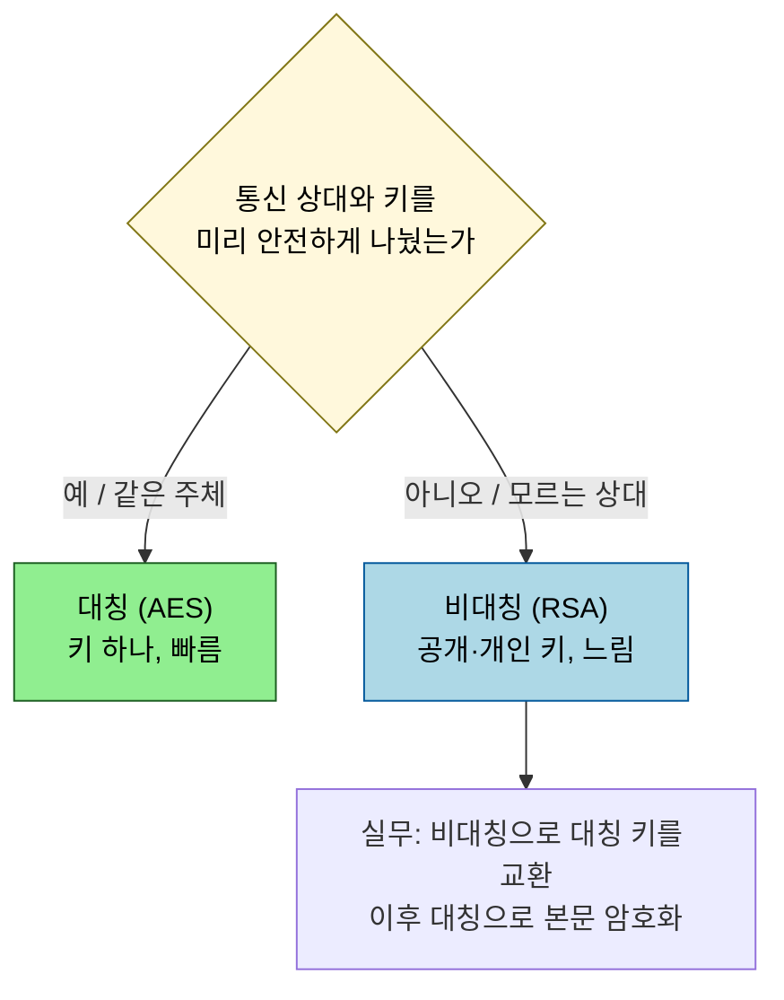
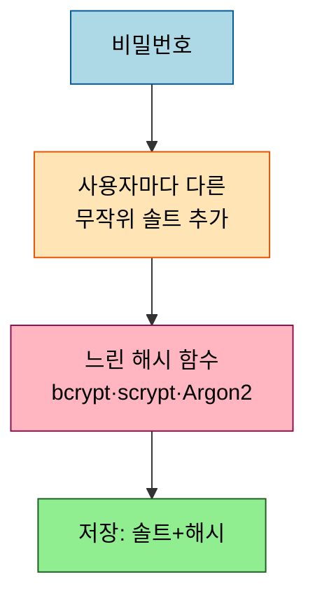

# 암호학 기초 — 대칭·비대칭·해시·HMAC

---

> 보안 이론의 도구 상자에는 용도가 다른 네 가지 기본 연산이 있습니다. 기밀성을 지키는 대칭·비대칭 암호화, 무결성과 단방향성을 보장하는 해시, 그리고 둘을 묶어 인증까지 더한 HMAC 입니다. 무엇을 보호하려는지(기밀성·무결성·인증)에 따라 도구가 갈립니다. 본 문서는 각 연산의 용도를 이론으로 정리합니다.

## 0. 학습 목표

이 문서를 읽고 나면 대칭과 비대칭 암호화를 언제 쓰는지, 해시가 암호화와 어떻게 다른지, 비밀번호 저장에 솔트와 느린 해시가 왜 필요한지, HMAC 이 무엇을 더하는지 답할 수 있습니다.

## 1. 대칭 vs 비대칭 — 기밀성을 지키는 두 방식

암호화는 *기밀성* 을 지킵니다 — 허가된 자만 원문을 볼 수 있게 합니다. 대칭 암호화는 하나의 키로 암호화·복호화를 모두 합니다(AES 등). 빠르지만 키를 어떻게 안전하게 나눠 가질지가 문제입니다. 비대칭 암호화는 공개 키로 암호화하고 개인 키로만 복호화합니다(RSA 등). 키 교환 문제를 풀지만 느립니다.

그래서 TLS 같은 실무 프로토콜은 둘을 결합합니다 — 비대칭으로 대칭 키를 안전하게 교환한 뒤, 빠른 대칭 암호화로 실제 데이터를 주고받습니다. 비대칭은 서명에도 쓰이는데, 개인 키로 서명하고 공개 키로 검증하는 이 구조가 [`03_jwt-design`](03_jwt-design.md) 의 RS256 입니다.

## 2. 해시 — 단방향과 무결성

해시는 암호화가 아닙니다. 임의 길이 입력을 고정 길이 출력으로 바꾸는 *단방향* 함수라, 출력에서 원문을 되돌릴 수 없습니다. 같은 입력은 항상 같은 출력을 내고, 한 비트만 바뀌어도 출력이 완전히 달라집니다. 그래서 해시는 *무결성* 확인(파일이 변조되지 않았나)과 비밀번호 저장에 쓰입니다.

암호학적 해시는 충돌 저항성(같은 출력을 내는 다른 입력을 찾기 어려움)을 가져야 하며, MD5·SHA-1 은 이 성질이 깨져 더는 보안 용도로 쓰지 않습니다.

## 3. 비밀번호 저장 — 솔트와 느린 해시

비밀번호를 그냥 해시만 해서 저장하면 두 가지 공격에 약합니다. 첫째, 같은 비밀번호는 같은 해시가 되어 *레인보우 테이블* 로 역추적됩니다. 둘째, SHA-256 같은 빠른 해시는 초당 수십억 번 시도하는 *무차별 대입* 을 못 막습니다.

해법은 두 가지를 함께 씁니다. *솔트* 는 사용자마다 다른 무작위 값을 비밀번호에 더해, 같은 비밀번호라도 다른 해시가 되게 만들어 레인보우 테이블을 무력화합니다. *느린 해시*(bcrypt·scrypt·Argon2)는 의도적으로 계산을 무겁게 만들어 무차별 대입의 초당 시도 횟수를 떨어뜨립니다. OWASP 는 비밀번호 저장에 이 느린 해시 계열을 권장합니다. 페퍼(애플리케이션 전역 비밀)를 솔트에 더 얹기도 합니다.

## 4. HMAC — 해시에 인증을 더하기

HMAC(RFC 2104)은 해시에 비밀 키를 결합해 *무결성에 더해 인증* 까지 보장합니다. 단순 해시는 누구나 계산할 수 있어 "내용이 안 바뀌었다" 만 보장하지만, HMAC 은 비밀 키를 아는 자만 같은 값을 만들 수 있어 "내용이 안 바뀌었고, 이 값을 만든 자가 키를 가진 정당한 주체다" 까지 보장합니다. JWT 의 HS256 서명이 바로 HMAC-SHA256 입니다 — 비밀 키로 토큰을 서명하므로, 키가 없으면 위조한 토큰의 서명을 통과시킬 수 없습니다.

| 연산 | 보장하는 것 |
|------|------------|
| 대칭·비대칭 암호화 | 기밀성 (허가된 자만 본다) |
| 해시 | 무결성 (안 바뀌었다) + 단방향 |
| HMAC | 무결성 + 인증 (정당한 주체가 만들었다) |

## 5. work factor와 디지털 서명

느린 해시의 "느림" 은 고정값이 아니라 *조절 가능한 비용* 입니다. bcrypt 의 cost factor(또는 Argon2 의 메모리·반복 파라미터)를 올리면 해시 한 번에 드는 계산이 지수적으로 늘어납니다. 하드웨어가 빨라질수록 이 값을 키워 무차별 대입 비용을 따라 올리는 게 핵심입니다 — OWASP 는 현재 하드웨어 기준 권장 cost 를 주기적으로 갱신합니다. 너무 높이면 정상 로그인 응답도 느려지므로, 로그인당 수십~수백 밀리초 수준에서 균형을 잡습니다.

비대칭 암호의 또 다른 용도는 *디지털 서명* 과 그로 인한 부인방지(non-repudiation)입니다. 개인 키로 서명하면 그 키를 가진 자만 만들 수 있는 값이 나오므로, 서명자는 "내가 안 했다" 고 부인할 수 없습니다. HMAC 도 무결성·인증을 주지만 *비밀 키를 양쪽이 공유* 하므로 누가 만들었는지 특정하지 못해 부인방지는 안 됩니다. 그래서 "보낸 사람을 제3자에게 증명" 해야 하면 비대칭 서명, "두 당사자 사이 무결성·인증" 이면 HMAC 으로 갈립니다.

## 6. 면접 대비 체크리스트

> 이 문서를 다 읽은 뒤 다음 질문에 답할 수 있어야 합니다.

1. 대칭과 비대칭 암호화는 각각 무엇이 강하고 약합니까? TLS 가 둘을 함께 쓰는 이유는?
2. 비밀번호 저장에 SHA-256 같은 빠른 해시 대신 bcrypt 를 쓰고 솔트를 더하는 이유는 각각 무엇입니까?
3. 단순 해시와 HMAC 의 차이는 무엇이고, JWT 의 HS256 은 둘 중 무엇에 해당합니까?
4. bcrypt 의 cost factor 를 올리면 무엇이 달라집니까? 부인방지가 필요할 때 HMAC 대신 비대칭 서명을 쓰는 이유는?
