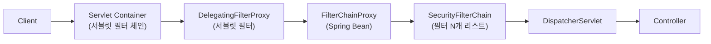
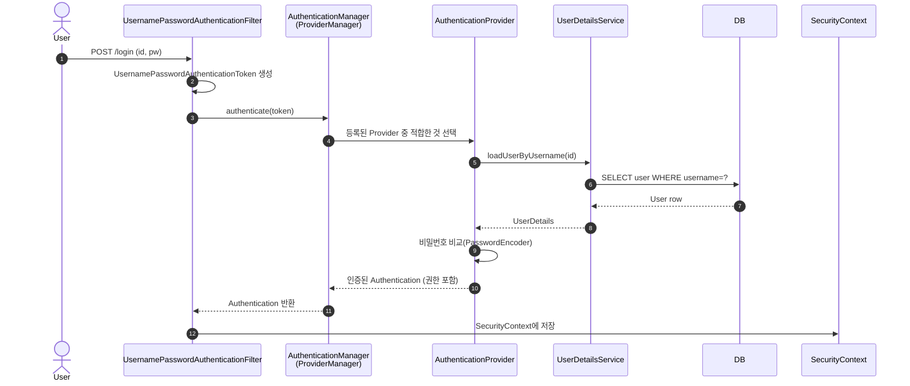

# Spring Security 개념과 Filter Chain

---

> Spring 애플리케이션에서 인증(authentication)과 인가(authorization)를 어떻게 처리할지를 결정하는 핵심 프레임워크다. 이 글은 Spring Security 6.x를 기준으로 동작 흐름과 Filter Chain 구조를 한 번에 따라간다.

## 한 줄 정의

Spring Security는 **서블릿 필터 체인 위에 인증·인가 책임을 얹은 보안 프레임워크**다. 요청이 컨트롤러에 도달하기 전에 별도의 필터들이 가로채서 누가(인증), 무엇을 할 수 있는지(인가)를 결정하고, 이 결정을 `SecurityContext`라는 스레드 단위 저장소에 보관한다.

## 왜 필요한가

> 모든 컨트롤러가 직접 인증을 검사하면 같은 코드가 반복된다. Spring Security는 이 책임을 한 단계 위인 필터로 끌어올려, 비즈니스 코드가 "이미 인증된 사용자" 가정 위에서만 동작하도록 분리한다.

세 가지 이유로 필터 계층이 답이 된다.

1. **횡단 관심사 분리** — 인증·인가는 모든 요청에 공통으로 적용되어야 하는 횡단 관심사다. 컨트롤러 단에 흩어 놓으면 한 곳을 빠뜨릴 때 보안 구멍이 생긴다. 필터 한 곳에서 검사하면 누락이 구조적으로 막힌다.
2. **순서 보장** — Spring Security는 십수 개의 필터가 정해진 순서로 동작한다. `CsrfFilter`가 `UsernamePasswordAuthenticationFilter`보다 먼저 와야 하는 식의 제약을 프레임워크가 강제하므로, 운영 중 새 필터를 끼워 넣을 때 위치만 맞추면 된다.
3. **MVC 분리** — 필터는 `DispatcherServlet`보다 앞단에서 동작한다. 즉 인증 실패면 컨트롤러 코드가 아예 실행되지 않는다. 이 분리 덕분에 MVC 컨트롤러는 보안 코드를 import하지 않고도 안전하게 작성할 수 있다.

## 인증·인가·접근 주체 정의

용어가 비슷해 보여도 보호 대상이 다르다. 본 시리즈에서는 다음 정의를 일관되게 쓴다.

| 용어 | 영문 | 의미 | 예 |
|------|------|------|------|
| 접근 주체 | Principal | 보호된 자원에 접근하려는 유저 | 로그인한 사용자 |
| 인증 | Authentication | "당신이 누구인가"를 검증 | 로그인 폼 제출 |
| 인가 | Authorization | "당신이 이 자원에 접근할 수 있는가"를 검증 | `/admin/**` 호출 시 ROLE_ADMIN 확인 |
| 권한 | Authority/Role | 인증된 주체에게 부여된 행동 자격 | `ROLE_USER`, `SCOPE_read` |

인증이 먼저고 인가는 그 다음이다. 인증되지 않은 요청에는 인가를 따질 대상이 없다. 단 `permitAll`로 표시된 경로는 인증 자체를 건너뛴다.

## 아키텍처

### 전체 흐름

서블릿 컨테이너의 필터 체인 안에 Spring Security의 필터 체인이 한 노드로 들어간다. `DelegatingFilterProxy`라는 서블릿 표준 필터가 Spring 컨테이너 안의 `FilterChainProxy` 빈에게 처리를 위임하는 구조다.



왜 한 단계 위임하는가? Spring Security 필터들은 Spring 빈이라서 서블릿 컨테이너가 직접 관리할 수 없다. `DelegatingFilterProxy`가 서블릿 컨테이너와 Spring 컨테이너 사이의 다리 역할을 하고, 실제 보안 로직은 Spring 빈인 `FilterChainProxy`가 수행한다.

### 인증 처리 10단계

폼 로그인을 예로 들면 다음 순서로 요청이 흐른다.



핵심은 **인증 객체(`Authentication`)가 단계마다 부풀려진다**는 점이다. 처음에는 id/pw만 담은 미인증 토큰이지만, `UserDetailsService`가 DB에서 권한을 채워 주고, `AuthenticationProvider`가 검증 도장을 찍어 인증된 토큰을 반환한다. 이 최종 객체가 `SecurityContext`에 들어간다.

### SecurityFilterChain 내부 필터들

`SecurityFilterChain`은 보통 15개 이상의 필터를 순서대로 보관한다. 자주 다루는 것만 추리면 다음과 같다.

| 순서 | 필터 | 역할 |
|------|------|------|
| 1 | `SecurityContextHolderFilter` | 요청 시작 시 `SecurityContext`를 ThreadLocal에 올림 |
| 2 | `CsrfFilter` | CSRF 토큰 검증 (상태 있는 세션 기반에서 필수) |
| 3 | `LogoutFilter` | 로그아웃 URL 매칭 시 세션·쿠키 정리 |
| 4 | `UsernamePasswordAuthenticationFilter` | 폼 로그인 처리 |
| 5 | `BearerTokenAuthenticationFilter` | OAuth2 Resource Server에서 Bearer 토큰 추출 |
| 6 | `ExceptionTranslationFilter` | 인증 예외 → 로그인 페이지, 인가 예외 → 403 변환 |
| 7 | `AuthorizationFilter` | 마지막 단계의 인가 결정 (6.x 기준 `FilterSecurityInterceptor` 대체) |

필터 사이의 의존성을 이해하면 커스텀 필터를 어디에 끼울지 결정할 수 있다. 예를 들어 JWT를 검증하는 커스텀 필터는 `UsernamePasswordAuthenticationFilter` **앞**에 두는 것이 관례인데, 이는 JWT가 유효하면 폼 로그인 단계를 건너뛰고 곧장 `SecurityContext`를 채우기 위함이다 ([03-01. JWT 인증 구현](03-01.JWT 인증 구현.md) 참조).

## 핵심 객체

### Authentication

인증 객체. 미인증 상태에서는 자격 증명(`credentials`)만 담고, 인증 후에는 `principal`(`UserDetails`)과 `authorities`까지 채워진다. `Authentication.isAuthenticated()`가 `true`라야 후속 필터가 인가를 따질 수 있다.

### SecurityContext / SecurityContextHolder

`Authentication`을 보관하는 컨테이너. `SecurityContextHolder`는 이를 ThreadLocal(혹은 InheritableThreadLocal)로 노출한다. 컨트롤러에서 `SecurityContextHolder.getContext().getAuthentication()`을 호출하면 현재 요청의 인증 정보를 얻는다.

### UserDetails / UserDetailsService

`UserDetails`는 Spring Security가 이해하는 사용자 표현이다. `getUsername()`, `getPassword()`, `getAuthorities()`, 그리고 계정 만료·잠금·자격 만료·비활성 여부 4개의 boolean을 가진다. `UserDetailsService`는 단 하나의 메서드 `loadUserByUsername(String)`로 DB를 뒤져 `UserDetails`를 반환한다.

### AuthenticationManager / AuthenticationProvider

`AuthenticationManager`는 인증 시도의 단일 진입점이다. Spring Security 기본 구현인 `ProviderManager`는 등록된 `AuthenticationProvider` 목록을 순회하며 토큰 타입을 지원하는 첫 Provider에게 위임한다. 가장 흔히 쓰이는 `DaoAuthenticationProvider`는 `UserDetailsService` + `PasswordEncoder` 조합으로 동작한다.

### PasswordEncoder

비밀번호 해시 알고리즘 추상화. Spring Security 5 이후 기본값은 `DelegatingPasswordEncoder`로, `{bcrypt}$2a$10$...` 같은 prefix를 통해 알고리즘을 식별한다. 운영 코드에서는 BCrypt가 사실상 표준이다.

## 실습 — 기본 동작 확인

`spring-boot-starter-security`만 추가하면 다음 두 가지가 자동으로 켜진다.

```groovy
dependencies {
    implementation 'org.springframework.boot:spring-boot-starter-security'
    testImplementation 'org.springframework.security:spring-security-test'
}
```

1. 모든 엔드포인트가 기본적으로 보호된다 (`/error`, `/favicon.ico` 제외).
2. 기본 로그인 페이지가 `/login`에 노출되고, 시스템 로그에 생성된 임시 비밀번호가 출력된다 (`user` 계정).

```
Using generated security password: 8e557245-73f4-4f15-9fd1-bf4d1ac98a3e
```

이 단계에서 `curl -u user:8e55...`로 `/`를 호출하면 200, 그냥 호출하면 401이 떨어진다. 즉 어떤 설정도 없이 starter만 추가해도 모든 경로가 보호된다는 사실이 1단계 검증이다.

## 면접 대비 요약

### 한 줄 정의

"서블릿 필터 체인 위에 인증·인가 책임을 위임 구조로 얹은 보안 프레임워크다. `DelegatingFilterProxy`가 Spring 빈인 `FilterChainProxy`로 위임하고, 그 안에서 `SecurityFilterChain`이 십수 개 필터를 순서대로 실행한다."

### 핵심 포인트 3가지

1. **인증·인가 분리** — `Authentication`은 누구인지, `AuthorizationFilter`는 무엇을 할 수 있는지를 따로 결정한다. 미인증 사용자에게는 인가 검사 자체를 적용하지 않는다.
2. **필터 위임 구조** — 서블릿 컨테이너의 `DelegatingFilterProxy`가 Spring 컨테이너의 `FilterChainProxy`에게 처리를 넘기는 패턴 덕분에, 보안 로직이 Spring 빈으로 관리되면서도 서블릿 표준에 끼어든다.
3. **`UserDetailsService` + `PasswordEncoder`** — 인증 코드를 작성할 때 거의 항상 이 두 빈만 등록하면 폼 로그인이 동작한다. 6.x에서는 `WebSecurityConfigurerAdapter`가 deprecated이므로 `SecurityFilterChain` 빈을 직접 등록하는 방식으로 바뀌었다.

### 자주 묻는 질문

Q: `SecurityContextHolder`가 ThreadLocal을 쓰는데 비동기 처리에서는 어떻게 되는가?
A: 기본 전략은 `ThreadLocalSecurityContextHolderStrategy`라 새 스레드에서는 컨텍스트가 비어 있다. `@Async` 같은 비동기 코드에서는 `DelegatingSecurityContextExecutor` 또는 `MODE_INHERITABLETHREADLOCAL` 전략을 명시해 전파해야 한다.

Q: Spring Security 5.7 이후 `WebSecurityConfigurerAdapter`가 사라진 이유는?
A: 상속 기반 설정은 한 클래스가 여러 책임(HttpSecurity·WebSecurity·AuthenticationManager)을 가지면서 테스트가 어려웠다. 6.x는 각 책임을 별도 빈으로 노출하는 컴포넌트 기반 설정을 권장한다. `SecurityFilterChain`, `WebSecurityCustomizer`, `AuthenticationManager` 각각을 `@Bean`으로 등록한다.

Q: CSRF 토큰은 언제 켜고 언제 끄는가?
A: 브라우저 세션 쿠키를 사용하는 SSR 앱은 CSRF를 켜야 한다. 반면 JWT 같은 토큰 기반 무상태 API는 CSRF 공격 표면 자체가 없으므로 `csrf().disable()`이 표준이다. 모바일 앱 백엔드도 같은 이유로 disable이 일반적이다.

## 관련 문서

- [01-02.Spring Security 기본 구현](01-02.Spring Security 기본 구현.md) — `SecurityFilterChain`·`PasswordEncoder`·`HttpSecurity` 설정 실제 코드
- [01-03.Form 로그인 실습](01-03.Form 로그인 실습.md) — 회원가입과 로그인 폼 구현
- [`11_spring/`](../../11_spring/README.md) — Spring 프레임워크 본질 이론 진입점
- [Spring Security Architecture (공식)](https://docs.spring.io/spring-security/reference/servlet/architecture.html)
