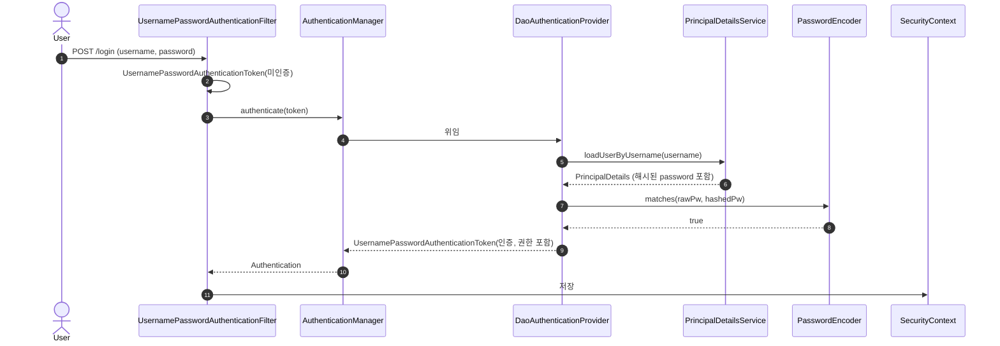

# Form 로그인 실습 (회원가입·UserDetails·권한)

---

> Spring Security가 폼 로그인을 처리할 때 무엇을 찾고 무엇을 채우는지를 회원가입부터 권한 검사까지 한 흐름으로 따라간다. 핵심은 `UserDetailsService`가 DB를 어떻게 매개하고, 폼이 제출되면 어떤 객체들이 `SecurityContext`에 저장되는지다.

## 한 줄 정의

폼 로그인은 사용자가 입력한 id/pw를 `UserDetailsService`가 DB의 `UserDetails`로 변환하고, `PasswordEncoder`가 해시 비교를 통과시키면 `Authentication`을 `SecurityContext`에 올리는 과정이다.

## 왜 이 흐름이 중요한가

> 회원가입 시 평문 비밀번호를 그대로 저장하면 시큐리티 로그인이 실패한다. `PasswordEncoder`가 폼에서 들어온 원문과 DB의 해시를 비교하기 때문이다. 이 사실을 모르고 `userRepository.save(user)`만 호출하면 로그인이 안 되는 첫 번째 원인이 된다.

회원가입과 로그인이 한 쌍을 이루려면 다음 두 약속이 지켜져야 한다.

1. **저장 시 해시화** — 회원가입 컨트롤러에서 반드시 `passwordEncoder.encode(rawPassword)` 결과를 저장한다.
2. **로그인 시 같은 인코더로 비교** — Spring Security는 컨테이너에 등록된 `PasswordEncoder` 빈을 자동으로 사용한다. 별도로 명시할 필요 없다.

## 회원가입 — 컨트롤러와 뷰

```java
@Controller
@RequiredArgsConstructor
public class JoinController {

    private final UserRepository userRepository;
    private final BCryptPasswordEncoder passwordEncoder;

    @GetMapping("/joinForm")
    public String joinForm() {
        return "joinForm";
    }

    @PostMapping("/join")
    public String join(User user) {
        user.setRole("ROLE_USER");
        user.setPassword(passwordEncoder.encode(user.getPassword()));
        userRepository.save(user);
        return "redirect:/loginForm";
    }
}
```

```html
<!-- joinForm.html -->
<form action="/join" method="post">
    <input type="text" name="username" placeholder="Username"/>
    <input type="password" name="password" placeholder="Password"/>
    <input type="email" name="email" placeholder="Email"/>
    <button>회원가입</button>
</form>
```

`name="username"`, `name="password"`는 `User` 엔티티의 필드명과 일치해야 한다. Spring MVC가 알아서 binding한다. `role`을 `ROLE_USER`로 박는 부분은 가입 직후 권한을 한 단계로 고정하기 위한 단순 처리고, 운영에서는 별도 권한 부여 로직이 들어간다.

## 로그인 — UserDetails와 PrincipalDetails

> `UserDetails`는 Spring Security가 이해하는 사용자 표현이다. 우리 도메인의 `User`를 그대로 쓸 수 없는 이유는, Spring Security가 요구하는 7개 메서드(getUsername·getPassword·getAuthorities·계정 만료 등 4개 boolean)를 우리 엔티티가 갖고 있지 않기 때문이다.

```java
@RequiredArgsConstructor
public class PrincipalDetails implements UserDetails {

    private final User user;

    @Override
    public Collection<? extends GrantedAuthority> getAuthorities() {
        Collection<GrantedAuthority> roles = new ArrayList<>();
        roles.add(() -> user.getRole());
        return roles;
    }

    @Override public String getPassword() { return user.getPassword(); }
    @Override public String getUsername() { return user.getUsername(); }
    @Override public boolean isAccountNonExpired() { return true; }
    @Override public boolean isAccountNonLocked() { return true; }
    @Override public boolean isCredentialsNonExpired() { return true; }
    @Override public boolean isEnabled() { return true; }
}
```

4개 boolean은 운영 정책을 직접 반영한다. 예를 들어 "1년간 로그인 없으면 휴면 처리"를 적용하려면 `isEnabled()`에서 마지막 로그인 시간을 검사해 `false`를 반환하면 된다. 이 단순 메서드가 인증 단계에서 자동으로 호출되어 휴면 계정의 로그인을 막는다.

## UserDetailsService — DB 조회 어댑터

```java
@Service
@RequiredArgsConstructor
public class PrincipalDetailsService implements UserDetailsService {

    private final UserRepository userRepository;

    @Override
    public UserDetails loadUserByUsername(String username) {
        User user = userRepository.findByUsername(username);
        if (user == null) {
            throw new UsernameNotFoundException(username);
        }
        return new PrincipalDetails(user);
    }
}
```

`loadUserByUsername`은 Spring Security가 로그인 요청을 받을 때마다 한 번 호출하는 진입점이다. 빈으로 등록된 `UserDetailsService`가 단 하나라면 Spring Boot가 `DaoAuthenticationProvider`에 자동으로 주입한다.

이 메서드에서 던지는 예외는 외부에 정보를 흘리지 않도록 주의한다. `UsernameNotFoundException`은 내부적으로 "사용자 없음 또는 비밀번호 틀림"으로 추상화되어 응답에 노출된다. id 존재 여부를 응답에서 구분 가능하면 enumeration attack의 단서가 된다.

## 로그인 흐름 — 객체가 부풀려지는 순서



흐름 안에서 `Authentication` 객체가 두 번 등장한다. 첫 번째는 폼 데이터만 가진 미인증 토큰이고, 두 번째는 권한까지 포함된 인증된 토큰이다. 둘은 같은 클래스(`UsernamePasswordAuthenticationToken`)지만 생성자가 다르다.

## 권한 처리 — Method Security

> URL 패턴으로 권한을 통제하는 방식([01-02 §HttpSecurity](01-02.Spring Security 기본 구현.md))은 진입 시점만 막는다. 컨트롤러 안에서 호출되는 서비스 메서드까지 권한 단위로 제어하려면 메서드 시큐리티가 필요하다.

```java
@Configuration
@EnableWebSecurity
@EnableMethodSecurity(securedEnabled = true, prePostEnabled = true)
public class SecurityConfig { ... }
```

5.x의 `@EnableGlobalMethodSecurity`는 6.x에서 `@EnableMethodSecurity`로 이름이 바뀌었다. `prePostEnabled = true`(기본값)가 `@PreAuthorize`·`@PostAuthorize`를 활성화하고, `securedEnabled = true`가 `@Secured`를 활성화한다.

```java
@RestController
public class AdminController {

    @Secured("ROLE_ADMIN")
    @GetMapping("/info")
    public String info() {
        return "개인정보";
    }

    @PreAuthorize("hasRole('MANAGER') or hasRole('ADMIN')")
    @GetMapping("/data")
    public String data() {
        return "데이터정보";
    }
}
```

세 어노테이션의 차이는 다음과 같다.

| 어노테이션 | 표현식 | 호출 시점 |
|----------|--------|----------|
| `@Secured` | 권한 이름만 (`"ROLE_ADMIN"`) | 메서드 진입 전 |
| `@PreAuthorize` | SpEL 표현식 (메서드 인자 접근 가능) | 메서드 진입 전 |
| `@PostAuthorize` | SpEL + `returnObject` 접근 | 메서드 반환 후 (반환값 검사) |

`@Secured`는 표현식이 단순해 빠르지만 다중 권한 조합이 어렵다. `@PreAuthorize`는 `hasRole('A') or hasRole('B')` 같은 표현식을 그대로 쓸 수 있어 실무에서 압도적으로 자주 쓰인다.

## 인증된 사용자 조회 — @AuthenticationPrincipal

컨트롤러에서 현재 로그인한 사용자 정보를 얻는 가장 깔끔한 방법은 `@AuthenticationPrincipal`이다.

```java
@GetMapping("/me")
public String me(@AuthenticationPrincipal PrincipalDetails principal) {
    return "username = " + principal.getUsername();
}
```

`@AuthenticationPrincipal`은 `SecurityContextHolder.getContext().getAuthentication().getPrincipal()`을 한 줄로 줄여 준다. 타입이 일치하지 않으면 `null`이 들어가니, 폼 로그인과 OAuth2 로그인이 같은 컨트롤러를 거친다면 `PrincipalDetails`가 둘을 모두 구현하도록 만드는 것이 안전하다 ([02-02.Google OAuth2 Login](02-02.Google OAuth2 Login.md) 참조).

## 실습 흐름 — 회원가입부터 권한 검증까지

1. **회원가입** — `/joinForm` → POST `/join` → DB에 BCrypt 해시 저장
2. **로그인** — `/loginForm` → POST `/login` → `PrincipalDetailsService.loadUserByUsername` 호출
3. **세션 확립** — `Authentication`이 `SecurityContextHolder`에 올라가고 `JSESSIONID` 쿠키가 발급된다
4. **권한 검사** — `/admin/info` 호출 시 `@Secured("ROLE_ADMIN")`이 `SecurityContext`의 권한과 매치되면 200, 아니면 403

각 단계에서 실패하면 다음을 확인한다.

- 1단계 실패 (insert 안 됨): `@Entity`/`@Repository` 매핑 점검
- 2단계 실패 (`null` 반환): `loadUserByUsername`이 user를 못 찾는 경우. DB에서 username 일치 여부와 `passwordEncoder.encode` 결과가 저장되었는지 검사
- 3단계 실패 (로그인 직후 다시 로그인 요청): `defaultSuccessUrl`이 인증 필요 경로면 또 다른 인증 흐름으로 재진입한다. `permitAll` 경로로 지정
- 4단계 실패 (403): DB의 role 값이 `ROLE_ADMIN`인지, `hasRole("ADMIN")`인지(prefix 자동 부여) 일치 점검

## 면접 대비 요약

### 한 줄 정의

"폼 로그인은 `UsernamePasswordAuthenticationFilter`가 가로채서 `UserDetailsService.loadUserByUsername`으로 DB의 `UserDetails`를 받고, `PasswordEncoder`가 입력 비밀번호와 저장된 해시를 비교한 결과를 `SecurityContext`에 저장하는 일련의 흐름이다."

### 핵심 포인트 3가지

1. **회원가입 시 반드시 encode** — `passwordEncoder.encode(rawPassword)`를 저장하지 않으면 로그인은 절대 성공할 수 없다. 모든 폼 로그인 디버깅의 첫 의심 지점이다.
2. **`UserDetails`는 어댑터 패턴** — 우리 도메인의 `User`는 Spring Security 인터페이스를 모르고, `PrincipalDetails`가 둘 사이를 매개한다. 이 분리 덕분에 도메인 모델이 보안 프레임워크에 종속되지 않는다.
3. **Method Security는 SpEL 표현식이 강점** — `@PreAuthorize("#userId == principal.username")`처럼 메서드 인자와 인증 주체를 함께 검사할 수 있다. URL 단 인가로는 도달할 수 없는 정밀도다.

### 자주 묻는 질문

Q: 회원가입은 잘 되는데 로그인이 실패한다. 어디부터 볼까?
A: 가장 흔한 원인은 평문 비밀번호 저장이다. DB의 password 컬럼에 `$2a$10$...` BCrypt 해시가 들어 있는지 먼저 확인한다.

Q: `@Secured`와 `@PreAuthorize` 중 하나만 쓰면 되는가?
A: 실무에서는 `@PreAuthorize` 하나로 통일하는 편이 일관적이다. `@Secured`는 단순한 권한 이름 비교만 지원하고, 표현식이 필요한 순간 즉시 한계가 드러난다.

Q: 인증 후 `SecurityContextHolder`가 비어 있는 컨트롤러가 있다. 왜?
A: `@Async`나 별도 스레드 풀에서 실행되는 코드라면 ThreadLocal이 전파되지 않는다. `DelegatingSecurityContextExecutor`로 감싸거나 `MODE_INHERITABLETHREADLOCAL` 전략을 명시한다.

## 관련 문서

- [01-02.Spring Security 기본 구현](01-02.Spring Security 기본 구현.md) — `SecurityFilterChain` 설정과 경로 인가
- [02-01.OAuth2 개념과 흐름](02-01.OAuth2 개념과 흐름.md) — 폼 로그인 외 OAuth2 소셜 로그인으로 확장
- [03-01.JWT 인증 구현](03-01.JWT 인증 구현.md) — 무상태 토큰 기반 인증
- [UserDetailsService (공식)](https://docs.spring.io/spring-security/reference/servlet/authentication/passwords/user-details-service.html)
