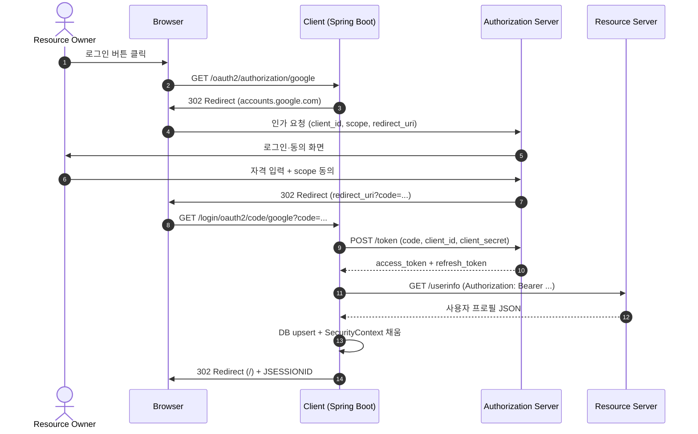
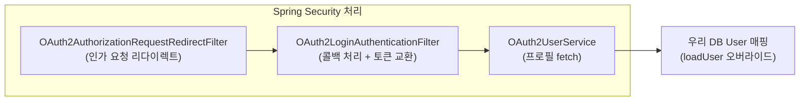

# OAuth2 개념과 흐름 (4역할·인가 코드 그랜트)

---

> OAuth2는 사용자가 자신의 비밀번호를 외부 앱에 직접 넘기지 않고도 자기 자원에 접근할 권한을 위임하는 표준 프로토콜이다. 이 글은 RFC 6749 기준으로 4개 역할의 정의와 인가 코드 그랜트(Authorization Code Grant) 흐름을 정리하고, Spring Security가 이를 어떻게 추상화하는지 짚는다.

## 한 줄 정의

OAuth2(Open Authorization 2.0)는 **리소스 소유자가 자기 자원에 접근할 권한을 클라이언트 애플리케이션에게 위임하는 인가 프로토콜**이다. 인증(누구인가)이 아니라 인가(무엇을 할 수 있는가)에 초점을 두며, 사용자 인증은 OIDC(OpenID Connect)가 OAuth2 위에 얹어 보완한다.

## 왜 OAuth2가 표준이 됐나

> "외부 앱에 내 구글 비밀번호를 입력하지 않고도 구글 캘린더 접근을 허용하고 싶다"가 OAuth2가 풀려는 문제다. 비밀번호를 공유하면 그 앱이 비밀번호를 저장·노출할 위험을 통제할 수 없다. OAuth2는 단명·범위 제한된 토큰을 발급해 이 위험을 격리한다.

세 가지 장점이 있다.

1. **비밀번호 비공유** — 사용자 자격 증명은 인가 서버(구글)에만 머무른다. 클라이언트는 토큰만 받는다.
2. **권한 범위(scope) 제한** — 사용자가 "이메일·프로필만 허용"을 선택하면 토큰은 그 범위 안에서만 동작한다.
3. **취소 가능성** — 사용자가 인가 서버 콘솔에서 권한을 회수하면 즉시 토큰이 무효화된다. 비밀번호 변경 없이 가능하다.

## 4개 역할

OAuth2는 네 주체의 상호작용으로 정의된다. 역할을 헷갈리면 흐름이 통째로 어긋난다.

| 역할 | 영문 | 무엇을 하는가 | 예 (구글 로그인 시) |
|------|------|--------------|---------------------|
| 리소스 소유자 | Resource Owner | 자기 자원에 접근 권한을 승인하는 주체 | 로그인하는 사용자 본인 |
| 클라이언트 | Client | 자원에 접근하려는 외부 애플리케이션 | 우리가 만든 Spring Boot 앱 |
| 인가 서버 | Authorization Server | 사용자 인증·동의를 받고 토큰을 발급 | `accounts.google.com` |
| 리소스 서버 | Resource Server | 보호된 자원을 토큰으로 보호하며 제공 | `www.googleapis.com/oauth2/v3/userinfo` |

구글·페이스북·네이버 같은 서비스는 인가 서버와 리소스 서버를 동시에 운영한다. 둘이 분리된 사례는 자체 IDP를 두고 마이크로서비스가 리소스 서버 역할만 하는 기업 환경에서 자주 나타난다.

## 주요 토큰

### Access Token

- 리소스 서버에서 보호된 자원을 가져올 때 제시하는 단명 토큰
- 보통 만료 1시간 이하, JWT 또는 불투명(opaque) 토큰
- 노출되면 해당 scope만큼의 접근이 가능하므로 HTTPS·짧은 수명·`Authorization: Bearer ...` 헤더로만 전송

### Refresh Token

- Access Token이 만료됐을 때 재발급에 사용하는 장기 토큰
- 보통 수일~수개월. 클라이언트 서버에만 저장
- 노출되면 Access Token을 무한히 갱신할 수 있어 더 강력한 자격 증명이 된다. 따라서 모바일 앱·SPA가 아닌 백엔드 서버에서만 보관

### Authorization Code

- 인가 서버가 사용자 동의 직후 발급하는 일회용·단명 코드(보통 10분 이하)
- 클라이언트가 이 코드를 다시 토큰 엔드포인트로 보내 Access·Refresh Token으로 교환한다
- 단계가 한 번 더 늘어나는 이유는 사용자의 브라우저(공개 영역)와 클라이언트 서버(비공개 영역)를 분리하기 위함

## 인가 코드 그랜트 흐름

5가지 그랜트 타입 중 가장 보안 수준이 높고 표준으로 권장된다.

흐름의 미묘한 부분 두 가지를 짚어 둔다. 첫째, **인가 코드는 브라우저를 거치지만 토큰 교환은 서버 ↔ 서버**다. 토큰이 브라우저에 노출되지 않는다는 점이 SPA용 임플리시트 그랜트(deprecated)와의 결정적 차이다. 둘째, **`client_secret`은 토큰 교환 단계에서만 사용**되고 브라우저로 흘러가지 않는다. 이 둘이 깨지면 그랜트 자체가 부정된다.

## Spring Security가 추상화하는 영역

Spring Security `oauth2-client` 모듈은 위 11단계를 거의 자동으로 처리한다. 개발자가 직접 작성해야 하는 부분은 두 가지뿐이다.

1. `application.yml`에 클라이언트 등록(`client-id`, `client-secret`, `scope`)
2. 토큰 교환 후 받은 프로필을 우리 DB의 `User`로 변환하는 후처리 — `OAuth2UserService` 구현

우리가 손대는 지점은 `F3`(`OAuth2UserService`)의 `loadUser` 메서드를 오버라이드해서 프로필을 받은 직후 회원가입 또는 기존 사용자 조회를 수행하는 부분이다. 구체적인 구현은 [02-02.Google OAuth2 Login](02-02.Google OAuth2 Login.md)에서 다룬다.

## OIDC가 OAuth2와 다른 점

> OAuth2는 인가 프로토콜이라 "이 토큰을 가진 사람이 누구인지"를 명세하지 않는다. 따라서 로그인 용도로 OAuth2만 쓰면 클라이언트는 사용자 식별을 위해 매번 리소스 서버에 프로필을 조회해야 한다.

OIDC(OpenID Connect)는 이 공백을 메운다. OAuth2 토큰 응답에 `id_token`(JWT)을 추가로 포함해, 그 안에 사용자 식별 정보(sub, email, name)와 발급 정보(iss, aud, exp)를 담는다. 클라이언트는 `id_token`만 검증하면 별도 호출 없이 사용자 신원을 얻는다.

Spring Security는 `scope: openid`가 포함되면 자동으로 OIDC 흐름으로 동작한다. 구글·네이버·카카오 모두 이 prefix를 지원한다.

## 주요 용어 정리

| 용어 | 의미 |
|------|------|
| Scope | 권한 범위. 사용자 동의 화면에서 표시되는 항목 (`email`, `profile`, `https://www.googleapis.com/auth/calendar.readonly`) |
| Client ID / Secret | 인가 서버에 클라이언트를 등록할 때 발급되는 식별자와 비밀값 |
| Redirect URI | 인가 코드가 도착할 클라이언트 URL. 사전 등록된 값과 정확히 일치해야 한다 |
| Grant Type | 토큰 발급 흐름의 종류. Authorization Code, Client Credentials, Refresh Token, Device Code 등 |
| PKCE | Authorization Code Grant 보강. SPA·모바일에서 client_secret 없이도 코드 가로채기 공격을 막는다 |

## 면접 대비 요약

### 한 줄 정의

"사용자 자격 증명을 외부 앱과 공유하지 않고도 자원 접근 권한을 위임하는 인가 프로토콜이다. 인가 코드 그랜트가 표준이고, 인증까지 필요하면 OIDC가 OAuth2 위에서 `id_token`을 추가한다."

### 핵심 포인트 3가지

1. **인가 코드 그랜트의 두 단계 분리** — 브라우저는 코드만 받고, 토큰 교환은 서버 간 통신. 이 분리가 SPA용 임플리시트 그랜트가 deprecated된 결정적 이유다.
2. **Access Token은 짧게, Refresh Token은 백엔드 보관** — Access Token은 보통 1시간 이하, 노출 시 영향이 제한적이다. Refresh Token은 더 강력한 자격 증명이라 모바일 앱·SPA가 아닌 서버에서만 보관한다.
3. **OAuth2와 OIDC 구분** — OAuth2는 인가, OIDC는 인증. 로그인 용도면 `scope: openid`를 포함해 OIDC 흐름을 타야 `id_token`으로 식별이 가능하다.

### 자주 묻는 질문

Q: Authorization Code Grant 외 그랜트는 언제 쓰는가?
A: Client Credentials는 서버 간 호출(사용자 없음), Refresh Token은 토큰 갱신 전용, Device Code는 TV 같은 입력 제약 장치에서 쓴다. 사용자가 있는 일반 웹 앱은 Authorization Code가 표준이다.

Q: 임플리시트 그랜트는 왜 deprecated인가?
A: 토큰이 URL fragment로 브라우저에 직접 노출되어 `Referer` 헤더·브라우저 히스토리로 유출 위험이 크다. 현재는 SPA도 PKCE를 결합한 Authorization Code가 권장된다.

Q: `client_secret`이 노출되면 어떻게 되는가?
A: 공격자가 인가 코드를 가로채면 토큰까지 교환할 수 있게 된다. 즉시 인가 서버 콘솔에서 secret을 재발급하고, 토큰 만료 대기 또는 사용자 동의를 강제 회수해야 한다.

## 관련 문서

- [02-02.Google OAuth2 Login](02-02.Google OAuth2 Login.md) — 흐름을 Spring Boot 코드로 옮긴 실습
- [02-03.Facebook OAuth2 Login](02-03.Facebook OAuth2 Login.md) — provider별 `attributes` 차이 처리
- [02-04.Naver OAuth2 Login](02-04.Naver OAuth2 Login.md) — 기본 제공이 아닌 provider 직접 등록
- [RFC 6749 — OAuth 2.0 Authorization Framework](https://datatracker.ietf.org/doc/html/rfc6749)
