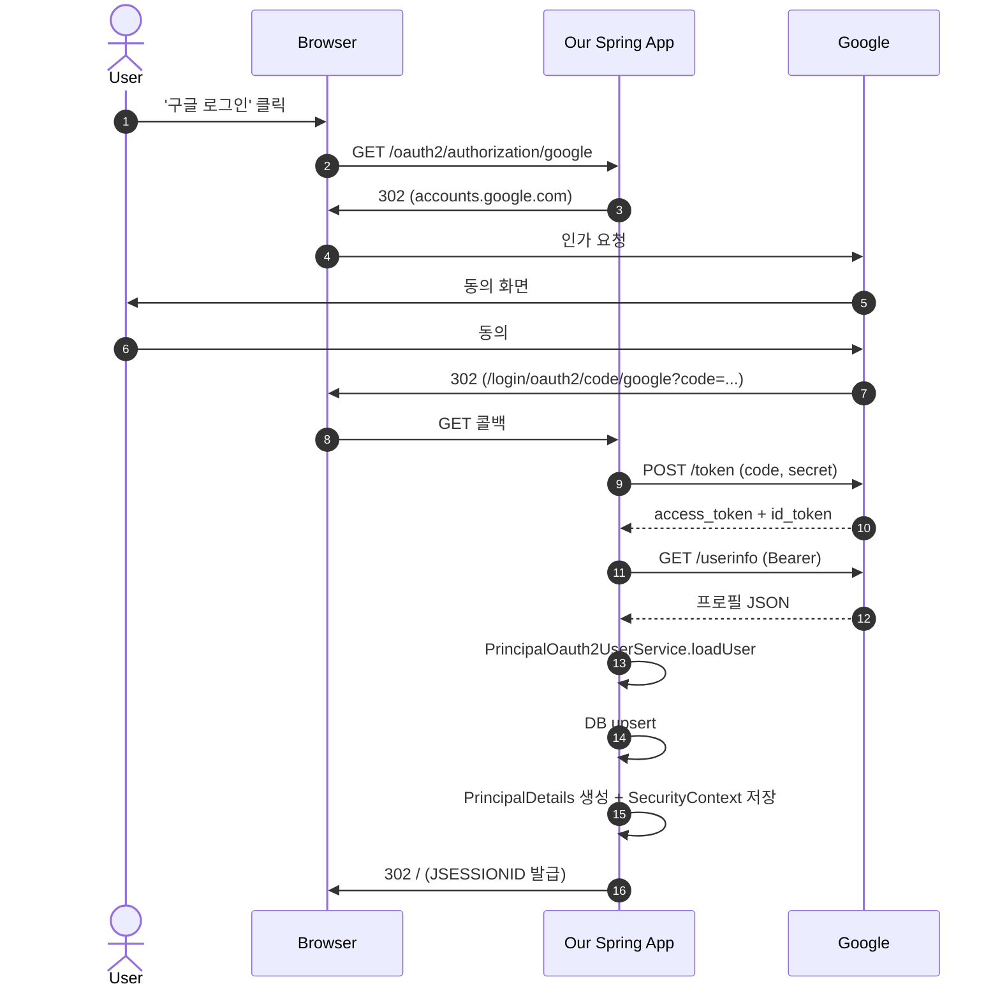

# Google OAuth2 Login (oauth2-client 설정과 OAuth2UserService)

---

> [02-01](02-01.OAuth2 개념과 흐름.md)에서 인가 코드 그랜트 흐름을 정리했다. 이 글은 같은 흐름을 Spring Boot 3 + Spring Security 6.x에서 코드로 옮기고, 토큰 교환 후 받은 프로필을 우리 DB의 `User`로 변환하는 `OAuth2UserService`를 구현한다.

## 한 줄 정의

`spring-boot-starter-oauth2-client`를 추가하고 `application.yml`에 client 정보를 등록한 뒤 `PrincipalOauth2UserService.loadUser`만 작성하면, 구글 로그인 버튼 한 번에 인가 요청·토큰 교환·프로필 fetch·DB upsert·세션 확립이 자동으로 일어난다.

## 구글 클라우드 콘솔 사전 작업

> 코드 작성 전 구글 측에 클라이언트 등록을 마쳐야 한다. 등록이 빠지면 인가 요청이 `redirect_uri_mismatch` 에러로 즉시 실패한다.

[Google Cloud Console](https://console.cloud.google.com/) → APIs & Services → Credentials → OAuth client ID 생성에서 다음을 등록한다.

1. **Application type**: Web application
2. **Authorized redirect URIs**: `http://localhost:8080/login/oauth2/code/google`
3. **Authorized JavaScript origins**: 운영 환경에서는 프론트 도메인 추가

`redirect_uri`의 `/login/oauth2/code/google` 부분은 Spring Security 기본값이라 임의로 바꾸면 안 된다. 마지막 `google` 토큰은 `application.yml`의 registration ID와 일치해야 한다. 등록을 마치면 `Client ID`와 `Client Secret`을 받아 둔다.

## 의존성과 설정

```groovy
dependencies {
    implementation 'org.springframework.boot:spring-boot-starter-security'
    implementation 'org.springframework.boot:spring-boot-starter-oauth2-client'
}
```

```yaml
# application.yml
spring:
  security:
    oauth2:
      client:
        registration:
          google:
            client-id: ${GOOGLE_CLIENT_ID}
            client-secret: ${GOOGLE_CLIENT_SECRET}
            scope:
              - email
              - profile
```

`client-id`·`client-secret`을 yml에 평문으로 박지 않고 환경 변수로 주입하는 이유는 secret이 git에 올라가는 사고를 막기 위함이다. 운영에서는 Vault·Parameter Store·Kubernetes Secret 등으로 주입한다.

`scope`는 사용자가 동의 화면에서 보게 될 권한이다. `email`·`profile`은 OpenID Connect 표준이라 Spring Security가 `id_token`까지 자동으로 받는다.

## SecurityFilterChain 설정

```java
@Configuration
@EnableWebSecurity
@RequiredArgsConstructor
public class SecurityConfig {

    private final PrincipalOauth2UserService oauth2UserService;

    @Bean
    public SecurityFilterChain filterChain(HttpSecurity http) throws Exception {
        http
            .authorizeHttpRequests(auth -> auth
                .requestMatchers("/", "/loginForm", "/joinForm").permitAll()
                .anyRequest().authenticated())
            .oauth2Login(oauth2 -> oauth2
                .loginPage("/loginForm")
                .defaultSuccessUrl("/")
                .failureUrl("/loginForm?error")
                .userInfoEndpoint(userInfo -> userInfo
                    .userService(oauth2UserService)));
        return http.build();
    }
}
```

`oauth2Login` 람다 안의 세 가지가 핵심이다.

| 메서드 | 역할 |
|--------|------|
| `loginPage("/loginForm")` | 인증 필요 URL 진입 시 이 페이지로 리다이렉트 |
| `defaultSuccessUrl("/")` | 로그인 성공 후 이동 경로. 이전 페이지가 있으면 그쪽으로 가는 옵션도 가능 |
| `userInfoEndpoint().userService(...)` | 토큰으로 프로필 fetch 후 후처리할 `OAuth2UserService` 지정 |

`/loginForm` 페이지에는 `<a href="/oauth2/authorization/google">Google Login</a>` 링크 하나만 있으면 된다. 이 URL은 `OAuth2AuthorizationRequestRedirectFilter`가 가로채서 구글로 리다이렉트한다.

## PrincipalDetails — Form·OAuth2 통합

> 회원이 폼 로그인으로도, 구글 로그인으로도 가입할 수 있다면 컨트롤러에서 받는 `principal` 객체가 두 가지일 수 있다. 둘을 하나로 통합하면 컨트롤러 코드가 단순해진다.

[01-03](01-03.Form 로그인 실습.md)의 `PrincipalDetails`를 확장해 `OAuth2User`까지 구현한다.

```java
@Getter
public class PrincipalDetails implements UserDetails, OAuth2User {

    private final User user;
    private Map<String, Object> attributes;

    // 폼 로그인 생성자
    public PrincipalDetails(User user) {
        this.user = user;
    }

    // OAuth2 로그인 생성자
    public PrincipalDetails(User user, Map<String, Object> attributes) {
        this.user = user;
        this.attributes = attributes;
    }

    @Override
    public Collection<? extends GrantedAuthority> getAuthorities() {
        return List.of((GrantedAuthority) user::getRole);
    }

    @Override public String getPassword() { return user.getPassword(); }
    @Override public String getUsername() { return user.getUsername(); }

    // OAuth2User
    @Override public Map<String, Object> getAttributes() { return attributes; }
    @Override public String getName() { return user.getUsername(); }

    // 4 boolean (true 고정, 실제로는 정책 적용)
    @Override public boolean isAccountNonExpired() { return true; }
    @Override public boolean isAccountNonLocked() { return true; }
    @Override public boolean isCredentialsNonExpired() { return true; }
    @Override public boolean isEnabled() { return true; }
}
```

같은 `PrincipalDetails` 한 클래스로 둘 다 처리할 수 있는 이유는 Spring Security가 `Authentication.getPrincipal()`에 넣는 타입을 인터페이스로 받기 때문이다. 컨트롤러에서는 `@AuthenticationPrincipal PrincipalDetails principal` 한 줄로 끝난다.

## OAuth2UserService — 토큰 교환 직후 후처리

```java
@Service
@RequiredArgsConstructor
public class PrincipalOauth2UserService extends DefaultOAuth2UserService {

    private final UserRepository userRepository;
    private final BCryptPasswordEncoder passwordEncoder;

    @Override
    public OAuth2User loadUser(OAuth2UserRequest userRequest) {
        OAuth2User oauth2User = super.loadUser(userRequest); // 구글에 GET /userinfo

        String provider = userRequest.getClientRegistration().getRegistrationId();
        String providerId = oauth2User.getAttribute("sub");
        String username = provider + "_" + providerId;
        String email = oauth2User.getAttribute("email");

        User user = userRepository.findByUsername(username);
        if (user == null) {
            user = User.builder()
                    .username(username)
                    .password(passwordEncoder.encode(UUID.randomUUID().toString()))
                    .email(email)
                    .role("ROLE_USER")
                    .provider(provider)
                    .providerId(providerId)
                    .build();
            userRepository.save(user);
        }
        return new PrincipalDetails(user, oauth2User.getAttributes());
    }
}
```

코드 안에 깔린 결정 두 가지를 살펴본다.

**첫째, username은 `provider + "_" + providerId`로 합성한다.** 구글에서 받은 `sub`(주체 식별자)은 다른 provider의 ID와 충돌할 수 있다. provider prefix를 붙이면 같은 이메일을 가진 사용자가 구글·페이스북에 각각 가입하더라도 다른 계정으로 분리된다.

**둘째, password는 UUID로 임의 채운다.** OAuth2 사용자는 폼 로그인을 하지 않으므로 password는 사용되지 않는다. 하지만 `User` 엔티티가 NOT NULL이라면 무언가 채워야 한다. 빈 문자열 대신 UUID를 BCrypt로 해시해 두면 우연히 빈 password로 폼 로그인하는 사고가 원천 차단된다.

## 구글 응답 attributes 구조

`super.loadUser(userRequest)`가 호출하는 `https://www.googleapis.com/oauth2/v3/userinfo` 응답은 다음과 같다.

```json
{
  "sub": "114477815481377286595",
  "name": "심보현",
  "given_name": "보현",
  "family_name": "심",
  "picture": "https://lh3.googleusercontent.com/a/...",
  "email": "user@gmail.com",
  "email_verified": true,
  "locale": "ko"
}
```

`sub`(subject)가 구글 내부의 영구 식별자다. 사용자가 이메일을 바꿔도 `sub`는 그대로 유지되므로, **DB의 외부 키로는 항상 `sub`를 사용하고 `email`은 표시용으로만 다룬다**. 이 분리를 지키지 않으면 사용자가 구글 계정 이메일을 바꿨을 때 우리 DB와 매핑이 깨진다.

## 컨트롤러에서 사용자 정보 조회

```java
@GetMapping("/")
public String home(@AuthenticationPrincipal PrincipalDetails principal, Model model) {
    if (principal != null) {
        model.addAttribute("username", principal.getUsername());
        model.addAttribute("email", principal.getUser().getEmail());
    }
    return "home";
}
```

`@AuthenticationPrincipal`은 폼 로그인이든 OAuth2 로그인이든 같은 `PrincipalDetails` 타입을 주입해 준다. 두 로그인 경로의 컨트롤러를 분리할 필요가 없다.

## 흐름 통합도



11단계 중 8단계까지는 Spring Security가 자동 처리한다. 우리가 손대는 곳은 9단계(`loadUser` 오버라이드)뿐이다.

## 면접 대비 요약

### 한 줄 정의

"`spring-boot-starter-oauth2-client`와 `application.yml`의 client 등록만으로 OAuth2 인가 코드 그랜트가 자동 작동한다. 개발자가 작성해야 하는 것은 토큰 교환 후 우리 DB와 매핑하는 `OAuth2UserService.loadUser`뿐이다."

### 핵심 포인트 3가지

1. **`redirect_uri`의 마지막 토큰이 registration ID와 일치** — `/login/oauth2/code/google`의 `google`은 yml의 `registration.google`과 같아야 Spring Security가 콜백을 매칭한다.
2. **username은 `provider + "_" + providerId`** — 같은 이메일을 가진 사용자가 여러 provider에 가입할 가능성을 분리한다. providerId(구글의 `sub`)는 영구 식별자이므로 외부 키로 안전하다.
3. **`PrincipalDetails`가 `UserDetails`와 `OAuth2User`를 동시에 구현** — 컨트롤러에서 `@AuthenticationPrincipal`로 같은 타입을 받게 해 폼·OAuth2 분기를 없앤다.

### 자주 묻는 질문

Q: 로그인 직후 `loadUser`에서 예외가 나면 동작이 어떻게 되는가?
A: `OAuth2AuthenticationException`으로 래핑되어 `failureUrl`로 리다이렉트된다. 사용자에게 보일 메시지는 별도 핸들러를 등록해 다듬는다.

Q: 구글 로그인 사용자도 비밀번호를 받아야 하는가?
A: 받지 않는다. OAuth2 사용자에게는 폼 로그인을 허용하지 않거나, 별도 비밀번호 등록 흐름을 둔다. UUID로 임의 채운 password는 단지 NOT NULL 제약 충족용이다.

Q: refresh token은 자동 저장되는가?
A: Spring Security 기본 구현은 `OAuth2AuthorizedClient`로 메모리(InMemoryOAuth2AuthorizedClientService) 또는 DB(JdbcOAuth2AuthorizedClientService)에 저장한다. JDBC 구현을 명시 등록하면 다중 인스턴스 환경에서도 토큰이 공유된다.

## 관련 문서

- [02-01.OAuth2 개념과 흐름](02-01.OAuth2 개념과 흐름.md) — 4역할과 인가 코드 그랜트 흐름
- [02-03.Facebook OAuth2 Login](02-03.Facebook OAuth2 Login.md) — provider별 attributes 차이 처리
- [02-04.Naver OAuth2 Login](02-04.Naver OAuth2 Login.md) — Spring Security가 기본 제공하지 않는 provider 직접 등록
- [OAuth 2.0 Login (공식)](https://docs.spring.io/spring-security/reference/servlet/oauth2/login/core.html)
