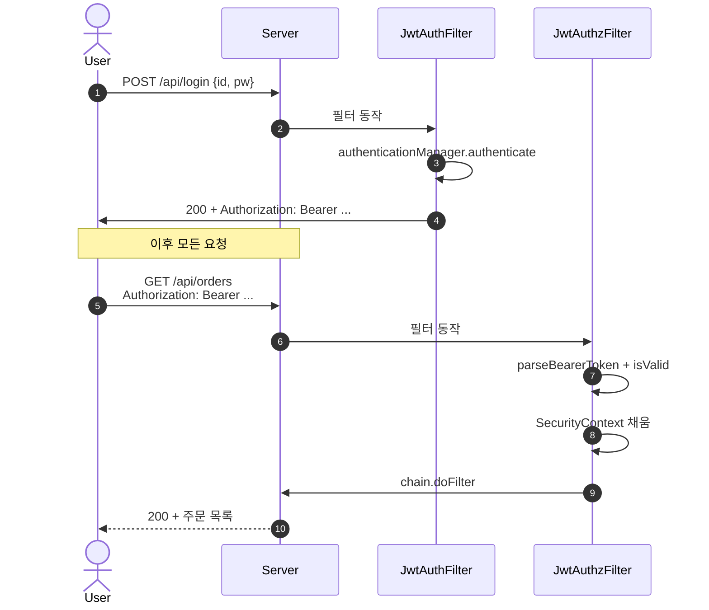

# JWT 인증 구현 (TokenProvider·필터 두 종류·STATELESS 세션)

---

> 폼 로그인이 세션 쿠키 기반이라면, JWT는 서버에 세션 상태를 두지 않고 클라이언트가 가진 토큰만으로 신원을 증명하는 방식이다. 이 글은 jjwt 라이브러리로 토큰을 발급·검증하고, Spring Security 6.x 필터 체인에 끼우는 표준 구조를 따라간다.

## 한 줄 정의

JWT 인증은 **세션 정책을 STATELESS로 두고, 로그인 시점에 토큰을 발급하는 필터와 매 요청마다 토큰을 검증하는 필터 두 개를 `UsernamePasswordAuthenticationFilter` 앞에 끼우는 구조**다.

## 왜 JWT인가, 그리고 왜 두 필터인가

> 세션 쿠키 방식은 서버가 세션 저장소(메모리·Redis)를 운영해야 한다. 마이크로서비스로 쪼개거나 다중 인스턴스를 운영할 때 세션 공유 비용이 누적된다. JWT는 서명만 검증하면 어느 인스턴스든 신원을 확인할 수 있어 무상태 분산 환경에 어울린다.

필터를 두 개로 나누는 이유는 책임이 분리되기 때문이다.

| 필터 | 시점 | 책임 |
|------|------|------|
| `JwtAuthenticationFilter` | 로그인 요청 1회 | id/pw 검증 → JWT 발급 → 응답 헤더로 전달 |
| `JwtAuthorizationFilter` | 모든 보호된 요청 | `Authorization` 헤더에서 JWT 추출 → 검증 → `SecurityContext` 채움 |

이 둘을 한 필터에 합치면 "로그인 안 한 요청도 토큰을 발급해야 하나?"같은 분기가 들어가 코드가 어지러워진다. 분리된 구조가 표준이다.

## JWT 구조 복습

JWT는 점(`.`)으로 연결된 세 부분이다.

```
eyJhbGc...    .  eyJpZC...    .  HsTjU...
─ Header        ─ Payload     ─ Signature
```

| 부분 | 내용 |
|------|------|
| Header | 서명 알고리즘(`alg`), 토큰 타입(`typ: JWT`) |
| Payload | Claims (사용자 ID, 만료, 발급자 등) |
| Signature | Header + Payload를 비밀키로 서명한 결과 |

서명이 핵심이다. **클라이언트가 Payload를 위조해도 비밀키 없이는 서명을 재생성할 수 없으므로 서버는 위조를 즉시 탐지**한다. 단 Payload는 base64-url 인코딩일 뿐 암호화되지 않으니, 민감정보(비밀번호·주민번호)는 절대 넣지 않는다.

## 의존성과 키 관리

```groovy
dependencies {
    implementation 'io.jsonwebtoken:jjwt-api:0.11.5'
    runtimeOnly 'io.jsonwebtoken:jjwt-impl:0.11.5'
    runtimeOnly 'io.jsonwebtoken:jjwt-jackson:0.11.5'
}
```

```yaml
jwt:
  secret: ${JWT_SECRET}
  expiration-seconds: 10800  # 3시간
```

비밀키를 코드나 application.yml 평문에 박으면 안 된다. 환경 변수·Vault·Parameter Store로 주입한다. 길이는 HS256(`HMAC-SHA256`)을 쓸 때 최소 32바이트가 필요하다. 짧으면 jjwt가 `WeakKeyException`을 던진다.

## TokenProvider — 토큰 발급과 검증의 단일 진입점

```java
@Component
public class TokenProvider {

    private final SecretKey key;
    private final long validitySeconds;

    public TokenProvider(@Value("${jwt.secret}") String secret,
                         @Value("${jwt.expiration-seconds}") long validitySeconds) {
        this.key = Keys.hmacShaKeyFor(secret.getBytes(StandardCharsets.UTF_8));
        this.validitySeconds = validitySeconds;
    }

    public String generate(User user) {
        Date now = new Date();
        Date expiry = new Date(now.getTime() + Duration.ofSeconds(validitySeconds).toMillis());

        return Jwts.builder()
                .setHeaderParam("typ", "JWT")
                .setSubject(String.valueOf(user.getId()))
                .claim("username", user.getUsername())
                .claim("role", user.getRole())
                .setIssuedAt(now)
                .setExpiration(expiry)
                .signWith(key, SignatureAlgorithm.HS256)
                .compact();
    }

    public boolean isValid(String token) {
        try {
            Jwts.parserBuilder().setSigningKey(key).build().parseClaimsJws(token);
            return true;
        } catch (ExpiredJwtException e) {
            log.info("만료된 토큰");
        } catch (UnsupportedJwtException | MalformedJwtException | SecurityException | IllegalArgumentException e) {
            log.info("유효하지 않은 토큰: {}", e.getMessage());
        }
        return false;
    }

    public Authentication toAuthentication(String token) {
        Claims claims = Jwts.parserBuilder().setSigningKey(key).build()
                .parseClaimsJws(token).getBody();

        Long userId = Long.parseLong(claims.getSubject());
        String role = claims.get("role", String.class);
        List<SimpleGrantedAuthority> authorities = List.of(new SimpleGrantedAuthority(role));

        // principal로 userId만 담은 가벼운 객체를 만들거나 PrincipalDetails 재구성
        return new UsernamePasswordAuthenticationToken(userId, token, authorities);
    }
}
```

`isValid`에서 예외를 종류별로 잡는 이유는 운영 로그에서 "왜 토큰이 거부됐는가"를 구분하기 위함이다. 만료와 위조를 같은 로그로 묶으면 보안 이슈와 단순 만료를 분간할 수 없다.

## JwtAuthenticationFilter — 로그인 + 토큰 발급

```java
public class JwtAuthenticationFilter extends UsernamePasswordAuthenticationFilter {

    private final AuthenticationManager authenticationManager;
    private final TokenProvider tokenProvider;

    public JwtAuthenticationFilter(AuthenticationManager authenticationManager, TokenProvider tokenProvider) {
        super(authenticationManager);
        this.authenticationManager = authenticationManager;
        this.tokenProvider = tokenProvider;
        setFilterProcessesUrl("/api/login");
    }

    @Override
    public Authentication attemptAuthentication(HttpServletRequest request, HttpServletResponse response) {
        try {
            LoginRequest dto = new ObjectMapper().readValue(request.getInputStream(), LoginRequest.class);
            UsernamePasswordAuthenticationToken token =
                    new UsernamePasswordAuthenticationToken(dto.getUsername(), dto.getPassword());
            return authenticationManager.authenticate(token);
        } catch (IOException e) {
            throw new InternalAuthenticationServiceException("로그인 요청 파싱 실패", e);
        }
    }

    @Override
    protected void successfulAuthentication(HttpServletRequest request, HttpServletResponse response,
                                            FilterChain chain, Authentication authResult) throws IOException {
        PrincipalDetails principal = (PrincipalDetails) authResult.getPrincipal();
        String jwt = tokenProvider.generate(principal.getUser());
        response.addHeader("Authorization", "Bearer " + jwt);

        response.setContentType("application/json");
        response.setStatus(HttpStatus.OK.value());
        new ObjectMapper().writeValue(response.getWriter(),
                Map.of("username", principal.getUsername()));
    }

    @Override
    protected void unsuccessfulAuthentication(HttpServletRequest request, HttpServletResponse response,
                                              AuthenticationException failed) throws IOException {
        response.setStatus(HttpStatus.UNAUTHORIZED.value());
        response.setContentType("application/json");
        new ObjectMapper().writeValue(response.getWriter(),
                Map.of("error", "로그인 실패"));
    }
}
```

`setFilterProcessesUrl("/api/login")`이 핵심이다. 폼 로그인 기본 경로 `/login` 대신 우리 API 경로로 바꿔, 폼 로그인과 JWT 로그인의 책임을 URL 단에서 분리한다.

## JwtAuthorizationFilter — 매 요청 토큰 검증

```java
public class JwtAuthorizationFilter extends OncePerRequestFilter {

    private final TokenProvider tokenProvider;

    public JwtAuthorizationFilter(TokenProvider tokenProvider) {
        this.tokenProvider = tokenProvider;
    }

    @Override
    protected void doFilterInternal(HttpServletRequest request, HttpServletResponse response,
                                    FilterChain chain) throws ServletException, IOException {
        String token = parseBearerToken(request);
        if (token != null && tokenProvider.isValid(token)) {
            Authentication auth = tokenProvider.toAuthentication(token);
            SecurityContextHolder.getContext().setAuthentication(auth);
        }
        chain.doFilter(request, response);
    }

    private String parseBearerToken(HttpServletRequest request) {
        String header = request.getHeader(HttpHeaders.AUTHORIZATION);
        if (header == null || !header.startsWith("Bearer ")) return null;
        return header.substring(7);
    }
}
```

`OncePerRequestFilter`를 상속하는 이유는 [01-02 §OncePerRequestFilter](01-02.Spring Security 기본 구현.md)에서 설명했다. forward·include 발생 시 중복 실행을 막는다.

토큰이 없거나 유효하지 않으면 단순히 `SecurityContext`를 비워 두고 다음 필터로 넘긴다. `AuthorizationFilter`가 인증 누락을 판단해 401·403을 반환할 것이다. 여기서 직접 응답을 쓰지 않는 이유는, "토큰 없음"이 곧 "인증 실패"를 의미하지 않기 때문이다(공개 엔드포인트는 토큰 없이도 200).

## SecurityFilterChain — 두 필터 등록

```java
@Configuration
@EnableWebSecurity
@RequiredArgsConstructor
public class SecurityConfig {

    private final TokenProvider tokenProvider;
    private final AuthenticationConfiguration authConfig;

    @Bean
    public PasswordEncoder passwordEncoder() { return new BCryptPasswordEncoder(); }

    @Bean
    public AuthenticationManager authenticationManager() throws Exception {
        return authConfig.getAuthenticationManager();
    }

    @Bean
    public SecurityFilterChain filterChain(HttpSecurity http) throws Exception {
        AuthenticationManager am = authenticationManager();

        http
            .csrf(csrf -> csrf.disable())
            .sessionManagement(sm -> sm.sessionCreationPolicy(SessionCreationPolicy.STATELESS))
            .authorizeHttpRequests(auth -> auth
                .requestMatchers("/api/login", "/api/join").permitAll()
                .requestMatchers("/api/admin/**").hasRole("ADMIN")
                .anyRequest().authenticated())
            .addFilter(new JwtAuthenticationFilter(am, tokenProvider))
            .addFilterBefore(new JwtAuthorizationFilter(tokenProvider),
                             UsernamePasswordAuthenticationFilter.class);

        return http.build();
    }
}
```

세 가지를 짚는다.

1. **`addFilter` vs `addFilterBefore`** — `JwtAuthenticationFilter`는 `UsernamePasswordAuthenticationFilter`를 상속하므로 `addFilter` 한 번이면 같은 위치에 들어간다. `JwtAuthorizationFilter`는 별도 필터라 명시적 위치 지정이 필요하다.
2. **`STATELESS` 세션** — JWT를 쓰는 이상 `JSESSIONID` 쿠키 발급을 막아야 무상태 가정이 깨지지 않는다.
3. **`csrf().disable()`** — CSRF는 세션 쿠키 방식의 공격 표면이다. JWT를 `Authorization` 헤더로 전송한다면 CSRF 공격 자체가 성립하지 않으므로 비활성화가 표준이다.

## 호출 흐름 통합도



로그인은 1회, 검증은 매 요청이다. 검증 비용이 매 요청마다 발생하지만, jjwt의 HS256 파싱은 마이크로초 단위라 실무에서 병목이 되지 않는다.

## Refresh Token 보강 (간단 메모)

본 글은 Access Token만 다룬다. 운영에서는 다음을 추가한다.

- Access Token 만료를 짧게(30분~1시간)
- Refresh Token을 DB·Redis에 저장하고 길게(7일~30일)
- `/api/auth/refresh` 엔드포인트에서 Refresh로 새 Access 발급
- 로그아웃 시 Refresh를 저장소에서 삭제해 재발급 차단

Refresh Token을 클라이언트 LocalStorage에 두지 않고 HttpOnly 쿠키로 격리하는 패턴이 XSS 위험을 낮춘다.

## 면접 대비 요약

### 한 줄 정의

"JWT 인증은 세션 정책을 STATELESS로 두고, 로그인용 `JwtAuthenticationFilter`와 검증용 `JwtAuthorizationFilter`를 `UsernamePasswordAuthenticationFilter` 앞에 끼우는 구조다. `TokenProvider`가 jjwt로 발급·검증 책임을 갖는다."

### 핵심 포인트 3가지

1. **두 필터의 책임 분리** — 인증(로그인 시점)과 인가(매 요청)는 시점이 다르고 응답 방식도 다르다. 한 필터에 합치면 분기가 폭증한다.
2. **`STATELESS` + `csrf().disable()`은 한 쌍** — JWT를 쓰는데 세션이 생기면 무상태 가정이 깨지고, CSRF가 켜져 있으면 비세션 환경에서 무용한 검증만 추가된다.
3. **Payload는 인코딩이지 암호화가 아니다** — 누구나 base64-url을 풀어 claims를 본다. 민감정보 절대 금지. 위조 방지는 서명이 책임진다.

### 자주 묻는 질문

Q: 토큰을 클라이언트에 어디에 저장하는가?
A: LocalStorage는 XSS에 노출, 일반 쿠키는 CSRF에 노출. `HttpOnly` + `Secure` + `SameSite=Strict` 쿠키가 가장 안전하다. 단 이 경우 `Authorization` 헤더 대신 쿠키에서 토큰을 추출하도록 필터를 수정해야 한다.

Q: 토큰을 무효화하려면?
A: JWT는 서명이 유효한 한 만료 전까지 자체적으로 살아 있다. 강제 무효화가 필요하면 (1) 만료를 짧게 잡고 Refresh로 재발급 통제, (2) Redis에 블랙리스트 저장 + `JwtAuthorizationFilter`에서 조회. 둘 다 무상태 가정을 일부 깬다.

Q: Spring Security의 `oauth2-resource-server`와 직접 구현 중 어느 쪽이 표준인가?
A: 자체 인가 서버를 두고 JWT를 발급한다면 `oauth2-resource-server`(`spring-boot-starter-oauth2-resource-server`)가 표준이다. JWK Set URI만 등록하면 검증이 자동이다. 본 글의 직접 구현은 인가 서버 없이 단일 앱이 발급·검증을 동시에 할 때, 또는 학습 목적에 적합하다.

## 관련 문서

- [01-02.Spring Security 기본 구현](01-02.Spring Security 기본 구현.md) — `SecurityFilterChain`과 커스텀 필터 끼우기
- [02-01.OAuth2 개념과 흐름](02-01.OAuth2 개념과 흐름.md) — JWT가 OAuth2/OIDC 흐름의 산물인 경우
- [JWT (RFC 7519)](https://datatracker.ietf.org/doc/html/rfc7519)
- [OAuth2 Resource Server with JWT (공식)](https://docs.spring.io/spring-security/reference/servlet/oauth2/resource-server/jwt.html)
