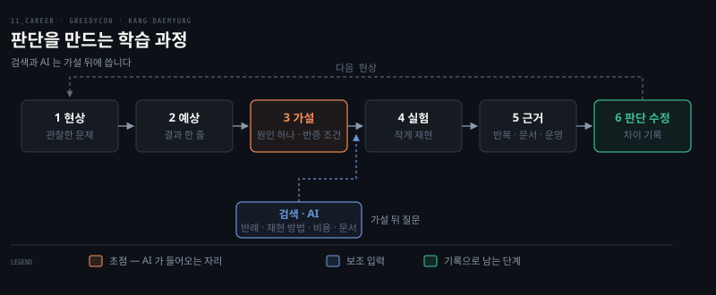

# 운영하기와 판단을 위한 학습 — 예상 먼저 적기와 실패 설계 (강대명)
---

> 강대명의 GREEDYCON 발표 "Learn it, Run it, Question it." 가운데 공부 방법 두 가지를 정리한 글입니다. 첫째는 만드는 것보다 운영해 보는 것이고, 둘째는 AI에게 묻기 전에 내 예상을 먼저 적는 것입니다.

마지막에 대학생이라는 시기를 실패 설계에 쓰는 방법이 붙습니다. 왜 이 두 방법이 필요한지는 [`02-01`](./02-01.AI%20시대%20신입%20개발자의%20역할%20—%20구현%20지식에서%20판단%20지식으로%20(강대명).md)이 세웠습니다. 두 번째 방법을 Neo4j 한 사례로 끝까지 따라간 편은 [`02-03`](./02-03.Neo4j%20분할%20사례%20—%20운영%20질문%20하나로%20그래프%20파티셔닝까지%20(강대명).md)입니다. 발표는 대학생을 향한 것이지만 여기서 말하는 운영과 가설의 습관은 연차와 무관하게 적용됩니다. 슬라이드 원문은 [`_raw/`](./_raw/) 아래에 있습니다. 발표 내용은 발표자의 개인적 견해입니다.

---

## 1. 만들기만 하면 왜 모자란가 — 기술의 숨은 제약은 실제 사용자를 통해 드러난다

> 완성은 기술 공부의 끝이 아니라 관찰을 시작할 수 있는 상태입니다. 만들기가 정상 경로에서 동작하는 것이라면, 운영하기는 데이터와 사용 방식이 변해도 계속 동작하는 것입니다.

대학생이 기술을 공부하는 흔한 방법은 토이 프로젝트를 하나 만들어 보는 것입니다. 발표자는 여기서 한 걸음을 더 요구합니다. 만든 것을 운영해 보라는 것입니다. 만들기는 정상 경로에서 동작하는 상태까지를 말하고, 운영하기는 데이터와 사용 방식이 변해도 계속 동작하는 상태를 말합니다. 둘 사이에 기술의 숨은 제약이 숨어 있는데, 그 제약은 문서를 읽어서가 아니라 실제 사용자를 통해서만 드러납니다.

운영에서 배울 수 있는 것으로 발표자가 꼽는 네 가지는 전부 정상 경로 바깥에 있습니다.

- 예상하지 못한 입력과 사용 방법
- 데이터 증가에 따른 성능 변화
- 동시 실행과 재시도
- 각종 장애 처리

네 가지 모두 "만들었다"는 시점에는 보이지 않습니다. 동시 실행 문제는 요청이 겹쳐야 생깁니다. 성능 변화는 데이터가 쌓여야 생기고, 장애는 시간이 지나야 납니다. 완성이 끝이 아니라 관찰의 시작이라는 말은 그래서 나옵니다.

### 오해 1 — 사용자가 많아야 운영이다

운영이라고 하면 사용자가 수만 명은 있어야 할 것 같아 시작을 못 하는 경우가 많습니다. 발표자는 중요한 것이 사용자 수가 아니라 실제로 반복해서 사용되는가라고 못 박습니다. 사용자가 서너 명이어도 충분하고, 그중 한 명은 나 자신이어야 하며 매일 써야 합니다. 나와 다른 방식으로 쓰는 사람이 한 명 더 있으면 더 좋습니다. 같은 기능을 반복해서 써야 불편과 예외 상황이 보이기 때문입니다. 한 번 시연하고 끝난 프로젝트는 운영을 시작하지 않은 것입니다.

### 오해 2 — 배포만 하면 운영이다

서버에 올려 두고 URL이 열리면 운영하고 있다고 생각하기 쉽습니다. 발표자는 배포와 운영을 구분하고, 운영 중이라면 답할 수 있어야 하는 질문 넷을 듭니다.

- 지금 정상적으로 동작하고 있는가
- 응답이 느려지고 있지는 않은가
- 오류는 얼마나 발생하는가
- CPU, Memory, Disk 등의 자원 사용량은 얼마인가

이 넷에 답할 수 없으면 배포한 것이지 운영하는 것이 아닙니다. 운영은 기능 추가가 아니라 안정적인 기능을 계속 유지하는 것입니다. 네 질문은 관측 가능성에서 말하는 Golden Signals(지연·트래픽·오류·포화)와 거의 그대로 겹칩니다. 발표자가 학생에게 요구하는 최소 운영이 곧 SRE의 기본 신호 네 가지라는 점이 흥미롭습니다.

> 네 질문을 지표로 옮기는 방법은 [`06_observability/01-03.시그널 모델 — Golden Signals, RED, USE`](../06_observability/01_Foundations/01-03.시그널%20모델%20—%20Golden%20Signals,%20RED,%20USE.md)에, "안정적인 기능을 계속 유지"를 목표 수치로 정하는 방법은 [`01-04.SLO와 알림`](../06_observability/01_Foundations/01-04.SLO와%20알림%20—%20Error%20Budget,%20Burn%20Rate.md)에 있습니다.

## 2. 왜 너무 빨리 정답을 아는 것이 위험한가 — AI에게 묻기 전에 내 예상을 먼저 적는다

> 판단 능력은 정답을 학습해서가 아니라 자기 생각을 만드는 시간에서 자랍니다. 그래서 첫 번째 규칙은 "AI에게 묻기 전에 내 예상을 먼저 적는다"입니다.

여섯 단계는 한 줄로 이어지고, 검색과 AI는 가설을 세운 뒤에야 들어옵니다. 도식이 보여주는 것은 순서 자체보다 그 진입 지점입니다. 이 절은 각 단계에서 무엇을 적는지를 따라갑니다.

[`02-01`](./02-01.AI%20시대%20신입%20개발자의%20역할%20—%20구현%20지식에서%20판단%20지식으로%20(강대명).md)의 결론은 개발자가 준비할 것이 구현 지식이 아니라 판단 지식이라는 것이었습니다. 그런데 AI가 어떤 질문에도 그럴듯한 답을 바로 주는 환경에서 판단은 오히려 자라기 어렵습니다. 발표자는 틀린 답을 내는 것보다 너무 빨리 정답을 아는 것이 더 위험하다고 말합니다. 답을 먼저 보면 내 예상과 결과 사이의 차이가 생기지 않고, 그 차이가 없으면 배울 것도 없기 때문입니다.

그래서 규칙은 하나입니다. AI에게 묻기 전에 내 예상을 먼저 적는 것입니다. 답을 보기 전에 적을 것은 셋입니다.

- 어떤 결과가 나올 것으로 예상하는가
- 왜 그런 결과가 나온다고 생각하는가
- 무슨 결과가 나오면 내 생각이 틀렸다고 인정할 것인가

오래 고민하라는 말이 아니라 검증 가능한 생각을 만들라는 뜻이라고 발표자는 덧붙입니다. 한 줄이어도 됩니다. 있고 없고가 갈립니다.

### 판단을 만드는 여섯 단계

발표자가 정리한 학습 과정은 현상, 예상, 가설, 실험, 근거, 판단 수정의 여섯 단계입니다. 각 단계에서 적는 것은 다음과 같습니다.

예상은 실행하기 전에 결과를 한 줄로 적는 것입니다. 예상이 있어야 실제 결과와의 차이가 보입니다. 가설은 원인을 하나 골라 설명해 보는 것입니다. 모든 가능성을 나열하지 말고 먼저 확인할 설명 하나를 정합니다. 반증 조건은 내 생각이 틀렸음을 보여줄 결과를 먼저 정하는 것입니다. 맞는 증거만 찾는 습관에서 벗어나게 해 줍니다.

근거에는 순서가 있습니다. 발표자는 강한 순서대로 넷을 놓습니다.

1. 작게 재현한 실행 결과
2. 같은 조건을 반복한 테스트
3. 공식 문서와 실제 코드
4. 운영 환경에서 다시 관찰한 결과

설명보다 실행 결과가 강하고, 한 번의 결과보다 반복된 결과가 강하다는 것이 기준입니다. 이 순서를 정리하면서 눈에 띈 것은 공식 문서가 세 번째라는 점입니다. 슬라이드가 이유를 따로 적지는 않았습니다. 문서는 일반론이고 내 조건에서 실제로 어떻게 되는지는 실행해 봐야 안다는 뜻으로 읽힙니다. 마지막 단계인 판단 수정은 정답을 얻는 데서 끝내지 않고 처음 생각과 결과가 어떻게 달랐는지 기록하는 것입니다. 발표자는 그때 경험이 지식으로 남는다고 말합니다.

### AI는 가설 뒤에 쓴다

이 여섯 단계에서 AI의 자리는 가설 뒤입니다. 발표자는 두 시점을 대비합니다. 바로 질문하면 생각 없이 답을 채택하기 쉽고, 가설을 세운 뒤 질문하면 반례와 검증 방법을 비교할 수 있습니다. AI가 생각을 대신하지 않고 생각을 넓혀 주는 쪽으로 쓰이려면 순서가 이래야 합니다. 가설이 있을 때 AI에게 물어볼 질문은 다음 넷입니다.

- 내 가설이 틀릴 수 있는 조건은 무엇인가
- 이 문제를 더 작게 재현하는 방법은 무엇인가
- 서로 다른 해결책이 감수하는 비용은 무엇인가
- 어느 공식 문서와 코드를 확인해야 하는가

넷 다 "답을 달라"가 아니라 "내 생각을 시험할 재료를 달라"는 질문입니다. 좋은 질문은 이미 문제를 상당히 이해했다는 증거라는 말이 그래서 나옵니다. 같은 AI를 써도 처음부터 "분산하는 법을 알려줘"라고 묻는 사람과 "이 질의 패턴에서 내 분할 가설의 반례를 찾아줘"라고 묻는 사람의 학습 결과는 다릅니다. 그 대비를 실제 사례로 끝까지 밟은 것이 [`02-03`](./02-03.Neo4j%20분할%20사례%20—%20운영%20질문%20하나로%20그래프%20파티셔닝까지%20(강대명).md)입니다.

> 질문의 형태가 답의 품질을 바꾼다는 관점은 [`10_AI/02-06.Prompt Engineering`](../10_AI/02-06.Prompt%20Engineering%20—%20지시·역할·형식·예시로%20모델을%20조종하기.md)이 모델 쪽에서 다룹니다. 이 문서는 같은 이야기를 묻는 사람의 학습 쪽에서 봅니다.

## 3. 대학생은 왜 실패하기 좋은 시기인가 — 실패를 기다리지 않고 설계한다

> 책임질 실제 고객이 적고 잘못된 선택을 다시 해볼 시간이 많다는 것은, 더 많이 검증해도 된다는 뜻입니다.

앞의 두 방법은 운영과 실험을 요구합니다. 그런데 운영에서 장애를 내고 실험에서 틀리는 일은 현업에서는 비싼 일입니다. 발표자는 여기서 대학생이라는 시기의 장점을 꺼냅니다. 현업의 실패는 장애가 고객과 매출에 영향을 주지만, 대학생은 안전한 환경에서 실패를 설계할 수 있습니다. 실패 비용이 낮다는 사실을 학습에 쓰라는 것입니다.

설계할 수 있는 실패로 발표자가 든 예는 넷입니다.

- 프로세스를 중간에 종료한다
- 두 요청이 동시에 같은 데이터를 수정하게 한다
- 데이터를 백 배 늘려 다시 측정한다
- 캐시와 원본 값을 일부러 다르게 만든다

넷은 1절의 "운영에서 배울 수 있는 것"과 짝이 맞습니다. 프로세스 종료는 장애 처리, 동시 수정은 동시 실행과 재시도, 백 배 증가는 데이터 증가에 따른 성능 변화, 캐시 불일치는 예상하지 못한 상태입니다. 운영하다 보면 언젠가 만나는 일을 기다리지 않고 지금 만들어서 검증하는 것입니다.

다만 실패를 만드는 것만으로는 부족합니다. 예측과 기록이 없는 실패는 그냥 시행착오로 끝납니다. 실패 전 예상, 실패 후 관찰, 다음 실험이 함께 있어야 합니다. 이건 2절의 여섯 단계를 실패 실험에 그대로 적용한 것입니다. 발표자의 마지막 문장이 이 편 전체를 요약합니다. 학생 때 실패해도 된다는 말은 더 많이 검증해도 된다는 뜻입니다.

> 실패 주입을 도구로 체계화한 것이 카오스 엔지니어링입니다. 발표자가 든 네 가지는 도구 없이 손으로 할 수 있는 최소 버전입니다.

## 관련 문서

- [AI 시대 신입 개발자의 역할 — 구현 지식에서 판단 지식으로](./02-01.AI%20시대%20신입%20개발자의%20역할%20—%20구현%20지식에서%20판단%20지식으로%20(강대명).md) — 이 공부 방법이 왜 필요한지를 세운 앞 편
- [Neo4j 분할 사례 — 운영 질문 하나로 그래프 파티셔닝까지](./02-03.Neo4j%20분할%20사례%20—%20운영%20질문%20하나로%20그래프%20파티셔닝까지%20(강대명).md) — 여섯 단계를 실제 사례로 밟은 편
- [시그널 모델 — Golden Signals, RED, USE](../06_observability/01_Foundations/01-03.시그널%20모델%20—%20Golden%20Signals,%20RED,%20USE.md) — 운영 오해 2의 네 질문을 지표로 옮기는 방법
- [SLO와 알림 — Error Budget, Burn Rate](../06_observability/01_Foundations/01-04.SLO와%20알림%20—%20Error%20Budget,%20Burn%20Rate.md) — "안정적인 기능을 계속 유지"를 수치로 정하는 방법
- 원문 정돈본: [GREEDYCON 좋은 개발자 되기 for 대학생](./_raw/02-01.원문%20—%20GREEDYCON%20좋은%20개발자%20되기%20for%20대학생%20(강대명).md)
