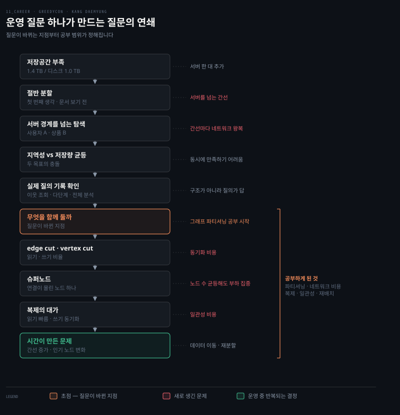

# Neo4j 분할 사례 — 운영 질문 하나로 그래프 파티셔닝까지 (강대명)
---

> 강대명의 GREEDYCON 발표 "Learn it, Run it, Question it." 후반부의 Neo4j 사례를 정리한 글입니다. 기능 목록부터 읽는 대신 운영에서 생긴 질문 하나를 끝까지 따라가면 공부의 범위가 저절로 정해진다는 것을 보여주는 사례입니다.

따라가는 방법 자체(예상 먼저·가설·반증 조건·근거의 순서)는 [`02-02`](./02-02.운영하기와%20판단을%20위한%20학습%20—%20예상%20먼저%20적기와%20실패%20설계%20(강대명).md)가 정본입니다. 이 문서는 그 방법이 실제로 어떤 질문의 연쇄를 만드는지를 봅니다. 사례에 등장하는 샤딩·핫스팟·복제·리밸런싱의 기술 본문은 이 카테고리의 범위가 아니어서 [`05_data/`](../05_data/)의 해당 절로 링크합니다. 슬라이드 원문은 [`_raw/`](./_raw/) 아래에 있습니다. 발표 내용은 발표자의 개인적 견해입니다.

---

## 1. 문서를 읽기 전에 왜 먼저 생각하는가 — 저장공간이 찬 Neo4j 한 대

> 시작은 기능 목록이 아니라 운영 중 생긴 문제 하나입니다. 문서를 보기 전에 자신이 생각한 가장 단순한 해결책부터 적습니다.

한 질문의 답이 다음 질문을 만드는 연쇄입니다. 가운데에서 "어떻게 나눌까"가 "무엇을 함께 둘까"로 바뀌는 지점이 이 사례의 핵심이고, 그 뒤로 공부 범위가 정해집니다.

새 기술을 공부할 때 흔히 공식 문서의 기능 목록부터 읽습니다. 발표자는 반대 방향을 제안합니다. 운영에서 생긴 질문에서 출발해 끝까지 따라가는 것입니다. 사례의 출발점은 단순합니다. Neo4j 한 대의 저장공간이 거의 가득 찼고, 서버를 한 대 더 추가하려고 합니다. 슬라이드의 그림으로는 저장할 데이터가 1.4 TB인데 서버 디스크는 1.0 TB라 0.4 TB가 밖으로 밀려나 있는 상태입니다.

여기서 [`02-02`](./02-02.운영하기와%20판단을%20위한%20학습%20—%20예상%20먼저%20적기와%20실패%20설계%20(강대명).md)의 첫 규칙이 적용됩니다. 문서를 보기 전에 예상을 먼저 적는 것입니다. 발표자가 적은 첫 번째 생각은 "노드를 절반씩 나누면 되지 않을까"입니다. 틀려도 괜찮은, 자신이 생각한 가장 단순한 해결책입니다. 이 한 줄이 있어야 뒤에 나올 결과와의 차이가 보입니다.

## 2. 절반으로 나누면 무엇이 새로 생기는가 — 서버를 넘는 간선과 탐색 비용

> 저장공간 문제를 해결하면서 탐색 비용을 만들었습니다. 그래프 탐색의 비용은 노드 수만으로 정해지지 않습니다.

절반으로 나누면 얻는 것은 분명합니다. 서버별 저장량이 줄었습니다. 그런데 새로 생기는 것이 있습니다. 서버를 넘는 간선입니다. 그래프에서 노드는 혼자 있지 않고 간선으로 이어져 있으니, 노드를 둘로 가르면 두 서버 사이를 잇는 간선이 반드시 생깁니다.

그 간선이 왜 문제인지는 질의 하나로 보입니다. "사용자에서 구매한 상품을 따라간다"는 질의에서 사용자는 서버 A에, 상품은 서버 B에 저장됐다면, 간선을 따라갈 때마다 네트워크 요청이 필요합니다. 한 서버 안에서 포인터를 따라가던 일이 서버 간 왕복이 됩니다. 발표자의 정리는 그래프 탐색의 비용이 노드 수만으로 정해지지 않는다는 것입니다. 저장량을 반으로 줄이는 데 성공한 첫 번째 가설이 탐색 비용이라는 새 문제를 만들었고, 이 관찰이 다음 질문을 부릅니다.

> 관계형 데이터의 샤딩은 행 단위라 이 문제가 덜 보입니다. 그래프에서 유독 "무엇이 서버를 넘는가"가 문제가 되는 이유는 데이터 모델 자체가 연결을 1급으로 두기 때문이고, 그 모델의 성격은 [`05_data/03-05.그래프 데이터 모델`](../05_data/book/designing-data-intensive-applications/03-05.그래프%20데이터%20모델.md)에 있습니다.

## 3. 질문이 바뀌는 지점 — 어떻게 나눌까에서 무엇을 함께 둘까로

> 서로 연결된 노드가 자주 함께 조회된다면, 균등한 저장보다 탐색의 지역성이 더 중요할 수 있습니다. 이 순간부터 단순 분할이 그래프 파티셔닝 공부로 이어집니다.

서버를 넘는 간선이 비싸다면 두 번째 질문이 나옵니다. 서로 연결된 노드가 자주 함께 조회된다면 어떻게 해야 하는가. 자주 함께 찾는 노드를 같은 서버에 두면 왕복이 줄어듭니다. 그러면 균등한 저장보다 탐색의 지역성이 더 중요할 수 있습니다.

그런데 두 목표는 충돌합니다. 슬라이드는 두 기준이 무엇을 맞추는지만 적었고, 세 번째 열의 대가는 앞 절의 내용을 바탕으로 정리하면서 붙인 것입니다.

| 분할 기준 | 무엇을 맞추는가 | 대가 |
|---|---|---|
| 저장량 균등 | 두 서버의 용량과 기본 부하를 맞춘다 | 연결된 노드가 갈라져 서버를 넘는 탐색이 생긴다 |
| 탐색 지역성 | 자주 함께 찾는 노드를 같은 서버에 둔다 | 저장량과 부하가 한쪽으로 쏠릴 수 있다 |

발표자는 두 목표를 동시에 완벽하게 만족시키기 어렵다고 말합니다. 그러면 어느 쪽을 우선할지 정해야 하고, 그 판단은 그래프 구조가 아니라 서비스의 질의 기록에서 나옵니다. 먼저 확인할 실제 질의로 발표자가 든 것은 넷입니다.

- 한 단계 이웃 조회가 대부분인가
- 여러 단계를 연속해서 탐색하는가
- 특정 종류의 노드 사이를 반복해서 오가는가
- 전체 그래프를 분석하는 작업이 있는가

한 단계 이웃 조회가 대부분이라면 서버를 넘는 간선의 비용이 크지 않고, 여러 단계를 연속 탐색한다면 지역성이 훨씬 중요해집니다. 답이 질의 기록에 있다는 것은 [`02-02`](./02-02.운영하기와%20판단을%20위한%20학습%20—%20예상%20먼저%20적기와%20실패%20설계%20(강대명).md)의 근거 순서에서 "운영 환경에서 다시 관찰한 결과"에 해당합니다.

여기서 질문이 바뀝니다. "어떻게 절반으로 나눌까"가 "무엇을 함께 둘까"가 됐습니다. 발표자는 이 순간부터 단순 분할이 그래프 파티셔닝 공부로 이어진다고 말합니다. 기능 목록에서 "파티셔닝"이라는 항목을 읽었다면 왜 필요한지 모른 채 지나갔을 개념이, 자기 질문의 답으로 등장하니 공부할 이유가 생깁니다.

## 4. 함께 두는 방법의 대가 — edge cut, vertex cut, 슈퍼노드, 복제

> 간선을 자를지 노드를 복제할지는 읽기와 쓰기의 비율에 따라 달라지고, 연결이 몰린 노드 하나는 노드 수가 균등해도 부하를 한곳에 모읍니다.

무엇을 함께 둘지 정했다면 어떻게 자를지의 방법이 나옵니다. 발표자는 두 가지를 대비합니다. 간선을 자르는 방법(edge cut)은 노드는 한 곳에 두고 원격 간선을 만듭니다. 노드를 복제하는 방법(vertex cut)은 탐색은 줄이지만 동기화 비용이 생깁니다. 어느 쪽이 나은지는 읽기와 쓰기의 비율에 따라 달라집니다.[^cut]

방법을 골라도 문제는 남습니다. 슈퍼노드입니다. 연결이 몰린 노드 하나가 서버의 균형을 깨뜨립니다. 유명 사용자나 인기 상품은 노드 수가 균등해도 부하를 한곳에 모읍니다. 저장량을 아무리 고르게 나눠도 요청이 한 노드로 쏠리면 그 노드가 있는 서버만 뜨거워집니다. 관계형 샤딩에서 말하는 핫스팟과 같은 문제이고, 그쪽에서는 셀럽 ID에 무작위 접두사를 붙여 흩는 답이 알려져 있습니다.

> 핫스팟이 생기는 자리와 접두사 분산이라는 답은 [`05_data/02-04.샤딩`](../05_data/01_foundation/02-04.샤딩.md)의 "핫스팟과 스큐 문제" 절에, 해시 샤딩으로도 핫 키는 해결되지 않는다는 점은 [`07-02.해시 샤딩과 일관 해싱`](../05_data/book/designing-data-intensive-applications/07-02.해시%20샤딩과%20일관%20해싱.md)에 있습니다.

복제를 택했다면 복제의 대가를 냅니다. 읽기는 가까운 복제본에서 빠르게 탐색하지만, 쓰기는 모든 복제본의 최신 상태를 맞춰야 합니다. 읽기 성능을 얻는 대신 쓰기와 일관성 비용을 내는 것입니다. 이 트레이드오프는 그래프에 국한되지 않고 복제 일반의 것입니다.

> 복제본 사이의 최신 상태를 맞추는 방식과 그 지연이 만드는 읽기 이상 현상은 [`05_data/06-01.복제 개요와 단일 리더`](../05_data/book/designing-data-intensive-applications/06-01.복제%20개요와%20단일%20리더.md), [`06-03.복제 지연 문제와 일관성 보장`](../05_data/book/designing-data-intensive-applications/06-03.복제%20지연%20문제와%20일관성%20보장.md)에 있습니다.

## 5. 오늘의 좋은 분할이 다음 달에도 좋을까 — 시간이 만든 문제와 공부 범위의 확정

> 간선이 늘고 인기 노드가 바뀌면 데이터 이동과 재분할이 필요합니다. 제품 설명서를 외우지 않았지만 공부의 범위가 구체적으로 정해졌습니다.

마지막 질문은 시간입니다. 오늘 질의 기록을 보고 잘 나눴다 해도 다음 달에는 간선이 늘고 인기 노드가 바뀝니다. 그러면 데이터 이동과 재분할이 필요합니다. 분할은 한 번 하고 끝나는 결정이 아니라 운영 중에 다시 해야 하는 일입니다.

> 샤드를 옮기고 요청을 새 위치로 보내는 리밸런싱은 [`05_data/07-03.요청 라우팅과 리밸런싱`](../05_data/book/designing-data-intensive-applications/07-03.요청%20라우팅과%20리밸런싱.md)에 있습니다.

여기까지 오면 저장공간이 찼다는 질문 하나에서 공부하게 된 것이 넷으로 정리됩니다.

- 그래프 파티셔닝과 지역성
- 서버 사이의 네트워크 비용
- 복제와 일관성
- 부하 집중과 데이터 재배치

발표자의 정리는 제품 설명서를 외우지 않았지만 공부의 범위가 구체적으로 정해졌다는 것입니다. 넷은 각각 [`05_data`](../05_data/) 로드맵의 5단계(복제와 샤딩)에 흩어져 있는 주제인데, 기능 목록으로 읽으면 왜 배우는지 모를 항목들이 한 운영 질문 아래에서는 순서까지 붙어 나왔습니다.

그리고 이제야 AI에게 묻습니다. 발표자가 대비한 두 질문이 이 사례의 결론입니다.

| 시점 | 질문 |
|---|---|
| 처음부터 | Neo4j를 분산하는 법을 알려줘 |
| 고민한 뒤 | 이 질의 패턴에서 내 분할 가설의 반례를 찾아줘 |

두 번째 질문은 아무나 던질 수 없습니다. 질의 패턴을 이미 확인했고 분할 가설을 세운 사람, 그래서 다음 단계가 반례 찾기라는 것을 아는 사람만 던질 수 있습니다. 같은 AI라도 질문하는 사람이 만든 학습 결과는 다릅니다. [`02-02`](./02-02.운영하기와%20판단을%20위한%20학습%20—%20예상%20먼저%20적기와%20실패%20설계%20(강대명).md)의 "AI는 가설 뒤에 쓴다"가 이 사례에서 실제로 어떤 질문이 되는지가 여기서 보입니다.

## 관련 문서

- [운영하기와 판단을 위한 학습 — 예상 먼저 적기와 실패 설계](./02-02.운영하기와%20판단을%20위한%20학습%20—%20예상%20먼저%20적기와%20실패%20설계%20(강대명).md) — 이 사례가 따르는 여섯 단계의 정본
- [AI 시대 신입 개발자의 역할 — 구현 지식에서 판단 지식으로](./02-01.AI%20시대%20신입%20개발자의%20역할%20—%20구현%20지식에서%20판단%20지식으로%20(강대명).md) — 같은 발표의 앞 편
- [그래프 데이터 모델](../05_data/book/designing-data-intensive-applications/03-05.그래프%20데이터%20모델.md) — Neo4j의 속성 그래프 모델과 Cypher
- [샤딩](../05_data/01_foundation/02-04.샤딩.md) — 핫스팟과 스큐, 접두사 분산
- [샤딩 개요와 키 범위 샤딩](../05_data/book/designing-data-intensive-applications/07-01.샤딩%20개요와%20키%20범위%20샤딩.md), [해시 샤딩과 일관 해싱](../05_data/book/designing-data-intensive-applications/07-02.해시%20샤딩과%20일관%20해싱.md), [요청 라우팅과 리밸런싱](../05_data/book/designing-data-intensive-applications/07-03.요청%20라우팅과%20리밸런싱.md) — DDIA 7장 샤딩 정독 노트
- [복제 개요와 단일 리더](../05_data/book/designing-data-intensive-applications/06-01.복제%20개요와%20단일%20리더.md), [복제 지연 문제와 일관성 보장](../05_data/book/designing-data-intensive-applications/06-03.복제%20지연%20문제와%20일관성%20보장.md) — DDIA 6장 복제 정독 노트
- 원문 정돈본: [GREEDYCON 좋은 개발자 되기 for 대학생](./_raw/02-01.원문%20—%20GREEDYCON%20좋은%20개발자%20되기%20for%20대학생%20(강대명).md)

[^cut]: 슬라이드는 두 방법을 "간선을 자른다"와 "노드를 복제한다"로만 적고 edge cut, vertex cut이라는 이름을 제목에 둡니다. 발표 밖 보강으로, 이 두 분할 방식을 읽기·쓰기 비율과 차수 분포(power-law) 관점에서 비교한 원 논문은 PowerGraph(Gonzalez 외, OSDI 2012)입니다. [usenix.org/conference/osdi12/technical-sessions/presentation/gonzalez](https://www.usenix.org/conference/osdi12/technical-sessions/presentation/gonzalez). 이 문서는 발표 범위를 넘어 두 방식의 상세를 설명하지 않습니다.
