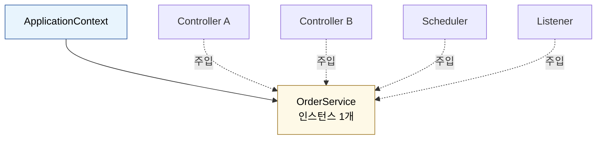
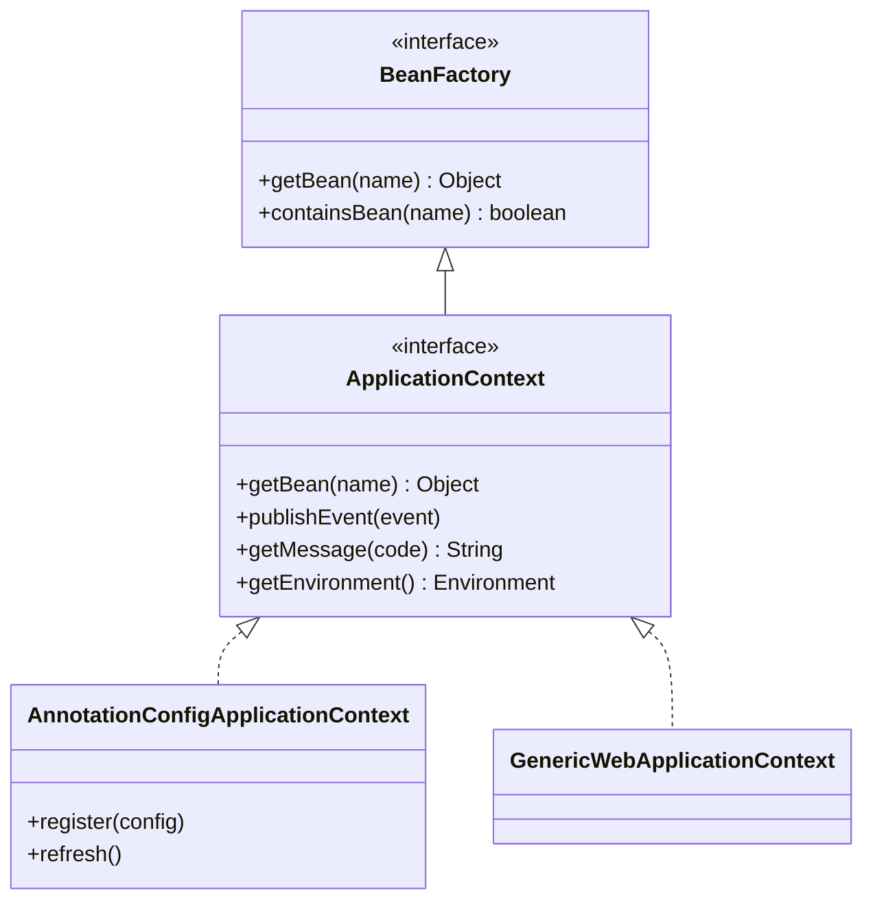
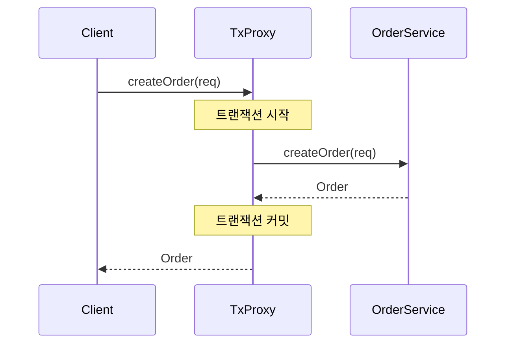
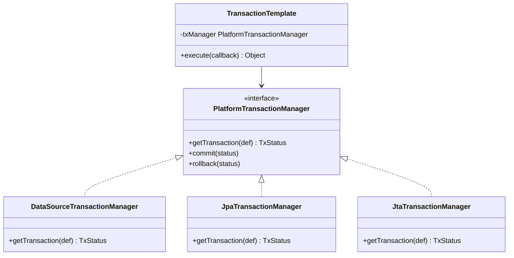
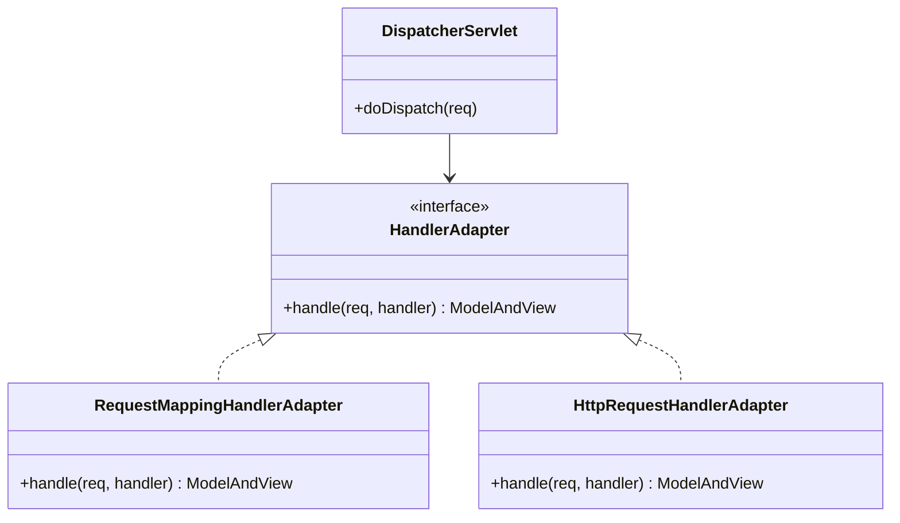
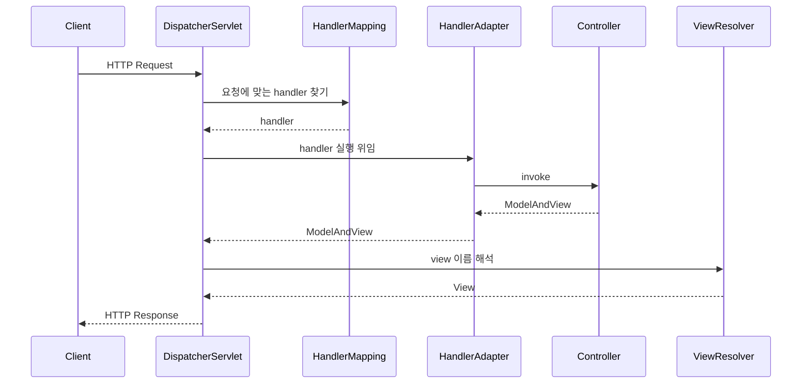

# Spring과 디자인 패턴

---

> Spring을 "프레임워크다"라고만 부르면 표면만 보는 것이다. 컨테이너 내부를 한 꺼풀 벗기면 GoF 디자인 패턴들이 정확히 자기 자리를 잡고 있다. 그 매핑을 이해해야 Spring을 "어노테이션 주술"이 아니라 객체지향 도구로 쓸 수 있다.


## 1. 한 줄 정의

Spring Framework는 GoF 디자인 패턴 다수를 인프라 수준에서 흡수해 "프레임워크 위에 비즈니스 로직만 얹으면 SOLID가 충족되는" 구조를 제공한다. 그러나 DI 컨테이너만 쓰면 클린한 코드가 자동으로 따라오지는 않는다는 점이 동시에 진실이다.


## 2. Spring이 흡수한 핵심 패턴 9가지

다음 표가 Spring 내부의 디자인 패턴 지도다. 각 패턴이 어디서 어떻게 작동하는지는 이어지는 절에서 풀어 설명한다.

| 패턴 | Spring에서의 위치 | 흡수 효과 |
|------|------------------|-----------|
| Singleton | 기본 Bean Scope | 컨테이너당 인스턴스 1개로 메모리·생성 비용 절감 |
| Factory | `BeanFactory`, `ApplicationContext` | 객체 생성 책임 컨테이너 위임 (DIP 자동) |
| Proxy | AOP, `@Transactional`, `@Cacheable` | 횡단 관심사를 비즈니스 코드 밖으로 |
| Template Method | `JdbcTemplate`, `RestTemplate`, `JpaTemplate` | 반복 절차(연결·예외 처리)를 골격으로 추출 |
| Strategy | `TransactionManager`, `TaskExecutor` | 런타임에 구현체 교체(JDBC↔JPA, 동기↔비동기) |
| Observer | `ApplicationEventPublisher`, `@EventListener` | 도메인 이벤트 발행·구독 |
| Adapter | `HandlerAdapter` | 다양한 컨트롤러 시그니처를 표준 인터페이스로 변환 |
| Front Controller | `DispatcherServlet` | 단일 진입점에서 요청 분배 |
| Composite | `BeanDefinition` 계층 | 부모-자식 빈 정의 관계 표현 |


## 3. Singleton — 기본 Bean Scope

Spring Bean은 명시적으로 다른 스코프를 지정하지 않는 한 모두 싱글톤이다. 컨테이너가 생성한 단 하나의 인스턴스를 모든 요청·스레드가 공유한다.



같은 인스턴스가 여러 호출자에 주입된다. 생성 비용은 컨테이너 기동 시 한 번에 끝난다. 그러나 이 공유 구조가 멀티스레드 환경에서 *상태를 보유한 Bean*에 경합을 만든다.

```java
@Service
public class OrderService {
    // 컨테이너 안에서 OrderService 인스턴스는 1개
}

@RestController
@RequiredArgsConstructor
public class OrderController {
    private final OrderService orderService; // 같은 인스턴스 주입
}
```

자바 코드로 직접 싱글톤을 구현하면 `enum`이나 *DCL(Double-Checked Locking)*을 신경 써야 하지만, Spring은 컨테이너가 이를 대신 책임진다. 단 *상태를 갖는 Bean*은 멀티스레드에서 경합이 생길 수 있으므로, Bean은 가능하면 무상태로 두는 것이 원칙이다.

```java
// 위험: 인스턴스 필드로 상태 보유
@Service
public class CounterService {
    private int count = 0; // 스레드 간 공유되어 예측 불가능

    public int increment() { return ++count; }
}
```

상태가 꼭 필요하다면 `@Scope("prototype")` 또는 `@RequestScope`로 스코프를 좁히거나, 외부 저장소(Redis, DB)로 옮긴다.

> **실무 적용 예시 — TPS executor의 상태 없는 Bean**
>
> `DispatchService`와 `ExecutionRecoverScheduler` 둘 다 싱글톤 Bean이면서 *상태를 보유하지 않는다*. 생성자 주입으로 의존성만 받고, 인스턴스 필드는 *주입된 의존성 + `@Value`로 외부 주입된 설정값*뿐이다.
>
> ```java
> @Slf4j
> @Service
> @RequiredArgsConstructor
> public class DispatchService implements DispatchUseCase {
>
>     private final ReceiveDomainComponent receiveDomainComponent;     // 주입
>     private final DispatchDomainComponent dispatchDomainComponent;   // 주입
>     private final SubmitDomainComponent submitDomainComponent;       // 주입
>
>     @Value("${executor.recover.pending.timeout-ms:86400000}")
>     private long pendingTimeoutMs;                                   // 설정값
>     // 가변 인스턴스 필드 없음
>
>     @Override
>     public void receive(ReceiveJobCommand command) { ... }
> }
> ```
>
> 멀티스레드 환경에서 *공유 가변 상태가 없기 때문에* 동기화 없이도 안전하다. 메서드의 모든 가변 데이터는 *매개변수와 지역 변수*로만 흐른다. 싱글톤 Bean을 *안전하게 운영하는* 정석 패턴이고, TPS executor가 그대로 따른다.


## 4. Factory — BeanFactory와 ApplicationContext

Spring 컨테이너 자체가 거대한 팩토리다. `BeanFactory`가 가장 기본적인 IoC 컨테이너 인터페이스이고, `ApplicationContext`는 그 위에 메시지 소스·이벤트 발행·환경 추상화를 얹은 확장이다.



`BeanFactory`가 *순수 IoC*만을 다루는 최소 계약이라면, `ApplicationContext`는 그 위에 운영에 필요한 부가 기능을 얹은 확장이다. 대부분의 Spring 애플리케이션은 `ApplicationContext`를 직접 다루지만, 그 핵심에는 여전히 팩토리 인터페이스가 자리한다.

```java
@Configuration
public class AppConfig {

    @Bean
    public DiscountPolicy discountPolicy() {
        return new RateDiscountPolicy();
    }

    @Bean
    public OrderService orderService(DiscountPolicy discountPolicy) {
        return new OrderServiceImpl(discountPolicy);
    }
}
```

클라이언트는 `new OrderServiceImpl(new RateDiscountPolicy())`를 직접 호출하지 않는다. 컨테이너가 `@Bean` 메서드를 팩토리 메서드로 활용해 객체를 만들고 의존성을 주입한다. 이로써 [팩토리 메서드 패턴](../../01_language/java/03_DesignPatterns/01-02.생성 패턴.md)의 의도(생성 결정권을 외부로 위임)가 코드 한 줄도 직접 쓰지 않은 채 성립한다.


## 5. Proxy — AOP의 뿌리

`@Transactional`, `@Cacheable`, `@Async` 같은 어노테이션은 모두 프록시를 동적으로 생성해 동작한다. 대상 클래스가 인터페이스를 구현하면 JDK Dynamic Proxy를, 아니면 CGLIB이 바이트코드 조작으로 서브클래스 프록시를 만든다.



```java
@Service
public class OrderService {

    @Transactional
    public Order createOrder(OrderRequest req) {
        // 비즈니스 로직만
        // 트랜잭션 시작/종료는 프록시가 처리
    }
}
```

**자주 만나는 함정**: 같은 클래스 내 메서드 호출은 프록시를 거치지 않는다. `this.helper()`는 실제 객체를 직접 부르므로 AOP가 적용되지 않는다. 이 함정은 자기 호출에 `@Transactional`을 걸어 두고 동작하지 않는다고 당황하는 가장 흔한 사례다. 해결은 별도 빈으로 분리하거나, `AopContext.currentProxy()`로 프록시를 명시적으로 얻는 것이다.


## 6. Template Method — JdbcTemplate 류

`JdbcTemplate`은 [템플릿 메서드 패턴](../../01_language/java/03_DesignPatterns/01-04.행동 패턴.md)의 교과서적 사례다. 반복되는 절차(연결 획득, 예외 변환, 자원 정리)는 골격으로 굳어 있고, 가변 부분(SQL과 결과 매핑)만 매개변수로 받는다.

```java
@Repository
@RequiredArgsConstructor
public class UserRepository {
    private final JdbcTemplate jdbcTemplate;

    public User findById(Long id) {
        return jdbcTemplate.queryForObject(
            "SELECT * FROM users WHERE id = ?"
            , new Object[]{id}
            , new UserRowMapper()
        );
    }
}
```

같은 원리로 `RestTemplate`, `TransactionTemplate`, `WebClient`도 동작한다. 변하는 부분과 변하지 않는 부분을 분리하는 안목이 이 패턴의 본질이다.


## 7. Strategy — TransactionManager와 TaskExecutor

Spring은 같은 인터페이스의 다양한 구현체를 런타임에 교체할 수 있게 해 [전략 패턴](../../01_language/java/03_DesignPatterns/01-04.행동 패턴.md)을 인프라 차원에서 흡수한다.



JDBC를 쓰던 프로젝트가 JPA로 옮겨가도, `TransactionTemplate`이나 `@Transactional` 어노테이션을 쓰는 코드는 손대지 않는다. Bean 등록만 `DataSourceTransactionManager`에서 `JpaTransactionManager`로 갈아 끼우면 끝난다. 이것이 전략 패턴의 인프라 적용이다.

```java
public interface PlatformTransactionManager { /* ... */ }

// 구현체들 — 환경에 따라 골라 쓴다
class DataSourceTransactionManager implements PlatformTransactionManager { /* JDBC */ }
class JpaTransactionManager implements PlatformTransactionManager       { /* JPA */ }
class JtaTransactionManager implements PlatformTransactionManager       { /* 분산 트랜잭션 */ }
```

`TaskExecutor`도 같은 구조다. `SyncTaskExecutor`로 시작했다가 부하가 늘면 `ThreadPoolTaskExecutor`로 교체하는 일이 비즈니스 코드를 거의 건드리지 않고 가능하다.


## 8. Observer — ApplicationEventPublisher

도메인 이벤트 발행은 [옵저버 패턴](../../01_language/java/03_DesignPatterns/01-04.행동 패턴.md)을 Spring이 인프라로 제공한 결과다.

```java
@Service
@RequiredArgsConstructor
public class OrderService {
    private final ApplicationEventPublisher events;

    public void place(OrderRequest req) {
        Order order = ...;
        events.publishEvent(new OrderPlacedEvent(order.id()));
    }
}

@Component
public class InventoryListener {

    @EventListener
    public void on(OrderPlacedEvent event) {
        // 재고 차감
    }
}

@Component
public class EmailListener {

    @EventListener
    @Async
    public void on(OrderPlacedEvent event) {
        // 발송 큐 적재 (비동기)
    }
}
```

발행자 `OrderService`는 구독자가 누구인지 알지 못한다. 새 구독자(예: 분석 로그)를 추가하려면 새 리스너 클래스를 만들기만 하면 된다. OCP가 자연스럽게 충족된다.

**옵저버 vs Pub/Sub 인프라**: 같은 JVM 안에서 동기/비동기로 처리할 일은 `ApplicationEventPublisher`로 충분하다. 다른 서비스에 알려야 할 일이면 Kafka 같은 메시지 브로커로 옮긴다. 패턴은 같지만 인프라 스케일이 다르다.

> **실무 적용 예시 — TPS의 두 갈래 발행 전략**
>
> TPS는 같은 옵저버 패턴을 *두 가지 인프라 스케일*로 동시에 운영한다.
>
> 첫째, *결재(approval) 도메인 안*의 알림은 `ApvrNotificationEventListener`처럼 `@EventListener` 기반 JVM 내 옵저버다. 같은 트랜잭션 컨텍스트, 같은 프로세스 안에서 처리된다.
>
> 둘째, *Jenkins 작업 결과*는 `JobResultPublish`가 *Kafka로* 발행한다. operator와 executor가 별도 프로세스로 분리돼 있어, 한쪽이 다른 쪽 객체 참조를 들 수 없기 때문이다.
>
> ```java
> // 같은 프로세스 — ApplicationEvent
> @Component
> public class ApvrNotificationEventListener {
>     @EventListener
>     public void on(ApprovalProcessedEvent event) {
>         // 같은 JVM의 알림 채널로
>     }
> }
>
> // 다른 프로세스 — Kafka
> @Component
> @RequiredArgsConstructor
> public class JobResultPublish {
>     private final KafkaTemplate<String, JobResultMessage> kafkaTemplate;
>
>     public void publish(JobResultMessage message) {
>         kafkaTemplate.send("tps-job-result", message.jobExcnId(), message);
>     }
> }
> ```
>
> 같은 패턴(*발행자는 구독자를 모른다*)이지만 인프라가 다르다. 분기점은 셋이다. (1) *프로세스 경계를 넘는가* — 그렇다면 Kafka 같은 외부 브로커. (2) *재시도·내구성·순서 보장이 필요한가* — 필요하면 브로커. (3) *동기 트랜잭션 안에서 묶여야 하는가* — 그렇다면 `ApplicationEvent`(`@TransactionalEventListener` 포함). 패턴 학습은 한 번이고, 인프라 선택은 사례마다 다르다.


## 9. Adapter — HandlerAdapter

Spring MVC의 컨트롤러는 `@Controller` 어노테이션 기반도 있고, 옛 `Controller` 인터페이스 기반도 있고, 함수형 라우터(`RouterFunction`)도 있다. 호출자인 `DispatcherServlet`은 어떤 형태이든 똑같이 호출하고 싶다. `HandlerAdapter`가 [어댑터 패턴](../../01_language/java/03_DesignPatterns/01-03.구조 패턴.md)으로 이 차이를 흡수한다.



새 컨트롤러 형태가 추가되어도 `DispatcherServlet`은 손대지 않는다. 그에 맞는 `HandlerAdapter`만 추가하면 된다.


## 10. Front Controller — DispatcherServlet

모든 HTTP 요청은 단 하나의 진입점 `DispatcherServlet`을 통과한다. 요청 분배·예외 변환·뷰 결정·국제화 같은 횡단 관심사가 이 한 곳에 모인다.



이 구조 덕분에 인증 필터, 로깅, CORS 처리 등을 컨트롤러 한 줄도 건드리지 않고 일괄 적용할 수 있다.


## 11. 클린 스프링 — 패턴 그 이전의 실용주의

지금까지 9개 패턴 매핑은 "Spring이 이미 내부에 흡수한 것"이다. 그러나 인프콘 2024 "클린 스프링" 강연이 강조한 메시지는 정반대 방향에서 출발한다. *클린 코드는 완성형 이상이 아니라, 동작하는 코드 위에 반복 적용되는 작은 결정들의 합*이라는 시각이다.

### 11.1 동작이 먼저, 정제는 다음

처음부터 모든 SOLID와 패턴을 완벽히 만족하는 코드를 쓰려고 하면 작업이 멈춘다. *"working 클린 코드"*가 강연의 표현이다. 동작하는 가장 단순한 구현을 먼저 만들고, 테스트로 보호한 다음, 점진적으로 다듬는다. 이 순서를 지키지 않으면 클린함이 출시를 가로막는 적이 된다.

### 11.2 DI만으로 좋은 설계는 아니다

`@Autowired`를 곳곳에 박는다고 클린한 설계가 되는 것은 아니다. 망나니 개발자의 체크리스트가 같은 지적을 한다. *"Spring DI 사용만으로 좋은 설계라 착각하기 쉽지만, 실제로는 책임 분리와 변화 예측이 핵심이다."*

판단 기준 세 가지를 다시 확인한다.

- 이 서비스에 외부 의존성을 mock으로 갈아 끼우고 단위 테스트가 작성되는가
- 새 기능 요구가 왔을 때 수정할 파일 수를 추정할 수 있는가
- 한 클래스가 변경되는 이유를 한 줄로 말할 수 있는가

DI는 도구이지 목적이 아니다.

### 11.3 테스트가 리팩토링의 기반

깨끗한 테스트가 없으면 운영 코드를 자신 있게 정리할 수 없다. Spring 환경의 테스트 도구를 단계별로 구분해 쓰는 안목이 필요하다.

| 도구 | 용도 | 무게 |
|------|------|------|
| 순수 JUnit + Mockito | 도메인·서비스 단위 로직 | 가장 가벼움 |
| `@WebMvcTest` | 컨트롤러 + 직렬화/역직렬화 | 중간 |
| `@DataJpaTest` | 리포지토리 + DB 매핑 | 중간 |
| `@SpringBootTest` | 전체 컨텍스트 통합 | 가장 무거움 |

대부분의 검증은 가벼운 도구로 끝낸다. `@SpringBootTest`는 종단 시나리오에서만 신중하게 쓴다.

### 11.4 과도한 패턴 적용을 경계하라

마지막 경고가 가장 중요하다. Strategy/State/Chain of Responsibility 같은 패턴은 이론적으로 우아하지만, 단순 분기에 적용하면 복잡성만 가중된다. 패턴 도입의 신호는 *분기가 셋 이상이고, 다음 3개월 안에 추가될 가능성이 보이며, 분기 로직이 점점 길어지고 있을 때*다. 그 신호가 없는 곳에 패턴을 박는 것은 학습 욕심일 뿐이다.


## 12. 학습 체크 — 다음 세 질문에 답할 수 있는가

본 문서를 충분히 흡수했는지 확인하는 질문이다.

1. `@Transactional`이 같은 클래스 안 `this.method()` 호출에서 동작하지 않는 이유를 프록시 패턴 관점에서 설명할 수 있는가
2. `BeanFactory`와 `ApplicationContext`의 관계를 팩토리 패턴 관점에서 설명할 수 있는가
3. 단순 분기 로직에 Strategy 패턴 도입을 누군가 제안했을 때, 받아들이거나 거절할 판단 기준을 말할 수 있는가

세 답이 모두 한 단락 이내로 나오면, Spring을 도구로 쓰는 단계에서 설계 언어로 쓰는 단계로 한 발 옮긴 것이다.


## 후속 학습

- [01-01.객체지향 원리 적용 — DI와 IoC](01-01.객체지향 원리 적용 — DI와 IoC.md) — DI 컨테이너의 등장 배경과 빈 생명주기
- [03_DesignPatterns/01-04.행동 패턴](../../01_language/java/03_DesignPatterns/01-04.행동 패턴.md) — Strategy/Observer/Template Method의 GoF 원형
- [03_DesignPatterns/02-02.클린 코드 원칙](../../01_language/java/03_DesignPatterns/02-02.클린 코드 원칙.md) — 패턴 이전의 미시 규칙
- 후속 작성 예정: Spring AOP 심화(Pointcut 표현식, JoinPoint API), `@Async`·`@Scheduled` 내부 프록시
