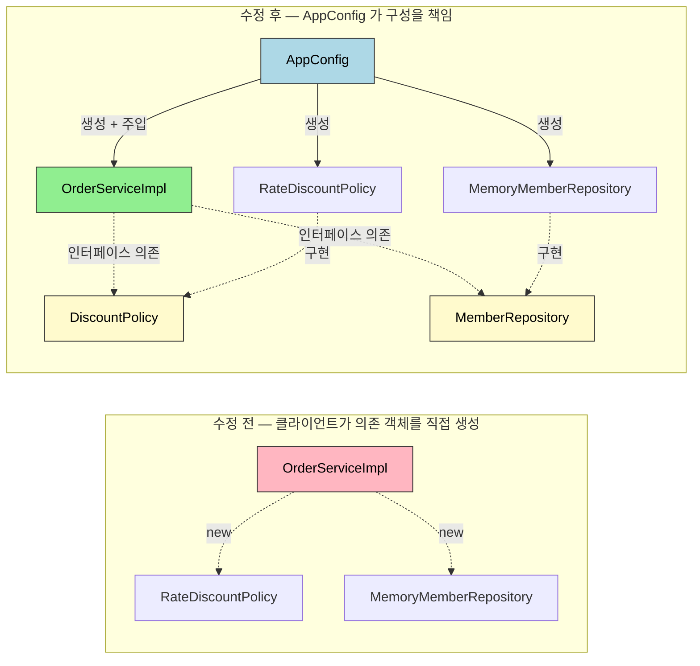
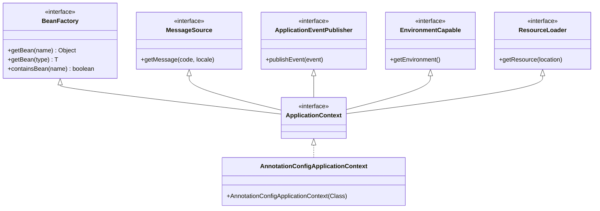
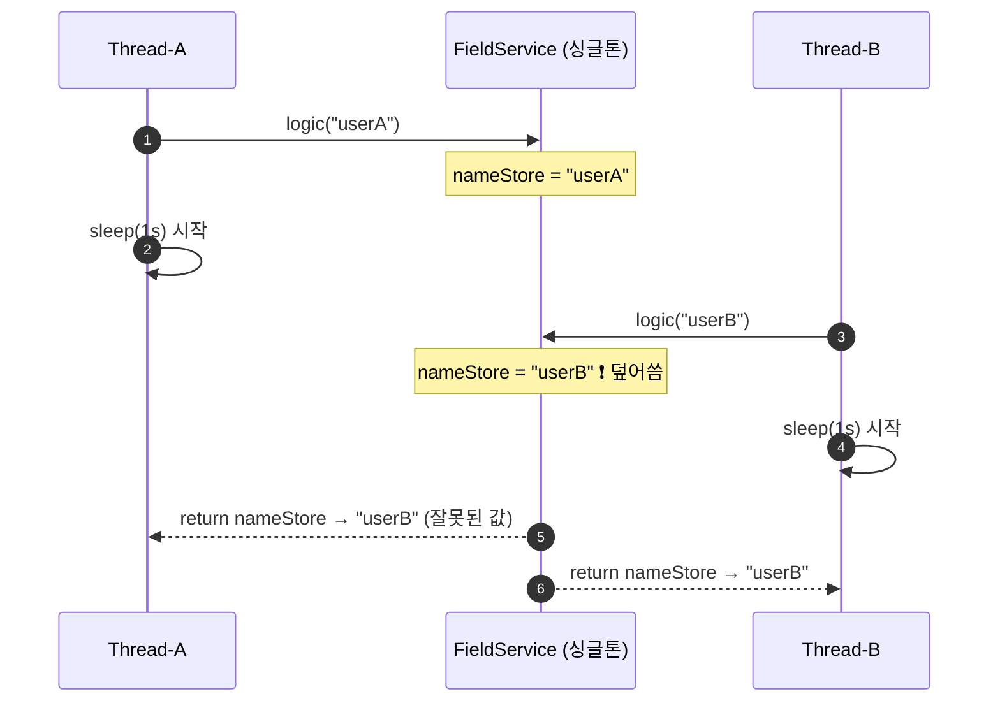
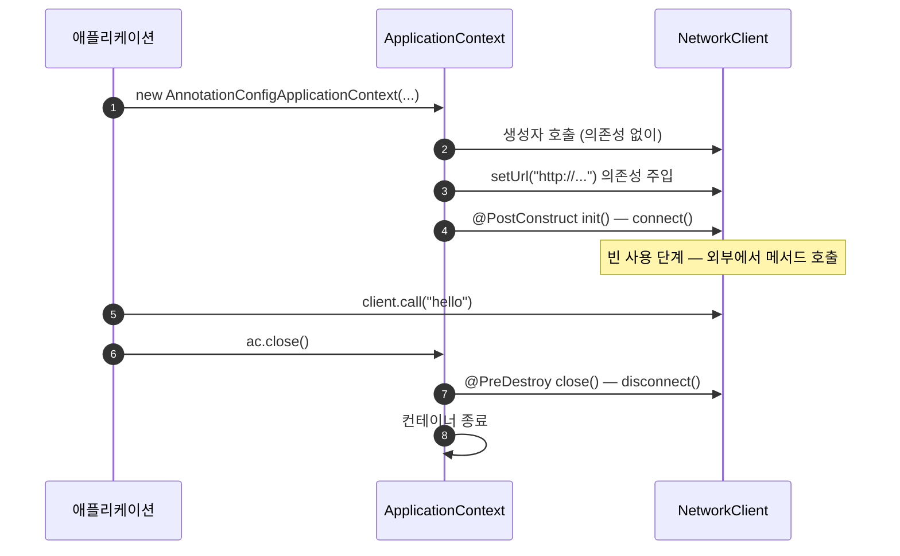
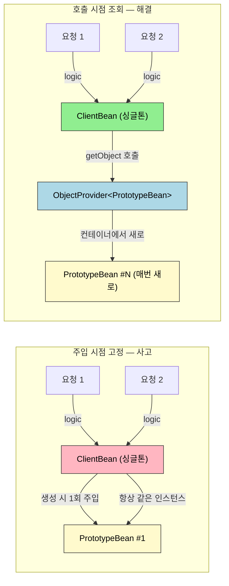
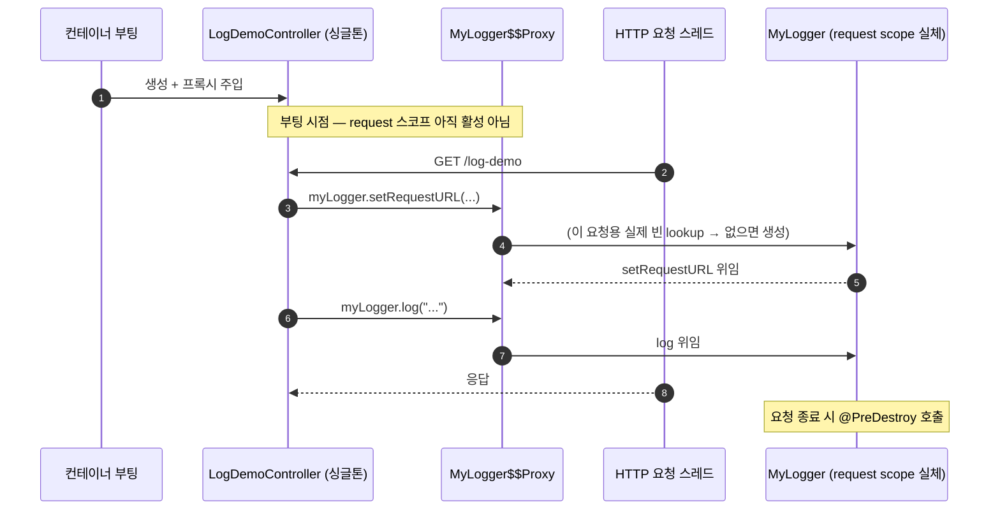

# 객체지향 원리 적용 — DI와 IoC
---

> Spring 컨테이너 한 줄짜리 정의는 학습 관점에서 도움이 안 됩니다. "컨테이너가 객체를 만들어 주입한다" 는 문장은 어느 책에든 나오지만, *왜 객체 생성을 외부에 맡기기로 했고*, 그렇게 맡긴 객체의 등록·주입·생명주기·스코프가 한 줄로 어떻게 꿰이는지를 답할 수 있어야 면접에서도 운영에서도 쓸모 있습니다. 본 문서는 Spring Framework 6.2 / Spring Boot 3.3 기준으로, AppConfig 같은 수기 DI 컨테이너가 왜 등장했고 그것이 `ApplicationContext` 로 이어졌는지부터 빈 스코프 충돌 해결까지 한 흐름으로 묶습니다.

## 1. 한 줄 정의

Spring DI 컨테이너는 객체의 *생성과 의존관계 연결을 객체 자신에게서 떼어 외부 설정으로 옮긴* 런타임 도구이며, 그 결과로 OCP·DIP 원칙이 코드 변경 없이 지켜지고, 빈의 등록·조회·생명주기·스코프가 한 곳에서 일괄 관리됩니다.


## 2. 왜 필요한가

> 코드가 *직접* 의존 객체를 만들면 한 줄도 바꾸지 않고 다른 구현으로 갈아 끼울 수가 없습니다. 이 한 문장이 DI 컨테이너 등장 이유의 거의 전부입니다.

다음 코드를 보겠습니다. `OrderServiceImpl` 이 비즈니스 로직을 가지고 있고, 할인 정책에는 `FixDiscountPolicy` 와 `RateDiscountPolicy` 두 구현이 있다고 합시다.

```java
public class OrderServiceImpl implements OrderService {
    private final DiscountPolicy discountPolicy = new RateDiscountPolicy();
}
```

이 코드는 추상(`DiscountPolicy` 인터페이스) 과 구체(`RateDiscountPolicy` 클래스) 양쪽에 동시에 의존합니다. DIP(Dependency Inversion Principle)가 깨진 상태입니다. 정책을 `FixDiscountPolicy` 로 바꾸려면 `OrderServiceImpl` 의 코드 한 줄을 고쳐야 합니다. OCP(Open-Closed Principle)도 깨집니다 — *확장*에는 열려 있지만 *변경*에도 함께 열려 버렸기 때문입니다.


원인은 *클라이언트 코드가 자기 의존 객체를 스스로 정한다*는 점입니다. 책임을 외부로 옮기면 두 원칙이 동시에 살아납니다. 외부에 "구성(Configuration)" 을 담당하는 별도 클래스를 두고, 클라이언트는 받아 쓰기만 합니다.



```java
public class AppConfig {
    public OrderService orderService() {
        return new OrderServiceImpl(memberRepository(), discountPolicy());
    }
    public MemberRepository memberRepository() {
        return new MemoryMemberRepository();
    }
    public DiscountPolicy discountPolicy() {
        return new RateDiscountPolicy();
    }
}
```

```java
public class OrderServiceImpl implements OrderService {
    private final MemberRepository memberRepository;
    private final DiscountPolicy discountPolicy;

    public OrderServiceImpl(MemberRepository memberRepository, DiscountPolicy discountPolicy) {
        this.memberRepository = memberRepository;
        this.discountPolicy = discountPolicy;
    }
}
```

이제 `OrderServiceImpl` 안에는 `RateDiscountPolicy` 라는 단어 자체가 사라졌습니다. 정책 교체는 `AppConfig` 한 곳의 변경으로 끝납니다. 비유하자면 *배우(클라이언트)는 자기 배역(인터페이스)만 알고, 어느 배역을 누가 맡을지는 감독(AppConfig)이 정한다*. 학습 노트의 비유지만 DI 컨테이너의 책임 분리를 가장 잘 설명합니다.

AppConfig 는 표준 자바 코드일 뿐입니다. 그러나 한 단계만 더 가면 Spring 의 `ApplicationContext` 가 같은 일을 어노테이션 기반으로 자동화해 줍니다. 그 한 단계가 본 문서의 출발점입니다.


## 3. 제어의 역전 — IoC 와 DI 의 관계

> 두 용어는 종종 같은 의미로 쓰이지만 층위가 다릅니다. IoC 는 *원칙*, DI 는 그 원칙을 *구현하는 한 가지 방법* 입니다.

**IoC (Inversion of Control, 제어의 역전)** 은 프로그램의 제어 흐름을 *내가 직접 쥐지 않고* 외부에 맡긴다는 설계 원칙입니다. 기존 자바 main 메서드는 `new` 로 객체를 만들고, 그 객체의 메서드를 직접 호출했습니다. 즉 클라이언트가 흐름을 *제어* 했습니다. AppConfig 또는 Spring 컨테이너를 도입한 순간, "어떤 객체를 만들지", "언제 만들지", "누구에게 줄지" 는 컨테이너가 결정합니다. 클라이언트는 *자기 로직만* 실행합니다.

프레임워크와 라이브러리의 차이도 같은 축에서 갈립니다.

| 구분 | 누가 흐름을 제어하나 | 예 |
|------|--------------------|---|
| 라이브러리 | 내가 호출하는 코드 | `Apache Commons Lang`, `Guava` |
| 프레임워크 | 프레임워크가 내 코드를 호출 | Spring, JUnit |

JUnit 은 내가 짠 `@Test` 메서드를 *자기 라이프사이클* 안에서 실행합니다. 내가 JUnit 을 호출하는 게 아니라 JUnit 이 나를 호출합니다. 이 한 줄이 "제어가 역전됐다" 의 실체입니다.

**DI (Dependency Injection, 의존관계 주입)** 은 IoC 를 구현하는 구체적 패턴 중 하나입니다. 객체가 필요로 하는 의존 객체를 *생성자/세터/필드* 같은 진입점으로 *외부에서 밀어 넣는* 방식입니다. AppConfig 의 생성자 호출 `new OrderServiceImpl(memberRepository(), discountPolicy())` 가 정확히 그 동작입니다.

IoC 에는 DI 외에도 *Service Locator*, *Template Method* 같은 다른 구현 방식이 있습니다. Spring 은 그중 DI 를 1순위로 고른 결과물입니다.

DI 의 효과 두 가지를 코드로 보겠습니다.

```java
// 정적 클래스 의존 — OrderServiceImpl 의 코드만 봐도 무엇을 의존하는지 알 수 있다.
public class OrderServiceImpl {
    private final DiscountPolicy discountPolicy; // 정적으로는 인터페이스 의존
}

// 동적 객체 의존 — 실행 시점에 RateDiscountPolicy 가 들어올지 FixDiscountPolicy 가 들어올지 결정된다.
new OrderServiceImpl(repo, new FixDiscountPolicy());
new OrderServiceImpl(repo, new RateDiscountPolicy());
```

정적(클래스) 의존은 컴파일 타임에 고정되고, 동적(객체) 의존은 런타임에 결정됩니다. DI 의 핵심 가치는 *정적 의존을 인터페이스에 묶어 두고, 동적 의존만 외부 구성으로 바꿔치기 가능하게* 만들어 준다는 점입니다.


## 4. 컨테이너의 두 인터페이스 — BeanFactory 와 ApplicationContext

> Spring 컨테이너의 진입점은 `ApplicationContext` 입니다. 그러나 그 안에는 `BeanFactory` 라는 더 작은 인터페이스가 들어 있습니다. 둘의 관계는 *최소 IoC 컨테이너* 와 *그 위에 부가 기능을 얹은 것* 의 관계입니다.

```java
// 진입점 — 거의 모든 학습/실무 코드는 ApplicationContext 를 쓴다.
ApplicationContext ac = new AnnotationConfigApplicationContext(AppConfig.class);
```

- `BeanFactory` — 빈의 등록·생성·조회·관리를 담당하는 *최소 IoC 컨테이너*. `getBean()` 한 줄로 빈을 끌어 씁니다.
- `ApplicationContext` — `BeanFactory` 를 상속하면서 다음 부가 기능을 얹습니다.
  - `MessageSource` — 메시지 국제화(i18n)
  - `ApplicationEventPublisher` — 이벤트 발행/구독
  - `EnvironmentCapable` — 프로파일·외부 설정 접근
  - `ResourceLoader` — 클래스패스/파일/URL 리소스 일관 조회

`BeanFactory` 만으로도 IoC 컨테이너 동작은 충족됩니다. 그러나 실제 애플리케이션은 거의 항상 위 4가지 부가 기능을 필요로 하기 때문에 `ApplicationContext` 가 표준 자리를 차지합니다. "둘 중 무엇을 써야 하나" 라는 질문에 거의 자동으로 `ApplicationContext` 라고 답해도 좋은 이유입니다.



빈이 컨테이너 안에서 어떤 형태로 사는지는 `BeanDefinition` 메타데이터로 정해집니다. `BeanDefinition` 은 "어떤 클래스를 어떤 이름으로, 어떤 스코프로, 어떤 초기화 콜백을 가진 형태로 만들지" 를 담은 *빈의 청사진* 입니다. 컨테이너는 `BeanDefinition` 을 먼저 모으고, 그것을 바탕으로 실제 인스턴스를 만듭니다. 학습 단계에서는 "컨테이너가 곧장 객체를 만든다" 라고 생각해도 큰 무리는 없지만, 빈 후처리기(BeanPostProcessor)나 프록시 생성을 다룰 때 이 두 단계 분리가 다시 등장합니다.


## 5. 빈 등록 세 가지 방식

> XML 기반은 레거시에 남아 있고, 새 코드는 거의 모두 `@Configuration` + `@Bean` 또는 `@ComponentScan` 으로 등록합니다.

### 1. `@Configuration` + `@Bean` — 명시적 등록

```java
@Configuration
public class AppConfig {

    @Bean(name = "memberService") // 이름을 명시적으로 줄 수도 있다.
    public MemberService memberService() {
        return new MemberServiceImpl(memberRepository());
    }

    @Bean // 이름을 생략하면 메서드명이 빈 이름이 된다 → "orderService"
    public OrderService orderService() {
        return new OrderServiceImpl(memberRepository(), discountPolicy());
    }

    @Bean
    public MemberRepository memberRepository() {
        return new MemoryMemberRepository();
    }

    @Bean
    public DiscountPolicy discountPolicy() {
        return new RateDiscountPolicy();
    }
}
```

장점은 *어떤 빈이 어디서 어떻게 만들어지는지* 가 한 파일을 읽으면 끝난다는 점입니다. 외부 라이브러리의 클래스(소스를 고칠 수 없는)를 빈으로 등록할 때도 이 방식만 가능합니다 — 라이브러리 클래스에 `@Component` 를 붙일 수 없기 때문입니다.

### 2. `@ComponentScan` + `@Component` — 자동 등록

```java
@Component
public class MemberServiceImpl implements MemberService {
    private final MemberRepository memberRepository;

    @Autowired // 생성자가 하나뿐이면 생략 가능 (Spring 4.3+)
    public MemberServiceImpl(MemberRepository memberRepository) {
        this.memberRepository = memberRepository;
    }
}

@Component
public class MemoryMemberRepository implements MemberRepository { }
```

```java
@ComponentScan(basePackages = "hello.core")
public class AppConfig { }
```

Spring Boot 의 `@SpringBootApplication` 안에는 이미 `@ComponentScan` 이 포함되어 있습니다. Boot 프로젝트에서 별도 선언 없이 `@Component` 가 자동으로 잡히는 이유입니다. 스캔 대상이 되는 어노테이션은 내부에 `@Component` 를 가지고 있는 다음 메타-어노테이션들입니다.

| 어노테이션 | 역할 |
|----------|------|
| `@Controller` | MVC 컨트롤러로 인식 (DispatcherServlet 의 핸들러로 등록) |
| `@Service` | 비즈니스 로직 계층임을 표시 (현재는 의미적 마커에 가까움) |
| `@Repository` | 데이터 접근 계층 — 데이터 액세스 예외를 Spring 의 `DataAccessException` 계열로 변환 |
| `@Configuration` | 설정 클래스로 인식 + CGLIB 프록시 적용 (뒤에서 다룬다) |

장점은 빈 등록 코드를 따로 안 써도 된다는 점, 단점은 *어떤 빈이 등록됐는지* 가 한눈에 안 보인다는 점입니다. 학습 단계에서는 `@Bean` 으로 명시 등록을 먼저 익히고 `@ComponentScan` 으로 옮기는 흐름을 권합니다.

`@ComponentScan` 은 어떤 대상을 스캔에 *포함*하거나 *제외*할지 필터로 조정할 수 있습니다. `includeFilters` 는 기본 스캔 대상(`@Component` 계열) 외에 추가로 등록할 대상을 지정하고, `excludeFilters` 는 스캔에서 뺄 대상을 지정합니다. 실무에서 `includeFilters` 를 쓸 일은 드물지만, `excludeFilters` 는 특정 설정 클래스나 테스트용 빈을 스캔에서 제외할 때 가끔 씁니다.

```java
@ComponentScan(
    includeFilters = @Filter(type = FilterType.ANNOTATION, classes = MyIncludeComponent.class),
    excludeFilters = @Filter(type = FilterType.ANNOTATION, classes = MyExcludeComponent.class)
)
public class AppConfig { }
```

`@Filter` 의 `type` 속성인 `FilterType` 은 *무엇을 기준으로* 대상을 가릴지 정합니다. 다섯 가지가 있습니다.

| FilterType | 기준 | 예 |
|-----------|------|-----|
| `ANNOTATION` (기본값) | 특정 어노테이션이 붙은 클래스 | `org.example.SomeAnnotation` |
| `ASSIGNABLE_TYPE` | 지정한 타입과 그 자식 타입 | `org.example.SomeClass` |
| `ASPECTJ` | AspectJ 패턴 | `org.example..*Service+` |
| `REGEX` | 정규 표현식 | `org\.example\.Default.*` |
| `CUSTOM` | `TypeFilter` 인터페이스 직접 구현 | — |

대부분 기본값인 `ANNOTATION` 으로 충분합니다. 어노테이션이 아니라 *타입 기준*으로 가려야 하면 `ASSIGNABLE_TYPE` 을 쓰고, 더 복잡한 조건은 `ASPECTJ`·`REGEX`·`CUSTOM` 으로 내려갑니다. 다만 필터로 스캔 대상을 억지로 조정하기 시작하면 "어떤 빈이 왜 등록됐는가"가 더 흐려지므로, 필터보다는 패키지 구조로 스캔 범위를 나누는 편이 깔끔합니다.

### 3. XML 기반 — 레거시

`<bean class="..." />` 형태의 XML 설정입니다. Spring 1.x~3.x 시기 표준이었으나 현재 새 프로젝트에서 쓸 이유는 거의 없습니다. 기존 코드를 읽을 때 알아볼 수 있는 정도면 충분합니다.

### 등록된 빈 조회

```java
@Test
void findApplicationBean() {
    String[] beanDefinitionNames = ac.getBeanDefinitionNames();
    for (String name : beanDefinitionNames) {
        BeanDefinition beanDefinition = ac.getBeanDefinition(name);
        if (beanDefinition.getRole() == BeanDefinition.ROLE_APPLICATION) {
            Object bean = ac.getBean(name);
            System.out.println("name = " + name + ", bean = " + bean);
        }
    }
}
```

`BeanDefinition.getRole()` 로 빈을 두 부류로 가릅니다. `ROLE_APPLICATION` 은 사용자가 직접 등록한 빈, `ROLE_INFRASTRUCTURE` 는 Spring 이 내부적으로 등록한 빈입니다. 디버깅이나 컨테이너 상태 점검 시 자주 쓰입니다.

타입 조회에는 한 가지 함정이 있습니다.

```java
// 동일 타입 빈이 두 개일 때
@Bean public MemberRepository memberRepository1() { return new MemoryMemberRepository(); }
@Bean public MemberRepository memberRepository2() { return new MemoryMemberRepository(); }

ac.getBean(MemberRepository.class); // → NoUniqueBeanDefinitionException
```

타입만으로는 구분이 안 됩니다. 이름을 함께 넘기거나, `getBeansOfType()` 으로 `Map<이름, 인스턴스>` 를 모두 받아야 합니다. 다중 빈 해결은 뒤의 "다중 빈 처리" 절에서 다시 다룹니다.


## 6. 의존관계 주입 — 생성자 vs 세터 vs 필드

> Spring 은 네 가지 주입 방식을 지원하지만, 새 코드는 *생성자 주입* 하나만 쓰면 됩니다. 나머지는 레거시 코드를 읽기 위한 지식입니다.

### 생성자 주입 — 권장

```java
@Component
@RequiredArgsConstructor // 롬복 — final 필드 생성자를 자동 생성
public class OrderServiceImpl implements OrderService {
    private final MemberRepository memberRepository;
    private final DiscountPolicy discountPolicy;
}
```

생성자 주입을 권장하는 이유는 네 가지입니다.

1. **불변성 보장** — 필드를 `final` 로 선언할 수 있습니다. 한 번 주입되면 다시 바뀌지 않습니다.
2. **누락 컴파일 차단** — 생성자 파라미터가 비면 컴파일 자체가 실패합니다. 런타임이 아니라 빌드 시점에 잡힙니다.
3. **테스트 용이** — `new OrderServiceImpl(mockRepo, mockPolicy)` 한 줄로 Spring 컨테이너 없이 단위 테스트할 수 있습니다.
4. **순환 참조 조기 감지** — 두 빈이 서로를 생성자로 요구하면 컨테이너 부팅 시점에 에러가 납니다. 세터/필드 주입은 부팅은 통과하고 런타임에 터집니다.

Spring 4.3+ 부터는 생성자가 하나뿐이면 `@Autowired` 를 생략해도 자동 주입됩니다. 그래서 위 코드처럼 어노테이션 한 줄(`@RequiredArgsConstructor`) 만 남습니다.

### 세터 주입 — 거의 안 씁니다

```java
@Autowired
public void setDiscountPolicy(DiscountPolicy discountPolicy) {
    this.discountPolicy = discountPolicy;
}
```

선택적·변경 가능 의존관계에 씁니다. 실무에서 이 조합이 필요한 경우는 드뭅니다. 필드를 `final` 로 못 박지 못해 불변성이 깨집니다.

### 필드 주입 — 안티패턴

```java
@Autowired private MemberRepository memberRepository;
```

코드가 가장 짧습니다. 그러나 *외부에서 의존 객체를 갈아끼울 방법이 없다*. 단위 테스트에서 mock 을 주입할 통로가 없어서, `@SpringBootTest` 같은 통합 테스트로 컨테이너를 띄우거나 reflection 으로 강제로 값을 박아 넣는 우회가 필요해집니다. 새 코드에 쓰지 않습니다.

### Optional·`@Nullable`·`required = false`

대상 빈이 없을 수도 있을 때의 세 가지 처리법입니다.

```java
@Autowired(required = false) // 빈이 없으면 setter 자체가 호출되지 않음
public void setNoBean1(Member noBean1) { ... }

@Autowired
public void setNoBean2(@Nullable Member noBean2) { ... } // null 이 들어온다

@Autowired
public void setNoBean3(Optional<Member> noBean3) { ... } // Optional.empty 가 들어온다
```

세터/필드 주입을 거의 안 쓰므로 이들은 보통 다음 형태로 나타납니다 — 생성자에 `Optional` 을 받거나, `@Nullable` 을 붙입니다.

### 다중 빈 처리 — `@Qualifier`, `@Primary`, `Map/List` 주입

같은 타입 빈이 여럿일 때 해결책은 세 가지입니다.

```java
@Component @Qualifier("mainDiscountPolicy")
public class RateDiscountPolicy implements DiscountPolicy { }

@Component @Qualifier("fixDiscountPolicy")
public class FixDiscountPolicy implements DiscountPolicy { }

@Component
public class OrderServiceImpl implements OrderService {
    public OrderServiceImpl(
            MemberRepository memberRepository,
            @Qualifier("mainDiscountPolicy") DiscountPolicy discountPolicy) {
        // ...
    }
}
```

`@Qualifier` 는 "내가 정확히 어떤 빈을 원한다" 를 *주입 지점* 과 *빈 정의* 양쪽에 표시합니다. 한 곳의 이름을 바꾸면 다른 한 곳도 바꿔야 하는 *짝* 으로 동작합니다.

```java
@Component @Primary // 동일 타입 빈 중 기본 선택
public class RateDiscountPolicy implements DiscountPolicy { }

@Component
public class FixDiscountPolicy implements DiscountPolicy { }
```

`@Primary` 는 "별다른 지시가 없으면 이것을 쓴다" 의 기본값 선언입니다. 흔히 *기본 90%, 예외 10%* 구도에서 씁니다 — 90% 자리에 `@Primary` 를 붙이고, 10% 자리는 `@Qualifier` 로 명시적으로 부릅니다.

```java
@Component
public class DiscountService {
    private final Map<String, DiscountPolicy> policyMap;
    private final List<DiscountPolicy> policies;

    public DiscountService(Map<String, DiscountPolicy> policyMap, List<DiscountPolicy> policies) {
        this.policyMap = policyMap;
        this.policies = policies;
    }

    public int discount(Member member, int price, String discountCode) {
        DiscountPolicy policy = policyMap.get(discountCode); // 이름으로 골라 쓴다
        return policy.discount(member, price);
    }
}
```

`Map<String, T>` / `List<T>` 주입은 *동일 타입의 빈 전체* 를 한꺼번에 받습니다. 정책·전략 패턴을 코드 변경 없이 확장할 때 자주 씁니다. 새 정책 클래스에 `@Component` 만 붙이면 `policyMap` 에 자동으로 추가됩니다.


## 7. 싱글톤 컨테이너와 무상태 설계

> Spring 빈은 기본 스코프가 *싱글톤* 입니다. 이것이 왜 의미가 있고, 그래서 어떤 코드를 쓰지 말아야 하는지가 본 절의 한 줄 요약입니다.

웹 애플리케이션은 초당 수백~수만 요청을 처리합니다. 요청마다 객체를 새로 만들면 GC 압박과 메모리 낭비가 누적됩니다. 그래서 *공용 객체 한 개* 를 만들어 모든 요청이 공유하는 패턴이 표준이 됩니다 — 싱글톤 패턴입니다.


순수 자바로 싱글톤을 만들려면 다음 정도의 코드가 필요합니다.

```java
public class SingletonService {
    private static final SingletonService instance = new SingletonService();
    public static SingletonService getInstance() { return instance; }
    private SingletonService() { } // 외부에서 new 차단
}
```

이 패턴의 문제는 (1) `getInstance()` 라는 정적 호출이 코드 곳곳에 박혀 결합도가 올라가고, (2) 테스트할 때 mock 으로 갈아끼우기가 어렵고, (3) 상속이 불가능하며, (4) 무엇보다 *클라이언트가 "이건 싱글톤이다" 를 알아야 한다* 는 점입니다.

Spring 은 위 네 가지를 모두 풀어 줍니다. `@Bean` 하나만 붙이면 컨테이너가 알아서 싱글톤을 보장합니다. 클라이언트는 인터페이스를 주입받을 뿐, 그것이 싱글톤인지 프로토타입인지 알 필요가 없습니다.

### `@Configuration` 이 어떻게 싱글톤을 보장하나 — CGLIB

다음 코드를 보겠습니다.

```java
@Configuration
public class AppConfig {
    @Bean public MemberService memberService() {
        return new MemberServiceImpl(memberRepository()); // (1) memberRepository() 호출
    }
    @Bean public OrderService orderService() {
        return new OrderServiceImpl(memberRepository(), discountPolicy()); // (2) 또 호출
    }
    @Bean public MemberRepository memberRepository() {
        return new MemoryMemberRepository(); // 호출될 때마다 새 객체?
    }
}
```

자바 코드만 보면 `memberRepository()` 가 두 번 호출되니 `new MemoryMemberRepository()` 도 두 번 생성될 것 같습니다. 그러나 실제로는 둘 다 *같은 인스턴스* 입니다. Spring 이 `@Configuration` 클래스를 CGLIB 라는 바이트코드 조작 라이브러리로 *프록시 서브클래스* 로 감싸기 때문입니다.

```java
// 개념도 — Spring 이 런타임에 만드는 클래스
public class AppConfig$$CGLIB extends AppConfig {
    private MemberRepository cachedRepo;

    @Override
    public MemberRepository memberRepository() {
        if (this.cachedRepo == null) {
            this.cachedRepo = super.memberRepository(); // 최초 한 번만 진짜 호출
        }
        return this.cachedRepo;
    }
}
```

`@Configuration` 이 빠지면(예: `@Component` 만 붙인 설정 클래스) 이 프록시가 만들어지지 않아 빈이 중복 생성됩니다. 학습 단계에서는 잘 잡히지 않는 버그라 *설정 클래스에는 무조건 `@Configuration`* 이 안전한 기본 규칙입니다.

CGLIB 프록시의 메커니즘은 AOP 의 프록시와 같습니다. 본 시리즈의 AOP 묶음에서 다시 다룹니다.

### 싱글톤 주의점 — 무상태 설계

싱글톤이 기본이라는 사실은 *빈을 무상태(stateless) 로 설계해야 한다* 는 의무를 만듭니다. 다음은 흔한 실수입니다.

```java
public class FieldService {
    private String nameStore; // 인스턴스 필드 — 모든 스레드가 공유!

    public String logic(String name) {
        nameStore = name;
        sleep(1000);
        return nameStore;
    }
}
```

스레드 A 가 `logic("userA")` 를 호출하고 1초를 자는 동안 스레드 B 가 `logic("userB")` 를 호출하면, 스레드 A 가 깨어났을 때 `nameStore` 는 이미 `"userB"` 입니다. 두 요청의 데이터가 섞입니다.




해결은 두 가지 중 하나입니다.

1. **무상태로 다시 씁니다** — 인스턴스 필드를 없애고, 메서드 파라미터/지역 변수만 사용. 가장 권장.
2. **스레드 로컬을 씁니다** — 어떤 이유로 빈 상태가 필요할 때만.

```java
public class ThreadLocalService {
    private final ThreadLocal<String> nameStore = new ThreadLocal<>();

    public String logic(String name) {
        nameStore.set(name);
        sleep(1000);
        String result = nameStore.get();
        nameStore.remove(); // 누수 방지 — 반드시 호출
        return result;
    }
}
```

`ThreadLocal` 은 *스레드마다 별도 저장소* 를 두어 동시성 문제를 회피합니다. 그러나 Tomcat 같은 스레드 풀 환경에서 `remove()` 를 빠뜨리면, 다음 요청이 같은 스레드를 재사용할 때 이전 요청의 값이 살아 있습니다 — 메모리 누수와 정보 유출 양쪽이 일어납니다. `try { ... } finally { tl.remove(); }` 가 안전한 사용 패턴입니다.


## 8. 빈 생명주기와 콜백

> 빈이 *언제 살아나고 언제 죽는지*, 그 중간에 어떤 훅(hook)을 걸 수 있는지를 정리합니다. DB 커넥션 풀, 네트워크 소켓처럼 *연결 → 사용 → 해제* 가 필요한 자원에 거의 항상 등장합니다.

### 왜 생성자에 초기화 로직을 넣으면 안 되나

```java
public class NetworkClient {
    private String url;

    public NetworkClient() {
        // 문제: 이 시점에 url 은 아직 null 이다.
        connect();
        call("초기화 연결 메시지");
    }

    public void setUrl(String url) { this.url = url; }
}
```

```java
@Configuration
static class LifeCycleConfig {
    @Bean
    public NetworkClient networkClient() {
        NetworkClient client = new NetworkClient(); // (1) 생성자 호출 → url = null
        client.setUrl("http://hello-spring.dev"); // (2) 이때서야 url 주입
        return client;
    }
}
```

생성자는 *객체에 메모리를 할당하고 필수 파라미터를 받는* 단계이고, 의존성 주입은 그 이후에 일어납니다. 그래서 생성자 안에서 외부 자원에 접근(connect, 외부 API 호출 등)하면 *주입이 아직 안 된 상태* 에서 실행되어 NPE 나 잘못된 동작이 발생합니다.

원칙은 *생성과 초기화의 분리* 입니다.

- **생성자** — 필수 파라미터를 받고 메모리를 할당. 외부 자원에 손대지 않습니다.
- **초기화 콜백** — 의존성 주입이 모두 끝난 뒤 외부 커넥션을 엽니다.

### 초기화/소멸 콜백 세 가지 방식

**1) `@PostConstruct` / `@PreDestroy` — 권장**

```java
public class NetworkClient {
    @PostConstruct
    public void init() {
        connect();
        call("초기화 연결 메시지");
    }

    @PreDestroy
    public void close() {
        disconnect();
    }
}
```

JSR-250 자바 표준 어노테이션이라 Spring 외 환경에서도 동작합니다. 새 코드에서는 거의 항상 이 방식을 고릅니다. 단 *외부 라이브러리 클래스* 에는 어노테이션을 못 붙이므로 그때만 다음 (2) 를 씁니다.

**2) `@Bean(initMethod, destroyMethod)` — 외부 라이브러리용**

```java
@Bean(initMethod = "init", destroyMethod = "close")
public NetworkClient networkClient() {
    NetworkClient client = new NetworkClient();
    client.setUrl("http://hello-spring.dev");
    return client;
}
```

설정 정보에서 메서드 이름을 지정하므로 *외부 라이브러리에도 적용 가능* 합니다. `destroyMethod` 는 기본값이 `"(inferred)"` 라서, 빈에 `close` 또는 `shutdown` 메서드가 있으면 자동으로 호출해 줍니다 — DataSource 같은 라이브러리에 거의 무료로 동작하는 이유입니다.

**3) `InitializingBean` / `DisposableBean` — 레거시**

```java
public class NetworkClient implements InitializingBean, DisposableBean {
    @Override public void afterPropertiesSet() throws Exception { connect(); }
    @Override public void destroy() throws Exception { disconnect(); }
}
```

Spring 전용 인터페이스라 *Spring 에 강하게 결합* 됩니다. 메서드명도 고정이라 가독성도 낮습니다. 거의 쓰지 않습니다.

### 흐름 정리

| 단계 | 일어나는 일 |
|------|------------|
| 1 | 스프링 컨테이너 생성 |
| 2 | 스프링 빈 생성 (생성자 호출) |
| 3 | 의존관계 주입 (필드/세터/생성자 파라미터로) |
| 4 | 초기화 콜백 호출 (`@PostConstruct` / `initMethod` / `afterPropertiesSet`) |
| 5 | 빈 사용 |
| 6 | 소멸전 콜백 호출 (`@PreDestroy` / `destroyMethod` / `destroy`) |
| 7 | 스프링 종료 |




면접에서 "Spring 빈의 생명주기를 설명하라" 는 질문이 나오면 이 7단계가 답입니다. 핵심은 (2)→(3)→(4) 의 순서로, "생성자에서 의존성을 쓸 수 있는가" 라는 후속 질문에 *없다* 라고 답할 수 있게 만듭니다.


## 9. 스코프 — singleton 외의 6종

> 기본은 singleton 이지만, *요청마다* 또는 *세션마다* 빈이 따로 필요한 경우가 있습니다. 이때 스코프를 바꿉니다.

| 스코프 | 의미 | 컨테이너가 관리하는 끝 시점 |
|--------|------|------------------------|
| `singleton` (기본) | 컨테이너당 하나 | 컨테이너 종료까지 |
| `prototype` | 요청마다 새 인스턴스 | *주입까지만* 관리 (소멸 콜백 미호출) |
| `request` | HTTP 요청마다 하나 | 요청 종료까지 |
| `session` | HTTP 세션마다 하나 | 세션 만료까지 |
| `application` | 서블릿 컨텍스트당 하나 | 애플리케이션 종료까지 |
| `websocket` | 웹소켓 연결당 하나 | 연결 종료까지 |

### 프로토타입의 함정 — 소멸 콜백 미호출

```java
@Scope("prototype")
static class PrototypeBean {
    @PostConstruct void init()    { System.out.println("init"); }
    @PreDestroy   void destroy()  { System.out.println("destroy"); }
}

PrototypeBean a = ac.getBean(PrototypeBean.class); // init 출력
PrototypeBean b = ac.getBean(PrototypeBean.class); // init 출력 (새 인스턴스)
ac.close(); // destroy 가 출력되지 않는다 ❗
```

Spring 은 프로토타입 빈을 *생성과 의존성 주입까지만* 책임집니다. 그 이후의 생명주기(소멸 포함)는 *받아 간 클라이언트의 책임* 입니다. 그래서 `@PreDestroy` 가 호출되지 않습니다. 외부 리소스를 잡는 프로토타입 빈을 만들 때는 클라이언트가 직접 정리 코드를 호출해야 합니다.


### 싱글톤 안의 프로토타입 — 가장 흔한 사고

```java
@Component
static class ClientBean { // 싱글톤
    private final PrototypeBean prototypeBean;
    public ClientBean(PrototypeBean prototypeBean) { this.prototypeBean = prototypeBean; }
    public int logic() { prototypeBean.addCount(); return prototypeBean.getCount(); }
}
```

`ClientBean` 은 싱글톤이므로 컨테이너에 *한 번만* 생성됩니다. 그 시점에 `PrototypeBean` 이 한 번 주입되고, 이후로는 `this.prototypeBean` 이 *그 한 인스턴스에 고정* 됩니다. 첫 호출이 `count=1`, 두 번째 호출이 `count=2` 가 되는 이유입니다. *프로토타입을 요청한 사람이 기대했던 "매번 새 인스턴스"* 동작이 안 일어납니다.



해결책은 *주입 시점이 아니라 사용 시점에* 컨테이너에서 새로 받아 오는 것입니다. 두 가지 방법이 있습니다.

**방법 1 — `ObjectProvider` (Spring 전용)**

```java
@Component
static class ClientBean {
    @Autowired
    private ObjectProvider<PrototypeBean> prototypeBeanProvider;

    public int logic() {
        PrototypeBean bean = prototypeBeanProvider.getObject(); // 호출 시점에 새 인스턴스
        bean.addCount();
        return bean.getCount();
    }
}
```

**방법 2 — `Provider` (JSR-330 자바 표준)**

```java
@Component
static class ClientBean {
    @Autowired
    private Provider<PrototypeBean> provider;

    public int logic() {
        PrototypeBean bean = provider.get();
        bean.addCount();
        return bean.getCount();
    }
}
```

기능은 같습니다. Spring 외 환경에서도 코드를 재사용할 가능성이 있다면 `Provider`, Spring 에만 쓸 거라면 `ObjectProvider` 가 무난합니다. `ObjectProvider` 가 좀 더 풍부한 부가 메서드(`getIfAvailable`, `stream` 등)를 가집니다.

### 웹 스코프와 스코프 프록시

`@Scope("request")` 빈을 싱글톤 컨테이너 시점에 주입하려고 하면 다음 에러가 납니다.

```
Scope 'request' is not active for the current thread; ...
```

컨테이너가 부팅되는 시점에는 아직 HTTP 요청이 없으니 `request` 스코프 빈을 만들 *데이터가 없다*. 그러나 싱글톤 빈은 부팅 시점에 의존성을 주입받아야 합니다 — 충돌합니다.

해결은 *프록시를 주입* 하는 것입니다.

```java
@Component
@Scope(value = "request", proxyMode = ScopedProxyMode.TARGET_CLASS)
public class MyLogger {
    private String uuid;
    public void setRequestURL(String url) { ... }
    public void log(String msg) { ... }
}
```

```java
@Controller
@RequiredArgsConstructor
public class LogDemoController {
    private final MyLogger myLogger; // 실은 프록시가 주입된다.

    @RequestMapping("log-demo")
    @ResponseBody
    public String logDemo(HttpServletRequest request) {
        myLogger.setRequestURL(request.getRequestURL().toString());
        myLogger.log("controller test"); // 이 호출 시점에 진짜 request 빈이 찾아진다.
        return "OK";
    }
}
```

`proxyMode = TARGET_CLASS` 는 *클래스 기반 CGLIB 프록시* 를 만들라는 지시입니다. 컨테이너는 빈 슬롯에 *프록시 객체* 를 박아 두고, 메서드가 호출되는 순간에야 *지금 이 요청의 실제 빈* 을 찾아 위임합니다. 인터페이스 기반이면 `INTERFACES` 도 가능하지만, MVC 코드 대부분이 구체 클래스를 주입받으므로 `TARGET_CLASS` 가 표준입니다.





## 10. 정리표

| 주제 | 핵심 |
|------|------|
| IoC | 객체의 *제어 흐름* 을 외부로 옮깁니다. 프레임워크가 내 코드를 호출합니다. |
| DI | IoC 를 구현하는 방법 중 하나. 의존 객체를 생성자/세터/필드로 외부에서 밀어 넣습니다. |
| BeanFactory | 최소 IoC 컨테이너. 빈 등록/조회만 합니다. |
| ApplicationContext | BeanFactory + i18n + 이벤트 + 리소스 + 환경. 거의 항상 이것을 씁니다. |
| `@Configuration` + `@Bean` | 명시적 등록. 외부 라이브러리 빈은 이 방식만 가능. |
| `@ComponentScan` + `@Component` | 자동 등록. Spring Boot 의 `@SpringBootApplication` 안에 포함. |
| `BeanDefinition` | 빈의 청사진. 컨테이너는 청사진을 모으고 그것으로 인스턴스를 만듭니다. |
| 생성자 주입 | 권장. 불변성·누락 컴파일 차단·테스트 용이·순환 참조 조기 감지. |
| 세터/필드 주입 | 거의 안 씁니다. 레거시 읽기용 지식. |
| `@Qualifier` | 동일 타입 다수 빈에서 정확한 하나 지정. 주입 지점과 빈 정의 양쪽에 표시. |
| `@Primary` | 동일 타입 다수 빈의 기본값 선언. |
| `Map<String, T>` / `List<T>` 주입 | 동일 타입 전체 수집. 전략 패턴 확장에 유용. |
| 싱글톤 + 무상태 | 인스턴스 필드 금지. 멀티 스레드 동시성 사고의 가장 흔한 원인. |
| CGLIB 프록시 | `@Configuration` 이 싱글톤을 보장하는 메커니즘. AOP 와 같은 기술. |
| `@PostConstruct` / `@PreDestroy` | 새 코드의 초기화/소멸 콜백 표준 방식. JSR-250 자바 표준. |
| `@Bean(initMethod, destroyMethod)` | 외부 라이브러리 빈의 콜백. `destroyMethod` 는 `close`/`shutdown` 자동 추론. |
| 생명주기 7단계 | 컨테이너 생성 → 빈 생성 → 의존성 주입 → 초기화 콜백 → 사용 → 소멸 콜백 → 종료. |
| 프로토타입의 함정 | 소멸 콜백 미호출. 싱글톤 안에서 받으면 인스턴스 고정. |
| `ObjectProvider` / `Provider` | 프로토타입을 *사용 시점* 에 받아 오는 해결책. |
| 웹 스코프 + 스코프 프록시 | `proxyMode = TARGET_CLASS` 로 싱글톤 슬롯에 프록시 박고, 호출 시점에 실제 빈 위임합니다. |


## 11. 다음에 읽을 것

- `../../03_architecture/01_foundation/01-02.객체지향과 설계 원칙.md` — DI 가 받쳐 주는 SOLID 원칙의 전반 맥락
- `../04_testing/01-04.@SpringBootTest와 ApplicationContextRunner.md` — 컨테이너 기반 테스트
- `../03_network/webflux/README.md` — `WebClient` 같은 빈을 어떻게 등록하고 주입하는지의 실무 사례
- `02-01.WAS와 서블릿 — HTTP 처리의 토대.md` — Servlet 컨테이너와 Spring 컨테이너의 경계
- `../05_aop/01-01.횡단 관심사와 AOP — 프록시로 풀어내기.md` — `@Configuration` 의 CGLIB 프록시가 AOP 프록시와 어떻게 닮았는지
