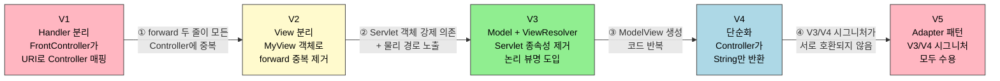
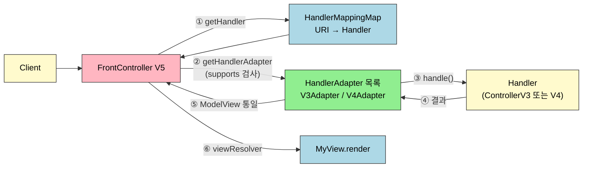
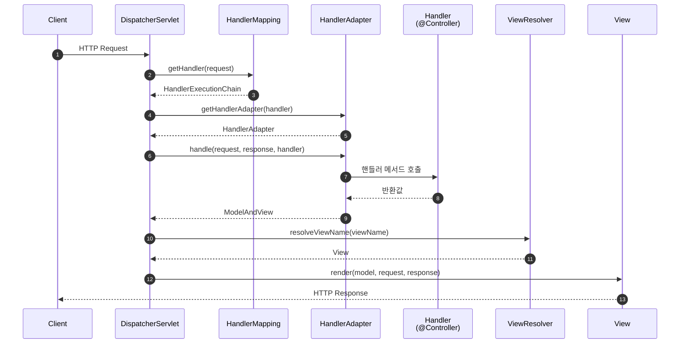
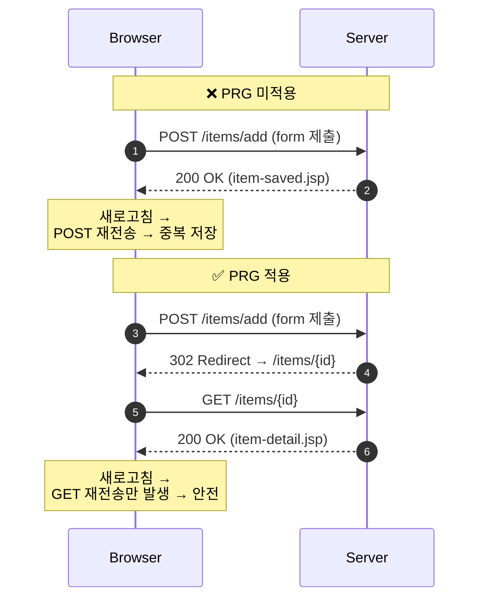

# Spring MVC — FrontController에서 DispatcherServlet까지
---

> 서블릿 한 개로 시작한 MVC가 어떤 단점을 만났고, FrontController 패턴이 V1부터 V5까지 어떤 압력으로 진화했으며, 그 종착점인 Spring `DispatcherServlet`이 왜 그렇게 생겼는지를 한 흐름으로 설명합니다. 면접에서 "DispatcherServlet은 무엇인가" 라는 질문에 V1~V5의 진화 과정을 근거로 풀어낼 수 있는 수준을 목표로 합니다.

## 진입 — 왜 FrontController 패턴인가

> Spring MVC를 "어노테이션 모음" 으로만 익히면 `@Controller`, `@RequestMapping`이 왜 굳이 그 모양인지 답하기 어렵습니다. FrontController 패턴을 직접 만들어 보는 과정을 거치면, `DispatcherServlet`의 각 부품이 어떤 중복을 제거하기 위해 생겼는지가 그대로 보입니다.

서블릿만으로 화면 하나 그리던 시점부터 출발합니다. 처음에는 비즈니스 로직과 뷰가 한 덩어리였고, MVC 패턴 1로 둘을 갈랐습니다. MVC 패턴 2에서 컨트롤러를 다시 컨트롤러와 서비스로 쪼갰지만, 컨트롤러마다 같은 보일러플레이트가 반복되는 한계가 남았습니다. 그 반복을 줄이려고 앞단에 단일 진입점을 두는 FrontController 패턴이 나왔고, 직접 V1부터 V5까지 만들면서 핸들러·뷰·모델·어댑터를 차례로 분리해 보면 Spring MVC의 부품 이름들이 익숙해집니다.

## 1. 한 줄 정의

> Spring MVC는 모든 HTTP 요청을 단일 `DispatcherServlet`이 받은 뒤, `HandlerMapping`으로 처리기를 찾고 `HandlerAdapter`로 실행하며, 결과 `ModelAndView`를 `ViewResolver`가 물리 뷰로 바꿔 렌더링하는 FrontController 기반 웹 프레임워크입니다.

한 문장에 다섯 부품 — `DispatcherServlet`, `HandlerMapping`, `HandlerAdapter`, `ModelAndView`, `ViewResolver` — 이 모두 등장합니다. 면접에서는 이 다섯 부품이 각각 어떤 중복을 없애기 위해 생겼는지까지 답할 수 있어야 진짜 아는 것입니다. 그 답을 V1~V5 진화 과정에서 끌어오는 게 본 문서의 목적입니다.

## 2. MVC 패턴의 등장과 Model 1/2의 한계

> MVC 패턴이 왜 등장했는지를 알아야 FrontController가 왜 필요한지를 답할 수 있습니다. MVC는 컨트롤러와 뷰를 분리하는 패턴이고, MVC 적용 후에도 컨트롤러 사이의 중복이 남는 것이 FrontController 도입의 직접 원인입니다.

### 2.1 MVC 패턴의 역할 분리

MVC는 Model, View, Controller 세 역할로 코드를 나눕니다. 각 역할은 다음과 같습니다.

- **Controller**: HTTP 요청을 받아 파라미터를 검증하고 비즈니스 로직을 실행합니다. 자바에서는 `Servlet`이 컨트롤러 역할을 맡습니다. Model과 View 사이의 데이터 전달 책임도 컨트롤러가 가집니다.
- **Model**: View가 출력할 데이터를 담아 둡니다. Controller가 채우고 View가 꺼냅니다.
- **View**: Model의 데이터를 사용해 화면을 렌더링하는 일에만 집중합니다.
- **Service**: Controller에서 넘어온 요청을 받아 비즈니스 로직을 수행하고, DAO를 이용해 결과값을 받습니다.
- **DAO**: 실제 DB(예: MySQL)에 접근하여 SQL을 실행하는 객체입니다.

MVC 패턴 1은 비즈니스 로직과 뷰 로직을 분리하는 데 초점을 둡니다. MVC 패턴 2는 거기서 한 발 더 나아가 컨트롤러를 "HTTP 요청 처리(Controller)" 와 "비즈니스 로직(Service)" 으로 다시 쪼갭니다.

### 2.2 MVC 패턴 적용 — Servlet + JSP + Request

직접 적용해 보면 다음 조합이 됩니다.

- **Controller**: Servlet
- **View**: JSP
- **Model**: `HttpServletRequest` 객체 (내부 데이터 저장소 `setAttribute()` / `getAttribute()`)

회원 등록 폼 이동은 다음과 같이 작성합니다.

```java
@WebServlet(name = "mvcMemberFormServlet", urlPatterns = "/servlet-mvc/members/new-form")
public class MvcMemberFormServlet extends HttpServlet {
    @Override
    protected void service(HttpServletRequest request, HttpServletResponse response) throws ServletException, IOException {
        String viewPath = "/WEB-INF/views/new-form.jsp";
        RequestDispatcher dispatcher = request.getRequestDispatcher(viewPath);
        dispatcher.forward(request, response);
    }
}
```

`/WEB-INF` 폴더는 외부에서 직접 접근할 수 없도록 설정된 폴더이므로 반드시 서블릿을 통해 접근해야 합니다. `redirect` 는 클라이언트가 인지하고 URL이 실제로 바뀌지만, `forward` 는 서버 내부 호출이라 클라이언트가 알지 못합니다.

회원 저장은 다음과 같이 Model 역할을 `request.setAttribute()` 로 채웁니다.

```java
@WebServlet(name = "mvcMemberSaveServlet", urlPatterns = "/servlet-mvc/members/save")
public class MvcMemberSaveServlet extends HttpServlet {
    private MemberRepository memberRepository = MemberRepository.getInstance();

    @Override
    protected void service(HttpServletRequest request, HttpServletResponse response) throws ServletException, IOException {
        String username = request.getParameter("username");
        int age = Integer.parseInt(request.getParameter("age"));
        Member member = new Member(username, age);
        memberRepository.save(member);

        request.setAttribute("member", member);

        String viewPath = "/WEB-INF/views/save-result.jsp";
        RequestDispatcher dispatcher = request.getRequestDispatcher(viewPath);
        dispatcher.forward(request, response);
    }
}
```

### 2.3 단점 — 공통과 중복

MVC 패턴을 적용해도 컨트롤러마다 다음 네 가지 중복이 남습니다.

1. **ViewPath 중복**: `prefix = /WEB-INF/views/`, `suffix = .jsp` 형태가 모든 컨트롤러에 반복됩니다. JSP가 아닌 Thymeleaf 같은 뷰로 바꾸려면 모든 컨트롤러를 수정해야 합니다.
2. **포워드 중복**: `RequestDispatcher dispatcher = request.getRequestDispatcher(viewPath); dispatcher.forward(request, response);` 두 줄이 컨트롤러마다 그대로 반복됩니다.
3. **사용하지 않는 코드**: `HttpServletRequest`, `HttpServletResponse` 객체가 컨트롤러에 강제로 주입되지만 항상 쓰이지는 않습니다. 개발자가 직접 만들지 않는 객체이므로 테스트 작성도 까다롭습니다.
4. **공통 처리가 어렵다**: 위 단점들은 모두 "공통과 중복" 이라는 한 단어로 묶이고, 메서드로 뽑아도 그 메서드 호출 자체가 또 중복입니다. 컨트롤러 호출 전 앞단에서 공통 기능을 처리해야 깔끔하게 풀립니다.

그 앞단을 도입한 패턴이 FrontController입니다.

## 3. FrontController V1~V5 — 직접 만들어 보는 진화 과정

> FrontController는 단일 진입점이 클라이언트의 모든 요청을 받아 적절한 컨트롤러를 찾아 호출하는 패턴입니다. Spring 웹 MVC의 `DispatcherServlet`이 바로 이 패턴으로 구현되어 있으므로, V1~V5를 직접 만들어 보는 것은 `DispatcherServlet`을 분해해 보는 것과 같습니다.

V1부터 V5까지의 진화를 한 그림으로 정리합니다. 각 버전이 직전 버전의 어떤 한계를 풀었는지를 화살표 라벨에 박았습니다.



### 3.1 V1 — Handler만 분리

> FrontController가 URI로 알맞은 Handler(Controller)를 찾아 호출하는 가장 단순한 형태입니다. URL과 매핑된 Handler를 저장하는 공간을 `Handler Mapping` 이라 부릅니다.

핵심은 `controllerMap`에 URI → Controller를 미리 등록해 두고, 요청 URI로 조회해서 실행하는 두 단계입니다.

```java
@WebServlet(name = "frontControllerServletV1", urlPatterns = "/front-controller/v1/*")
public class FrontControllerServletV1 extends HttpServlet {

    private Map<String, ControllerV1> controllerMap = new HashMap<>();

    public FrontControllerServletV1() {
        controllerMap.put("/front-controller/v1/members/new-form", new MemberFormControllerV1());
        controllerMap.put("/front-controller/v1/members/save", new MemberSaveControllerV1());
        controllerMap.put("/front-controller/v1/members", new MemberListControllerV1());
    }

    @Override
    protected void service(HttpServletRequest request, HttpServletResponse response) throws ServletException, IOException {
        String requestURI = request.getRequestURI();

        ControllerV1 controller = controllerMap.get(requestURI);
        if (controller == null) {
            response.setStatus(HttpServletResponse.SC_NOT_FOUND);
            return;
        }

        controller.process(request, response);
    }
}
```

`urlPatterns = "/front-controller/v1/*"` 의 별표는 패턴 매칭으로 하위 모든 요청을 이 서블릿이 처리한다는 의미입니다. 못 찾으면 `404 SC_NOT_FOUND`, 찾으면 `controller.process()`를 호출합니다. 개별 컨트롤러는 여전히 `request/response` 를 받아 `RequestDispatcher.forward()` 를 직접 호출합니다.

### 3.2 V2 — View 분리

> V1에서는 모든 컨트롤러가 `RequestDispatcher.forward()` 두 줄을 그대로 반복했습니다. View 관련 로직을 `MyView` 객체로 빼내면 컨트롤러는 경로만 반환하고 렌더링은 위임됩니다.

```java
public class MyView {
    private String viewPath;

    public MyView(String viewPath) {
        this.viewPath = viewPath;
    }

    public void render(HttpServletRequest request, HttpServletResponse response) throws ServletException, IOException {
        RequestDispatcher dispatcher = request.getRequestDispatcher(viewPath);
        dispatcher.forward(request, response);
    }
}
```

FrontController는 컨트롤러의 반환값으로 `MyView` 를 받아 `render()` 만 호출합니다.

```java
MyView view = controller.process(request, response);
view.render(request, response);
```

V1 컨트롤러가 `void process(...)` 였다면 V2 컨트롤러는 `MyView process(...)` 로 시그니처가 바뀝니다. 회원 등록 폼이 두 줄에서 한 줄로 줄어듭니다.

```java
// V2
@Override
public MyView process(HttpServletRequest request, HttpServletResponse response) throws ServletException, IOException {
    return new MyView("/WEB-INF/views/new-form.jsp");
}
```

### 3.3 V3 — Model 객체 도입과 ViewResolver

> V2까지는 Controller가 `HttpServletRequest/HttpServletResponse` 에 묶여 있어 테스트가 어렵고 물리 뷰 경로(`/WEB-INF/views/...jsp`)가 컨트롤러에 노출되었습니다. V3는 별도의 `ModelView` 객체와 논리 뷰 이름을 도입해 두 문제를 동시에 해결합니다.

핵심 변화는 세 가지입니다.

1. **paramMap 추출**: FrontController가 `request.getParameterNames()` 를 돌려 `Map<String, String>` 으로 만들어 컨트롤러에 넘깁니다.
2. **viewResolver 도입**: 컨트롤러가 반환한 논리 뷰 이름(`members`)을 물리 뷰 경로(`/WEB-INF/views/members.jsp`)로 변환합니다.
3. **render(model, request, response)**: `MyView`가 모델 데이터를 받아 내부에서 `request.setAttribute()` 로 옮긴 뒤 forward합니다.

```java
@Override
protected void service(HttpServletRequest request, HttpServletResponse response) throws ServletException, IOException {
    String requestURI = request.getRequestURI();

    ControllerV3 controller = controllerMap.get(requestURI);
    if (controller == null) {
        response.setStatus(HttpServletResponse.SC_NOT_FOUND);
        return;
    }

    ModelView modelView = controller.process(paramMap(request));
    MyView myView = viewResolver(modelView.viewName());
    myView.render(modelView.model(), request, response);
}

private MyView viewResolver(String viewName) {
    return new MyView("/WEB-INF/views/" + viewName + ".jsp");
}
```

`ModelView` 는 뷰 이름과 모델 데이터를 함께 담는 단순 객체입니다.

```java
public class ModelView {
    private String viewName;
    private Map<String, Object> model = new HashMap<>();
    public ModelView(String viewName) { this.viewName = viewName; }
    // getter/setter 생략
}
```

컨트롤러 인터페이스는 더 이상 서블릿 객체를 받지 않습니다.

```java
public interface ControllerV3 {
    ModelView process(Map<String, String> paramMap);
}
```

회원 저장 컨트롤러가 어떻게 깔끔해지는지 V2와 비교하면 분명합니다.

```java
// V3
@Override
public ModelView process(Map<String, String> paramMap) {
    String username = paramMap.get("username");
    int age = Integer.parseInt(paramMap.get("age"));

    Member member = new Member(username, age);
    memberRepository.save(member);

    ModelView modelView = new ModelView("save-result");
    modelView.getModel().put("member", member);
    return modelView;
}
```

`HttpServletRequest` 가 사라졌고 뷰 이름이 논리 이름("save-result") 으로 압축되었습니다. 테스트도 `paramMap` 만 만들어 호출하면 끝납니다.

### 3.4 V4 — 단순화

> 좋은 프레임워크는 아키텍처도 중요하지만 개발자가 단순하게 사용할 수 있어야 합니다. V3에서 `ModelView` 객체를 매번 만들어 반환하는 부분이 거추장스럽습니다. V4는 컨트롤러가 `String` 뷰 이름만 반환하고, 모델은 FrontController가 만들어 인자로 넘겨주는 형태로 바꿉니다.

```java
@Override
protected void service(HttpServletRequest request, HttpServletResponse response) throws ServletException, IOException {
    String requestURI = request.getRequestURI();
    ControllerV4 controller = controllerMap.get(requestURI);
    if (controller == null) {
        response.setStatus(HttpServletResponse.SC_NOT_FOUND);
        return;
    }

    Map<String, String> paramMap = paramMap(request);
    Map<String, Object> model = new HashMap<>();
    String viewName = controller.process(paramMap, model);

    MyView myView = viewResolver(viewName);
    myView.render(model, request, response);
}
```

회원 저장 컨트롤러는 더 짧아집니다.

```java
// V4
@Override
public String process(Map<String, String> paramMap, Map<String, Object> model) {
    String username = paramMap.get("username");
    int age = Integer.parseInt(paramMap.get("age"));

    Member member = new Member(username, age);
    memberRepository.save(member);

    model.put("member", member);
    return "save-result";
}
```

여기서 한 가지 문제가 생깁니다. V3 컨트롤러는 `ModelView` 를 반환하고 V4 컨트롤러는 `String` 을 반환하므로, 두 시그니처가 한 FrontController에 같이 들어가지 못합니다. 그래서 V5가 필요합니다.

### 3.5 V5 — Adapter 패턴

> V3 방식과 V4 방식을 동시에 지원하려면 FrontController가 두 시그니처를 모두 알아야 합니다. 시그니처별로 변환기를 두는 것이 어댑터 패턴이고, 이때 어댑터 이름은 `HandlerAdapter` 입니다. 컨트롤러 명칭도 더 넓은 의미의 `Handler` 로 격상됩니다.



FrontController는 어댑터를 통해 핸들러를 호출합니다.

```java
@Override
protected void service(HttpServletRequest request, HttpServletResponse response) throws ServletException, IOException {

    Object handler = getHandler(request);
    if (handler == null) {
        response.setStatus(HttpServletResponse.SC_NOT_FOUND);
        return;
    }

    MyHandlerAdapter adapter = getHandlerAdapter(handler);
    ModelView mv = adapter.handle(request, response, handler);

    String viewName = mv.getViewName();
    MyView view = viewResolver(viewName);
    view.render(mv.getModel(), request, response);
}

private MyHandlerAdapter getHandlerAdapter(Object handler) {
    for (MyHandlerAdapter adapter : handlerAdapters) {
        if (adapter.supports(handler)) {
            return adapter;
        }
    }
    throw new IllegalArgumentException("handler adapter를 찾을 수 없습니다." + handler);
}
```

어댑터 인터페이스는 두 메서드만 가집니다.

```java
public interface MyHandlerAdapter {
    boolean supports(Object handler);
    ModelView handle(HttpServletRequest request, HttpServletResponse response, Object handler) throws ServletException, IOException;
}
```

V4 어댑터는 컨트롤러가 `String` 만 반환해도 직접 `ModelView` 로 감싸 반환합니다.

```java
public class ControllerV4HandlerAdapter implements MyHandlerAdapter {
    @Override
    public boolean supports(Object handler) { return (handler instanceof ControllerV4); }

    @Override
    public ModelView handle(HttpServletRequest request, HttpServletResponse response, Object handler) throws ServletException, IOException {
        ControllerV4 controller = (ControllerV4) handler;
        Map<String, String> paramMap = createParamMap(request);
        Map<String, Object> model = new HashMap<>();
        String viewName = controller.process(paramMap, model);

        ModelView mv = new ModelView(viewName);
        mv.setModel(model);
        return mv;
    }
    // createParamMap 생략
}
```

이렇게 만들어진 V5의 부품 — `HandlerMapping`, `HandlerAdapter`, `Handler`, `ViewResolver`, `MyView` — 가 Spring MVC의 부품 이름과 정확히 일치합니다.

## 4. Spring MVC — DispatcherServlet의 실체

> Spring MVC도 FrontController 패턴으로 구현되어 있고, 그 FrontController가 `DispatcherServlet` 입니다. V5에서 만든 `FrontControllerServletV5` 를 Spring이 정식으로 구현해 둔 형태라고 보면 거의 정확합니다.

`DispatcherServlet` 도 `HttpServlet` 을 상속받아 서블릿으로 동작합니다. Spring Boot는 `DispatcherServlet` 을 서블릿으로 자동 등록하면서 모든 경로(`urlPatterns = "/"`) 에 매핑합니다.

요청 흐름은 다음과 같습니다.

1. 서블릿이 호출되면 `HttpServlet` 이 제공하는 `service()` 가 호출됩니다.
2. Spring MVC는 `DispatcherServlet` 의 부모인 `FrameworkServlet` 에서 `service()` 를 오버라이딩해 두었습니다.
3. `FrameworkServlet.service()` 를 시작으로 여러 메서드가 호출되면서 최종적으로 `DispatcherServlet.doDispatch()` 가 호출됩니다.

`doDispatch()` 의 핵심 골격은 다음과 같습니다.

```java
protected void doDispatch(HttpServletRequest request, HttpServletResponse response) throws Exception {
    HttpServletRequest processedRequest = request;
    HandlerExecutionChain mappedHandler = null;
    ModelAndView mv = null;

    // 1. 핸들러 조회
    mappedHandler = getHandler(processedRequest);
    if (mappedHandler == null) {
        noHandlerFound(processedRequest, response);
        return;
    }

    // 2. 핸들러를 처리할 수 있는 어댑터 조회
    HandlerAdapter ha = getHandlerAdapter(mappedHandler.getHandler());

    // 3~5. 어댑터로 핸들러 실행 → ModelAndView 반환
    mv = ha.handle(processedRequest, response, mappedHandler.getHandler());

    processDispatchResult(processedRequest, response, mappedHandler, mv, dispatchException);
}

protected void render(ModelAndView mv, HttpServletRequest request, HttpServletResponse response) throws Exception {
    // 6~7. 뷰 리졸버로 View 찾기
    String viewName = mv.getViewName();
    View view = resolveViewName(viewName, mv.getModelInternal(), locale, request);

    // 8. 뷰 렌더링
    view.render(mv.getModelInternal(), request, response);
}
```

V5의 `service()` 와 한 줄씩 대응됩니다. `Object handler` 가 `HandlerExecutionChain` 으로, `MyHandlerAdapter` 가 `HandlerAdapter` 인터페이스로, `ModelView` 가 `ModelAndView` 로 이름만 바뀌었습니다.

요청 흐름을 시퀀스로 정리하면 한 그림에 다 담깁니다.



이 흐름이 머릿속에 들어오면 `@Controller` 메서드 한 줄이 어디서 호출되는지를 항상 추적할 수 있습니다.

### 4.1 시작 단계 — Loading과 Container 구동 (레거시 web.xml 기준)

Spring Boot 환경에서는 거의 보이지 않지만, 레거시 `web.xml` 기반 프로젝트에서는 다음 순서로 컨테이너가 구동됩니다.

1. 웹 애플리케이션이 실행되면 Tomcat(WAS)이 `web.xml` 을 로딩합니다.
2. `web.xml` 에 등록된 `ContextLoaderListener` 가 자동으로 메모리에 생성됩니다(Pre-Loading). 이 리스너는 `ApplicationContext(root-context)` 를 생성하며 서블릿의 생명주기에 맞춰 컨텍스트를 등록·삭제합니다.
3. `ContextLoaderListener` 가 `applicationContext.xml`(`root-context.xml`)을 로딩하여 스프링 컨테이너를 구동합니다. 이것이 Root 컨테이너입니다.
4. `root-context.xml` 에는 주로 뷰를 제외한 공통 빈(Service, DAO 등)을 등록합니다. Controller 같은 웹 관련 빈은 여기에 두지 않습니다.
5. 최초 클라이언트 요청이 들어오면 `DispatcherServlet` 이 생성되고, `WEB-INF/config/servlet-context.xml` 을 로딩하여 두 번째 스프링 컨테이너를 구동합니다. 이쪽에는 Controller, ViewResolver 등 웹 관련 빈이 등록됩니다.
6. 두 번째 컨테이너가 구동된 뒤부터는 FrontController 흐름이 동작합니다.

레거시 `web.xml` 의 `DispatcherServlet` 선언 예시는 다음과 같습니다.

```xml
<servlet>
    <servlet-name>appServlet</servlet-name>
    <servlet-class>org.springframework.web.servlet.DispatcherServlet</servlet-class>
    <init-param>
        <param-name>contextConfigLocation</param-name>
        <param-value>/WEB-INF/spring/appServlet/servlet-context.xml</param-value>
    </init-param>
    <load-on-startup>1</load-on-startup>
</servlet>
<servlet-mapping>
    <servlet-name>appServlet</servlet-name>
    <url-pattern>/</url-pattern>
</servlet-mapping>
```

Spring Boot는 이 모든 등록을 `AutoConfiguration` 으로 대체합니다.

## 5. HandlerMapping / HandlerAdapter / ViewResolver

> `DispatcherServlet` 의 동작을 결정하는 세 인터페이스입니다. 이 셋만 구현해 등록하면 자신만의 컨트롤러 형식도 만들 수 있습니다.

- **HandlerMapping**: `org.springframework.web.servlet.HandlerMapping` — URL에서 Handler를 찾습니다.
- **HandlerAdapter**: `org.springframework.web.servlet.HandlerAdapter` — 찾아낸 Handler를 실행합니다.
- **ViewResolver**: `org.springframework.web.servlet.ViewResolver` — 논리 뷰 이름을 View 객체로 바꿉니다.
- **View**: `org.springframework.web.servlet.View` — 실제 렌더링을 수행합니다.

### 5.1 Controller 인터페이스 vs @Controller 어노테이션

옛 버전의 `org.springframework.web.servlet.mvc.Controller` 인터페이스를 구현하는 방식과, 최근의 `@Controller` 어노테이션 기반 방식은 같은 이름이라도 전혀 다릅니다.

```java
// 스프링 빈 이름을 URL에 맞추는 옛 방식
@Component("/springmvc/old-controller")
public class OldController implements Controller {
    @Override
    public ModelAndView handleRequest(HttpServletRequest request, HttpServletResponse response) throws Exception {
        System.out.println("OldController.handleRequest");
        return null;
    }
}
```

이 컨트롤러를 호출하려면 다음 두 가지가 필요합니다.

- **HandlerMapping**: 스프링 빈 이름으로 핸들러를 찾을 수 있는 매핑 — `BeanNameUrlHandlerMapping`
- **HandlerAdapter**: `Controller` 인터페이스를 실행할 수 있는 어댑터 — `SimpleControllerHandlerAdapter`

매핑과 어댑터는 모두 우선순위 순서대로 탐색되며, 위가 못 찾으면 아래로 넘어갑니다. 가장 우선순위가 높은 매핑·어댑터는 `RequestMappingHandlerMapping` 과 `RequestMappingHandlerAdapter` 이고, 이것이 실무에서 쓰는 어노테이션 기반 컨트롤러를 지원합니다.

### 5.2 @RequestMapping 기반 컨트롤러

`RequestMappingHandlerMapping` 의 `isHandler()` 를 보면 스프링 빈 중에서 `@RequestMapping` 또는 `@Controller` 가 붙은 클래스의 매핑 정보를 인식합니다.

```java
@Override
protected boolean isHandler(Class<?> beanType) {
    return (AnnotatedElementUtils.hasAnnotation(beanType, Controller.class) ||
            AnnotatedElementUtils.hasAnnotation(beanType, RequestMapping.class));
}
```

실무에서는 `@Controller` 가 표준 형태입니다.

```java
@Controller
public class SpringMemberFormControllerV1 {
    @RequestMapping("/springmvc/v1/members/new-form")
    public ModelAndView process() {
        return new ModelAndView("new-form");
    }
}
```

- `@Controller` 는 내부에 `@Component` 가 있어 컴포넌트 스캔 대상이 됩니다.
- `@RequestMapping` 은 어노테이션 기반이라 메서드 이름은 임의로 지어도 됩니다.
- `ModelAndView` 는 모델과 뷰 정보를 담아 반환합니다.

여러 메서드를 한 클래스에 모아 클래스 레벨 `@RequestMapping` 으로 공통 경로를 묶을 수 있습니다.

```java
@Controller
@RequestMapping("/springmvc/v2/members")
public class SpringMemberControllerV2 {
    @RequestMapping("/new-form")    // → /springmvc/v2/members/new-form
    public ModelAndView newForm() { ... }

    @RequestMapping("/save")        // → /springmvc/v2/members/save
    public ModelAndView save(...) { ... }

    @RequestMapping                  // → /springmvc/v2/members
    public ModelAndView members() { ... }
}
```

실용적인 방식에서는 `ModelAndView` 대신 `Model` 파라미터를 받고 뷰 이름은 `String` 으로 반환하며, `@RequestParam` 으로 파라미터를 직접 받고, `@RequestMapping` 대신 HTTP 메서드별 `@GetMapping`·`@PostMapping` 을 사용합니다.

```java
@Controller
@RequestMapping("/springmvc/v3/members")
public class SpringMemberControllerV3 {

    private MemberRepository memberRepository = MemberRepository.getInstance();

    @GetMapping("/new-form")
    public String newForm() {
        return "new-form";
    }

    @PostMapping("/save")
    public String save(
            @RequestParam("username") String username,
            @RequestParam("age") int age, Model model) {
       Member member = new Member(username, age);
       memberRepository.save(member);
       model.addAttribute("member", member);
       return "save-result";
    }

    @GetMapping
    public String members(Model model) {
        List<Member> members = memberRepository.findAll();
        model.addAttribute("members", members);
        return "members";
    }
}
```

`@GetMapping`·`@PostMapping` 은 Spring 4.3 부터 도입된 단축형으로 `Get`, `Post`, `Put`, `Delete`, `Patch` 모두 어노테이션이 준비되어 있습니다.

### 5.3 ViewResolver 동작

논리 뷰 이름이 어떻게 물리 뷰로 풀리는지가 ViewResolver의 역할입니다. JSP 환경에서 `InternalResourceViewResolver` 가 자동으로 등록되며, 다음 설정으로 prefix/suffix 를 잡습니다.

```properties
spring.mvc.view.prefix=/WEB-INF/views/
spring.mvc.view.suffix=.jsp
```

Spring Boot의 `AutoConfiguration` 이 위 설정을 읽어 `InternalResourceViewResolver` 를 등록합니다. 스프링 레거시에서는 별도 빈을 직접 등록해야 합니다.

ViewResolver 호출 흐름은 다음과 같습니다.

1. HandlerAdapter가 핸들러를 실행해 논리 뷰 이름("new-form")을 얻습니다.
2. ViewResolver 들이 우선순위 순서로 호출됩니다. `BeanNameViewResolver` 가 먼저 빈 이름으로 등록된 뷰를 찾고, 없으면 `InternalResourceViewResolver` 가 호출됩니다.
3. `InternalResourceViewResolver` 는 JSP용 `InternalResourceView`(JstlView 포함)를 반환합니다.
4. `view.render()` 가 호출되며, `InternalResourceView` 는 내부에서 `forward()` 로 JSP를 실행합니다. JSP를 제외한 나머지 뷰 템플릿은 `forward()` 과정 없이 바로 렌더링됩니다.

Thymeleaf 같은 다른 템플릿은 `ThymeleafViewResolver` 가 등록되며, 최근에는 라이브러리만 추가하면 Spring Boot가 자동으로 해 줍니다.

## 6. PRG (Post-Redirect-Get) 패턴

> POST 요청 처리 후 동일 URL에 머무르면 사용자가 새로고침할 때마다 POST가 중복 수행됩니다. POST의 응답을 별도 URL의 GET으로 리다이렉트하는 것이 PRG 패턴입니다.



Spring MVC에서는 컨트롤러 반환값에 `redirect:` 접두어를 붙이면 리다이렉트로 처리됩니다.

```java
@PostMapping("/add")
public String addItemV5(Item item) {
    itemRepository.save(item);
    return "redirect:/basic/items/" + item.getId();
}
```

위 방식의 한계는 `item.getId()` 같은 동적 값을 직접 문자열 연결하므로 URL 인코딩이 빠진다는 점입니다. `RedirectAttributes` 를 쓰면 URL 인코딩과 Path Variable / Query Parameter 처리가 자동으로 수행됩니다.

```java
@PostMapping("/add")
public String addItemV6(Item item, RedirectAttributes redirectAttributes) {
    Item savedItem = itemRepository.save(item);

    redirectAttributes.addAttribute("itemId", savedItem.getId());
    redirectAttributes.addAttribute("status", true);

    return "redirect:/basic/items/{itemId}";
}
```

URL 경로에 같은 이름의 Path Variable이 있으면 해당 자리에 치환되고, 없으면 Query Parameter로 자동 추가됩니다. 위 예에서는 `itemId` 가 경로에 치환되고 `status=true` 는 쿼리로 붙습니다.

## 부록 A. WebMvcConfigurer와 CORS 설정
> `DispatcherServlet`이 제공하는 기본 설정을 그대로 두면서 일부만 *바꾸거나 확장*하고 싶을 때 진입점이 `WebMvcConfigurer`입니다. 본 부록은 그 인터페이스의 용도와 가장 자주 만나는 사례인 CORS 설정을 묶어 정리합니다.

### A.1 설정 자동화와 변경의 분업 — `@EnableWebMvc` vs `WebMvcConfigurer`

`@EnableWebMvc`는 메시지 컨버터·뷰 리졸버·인터셉터처럼 MVC 구동에 필요한 인프라 빈을 한꺼번에 등록합니다. Spring Boot의 `@SpringBootApplication`은 내부의 `@EnableAutoConfiguration`을 통해 같은 일을 자동으로 해 주므로 우리가 직접 붙일 일은 거의 없습니다.

이때 “자동 설정은 유지하면서 일부 동작만 바꾸고 싶은” 요구가 생깁니다. Spring은 `~Configurer` 인터페이스 계열로 이 분업을 표현합니다. `WebMvcConfigurer`를 구현한 클래스를 `@Configuration`으로 등록하면 `@EnableWebMvc`(또는 Boot 자동 설정)이 이 빈을 발견해 추가 설정을 위임합니다.

```java
@Configuration
public class WebMvcConfig implements WebMvcConfigurer {
    // 필요한 메서드만 오버라이드
}
```

메서드 이름의 접두어가 곧 의미입니다.

| 접두어 | 의미 |
|--------|------|
| `add~` | 기본 설정이 없는 빈에 *새로운 항목 추가* (예: `addInterceptors`, `addCorsMappings`) |
| `configure~` | 수정자를 통해 *기존 설정을 대체* (예: `configureMessageConverters`) |
| `extend~` | 기존 설정을 *유지한 채 확장* (예: `extendMessageConverters`) |

Spring Boot 환경에서는 `@EnableWebMvc`를 붙이지 *않아야* 합니다. 붙이면 자동 설정이 꺼져 `WebMvcConfigurer`의 의도가 깨집니다.

### A.2 자주 쓰는 메서드 — 인터셉터, 정적 리소스, 뷰 컨트롤러

다음 한 클래스에 세 종류 설정이 동시에 들어가는 경우를 자주 만납니다.

```java
@Configuration
public class WebMvcConfiguration implements WebMvcConfigurer {

    @Autowired
    private ConfirmInterceptor confirmInterceptor;

    private final String uploadFilePath;
    private final List<String> patterns = Arrays.asList("/board/*", "/admin", "/user/list");

    public WebMvcConfiguration(@Value("${file.path.upload-files}") String uploadFilePath) {
        this.uploadFilePath = uploadFilePath;
    }

    @Override
    public void addInterceptors(InterceptorRegistry registry) {
        registry.addInterceptor(confirmInterceptor).addPathPatterns(patterns);
    }

    @Override
    public void addResourceHandlers(ResourceHandlerRegistry registry) {
        registry.addResourceHandler("/upload/file/**")
                .addResourceLocations("file:///" + uploadFilePath + "/")
                .setCachePeriod(3600)
                .resourceChain(true)
                .addResolver(new PathResourceResolver());
    }

    @Override
    public void addViewControllers(ViewControllerRegistry registry) {
        // /login 요청을 컨트롤러 없이 login 뷰로 직접 연결
        registry.addViewController("/login").setViewName("login");
    }
}
```

`addViewControllers`는 컨트롤러 메서드 없이 단순 뷰만 보여 줘도 충분한 경로(`GET /login` 같은 폼 출력)에서 유용합니다.

### A.3 CORS — `addCorsMappings`로 한 곳에 모으기

브라우저는 다른 출처(스킴+호스트+포트가 다른) 자원을 기본적으로 차단합니다. 백엔드가 다른 도메인에서 호출될 가능성이 있으면 CORS(Cross-Origin Resource Sharing) 허용 정책을 명시해야 합니다.

`WebMvcConfigurer.addCorsMappings`로 전역 정책을 한 곳에 모으는 방식이 가장 깔끔합니다.

```java
@Configuration
public class WebConfig implements WebMvcConfigurer {
    @Override
    public void addCorsMappings(CorsRegistry registry) {
        registry.addMapping("/**")
                .allowedOrigins("http://localhost:8080", "http://localhost:8081")
                .allowedMethods("GET", "POST", "PUT", "DELETE", "OPTIONS", "PATCH", "HEAD")
                .maxAge(1800);
    }
}
```

옵션별 의미를 짚어 둡니다.

- `addMapping("/**")` — CORS를 적용할 URL 패턴
- `allowedOrigins(...)` — 허용할 출처(운영에서는 와일드카드 `*` 대신 명시적 목록을 권장)
- `allowedMethods(...)` — 허용할 HTTP 메서드
- `maxAge(seconds)` — preflight(`OPTIONS`) 응답을 브라우저가 캐시할 시간

특정 컨트롤러나 메서드에만 적용해야 한다면 `@CrossOrigin` 어노테이션이 가벼운 대안입니다.

```java
@RestController
@RequestMapping("/somePath")
public class SomeController {

    @CrossOrigin(origins = "https://app.example.com")
    @DeleteMapping("/{something}")
    public ResponseEntity<String> delete(@PathVariable Long reservationNo) {
        // ...
    }
}
```

전역 정책과 어노테이션 정책이 충돌하면 메서드 단위가 우선입니다. CORS 정책은 인증(쿠키·인증 헤더)과 묶여 동작하므로 `allowCredentials(true)`를 켤 때는 `allowedOrigins`를 와일드카드로 두면 안 됩니다(스펙상 거부됩니다).


## 7. 면접 대비 요약

> 본 문서를 읽은 뒤 다음 질문에 답할 수 있어야 합니다. 막히면 우측 절로 돌아갑니다.

1. MVC 패턴이 왜 등장했고 MVC 적용 후에도 남은 단점은 무엇입니까? → §2.3
2. FrontController 패턴이 풀고자 한 중복은 정확히 무엇입니까? → §2.3, §3.1
3. V2 → V3 진화에서 Servlet 종속성 제거가 가져온 이점 두 가지는 무엇입니까? → §3.3
4. V4 컨트롤러가 V3보다 단순한데도 V5에서 어댑터 패턴이 필요한 이유는 무엇입니까? → §3.5
5. 직접 만든 V5와 Spring `DispatcherServlet` 의 부품 이름을 한 쌍씩 매핑하면? → §4
6. `DispatcherServlet.doDispatch()` 의 핵심 8단계를 순서대로 말할 수 있습니까? → §4
7. `Controller` 인터페이스 구현체와 `@Controller` 어노테이션 기반 컨트롤러는 어떤 매핑·어댑터를 각각 사용합니까? → §5.1, §5.2
8. JSP의 `InternalResourceView` 가 다른 뷰와 다르게 `forward()` 를 거치는 이유는 무엇입니까? → §5.3
9. PRG 패턴이 풀고자 한 문제와 `RedirectAttributes` 를 써야 하는 이유는 무엇입니까? → §6

## 8. 다음에 읽을 것

- [`../README.md`](../README.md) — `01_core/` 진입점
- [`02-01.WAS와 서블릿 — HTTP 처리의 토대.md`](02-01.WAS와%20서블릿%20—%20HTTP%20처리의%20토대.md) — 본 문서가 전제로 깔고 있는 서블릿/WAS 기초
- [`03-02.예외 처리 — 서블릿에서 @ControllerAdvice까지.md`](03-02.예외%20처리%20—%20서블릿에서%20@ControllerAdvice까지.md) — `DispatcherServlet` 흐름에서 예외가 어떻게 잡히는지
- [Spring Framework Reference — Web MVC](https://docs.spring.io/spring-framework/reference/web/webmvc.html) — 공식 문서 진입점
