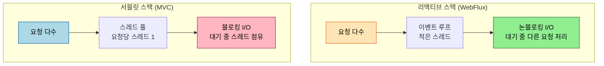
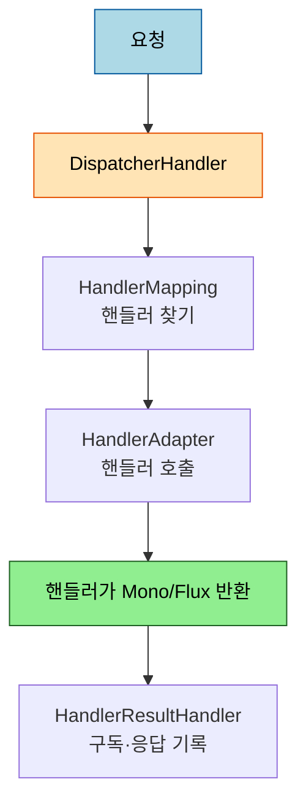

# WebFlux 서버 — 리액티브 스택과 어노테이션 모델

---

> 서블릿 MVC 가 요청 하나에 스레드 하나를 묶어 블로킹으로 처리한다면, WebFlux 는 적은 스레드로 논블로킹 이벤트 루프 위에서 많은 요청을 처리합니다. 같은 "요청을 받아 응답한다" 라는 문제를 다른 스택으로 푸는 것입니다. 본 문서는 두 스택의 차이와 WebFlux 의 어노테이션 모델을 다룹니다. 서블릿 MVC 의 DispatcherServlet 흐름은 [`03-01`](03-01.Spring%20MVC%20—%20FrontController에서%20DispatcherServlet까지.md), 리액티브 기초(Mono·Flux)는 [`../03_network/webflux/`](../03_network/webflux/README.md) 에 있으니 재서술하지 않고 위임합니다.


## 0. 학습 목표

이 문서를 읽고 나면 서블릿 스택과 리액티브 스택이 무엇이 다른지(`DispatcherServlet` vs `DispatcherHandler`, 블로킹 vs 논블로킹), WebFlux 의 어노테이션 모델로 리액티브 컨트롤러를 어떻게 쓰는지, 언제 WebFlux 를 골라야 하는지 설명할 수 있습니다. 본 묶음은 Spring Framework 6.2 / Spring Boot 3.3+ 기준입니다.

## 1. 두 스택 — 서블릿 vs 리액티브

서블릿 스택(Spring MVC)은 요청 하나가 스레드 하나를 점유하고, I/O 를 기다리는 동안 그 스레드가 블로킹됩니다. 요청이 많아지면 스레드 풀이 동나고, 스레드마다 스택 메모리가 들어 확장에 한계가 옵니다. 리액티브 스택(WebFlux)은 적은 수의 이벤트 루프 스레드가 논블로킹으로 동작해, I/O 를 기다리는 동안 그 스레드가 다른 요청을 처리합니다.



WebFlux 의 기본 서버는 서블릿 컨테이너(톰캣)가 아니라 Netty 입니다. 서블릿 API 자체를 전제하지 않고, 요청·응답을 리액티브 스트림으로 다룹니다. 서블릿 흐름의 상세는 [`03-01`](03-01.Spring%20MVC%20—%20FrontController에서%20DispatcherServlet까지.md) 에서 다루므로 여기서는 대비만 짚습니다.

## 2. DispatcherHandler — 리액티브 프런트 컨트롤러

MVC 에 `DispatcherServlet` 이 있다면, WebFlux 에는 `DispatcherHandler` 가 같은 자리를 맡습니다. 요청을 받아 적절한 핸들러로 위임하는 프런트 컨트롤러입니다. 내부 협력자도 MVC 와 대응합니다.

| MVC | WebFlux | 역할 |
|-----|---------|------|
| `DispatcherServlet` | `DispatcherHandler` | 프런트 컨트롤러 |
| `HandlerMapping` | `HandlerMapping` | 요청 → 핸들러 매핑 |
| `HandlerAdapter` | `HandlerAdapter` | 핸들러 호출 |
| `ViewResolver` | `HandlerResultHandler` | 결과 처리 |

이름과 역할이 거의 평행해서, MVC 를 알면 WebFlux 의 요청 처리 그림이 빠르게 들어옵니다. 차이는 *반환을 리액티브 타입(`Mono`/`Flux`)으로 다루고, 전 과정이 논블로킹* 이라는 점입니다.



## 3. 어노테이션 모델 — MVC와 같은 어노테이션

WebFlux 의 첫 번째 프로그래밍 모델은 어노테이션 기반입니다. 공식 문서가 "Annotated Controllers, which are consistent with Spring MVC and use the same annotations" 라고 적듯, `@RestController`·`@GetMapping`·`@RequestBody` 를 그대로 씁니다. 차이는 반환 타입이 `Mono`/`Flux` 라는 점뿐입니다.

```java
@RestController
public class UserController {

    @GetMapping("/users/{id}")
    public Mono<User> getUser(@PathVariable String id) {
        return userRepository.findById(id);   // 논블로킹, 단일 값
    }

    @GetMapping("/users")
    public Flux<User> listUsers() {
        return userRepository.findAll();        // 논블로킹, 다중 값 스트림
    }
}
```

`Mono<User>` 는 0~1개 값을, `Flux<User>` 는 0~N개 값을 비동기로 방출합니다. 컨트롤러는 값을 *직접 반환하는 게 아니라* "값이 준비되면 방출할 발행자" 를 반환하고, 실제 구독·실행은 프레임워크가 맡습니다. 그래서 MVC 코드를 거의 그대로 옮기면서 논블로킹 이점을 얻습니다.

## 4. 언제 WebFlux 인가

WebFlux 가 빛나는 자리는 *고동시성·스트리밍·논블로킹 I/O 체인* 입니다. 외부 API 를 여러 번 호출해 합치거나(WebClient 와 결합), 서버-센트 이벤트로 데이터를 흘려보내거나, 적은 자원으로 많은 연결을 받아야 할 때입니다. 그러나 함정이 있습니다. 체인 중간에 *블로킹 호출* (전통적 JDBC, 동기 라이브러리)이 끼면 이벤트 루프 스레드가 막혀 리액티브의 이점이 사라지고, 오히려 MVC 보다 나빠질 수 있습니다. 그래서 WebFlux 를 제대로 쓰려면 영속성도 논블로킹(R2DBC)이어야 하고, 불가피한 블로킹은 별도 스케줄러로 격리해야 합니다. 이 `.block()` 안티패턴은 [`../03_network/webflux/02-02`](../03_network/webflux/02-02.동기·비동기%20결정%20(block%20안티패턴).md) 에서 자세히 다룹니다.

## 5. 면접 대비 체크리스트

> 이 문서를 다 읽은 뒤 다음 질문에 답할 수 있어야 합니다.

1. 서블릿 스택과 리액티브 스택은 스레드 모델에서 어떻게 다릅니까? `DispatcherServlet` 과 `DispatcherHandler` 는 각각 무엇입니까?
2. WebFlux 어노테이션 모델이 MVC 와 거의 같은 코드인데도 논블로킹 이점을 얻는 이유는 무엇입니까? `Mono` 와 `Flux` 의 차이는?
3. WebFlux 체인에 블로킹 JDBC 호출을 섞으면 왜 이점이 사라집니까? 무엇으로 해결합니까?
