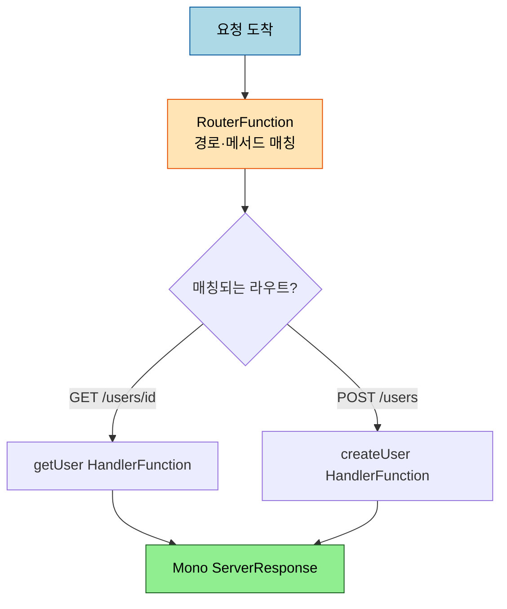
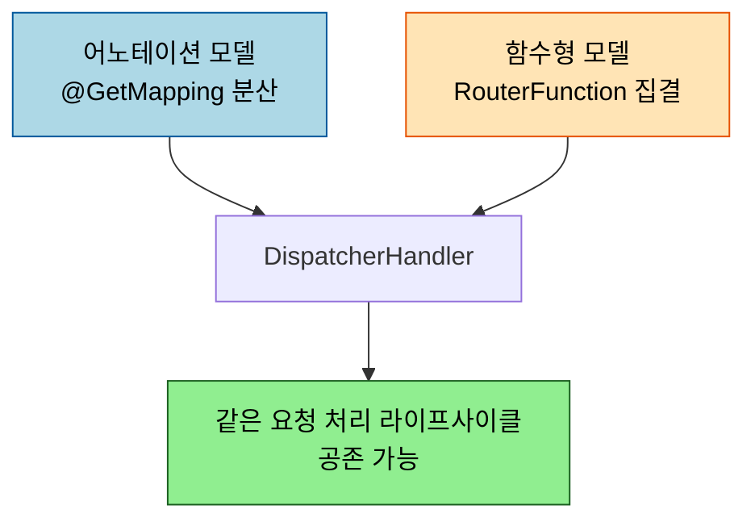

# WebFlux 함수형 엔드포인트 — RouterFunction과 HandlerFunction

---

> [`04-01`](04-01.WebFlux%20서버%20—%20리액티브%20스택과%20어노테이션%20모델.md) 의 어노테이션 모델 외에, WebFlux 는 두 번째 프로그래밍 모델을 제공합니다. `@RequestMapping` 어노테이션 대신 람다와 함수로 라우팅과 처리를 직접 짜는 WebFlux.fn 입니다. 라우팅이 어노테이션에 흩어지지 않고 코드 한곳에 명시적으로 모인다는 점이 다릅니다.


## 0. 학습 목표

이 문서를 읽고 나면 WebFlux.fn 의 `RouterFunction`·`HandlerFunction` 으로 어노테이션 없이 라우팅을 선언하고, 어노테이션 모델과 무엇이 다른지, 둘 중 무엇을 고를지 답할 수 있습니다.

## 1. 두 번째 모델 — 함수형 엔드포인트

WebFlux 의 어노테이션 모델이 `@GetMapping` 으로 *선언* 한다면, 함수형 모델은 요청 처리를 람다로 *직접 작성* 합니다. 공식 문서는 이를 "a lambda-based, lightweight, and functional approach where the application manages request handling from start to finish" 로 설명합니다. 두 모델은 같은 `DispatcherHandler` 라이프사이클 위에서 동작하고, 한 애플리케이션에 공존할 수 있습니다.

## 2. HandlerFunction — 요청을 처리하는 함수

함수형 모델의 처리 단위는 `HandlerFunction` 입니다. `ServerRequest` 를 받아 `Mono<ServerResponse>` 를 반환하는 함수로, 어노테이션 모델의 `@RequestMapping` 메서드 본문에 해당합니다. `ServerRequest`·`ServerResponse` 는 불변 계약이라 안전하게 다룰 수 있습니다.

```java
Mono<ServerResponse> getUser(ServerRequest request) {
    String id = request.pathVariable("id");
    return userRepository.findById(id)
        .flatMap(user -> ServerResponse.ok().bodyValue(user))
        .switchIfEmpty(ServerResponse.notFound().build());
}
```

값을 직접 반환하지 않고 `Mono<ServerResponse>` 를 반환하는 것은 04-01 의 어노테이션 모델과 같은 원리입니다 — 논블로킹이라 "응답이 준비되면 방출할 발행자" 를 돌려줍니다.

## 3. RouterFunction — 요청을 함수로 라우팅

어느 요청을 어느 `HandlerFunction` 으로 보낼지는 `RouterFunction` 이 정합니다. `ServerRequest` 를 받아 `Mono<HandlerFunction>` 을 반환하는 함수로, `@RequestMapping` 어노테이션의 등가물입니다 — 매핑 정보와 처리 위임을 함께 담습니다. `route()` DSL 로 선언합니다.

```java
@Bean
public RouterFunction<ServerResponse> userRoutes(UserHandler handler) {
    return route()
        .GET("/users/{id}", handler::getUser)
        .POST("/users", handler::createUser)
        .build();
}
```



라우팅 규칙이 한 메서드 안에 모여, 어떤 경로가 어디로 가는지 코드 한곳에서 읽힙니다. 어노테이션 모델에서 컨트롤러마다 흩어지던 매핑이 함수형에서는 라우터에 집결합니다.

## 4. 어노테이션 vs 함수형 — 결정

둘은 우열이 아니라 취향과 상황의 선택입니다. 같은 `DispatcherHandler` 위에서 돌고 공존하므로, 한 앱에서 섞어 써도 됩니다.



| 관점 | 어노테이션 모델 | 함수형 (WebFlux.fn) |
|------|----------------|---------------------|
| 라우팅 선언 | 컨트롤러에 어노테이션으로 분산 | RouterFunction 한곳에 집결 |
| 진입 비용 | MVC 경험 그대로 (낮음) | 함수형 사고 필요 |
| 제어 | 프레임워크가 많이 가져감 | 앱이 처음부터 끝까지 관리 |
| 적합 | 익숙함·관례 선호 | 라우팅을 명시적으로 보고 싶을 때 |

한 가지 혼동 주의가 있습니다. 서블릿 스택(MVC)에도 함수형 모델 WebMvc.fn 이 있지만, 이는 `web.servlet.function` 패키지로 `ServerResponse` 를 *직접* 반환합니다. WebFlux.fn 은 `web.reactive.function` 패키지로 `Mono<ServerResponse>` 를 반환합니다 — 이름이 비슷해도 스택이 다르니 import 와 반환 타입으로 구분합니다.

## 5. 면접 대비 체크리스트

> 이 문서를 다 읽은 뒤 다음 질문에 답할 수 있어야 합니다.

1. `HandlerFunction` 과 `RouterFunction` 은 각각 어노테이션 모델의 무엇에 대응합니까?
2. 함수형 모델이 어노테이션 모델과 비교해 라우팅을 어떻게 다르게 보여 줍니까?
3. WebFlux.fn 과 WebMvc.fn 은 무엇이 다릅니까? 코드에서 어떻게 구분합니까?
