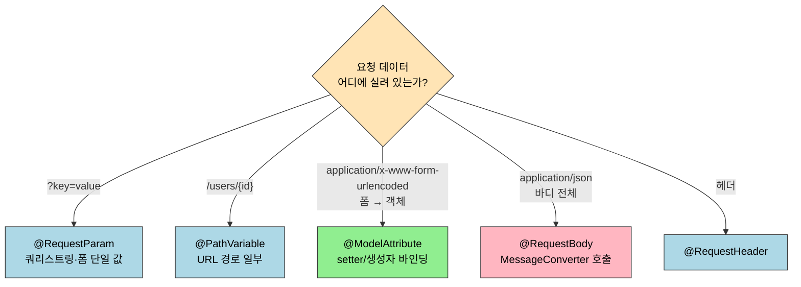
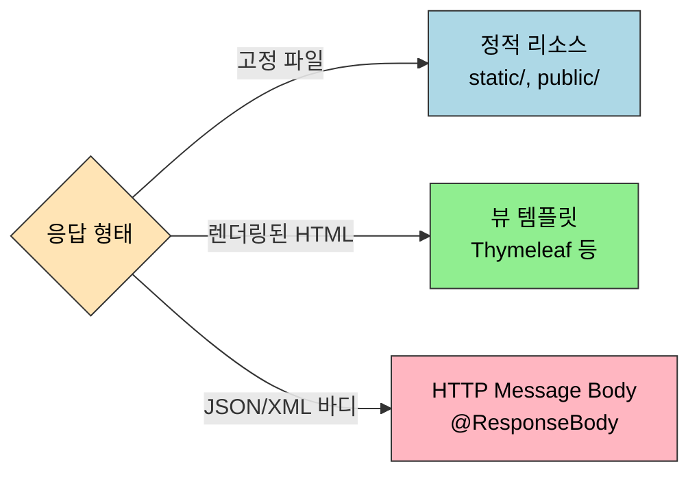
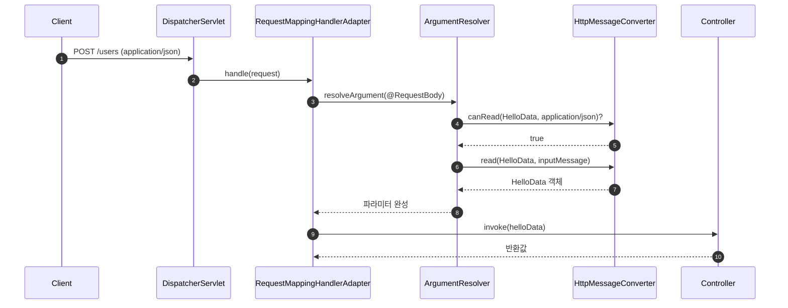
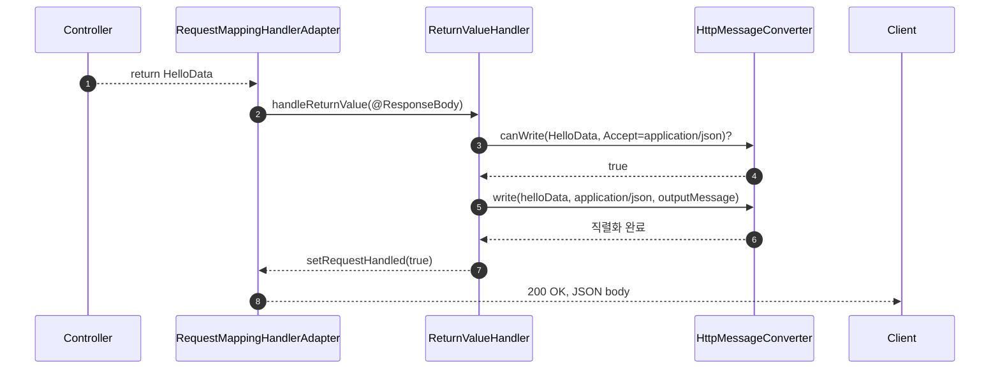

# HTTP 요청·응답과 메시지 컨버터

---

> DispatcherServlet이 HandlerAdapter를 호출한 뒤, 컨트롤러 메서드의 파라미터와 반환값이 실제 HTTP 메시지와 어떻게 연결되는지를 추적합니다. `@RequestParam`·`@RequestBody`·`HttpMessageConverter`·Jackson `ObjectMapper`까지를 하나의 흐름으로 이어 설명합니다.

## 진입 — DispatcherServlet 다음 단계

> DispatcherServlet이 핸들러를 찾은 뒤, 컨트롤러 메서드의 파라미터를 채우는 일은 `RequestMappingHandlerAdapter`가 맡습니다. 이 단계에서 `ArgumentResolver`와 `HttpMessageConverter`가 등장합니다.

`01_core/` 의 MVC(03장) 편에서 DispatcherServlet이 HandlerMapping으로 핸들러를 찾고 HandlerAdapter에 위임하는 것까지 추적했습니다. 이 문서는 그 다음 단계, 곧 핸들러 메서드의 *파라미터를 어떻게 만들고* *반환값을 어떻게 응답 바디로 바꾸는가*에 집중합니다.

```mermaid
flowchart LR
    A["DispatcherServlet"] --> B["RequestMappingHandlerAdapter"]
    B --> C["ArgumentResolver<br>파라미터 채우기"]
    C --> D["HttpMessageConverter<br>바디 → 객체"]
    D --> E["Controller 메서드 실행"]
    E --> F["ReturnValueHandler<br>반환값 처리"]
    F --> G["HttpMessageConverter<br>객체 → 바디"]
    G --> H["HTTP Response"]

    style A fill:#FFE4B5,color:#000,stroke:#333
    style B fill:#FFE4B5,color:#000,stroke:#333
    style C fill:#ADD8E6,color:#000,stroke:#333
    style D fill:#90EE90,color:#000,stroke:#333
    style E fill:#FFB6C1,color:#000,stroke:#333
    style F fill:#ADD8E6,color:#000,stroke:#333
    style G fill:#90EE90,color:#000,stroke:#333
    style H fill:#FFE4B5,color:#000,stroke:#333
```



## 1. 한 줄 정의

> 데이터 바인딩은 *문자 기반 HTTP 메시지*를 *타입 있는 자바 객체*로 옮기는 작업이고, 컨버터·포맷터·메시지 컨버터는 모두 이 옮김의 단계별 도구입니다.

스프링 MVC는 같은 "변환"이라도 어디서 일어나느냐에 따라 도구를 나누어 둡니다. URL 파라미터 한 개를 `int`로 바꾸는 일과, JSON 본문 전체를 DTO로 바꾸는 일은 *발생 지점*도 다르고 *책임 인터페이스*도 다릅니다. 이 차이를 먼저 잡지 않으면 어노테이션과 인터페이스가 비슷한 이름으로 자꾸 충돌하는 것처럼 보입니다.

| 구분 | 인터페이스 | 다루는 데이터 | 사용 어노테이션 |
|------|-----------|-------------|---------------|
| 단일 값 타입 변환 | `Converter<S, T>` | `?id=10` 같은 문자열 한 조각 | `@RequestParam`, `@PathVariable` |
| 문자 특화 + 국제화 | `Formatter<T>` | 날짜·숫자 표시 형식 | `@DateTimeFormat`, `@NumberFormat` |
| 본문 전체 직렬화 | `HttpMessageConverter<T>` | JSON·XML·텍스트 *바디 전체* | `@RequestBody`, `@ResponseBody` |
| JSON ↔ 객체 라이브러리 | Jackson `ObjectMapper` | JSON 문자열 | (메시지 컨버터 내부에서 호출) |

이 구분을 머리에 두고 각 도구의 자리를 하나씩 따라가겠습니다.

## 2. DTO — 컨트롤러가 받는 모양

> DTO(Data Transfer Object)는 계층 간 데이터 이동을 위한 *전용 객체*입니다. 엔티티를 그대로 노출하지 않는 이유는 DB 스키마와 API 표현을 분리해 두어야 한쪽이 바뀌어도 다른 쪽에 영향이 번지지 않기 때문입니다.

DTO가 필요한 이유는 세 가지입니다. 첫째, 한 번의 요청으로 필요한 데이터만 묶어 보내 네트워크 호출 횟수를 줄입니다. 둘째, 직렬화 형식(JSON, XML 등)을 한 곳에서 관리할 수 있어 표현 계층이 바뀌어도 다른 계층은 그대로 둘 수 있습니다. 셋째, 프레젠테이션 계층과 데이터 액세스 계층 사이 결합도를 낮춰, 한쪽 변경의 파급을 차단합니다.

```java
@Data  // getter/setter/toString/equals/hashCode 자동 생성
public class AccountsDto {
    private String accountNumber;
    private String accountType;
    private String branchAddress;
}
```

엔티티에는 `@Data`를 쓰지 않는 관행이 있습니다. JPA는 동등성을 식별자 기반으로 다루는데 Lombok의 `equals`/`hashCode`가 모든 필드를 끌어다 비교하면서 영속성 컨텍스트의 일관성을 깨뜨릴 수 있기 때문입니다. DTO는 영속성과 무관하므로 `@Data`를 써도 안전합니다.

## 3. 요청 데이터 4가지 형태

> HTTP 요청이 데이터를 싣고 오는 자리는 네 곳입니다. URL 쿼리, 경로 변수, 폼 바디, JSON 바디. 각각에 대응하는 어노테이션이 다른 이유는 *바디 파싱 여부*와 *Content-Type*이 다르기 때문입니다.



### 3.1 @RequestParam — 쿼리·폼 단일 값

> `@RequestParam`은 쿼리스트링이나 폼 인코딩에서 *이름으로* 값 하나를 꺼냅니다. 변수명이 같으면 어노테이션과 속성명을 모두 생략할 수 있는 것은, 스프링이 단순 타입에 한해 자동 변환기를 적용해 주기 때문입니다.

```java
// http://localhost:8080/request-param?username=hello&age=20
@ResponseBody
@RequestMapping("/request-param-v2")
public String requestParamV2(
        @RequestParam("username") String username
        , @RequestParam("age") int age) {
    return "ok";
}

// 변수명이 동일하면 속성 생략 가능
@ResponseBody
@RequestMapping("/request-param-v3")
public String requestParamV3(@RequestParam String username, @RequestParam int age) {
    return "ok";
}

// 단순 타입은 어노테이션도 생략 가능
@ResponseBody
@RequestMapping("/request-param-v4")
public String requestParamV4(String username, int age) {
    return "ok";
}
```

필수 여부와 기본값도 지정할 수 있습니다. `required = true`인데 값이 없으면 400을 반환하고, `defaultValue`는 값이 빠졌을 때 채워 넣을 값을 정합니다. 여러 파라미터를 한 번에 받고 싶을 때는 `Map<String, Object>`로 받습니다.

```java
@RequestMapping("/request-param-default")
public String requestParamDefault(
        @RequestParam(required = true, defaultValue = "guest") String username
        , @RequestParam(required = false, defaultValue = "-1") int age) {
    return "ok";
}

@RequestMapping("/request-param-map")
public String requestParamMap(@RequestParam Map<String, Object> paramMap) {
    return "ok";
}
```

### 3.2 @PathVariable — URL 경로

> `@PathVariable`은 URL 경로의 일부를 변수로 꺼냅니다. RESTful 설계에서 자원의 식별자를 경로에 두는 관례 때문에 거의 모든 단건 조회 API에서 사용합니다.

```java
@GetMapping("/mapping/{userId}")
public String mappingPath(@PathVariable("userId") String data) {
    return "ok";
}

// 변수명이 같으면 속성 생략
@GetMapping("/mapping/{userId}")
public String mappingPath(@PathVariable String userId) {
    return "ok";
}

// 다중 사용
@GetMapping("/mapping/users/{userId}/orders/{orderId}")
public String mappingPath(@PathVariable String userId, @PathVariable Long orderId) {
    return "ok";
}
```

### 3.3 @ModelAttribute — 폼 객체 바인딩

> `@ModelAttribute`는 요청 파라미터 이름과 객체 프로퍼티 이름을 매칭해 *객체 단위*로 채워 줍니다. 동작 기반이 setter/생성자이기 때문에 대상 클래스에 이 둘 중 하나가 반드시 필요합니다.

```java
@ResponseBody
@RequestMapping("/model-attribute-v1")
public String modelAttributeV1(@ModelAttribute HelloData helloData) {
    log.info("username={}, age={}", helloData.getUsername(), helloData.getAge());
    return "ok";
}
```

동작 순서는 두 단계입니다. 먼저 요청 파라미터 이름으로 `HelloData`의 프로퍼티를 찾고, 다음으로 setter 또는 생성자를 호출해 값을 주입합니다. `age=abc`처럼 타입이 맞지 않으면 `BindException`이 발생하는데, 이 바인딩 오류의 안전한 처리는 `02-01` 검증 편에서 다룹니다.

`@RequestParam`과 `@ModelAttribute`는 요청 *파라미터* 영역에 한정됩니다. HTTP 메시지 바디로 데이터가 직접 넘어오는 JSON 요청은 다음 절의 `@RequestBody`가 받습니다.

### 3.4 @RequestBody — JSON 바디

> `@RequestBody`는 HTTP 요청 본문 전체를 자바 객체로 변환합니다. 이 변환은 어노테이션 자체가 하는 일이 아니라, 등록된 `HttpMessageConverter` 중 Content-Type을 지원하는 컨버터에게 위임되는 일입니다.

JSON 요청을 받는 가장 원시적인 방법은 서블릿 입력 스트림에서 직접 읽는 것입니다. 흐름을 한 번 보면 메시지 컨버터가 무엇을 자동화하는지가 명확해집니다.

```java
@PostMapping("/request-body-json-v1")
public void requestBodyJsonV1(HttpServletRequest request, HttpServletResponse response)
        throws IOException {
    ServletInputStream inputStream = request.getInputStream();
    String messageBody = StreamUtils.copyToString(inputStream, StandardCharsets.UTF_8);
    HelloData helloData = objectMapper.readValue(messageBody, HelloData.class);
    response.getWriter().write("ok");
}
```

스트림 추출 → 문자열 변환 → `ObjectMapper` 호출까지 세 줄을 매번 쓰지 않아도 되도록 `@RequestBody`가 동일한 일을 대신합니다. 이 자리에서 호출되는 것이 `MappingJackson2HttpMessageConverter`입니다.

```java
@ResponseBody
@PostMapping("/request-body-json-v3")
public String requestBodyJsonV3(@RequestBody HelloData helloData) {
    return "ok";
}
```

`HelloData`에 생성자나 setter가 없어 보여도 Jackson이 리플렉션으로 필드를 채우기 때문에 객체화 자체는 동작합니다. 다만 *예측 가능한 코드*를 위해 기본 생성자와 getter는 명시적으로 두는 편이 안전합니다.

헤더와 바디를 함께 받고 싶다면 `HttpEntity`로 감쌉니다.

```java
@PostMapping("/request-body-json-v4")
public String requestBodyJsonV4(HttpEntity<HelloData> data) {
    HelloData helloData = data.getBody();
    return "ok";
}
```

### 3.5 @RequestHeader — 헤더

> `@RequestHeader`는 특정 헤더 값을 메서드 파라미터로 받습니다. 인증 토큰, 언어 협상, 추적 ID처럼 메서드 본문 흐름에 사용해야 하는 헤더에 씁니다.

`@RequestMapping`은 `headers`, `params`, `consumes`, `produces` 속성으로 특정 조건에서만 매핑되도록 좁힐 수 있습니다. `consumes`는 요청 Content-Type을 제한하고(불일치 시 415), `produces`는 응답 Accept을 제한합니다(불일치 시 406).

```java
@PostMapping(value = "/mapping-consume", consumes = "application/json")
public String mappingConsumes() { return "ok"; }

@GetMapping(value = "/mapping-produce", produces = "text/html")
public String mappingProduce() { return "ok"; }
```

## 4. 응답 데이터 — @ResponseBody / @RestController / @ResponseStatus

> 서버가 응답을 만드는 방식은 정적 리소스, 뷰 템플릿, HTTP 메시지 바디 세 가지입니다. REST API는 세 번째에 해당하며, `@ResponseBody`·`@RestController`·`ResponseEntity`가 이 자리에서 동작합니다.

스프링 부트는 `src/main/resources/static`·`public` 아래 파일을 컨트롤러를 거치지 않고 그대로 응답합니다. 동적 페이지는 Thymeleaf 같은 템플릿 엔진을 사용해 모델 데이터를 HTML로 렌더링합니다. REST API는 HTML이 아닌 JSON·XML을 바디에 직접 실어 보냅니다.



`@ResponseBody`는 메서드 반환값을 HTTP 메시지 바디에 직접 쓰겠다는 표시입니다. `@RestController`는 `@Controller`와 `@ResponseBody`를 묶은 메타 어노테이션이라, 클래스 단위로 모든 메서드에 적용됩니다.

```java
@RestController
public class ResponseBodyController {

    @ResponseBody
    @GetMapping("/response-body-string-v3")
    public String responseBodyV3() {
        return "ok";
    }
}
```

상태 코드까지 명시하려면 `@ResponseStatus`를 붙이거나 `ResponseEntity`를 반환합니다. 헤더·바디·상태를 모두 제어해야 한다면 빌더 형태가 가장 가독성이 좋습니다.

```java
@RestController
public class ResponseBodyController {

    // 1. 직접 객체 생성
    @GetMapping("/response-body-json-v1")
    public ResponseEntity<HelloData> responseBodyJsonV1() {
        HelloData helloData = new HelloData();
        helloData.setUsername("userA");
        helloData.setAge(20);
        return new ResponseEntity<>(helloData, HttpStatus.OK);
    }

    // 2. @ResponseStatus 사용
    @ResponseStatus(HttpStatus.OK)
    @ResponseBody
    @GetMapping("/response-body-json-v2")
    public HelloData responseBodyJsonV2() {
        HelloData helloData = new HelloData();
        helloData.setUsername("userA");
        helloData.setAge(20);
        return helloData;
    }

    // 3. ResponseEntity 빌더
    @GetMapping("/api/users")
    public ResponseEntity<HelloData> getUser() {
        HelloData helloData = new HelloData();
        helloData.setUsername("userB");
        helloData.setAge(25);
        return ResponseEntity.ok()
                .header("Custom-Header", "value")
                .body(helloData);
    }
}
```

## 5. 타입 변환 — Converter / Formatter / ConversionService

> `Converter`는 단순 타입 변환을 위한 *가장 작은 단위*이고, `Formatter`는 거기에 *문자 표현*과 *Locale*을 더한 것이며, `ConversionService`는 이들을 모아 두는 *레지스트리*입니다. 셋의 역할 분리를 알면 어디에 무엇을 등록해야 할지가 자연스레 정해집니다.

`Converter<S, T>`는 소스 타입을 대상 타입으로 바꾸는 함수형 인터페이스입니다.

```java
public interface Converter<S, T> {
    T convert(S source);
}
```

문자열 `"127.0.0.1:8080"`을 `IpPort` 값 객체로 바꾸는 예입니다.

```java
@Getter
@EqualsAndHashCode
public class IpPort {
    private String ip;
    private int port;

    public IpPort(String ip, int port) {
        this.ip = ip;
        this.port = port;
    }
}

public class StringToIpPortConverter implements Converter<String, IpPort> {
    @Override
    public IpPort convert(String source) {
        String[] split = source.split(":");
        return new IpPort(split[0], Integer.parseInt(split[1]));
    }
}
```

스프링은 용도에 따라 네 가지 변환기 종류를 제공합니다.

- `Converter`: 기본 타입 컨버터
- `ConverterFactory`: 전체 클래스 계층 구조가 필요할 때(Enum 계층 등)
- `GenericConverter`: 대상 필드의 애노테이션 정보까지 사용할 때
- `ConditionalGenericConverter`: 특정 조건이 참인 경우에만 실행할 때

`ConversionService`는 등록된 컨버터들을 한곳에서 호출할 수 있게 해 줍니다. `DefaultConversionService`는 사용용 인터페이스(`ConversionService`)와 등록용 인터페이스(`ConverterRegistry`) 둘 다 구현합니다.

```java
@Test
void conversionService() {
    DefaultConversionService conversionService = new DefaultConversionService();
    conversionService.addConverter(new StringToIpPortConverter());
    conversionService.addConverter(new IpPortToStringConverter());

    IpPort ipPort = conversionService.convert("127.0.0.1:8080", IpPort.class);
    assertThat(ipPort).isEqualTo(new IpPort("127.0.0.1", 8080));
}
```

스프링 MVC에서는 `WebMvcConfigurer#addFormatters`로 등록하면 `@RequestParam`, `@PathVariable`, `@ModelAttribute` 같은 데이터 바인딩 자리에 자동 적용됩니다.

```java
@Configuration
public class WebConfig implements WebMvcConfigurer {
    @Override
    public void addFormatters(FormatterRegistry registry) {
        registry.addConverter(new IpPortToStringConverter());
        registry.addConverter(new StringToIpPortConverter());
    }
}

@RestController
public class TestController {
    // ip-port?ipPort=127.0.0.1:8080 → IpPort 자동 변환
    @GetMapping("/ip-port")
    public String ipPort(@RequestParam("ipPort") IpPort ipPort) {
        return "ok";
    }
}
```

`Formatter<T>`는 `Converter`와 비슷하지만 *문자 표현*에 특화되어 있고 `Locale`을 받아 국제화에 대응합니다.

```java
public interface Formatter<T> extends Printer<T>, Parser<T> {
    String print(T object, Locale locale);            // 객체 → 문자
    T parse(String text, Locale locale) throws ParseException;  // 문자 → 객체
}

public class MyNumberFormatter implements Formatter<Number> {
    @Override
    public String print(Number object, Locale locale) {
        return NumberFormat.getInstance(locale).format(object);
    }
    @Override
    public Number parse(String text, Locale locale) throws ParseException {
        return NumberFormat.getInstance(locale).parse(text);
    }
}
```

`@NumberFormat`, `@DateTimeFormat`은 이런 포맷터 기반으로 동작하는 어노테이션입니다. 등록은 `DefaultFormattingConversionService`로 하며, 이쪽은 컨버터와 포맷터를 모두 받습니다.

주의할 점은 **`Formatter`는 JSON 직렬화에 영향을 주지 않는다**는 사실입니다. 스프링의 데이터 바인딩과 웹 폼 제출에는 적용되지만, REST API의 JSON 응답은 Jackson이 처리하므로 그 자리에는 `@JsonFormat`이나 사용자 정의 `JsonSerializer`를 따로 써야 합니다.

```java
@Data
static class Form {
    @NumberFormat(pattern = "###,###")  // 폼 바인딩용
    private Integer number;

    @JsonFormat(shape = JsonFormat.Shape.STRING, pattern = "yyyy-MM-dd HH:mm:ss")
    private LocalDateTime localDateTime;  // JSON 직렬화용
}
```

`Enum` 코드 매핑처럼 다형적 변환이 필요할 때는 `ConverterFactory`가 한 줄로 답이 됩니다.

```java
@Component
public class StringToTableEnumConverterFactory implements ConverterFactory<String, TableEnum> {
    @Override
    public <T extends TableEnum> Converter<String, T> getConverter(Class<T> targetType) {
        if (!targetType.isEnum()) {
            throw new IllegalArgumentException("TableEnum 구현체는 Enum이어야 합니다.");
        }
        return new StringToTableEnumConverter<>(targetType);
    }

    @RequiredArgsConstructor
    private static class StringToTableEnumConverter<T extends TableEnum> implements Converter<String, T> {
        private final Class<T> enumType;

        @Override
        public T convert(String source) {
            if (source.isEmpty()) return null;
            for (T enumConstant : enumType.getEnumConstants()) {
                if (enumConstant.getCode().equals(source)) return enumConstant;
            }
            throw new IllegalArgumentException(
                    String.format("Enum 상수에 '%s' 코드가 없습니다. enumType=%s"
                            , source, enumType.getSimpleName()));
        }
    }
}
```

## 6. HTTP Message Converter — JSON ↔ Java 객체

> 메시지 컨버터는 *바디 전체*를 객체로 바꾸거나 객체를 바디로 쓰는 역할을 합니다. `@RequestBody`/`@ResponseBody`가 붙은 자리에서 동작하며, `Converter`(단일 값 변환)와는 역할이 다른 별도 인터페이스입니다.

```java
public interface HttpMessageConverter<T> {
    boolean canRead(Class<?> clazz, @Nullable MediaType mediaType);
    boolean canWrite(Class<?> clazz, @Nullable MediaType mediaType);
    List<MediaType> getSupportedMediaTypes();

    T read(Class<? extends T> clazz, HttpInputMessage inputMessage)
            throws IOException, HttpMessageNotReadableException;

    void write(T t, @Nullable MediaType contentType, HttpOutputMessage outputMessage)
            throws IOException, HttpMessageNotWritableException;
}
```

대표 컨버터는 세 가지입니다.

| 컨버터 | 처리 대상 | 매칭되는 Content-Type / 반환 타입 |
|--------|----------|-------------------------------|
| `ByteArrayHttpMessageConverter` | `byte[]` | `application/octet-stream` 등 |
| `StringHttpMessageConverter` | `String` | `text/plain` 등 |
| `MappingJackson2HttpMessageConverter` | 객체 ↔ JSON | `application/json` |

동작 방식은 두 방향으로 갈립니다. 요청 측에서는 `@RequestBody`나 `HttpEntity`를 만난 시점에 `canRead()`로 후보 컨버터를 고른 뒤 `read()`로 객체화합니다. 응답 측에서는 `@ResponseBody`나 `HttpEntity` 반환을 만나면 `canWrite()`로 후보를 고른 뒤 `write()`로 바디에 직렬화합니다.



응답 흐름은 `ReturnValueHandler` → `HttpMessageConverter`로 이어집니다.



`RequestMappingHandlerAdapter`는 메서드 파라미터를 `HandlerMethodArgumentResolver`로 채우고, 반환값을 `HandlerMethodReturnValueHandler`로 처리합니다. `@RequestBody`/`@ResponseBody`에 대응하는 리졸버·핸들러가 내부에서 메시지 컨버터를 호출하는 구조라서, 컨버터 자체를 컨트롤러가 직접 다룰 일은 거의 없습니다.

`ArgumentResolver`는 사용자 정의도 가능합니다. 세션에서 로그인 사용자 객체를 꺼내 자동으로 파라미터로 주입하는 패턴이 대표적입니다.

```java
@Target(ElementType.PARAMETER)
@Retention(RetentionPolicy.RUNTIME)
public @interface SignIn {}

public class SignInArgumentResolver implements HandlerMethodArgumentResolver {
    @Override
    public boolean supportsParameter(MethodParameter parameter) {
        boolean hasLoginAnnotation = parameter.hasParameterAnnotation(SignIn.class);
        boolean hasMemberType = MemberResponseStatus.class
                .isAssignableFrom(parameter.getParameterType());
        return hasLoginAnnotation && hasMemberType;
    }

    @Override
    public Object resolveArgument(MethodParameter parameter,
                                  ModelAndViewContainer mavContainer,
                                  NativeWebRequest webRequest,
                                  WebDataBinderFactory binderFactory) {
        HttpServletRequest request = (HttpServletRequest) webRequest.getNativeRequest();
        HttpSession session = request.getSession(false);
        if (session == null || session.getAttribute(Const.SIGNIN_MEMBER) == null) {
            return null;
        }
        return session.getAttribute(Const.SIGNIN_MEMBER);
    }
}

@Configuration
public class WebConfig implements WebMvcConfigurer {
    @Override
    public void addArgumentResolvers(List<HandlerMethodArgumentResolver> resolvers) {
        resolvers.add(new SignInArgumentResolver());
    }
}

@RestController
@RequestMapping("/auth")
public class AuthController {
    @GetMapping("/status")
    public ResponseEntity<?> memberStatus(@SignIn MemberResponseStatus member) {
        return new ResponseEntity<>(member, HttpStatus.OK);
    }
}
```

## 7. Jackson ObjectMapper — 직렬화·역직렬화 흐름

> `ObjectMapper`는 `MappingJackson2HttpMessageConverter`가 실제 JSON↔객체 변환을 위임하는 라이브러리 클래스입니다. 직렬화는 리플렉션으로 객체에서 값을 꺼내고, 역직렬화는 기본 생성자로 객체를 만든 뒤 필드를 채우는 방식으로 동작합니다.

직렬화는 `writeValueAsString`이 담당합니다. 기본 설정은 `public` 필드 또는 `public` getter만 접근하므로, 안전하게 직렬화하려면 getter를 두어야 합니다.

```java
public class Person {
    private String name;
    private int age;

    public Person() {}
    public Person(String name, int age) {
        this.name = name;
        this.age = age;
    }
    // getter ...
}

@Component
@RequiredArgsConstructor
public class ObjectMapperService {
    private final ObjectMapper objectMapper;

    public String personToJson() throws Exception {
        Person person = new Person("John Doe", 30);
        return objectMapper.writeValueAsString(person);
        // {"name":"John Doe","age":30}
    }
}
```

getter 기반 접근에는 함정이 있습니다. 단순히 "값을 노출하는 메서드"가 아니라 `getXxx()` *명명 규칙*을 따르는 모든 메서드가 후보가 됩니다. 의도하지 않은 메서드까지 직렬화 대상이 되면 JSON에 불필요한 필드가 새어 나옵니다.

```java
public class Person {
    private String name;
    private int age;
    // ...
    public String getNameWithAge() {
        return name + "(" + age + ")";
    }
}
// 결과: {"name":"John Doe","age":30,"nameWithAge":"John Doe(30)"}
```

역직렬화는 두 단계입니다. 기본 생성자로 객체를 만들고 필드 값을 찾아 바인딩합니다. 기본 생성자가 없으면 에러가 발생합니다.

```java
@Test
void jsonToPersonTest() throws Exception {
    String personJson = "{\"name\":\"John Doe\",\"age\":30}";
    Person result = objectMapperService.jsonToPerson(personJson);
}
```

자바 8에서 도입된 `LocalDateTime`은 Jackson이 하위 호환성을 위해 기본 지원하지 않습니다. `JavaTimeModule`을 등록해야 정상 처리됩니다. 스프링 부트는 클래스패스에 `jackson-datatype-jsr310`이 있으면 이 모듈을 자동 등록해 주지만, 직접 `ObjectMapper`를 만들 때는 명시해야 합니다.

```java
objectMapper = new ObjectMapper();
objectMapper.registerModule(new JavaTimeModule());
```

DTO에 자주 쓰는 Jackson 어노테이션은 다음과 같습니다.

```java
@Getter @Builder
@NoArgsConstructor @AllArgsConstructor
@ToString
public class Person {
    private String name;
    private int age;

    @JsonProperty("email_address")  // JSON 필드명 매핑
    private String email;

    @JsonIgnore                     // 직렬화/역직렬화 모두 제외
    private String password;

    @JsonFormat(shape = JsonFormat.Shape.STRING, pattern = "yyyy-MM-dd")
    private LocalDate birthDate;
}
```

이렇게 두면 `email`은 JSON에서 `email_address`로 노출되고, `password`는 양방향 모두에서 제외되며, `birthDate`는 지정 패턴 문자열로 직렬화됩니다.

## 8. 면접 대비 요약

> 각 도구의 *책임 경계*를 한 문장으로 답할 수 있어야 합니다.

- **`@RequestParam`과 `@RequestBody`의 차이는?** `@RequestParam`은 쿼리스트링·폼 인코딩에서 *이름으로* 단일 값을 꺼내고 단순 타입 변환기에 위임하며, `@RequestBody`는 요청 *바디 전체*를 `HttpMessageConverter`(주로 `MappingJackson2HttpMessageConverter`)에 넘겨 객체로 변환합니다.
- **`@ModelAttribute`와 `@RequestBody`는 어떻게 다른가?** `@ModelAttribute`는 폼 파라미터를 setter/생성자로 바인딩하므로 `application/x-www-form-urlencoded`에 적합하고, `@RequestBody`는 메시지 컨버터로 바디 전체를 역직렬화하므로 `application/json`에 적합합니다.
- **`Converter`와 `HttpMessageConverter`는 같은 것인가?** 둘은 다른 인터페이스입니다. `Converter<S, T>`는 단일 값 타입 변환을 담당하고, `HttpMessageConverter<T>`는 HTTP 메시지 바디 전체의 읽기·쓰기를 담당합니다.
- **`Formatter`가 JSON 응답에 안 먹히는 이유는?** `Formatter`는 스프링 데이터 바인딩 경로에서만 적용되며, JSON 응답은 Jackson `ObjectMapper`가 처리합니다. 그래서 JSON 형식은 `@JsonFormat`이나 `JsonSerializer`로 따로 지정해야 합니다.
- **`@RestController`는 무엇의 단축형인가?** `@Controller` + `@ResponseBody`이며, 클래스의 모든 핸들러 메서드 반환값을 바디로 직접 쓰겠다는 선언입니다.
- **`@RequestBody`로 받는 DTO에 기본 생성자가 필요한 이유는?** Jackson이 역직렬화 첫 단계로 기본 생성자를 호출해 빈 객체를 만든 뒤 필드를 채우기 때문입니다. 기본 생성자가 없으면 즉시 실패합니다.
- **`ArgumentResolver`와 메시지 컨버터의 관계는?** `RequestMappingHandlerAdapter`가 메서드 파라미터를 `ArgumentResolver`로 채우고, `@RequestBody`를 처리하는 리졸버 내부에서 적합한 `HttpMessageConverter`를 골라 바디를 객체화합니다.

## 9. 다음에 읽을 것

> 이 문서가 다룬 "받은 데이터를 객체로 만든다"의 다음 단계는 "이 객체가 올바른지 검증한다"입니다.

- [`../09_validation/01-01.수동 검증과 BindingResult`](../09_validation/01-01.수동%20검증과%20BindingResult.md): `@ModelAttribute`/`@RequestBody`에서 발생하는 `BindException`을 안전하게 처리하는 방법과 `@Valid`/`@Validated`의 차이.
- `../01_core/03-01.Spring MVC — FrontController에서 DispatcherServlet까지`: 이 문서의 *바로 앞 단계*에 해당하는 HandlerMapping·HandlerAdapter 결정 과정.
