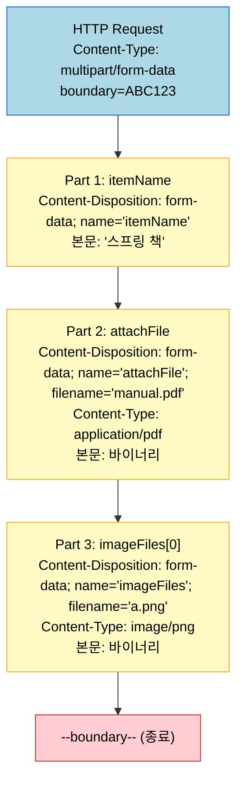
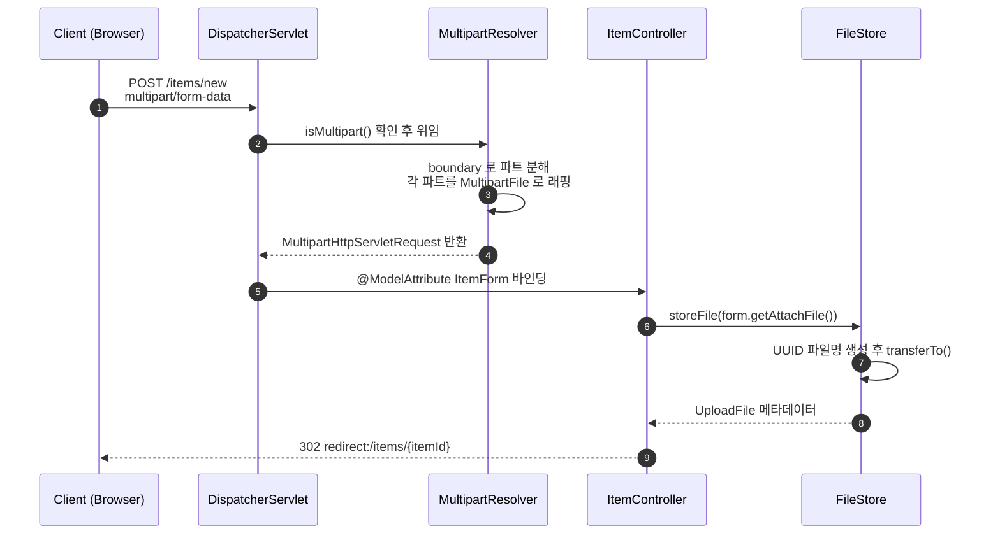

# 파일 업로드 — Multipart
---

> HTML 폼이 파일과 텍스트를 함께 실어 보내는 `multipart/form-data` 구조부터, Spring MVC가 그것을 `MultipartFile` 한 줄로 받아 저장·다운로드까지 끝내는 흐름을 한 번에 설명합니다. 면접에서 "왜 JSON 으로 파일을 못 보내냐" 라는 질문에 HTTP 바디 레이아웃부터 답할 수 있는 수준을 목표로 합니다.

## 진입 — JSON 바인딩으로는 부족한 영역

> 일반적인 폼 데이터는 `application/x-www-form-urlencoded` 한 줄짜리 쿼리스트링이면 충분합니다. 그러나 파일은 바이너리이고, 파일과 텍스트를 같이 보내야 하는 순간 인코딩 자체를 바꿔야 합니다. 그래서 `multipart/form-data` 라는 별도의 컨텐츠 타입이 필요합니다.

HTML 폼 전송은 크게 두 가지로 나뉩니다.

1. **`application/x-www-form-urlencoded`**: 폼 태그에 별도 `enctype` 옵션이 없을 때 자동으로 붙는 기본값입니다. `key=value&key2=value2` 형태로 쿼리 파라미터처럼 묶여 전송됩니다.
2. **`multipart/form-data`**: 파일 같은 바이너리 데이터와 일반 텍스트를 동시에 보낼 수 있는 형식입니다. 폼 태그에 `enctype="multipart/form-data"` 를 명시해야 활성화됩니다.

문자만 보낼 때는 1번이 가볍고 충분합니다. 문제는 파일입니다. 파일은 바이너리이고 길이가 길어 한 줄짜리 키-값으로 인코딩할 수 없습니다. 또한 실제 폼에서는 파일만 보내는 경우보다 "상품명 + 첨부파일 + 이미지 여러 장" 처럼 텍스트와 파일이 섞인 경우가 일반적입니다. 두 가지를 한 요청에 담아야 하므로 `multipart/form-data` 가 필요합니다.

## 1. 한 줄 정의

> `multipart/form-data` 는 하나의 HTTP 요청 바디를 `boundary` 라는 구분선으로 여러 파트로 나눠 각 파트마다 자체 헤더와 본문을 갖게 하는 컨텐츠 타입이고, Spring MVC 는 이를 `MultipartResolver` 가 분해해 컨트롤러의 `MultipartFile` 파라미터로 주입해 줍니다.

한 문장에 핵심 부품 세 개 — `boundary`, `MultipartResolver`, `MultipartFile` — 가 모두 등장합니다. 각각이 어디서 왜 등장하는지 다음 절부터 차례로 풀어 갑니다.

## 2. multipart/form-data — HTTP 바디 구조

> 한 요청 안에 여러 종류의 데이터를 실으려면 어디까지가 한 조각인지 약속이 필요합니다. `multipart/form-data` 는 `boundary` 문자열로 그 경계를 그어 각 파트를 분리하고, 파트마다 `Content-Disposition` 헤더로 부가 정보를 붙입니다.

브라우저가 폼을 전송할 때 실제 바디는 다음과 비슷한 모양이 됩니다.

```
POST /items/new HTTP/1.1
Content-Type: multipart/form-data; boundary=----WebKitFormBoundaryABC123

------WebKitFormBoundaryABC123
Content-Disposition: form-data; name="itemName"

스프링 책
------WebKitFormBoundaryABC123
Content-Disposition: form-data; name="attachFile"; filename="manual.pdf"
Content-Type: application/pdf

%PDF-1.4 ...(바이너리)...
------WebKitFormBoundaryABC123--
```

핵심은 두 가지입니다.

- **`boundary`**: 헤더에 선언된 문자열을 본문 내에서 `--` 접두로 사용해 파트 경계를 표시합니다. 마지막 경계에는 `--` 접미가 한 번 더 붙어 종료를 알립니다.
- **`Content-Disposition`**: 각 파트의 헤더에 들어가는 부가 정보입니다. `name` 으로 폼 필드 이름을, 파일 파트라면 `filename` 으로 원본 파일명을, `Content-Type` 으로 MIME 타입을 함께 적습니다.

이 구조 덕분에 한 요청 안에 "텍스트 1개 + PDF 1개 + 이미지 3개" 처럼 종류가 다른 데이터를 섞어 보낼 수 있습니다.



## 3. application.yml — spring.servlet.multipart.* 설정

> Spring Boot 는 기본적으로 멀티파트 처리를 활성화하지만, 업로드 용량 기본값은 작아 실무에서 거의 항상 늘려 줘야 합니다. 설정 한 블록으로 활성화·임계치·임시 저장 위치까지 한 번에 제어합니다.

```yaml
spring:
  servlet:
    multipart:
      enabled: true            # 멀티파트 처리 활성화 (기본 true)
      max-file-size: 10MB      # 파일 1개당 최대 크기 (기본 1MB)
      max-request-size: 10MB   # 요청 전체 최대 크기 (기본 10MB)
      file-size-threshold: 0   # 이 크기 넘으면 메모리 대신 디스크에 임시 저장
      location:                # 임시 파일 디렉터리 (비우면 시스템 기본값)
```

가장 자주 부딪히는 옵션은 `max-file-size` 와 `max-request-size` 입니다. 기본값이 각각 1MB 와 10MB 라 첨부파일 한 장만 커도 `MaxUploadSizeExceededException` 이 던져집니다. 운영 환경에서는 도메인 요구에 맞춰 두 값을 함께 올려 줘야 합니다. 한쪽만 올리면 다른 쪽 한계에 걸립니다.

추가로 알아 두면 유용한 설정도 있습니다.

- `file-size-threshold`: 메모리에 들고 있을지 디스크에 임시 저장할지 가르는 기준입니다. 큰 파일을 다룬다면 0 이나 작은 값으로 두어 메모리 압박을 피합니다.
- `location`: 임시 파일이 쌓이는 디렉터리입니다. 컨테이너 환경에서는 영속 볼륨이 아닌 `/tmp` 류로 두는 게 일반적입니다.

## 4. MultipartFile — 컨트롤러 파라미터로 받기

> 멀티파트 요청은 `MultipartResolver` 가 자동으로 파싱해 각 파트를 `MultipartFile` 인스턴스로 묶어 줍니다. 컨트롤러는 폼 DTO 안에 `MultipartFile` 필드만 선언하면 곧바로 파일을 손에 쥡니다.

폼 DTO 와 컨트롤러는 다음과 같이 작성합니다.

```java
@Data
public class ItemForm {
    private Long itemId;
    private String itemName;
    private MultipartFile attachFile;
    private List<MultipartFile> imageFiles;
}
```

```java
@PostMapping("/items/new")
public String saveItem(@ModelAttribute ItemForm form, RedirectAttributes redirectAttributes) throws IOException {
    UploadFile attachFile = fileStore.storeFile(form.getAttachFile());
    List<UploadFile> storeImageFiles = fileStore.storeFiles(form.getImageFiles());

    // 데이터베이스에 저장
    // ...

    return "redirect:/items/{itemId}";
}
```

폼 필드 이름(`attachFile`, `imageFiles`) 과 DTO 필드 이름이 일치하면 Spring 이 알아서 매핑합니다. 같은 `name` 으로 여러 파일이 올 때는 `List<MultipartFile>` 로 받으면 그대로 묶입니다.

`MultipartFile` 에서 실무에서 가장 자주 쓰는 메서드는 두 개입니다.

- `file.getOriginalFilename()`: 클라이언트가 업로드한 원본 파일명을 반환합니다. 사용자가 본 이름이라 다운로드 시 그대로 돌려줘야 자연스럽습니다.
- `file.transferTo(File dest)`: 임시 저장된 파일을 지정 위치로 옮깁니다. 내부적으로 zero-copy 가 적용되는 경우가 많아 직접 스트림을 복사하는 것보다 효율적입니다.



## 5. @RequestPart — 파일 + JSON 같이 받기

> `@ModelAttribute` 는 폼 필드를 1:1 로 묶는 데 적합하지만, JSON 본문과 파일을 한 요청에 같이 받아야 할 때는 `@RequestPart` 가 더 명확합니다. 파트별로 다른 컨버터를 적용할 수 있기 때문입니다.

API 서버에서 자주 마주치는 시나리오는 "JSON 메타데이터 + 파일 1개" 입니다. 이 경우 다음과 같이 분리합니다.

```java
@PostMapping(value = "/items", consumes = MediaType.MULTIPART_FORM_DATA_VALUE)
public ResponseEntity<Void> create(
        @RequestPart("meta") ItemMeta meta,
        @RequestPart("file") MultipartFile file
) throws IOException {
    UploadFile saved = fileStore.storeFile(file);
    itemService.create(meta, saved);
    return ResponseEntity.ok().build();
}
```

`@RequestPart("meta")` 파트는 `Content-Type: application/json` 으로 도착하면 `MappingJackson2HttpMessageConverter` 가 역직렬화합니다. `@RequestPart("file")` 파트는 `MultipartFile` 로 그대로 받습니다. `@RequestParam` 으로도 파일을 받을 수 있지만 단순 문자열·파일에만 쓰고, JSON 파트가 섞이면 `@RequestPart` 가 정석입니다.

## 6. 파일 저장과 다운로드

> 업로드 받은 파일은 원본 파일명을 그대로 디스크에 쓰면 충돌·보안 문제가 생기므로, 서버는 UUID 같은 안전한 파일명으로 바꿔 저장하고 원본 파일명은 메타데이터로 따로 보관합니다. 다운로드 시에는 보관된 원본 파일명을 응답 헤더로 돌려줘 사용자가 보던 이름으로 받게 합니다.

### 6.1 FileStore — 저장 책임 분리

```java
@Component
public class FileStore {

    @Value("${file.dir}")
    private String fileDir;

    public String getFullPath(String filename) {
        return fileDir + filename;
    }

    public List<UploadFile> storeFiles(List<MultipartFile> multipartFiles) throws IOException {
        List<UploadFile> storeFileResult = new ArrayList<>();
        for (MultipartFile multipartFile : multipartFiles) {
            if (!multipartFile.isEmpty()) {
                UploadFile uploadFile = storeFile(multipartFile);
                storeFileResult.add(uploadFile);
            }
        }
        return storeFileResult;
    }

    public UploadFile storeFile(MultipartFile multipartFile) throws IOException {
        if (multipartFile.isEmpty()) {
            return null;
        }

        String originalFilename = multipartFile.getOriginalFilename();
        String storeFileName = createStoreFileName(originalFilename);

        multipartFile.transferTo(new File(getFullPath(storeFileName)));
        return new UploadFile(originalFilename, storeFileName);
    }

    private String createStoreFileName(String originalFilename) {
        String uuid = UUID.randomUUID().toString();
        String ext = extracted(originalFilename);
        return uuid + "." + ext;
    }

    private String extracted(String originalFilename) {
        int pos = originalFilename.lastIndexOf(".");
        return originalFilename.substring(pos + 1);
    }
}
```

핵심은 `UploadFile` 이라는 작은 값 객체입니다. `uploadFileName` 은 사용자가 올린 원본 이름, `storeFileName` 은 서버가 디스크에 쓴 UUID 이름입니다. 두 이름을 같이 보관해야 다운로드 시 원본 이름을 복원할 수 있습니다.

```java
@Data
public class UploadFile {

    private String uploadFileName;
    private String storeFileName;

    public UploadFile(String uploadFileName, String storeFileName) {
        this.uploadFileName = uploadFileName;
        this.storeFileName = storeFileName;
    }
}
```

### 6.2 컨트롤러 — 이미지 표시와 첨부파일 다운로드

이미지 표시와 첨부 다운로드는 응답 방식이 다릅니다. 이미지는 브라우저가 인라인으로 렌더링하면 되니 `UrlResource` 만 반환해도 충분합니다.

```java
@ResponseBody
@GetMapping("/images/{filename}")
public Resource downloadImage(@PathVariable String filename) throws MalformedURLException {
    return new UrlResource("file:" + fileStore.getFullPath(filename));
}
```

반면 첨부파일 다운로드는 사용자가 보던 원본 파일명으로 저장되게 해야 하므로 `Content-Disposition` 헤더를 직접 만들어 줍니다. 한글 파일명이 깨지지 않도록 `UriUtils.encode` 로 UTF-8 퍼센트 인코딩을 적용합니다.

```java
@GetMapping("/attach/{itemId}")
public ResponseEntity<Resource> downloadAttach(@PathVariable Long itemId) throws MalformedURLException {
    Item item = itemRepository.findById(itemId);
    String storeFileName = item.getAttachFile().getStoreFileName();
    String uploadFileName = item.getAttachFile().getUploadFileName();

    UrlResource resource = new UrlResource("file:" + fileStore.getFullPath(storeFileName));

    log.info("uploadFileName={}", uploadFileName);

    String encodedUploadFileName = UriUtils.encode(uploadFileName, StandardCharsets.UTF_8);
    String contentDisposition = "attach; filename=\"" + encodedUploadFileName + "\"";

    return ResponseEntity.ok()
            .header(HttpHeaders.CONTENT_DISPOSITION, contentDisposition)
            .body(resource);
}
```

`Content-Disposition: attach; filename="..."` 가 붙은 응답을 받으면 브라우저는 인라인 렌더링 대신 파일 저장 다이얼로그를 띄웁니다. `inline` 으로 바꾸면 PDF 같은 파일은 브라우저 내에서 열립니다.

## 7. WebFlux 와의 차이 (한 줄 언급)

> Spring MVC 의 `MultipartFile` 은 서블릿 스택에서만 동작하는 동기 API 이고, WebFlux 환경에서는 같은 멀티파트 요청을 `Mono<FilePart>` / `Flux<Part>` 로 비동기 스트리밍 방식으로 받습니다. WebFlux 측 구현 세부는 [`../03_webflux/02-01.Multipart와 파일 업·다운로드.md`](../03_webflux/02-01.Multipart와 파일 업·다운로드.md) 에 별도로 정리돼 있습니다.

## 8. 면접 대비 요약

> 한 줄 정의에서 다섯 핵심 부품 — `boundary`, `Content-Disposition`, `MultipartResolver`, `MultipartFile`, `@RequestPart` — 을 모두 언급할 수 있어야 합니다.

| 질문 | 핵심 답 |
|------|--------|
| 왜 파일은 `application/x-www-form-urlencoded` 로 못 보내나요 | 바이너리이고, 보통 텍스트와 섞어 보내야 합니다. 한 줄 쿼리스트링 인코딩으로는 두 요구를 다 못 채워 `multipart/form-data` 가 필요합니다 |
| `multipart/form-data` 의 `boundary` 가 뭔가요 | 한 바디 안에서 각 파트의 경계를 표시하는 구분자입니다. 요청 헤더에 선언되고, 본문에서는 `--boundary` 형태로 나타나며 마지막은 `--boundary--` 로 종료를 알립니다 |
| Spring 에서 파일은 어떻게 받나요 | `MultipartResolver` 가 요청을 파싱해 `MultipartFile` 로 묶어 주고, 컨트롤러는 `@ModelAttribute` 안의 필드나 `@RequestPart` 파라미터로 받습니다 |
| `@RequestPart` 와 `@RequestParam` 차이는 | `@RequestParam` 은 단순 폼 필드·파일에 적합하고, `@RequestPart` 는 JSON 같은 컨텐츠 타입 파트를 메시지 컨버터로 변환할 때 씁니다 |
| 파일 1MB 넘으니 에러가 납니다 | `spring.servlet.multipart.max-file-size` 기본값이 1MB 입니다. `max-request-size` 와 같이 올려 줘야 합니다 |
| 원본 파일명을 그대로 저장하지 않는 이유는 | 동일 이름 충돌과 경로 주입 같은 보안 문제를 피하기 위해서입니다. 보통 UUID 로 바꿔 저장하고 원본 이름은 메타데이터로 따로 보관합니다 |
| 한글 파일명 다운로드 시 깨집니다 | `Content-Disposition` 헤더 값에 들어가는 파일명을 `UriUtils.encode` 로 UTF-8 퍼센트 인코딩해 줘야 합니다 |

## 9. 다음에 읽을 것

> 멀티파트는 데이터 바인딩의 한 갈래입니다. 같은 카테고리 내 다른 바인딩 주제와, 비동기 스택의 같은 주제로 진입할 수 있습니다.

- [`01-01.HTTP 요청·응답과 메시지 컨버터.md`](./01-01.HTTP%20요청·응답과%20메시지%20컨버터.md) — `HttpMessageConverter` 가 JSON·XML·String 을 어떻게 변환하는지 (멀티파트 파트별 컨버터 선택의 기반)
- [`../03_webflux/02-01.Multipart와 파일 업·다운로드.md`](../03_webflux/02-01.Multipart와%20파일%20업·다운로드.md) — WebFlux 에서 `Mono<FilePart>` / `Flux<Part>` 로 같은 멀티파트를 다루는 방식
- [`../01_core/03-01.Spring MVC — FrontController에서 DispatcherServlet까지.md`](../01_core/03-01.Spring%20MVC%20—%20FrontController에서%20DispatcherServlet까지.md) — `DispatcherServlet` 이 `MultipartResolver` 를 어느 시점에 호출하는지 전체 흐름
