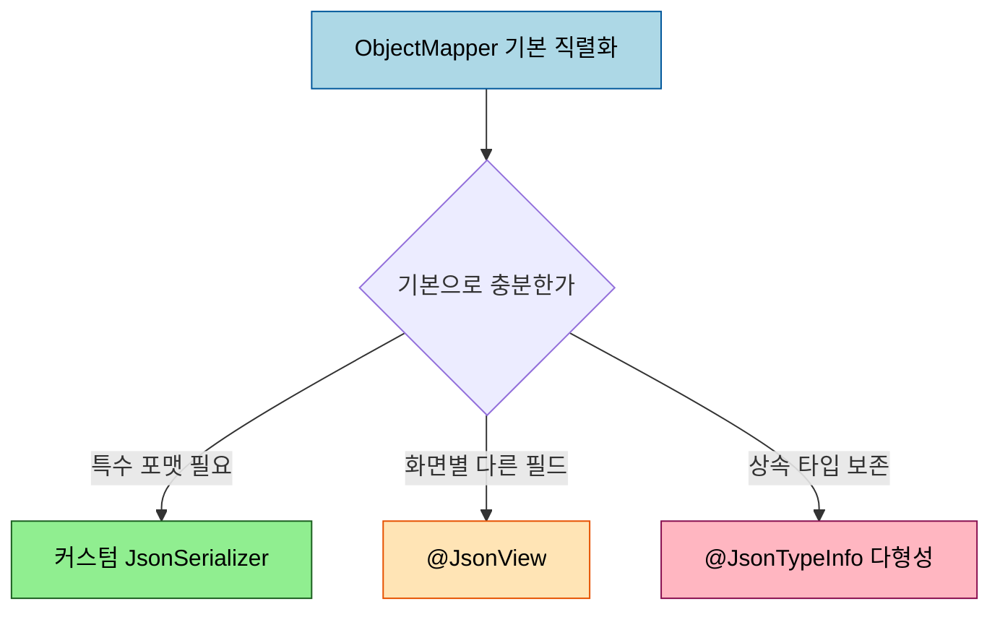
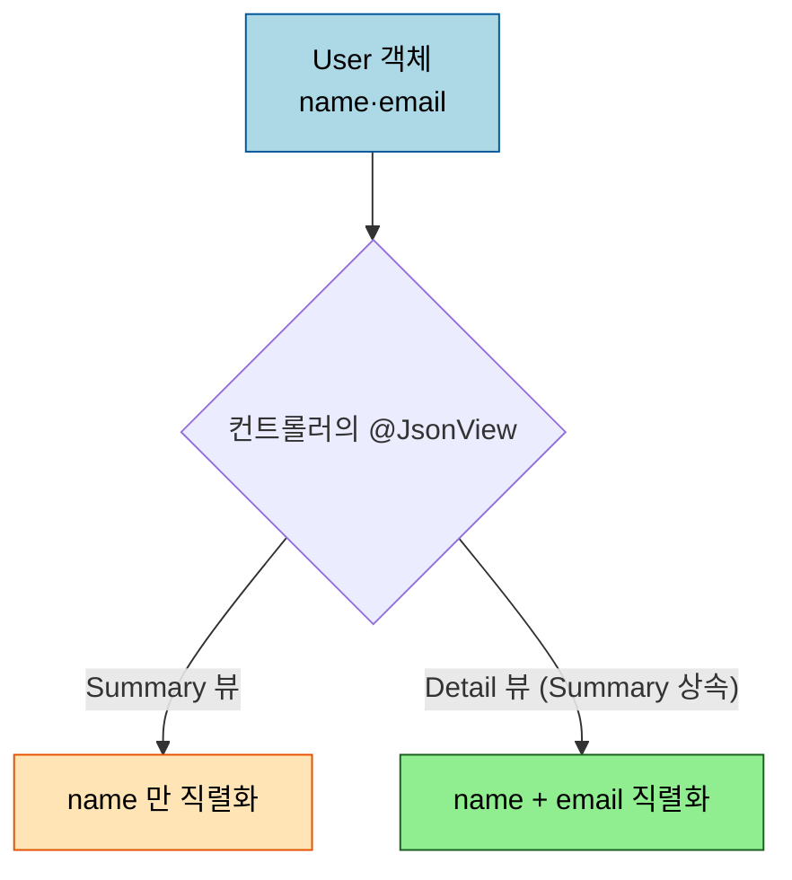

# JSON 직렬화 심화 — 커스텀 Serializer·@JsonView·다형성

---

> [`01-01 §7`](01-01.HTTP%20요청·응답과%20메시지%20컨버터.md) 에서 `ObjectMapper` 가 객체를 JSON 으로 바꾸는 기본 흐름을 봤습니다. 표준 직렬화로 안 되는 형상 — 특별한 포맷, 화면별로 다른 필드, 상속 타입 보존 — 은 그 위에 손을 더해야 합니다. 본 문서는 커스텀 `Serializer`, `@JsonView`, 다형성 직렬화 세 가지로 직렬화를 제어하는 법을 다룹니다. 기본 흐름은 01-01 위임, 여기서는 *그 위* 만 봅니다.


## 0. 학습 목표

이 문서를 읽고 나면 표준 직렬화로 표현되지 않는 형상을 커스텀 `JsonSerializer`/`JsonDeserializer` 로 직접 만들고, `@JsonView` 로 같은 객체를 화면별로 다르게 노출하며, 다형성 타입을 안전하게 직렬화할 수 있습니다. 본 묶음은 Spring Boot 3.3 / Jackson 2.x 기준입니다.

## 1. 언제 커스텀이 필요한가

`ObjectMapper` 의 기본 직렬화는 필드를 그대로 JSON 으로 옮깁니다([`01-01 §7`](01-01.HTTP%20요청·응답과%20메시지%20컨버터.md)). 그러나 도메인이 요구하는 표현은 종종 그 기본과 어긋납니다. 금액을 항상 소수점 둘째 자리 문자열로 내보내야 하거나, 같은 사용자 객체를 목록 화면에서는 이름만, 상세 화면에서는 전부 보여야 하거나, 상위 타입 컬렉션을 직렬화했다가 역직렬화할 때 구체 타입을 잃지 말아야 하는 경우입니다. 세 요구가 각각 §2·§3·§4 의 도구로 풀립니다.



## 2. 커스텀 JsonSerializer / JsonDeserializer

특정 타입을 항상 같은 형식으로 직렬화하려면 `JsonSerializer<T>` 를 구현합니다. Spring Boot 는 `@JsonComponent` 를 붙이면 이 직렬화기를 자동으로 `ObjectMapper` 에 등록해 줍니다.

```java
@JsonComponent
public class MoneySerializer extends JsonSerializer<Money> {
    @Override
    public void serialize(Money value, JsonGenerator gen, SerializerProvider sp) throws IOException {
        gen.writeString(value.getAmount().setScale(2) + " " + value.getCurrency());
    }
}
```

`@JsonComponent` 는 Spring Boot 가 제공하는 편의 어노테이션으로, 컴포넌트 스캔으로 발견해 Jackson 모듈로 묶어 등록합니다. Spring 없이 순수 Jackson 만 쓸 때는 `SimpleModule` 에 직렬화기를 담아 `ObjectMapper.registerModule` 로 등록합니다. 역직렬화가 필요하면 `JsonDeserializer<T>` 를 같은 방식으로 만듭니다. 필드 하나에만 적용하려면 `@JsonSerialize(using = ...)` 를 그 필드에 붙입니다.

## 3. @JsonView — 화면별 필드 노출

하나의 DTO 를 여러 화면이 공유할 때, 화면마다 노출 필드가 다를 수 있습니다. `@JsonView` 는 뷰 마커 인터페이스로 필드를 그룹 지어, 컨트롤러가 어느 뷰로 직렬화할지 고르게 합니다.



```java
public class Views {
    public interface Summary {}
    public interface Detail extends Summary {}
}

public class User {
    @JsonView(Views.Summary.class) private String name;
    @JsonView(Views.Detail.class) private String email;
}

@GetMapping("/users")
@JsonView(Views.Summary.class)   // 목록은 name 만
public List<User> list() { ... }
```

`Detail` 이 `Summary` 를 상속하므로 상세 화면은 `name` + `email` 을 모두 내보내고, 목록 화면은 `name` 만 내보냅니다. 같은 객체를 DTO 두 개로 쪼개지 않고도 노출을 분기할 수 있어, 단순한 경우에 편리합니다. 다만 뷰가 많아지면 어노테이션이 흩어져 복잡해지므로, 그 단계에서는 화면별 DTO 분리가 더 읽기 좋습니다.

## 4. 다형성 직렬화 — @JsonTypeInfo

상위 타입으로 선언된 필드나 컬렉션을 직렬화하면 기본적으로 구체 타입 정보가 사라져, 역직렬화 때 어느 하위 타입인지 알 수 없습니다. `@JsonTypeInfo` + `@JsonSubTypes` 로 타입 식별자를 JSON 에 함께 실으면 이 문제가 풀립니다.

```java
@JsonTypeInfo(use = JsonTypeInfo.Id.NAME, property = "type")
@JsonSubTypes({
    @JsonSubTypes.Type(value = CardPayment.class, name = "card"),
    @JsonSubTypes.Type(value = BankPayment.class, name = "bank")
})
public abstract class Payment { ... }
```

직렬화 시 `"type":"card"` 같은 식별자가 붙고, 역직렬화 시 그 값으로 구체 클래스를 고릅니다. 한 가지 보안 주의가 있습니다. 타입 식별자에 *클래스 이름 전체* 를 쓰는 default typing(`activateDefaultTyping`)은 신뢰할 수 없는 입력에 켜면 임의 클래스 역직렬화로 이어지는 취약점이 됩니다. 그래서 위처럼 `Id.NAME` + 명시적 `@JsonSubTypes` 로 허용 타입을 한정하는 편이 안전합니다.

## 5. 면접 대비 체크리스트

> 이 문서를 다 읽은 뒤 다음 질문에 답할 수 있어야 합니다.

1. 커스텀 `JsonSerializer` 를 Spring Boot 에서 자동 등록하려면 무엇을 붙입니까? 순수 Jackson 에서는 어떻게 등록합니까?
2. `@JsonView` 로 목록·상세 화면의 노출 필드를 어떻게 분기합니까? 뷰가 많아지면 무엇이 더 나은 선택입니까?
3. 다형성 직렬화에서 `@JsonTypeInfo` 의 default typing 을 신뢰 못 할 입력에 켜면 안 되는 이유는 무엇입니까?
