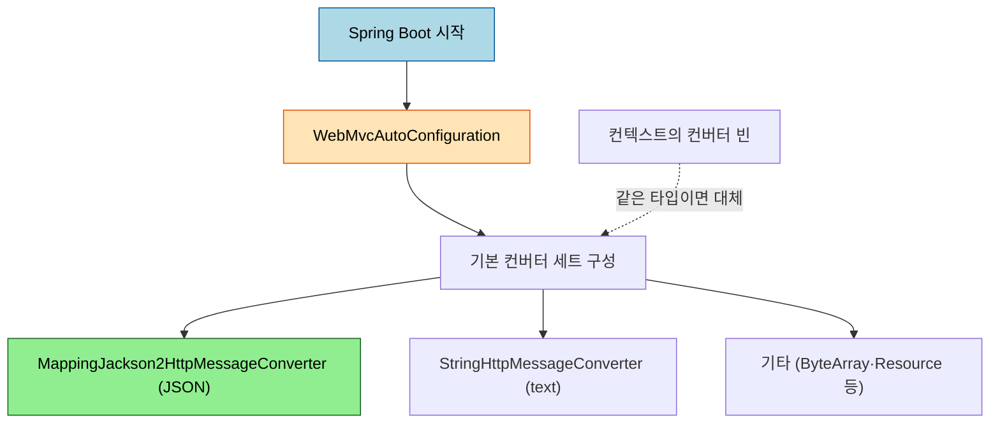
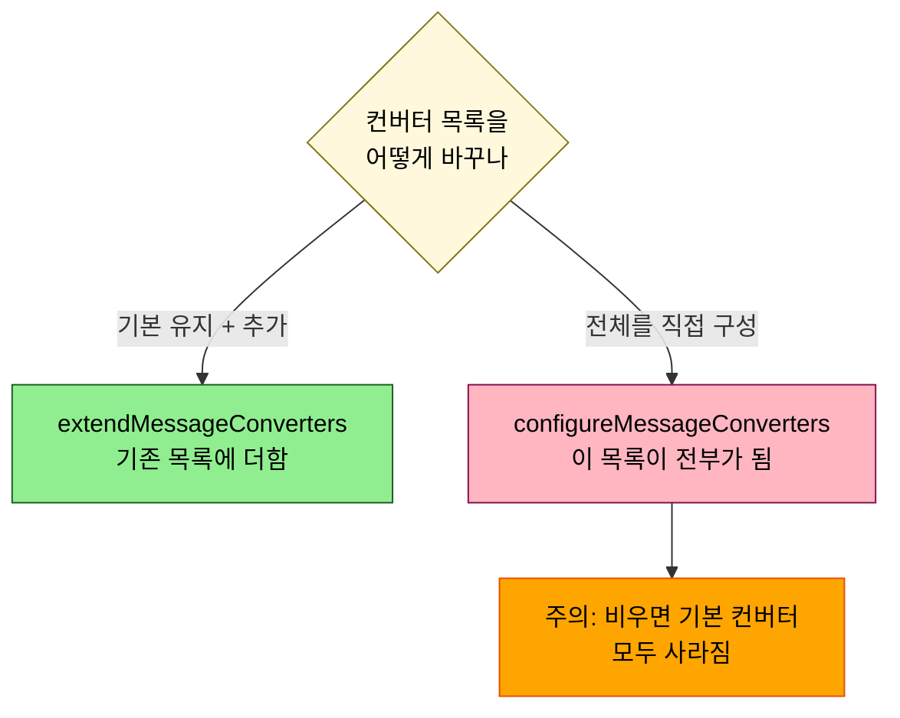

# 메시지 컨버터 자동 설정 — WebMvcAutoConfiguration과 등록 결정

---

> [`01-01 §6`](01-01.HTTP%20요청·응답과%20메시지%20컨버터.md) 에서 어느 `HttpMessageConverter` 가 JSON 을 처리하는지 봤습니다. 그 컨버터들이 *어떻게 등록되는가*, 그리고 커스텀 컨버터를 더하거나 바꾸려면 어디에 손대야 하는가가 본 문서의 주제입니다. 두 메서드(`configureMessageConverters`·`extendMessageConverters`)의 차이를 잘못 알면 기본 컨버터가 통째로 사라지는 사고가 납니다. 본 묶음은 Spring Boot 3.3 / Jackson 2.x 기준입니다.


## 0. 학습 목표

이 문서를 읽고 나면 Spring Boot 가 어떤 `HttpMessageConverter` 를 자동 등록하는지 설명하고, 커스텀 컨버터를 추가·교체하는 경로를 구분하며, `configureMessageConverters` 와 `extendMessageConverters` 중 무엇을 써야 기본 컨버터를 잃지 않는지 답할 수 있습니다.

## 1. 자동 등록 — WebMvcAutoConfiguration

Spring Boot 는 `WebMvcAutoConfiguration` 을 통해 기본 `HttpMessageConverter` 세트를 자동으로 구성합니다. JSON 은 Jackson 이 클래스패스에 있으면 `MappingJackson2HttpMessageConverter` 가, 문자열은 `StringHttpMessageConverter`(기본 UTF-8)가 맡는 식입니다. 개발자가 아무 설정도 안 해도 `@RestController` 가 객체를 JSON 으로 내보내는 것은 이 자동 등록 덕입니다.



편의를 위해 `HttpMessageConverters` 타입의 빈도 제공되어, 기본 컨버터와 사용자가 더한 컨버터 목록에 접근할 수 있습니다. 이는 커스텀 `RestTemplate` 에 같은 컨버터를 주입할 때 유용합니다.

## 2. ObjectMapper만 손보기 — Jackson2ObjectMapperBuilderCustomizer

컨버터 자체를 바꾸기보다 *JSON 형식만* 조정하고 싶을 때가 많습니다. 이때는 컨버터를 건드리지 않고 `Jackson2ObjectMapperBuilderCustomizer` 빈으로 자동 구성된 `ObjectMapper` 를 손봅니다.

```java
@Bean
public Jackson2ObjectMapperBuilderCustomizer jsonCustomizer() {
    return builder -> {
        builder.serializationInclusion(JsonInclude.Include.NON_NULL);
        builder.failOnUnknownProperties(false);
    };
}
```

`@JsonComponent` 로 등록한 커스텀 직렬화기([`01-03`](01-03.JSON%20직렬화%20심화%20—%20커스텀%20Serializer·@JsonView·다형성.md))도 이 자동 구성된 `ObjectMapper` 에 함께 실립니다. 그래서 대부분의 JSON 형식 요구는 컨버터를 새로 등록할 필요 없이 이 커스터마이저 한 곳에서 해결됩니다.

## 3. 컨버터 추가·교체 — 두 메서드의 결정 트리

컨버터 목록 자체에 손대야 하면 `WebMvcConfigurer` 의 두 메서드를 씁니다. 이름이 비슷하지만 동작이 정반대라, 잘못 고르면 기본 컨버터가 통째로 사라집니다.



`extendMessageConverters` 는 자동 등록된 기본 컨버터를 그대로 두고 목록을 *확장* 합니다. 대부분의 "컨버터 하나 추가" 요구는 이쪽입니다. `configureMessageConverters` 는 그 목록이 *전체* 가 되어, 여기서 추가하지 않은 기본 컨버터는 등록되지 않습니다. 더 간단하게는, 컨버터 빈을 컨텍스트에 등록하면 같은 타입의 기본 컨버터를 대체합니다 — Spring Boot 가 기본을 기여하는 메커니즘과 같은 통로를 쓰기 때문입니다.

## 4. @EnableWebMvc 의 함정 — 자동설정 opt-out

`@EnableWebMvc` 를 붙이면 *Spring Boot 의 MVC 자동 구성 전체가 꺼집니다*. 그러면 위에서 본 기본 컨버터 자동 등록도 사라져, 개발자가 `WebMvcConfigurationSupport.getMessageConverters` 로 모든 것을 직접 구성해야 합니다. 단순히 인터셉터 하나 추가하려고 `@EnableWebMvc` 를 붙였다가 JSON 응답이 깨지는 사고가 여기서 나옵니다. Spring Boot 환경에서는 `@EnableWebMvc` 없이 `WebMvcConfigurer` 만 구현하는 게 정석이고, 자동 구성을 완전히 떠안을 작정이 아니면 `@EnableWebMvc` 를 붙이지 않습니다.

## 5. 면접 대비 체크리스트

> 이 문서를 다 읽은 뒤 다음 질문에 답할 수 있어야 합니다.

1. Spring Boot 에서 JSON 응답 컨버터는 누가 자동 등록합니까? 클래스패스의 Jackson 유무가 무엇을 결정합니까?
2. `configureMessageConverters` 와 `extendMessageConverters` 는 어떻게 다릅니까? 기본 컨버터를 잃지 않으려면 무엇을 써야 합니까?
3. JSON 형식만 바꾸고 싶을 때 컨버터를 새로 등록하지 않고 쓰는 방법은 무엇입니까?
4. Spring Boot 에서 `@EnableWebMvc` 를 함부로 붙이면 안 되는 이유는 무엇입니까?
