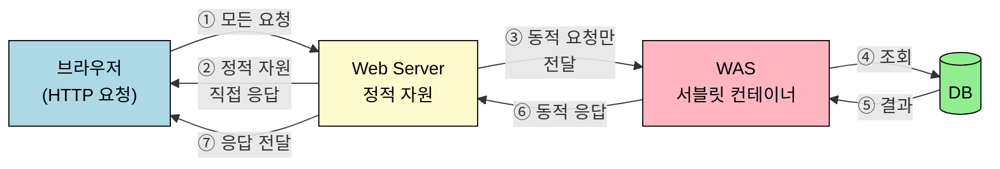
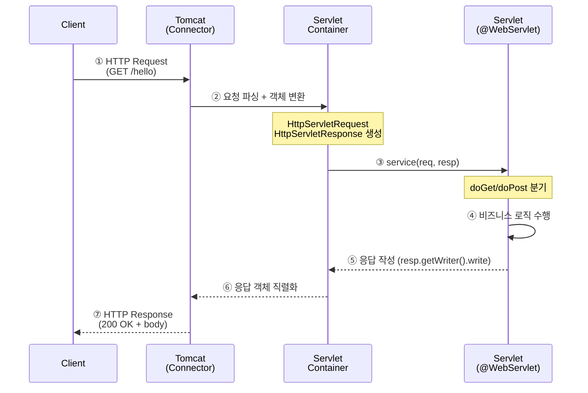
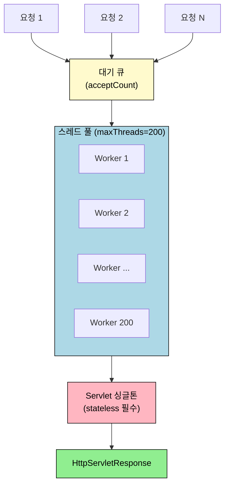

# WAS와 서블릿 — HTTP 처리의 토대
---
> 이 문서를 다 읽으면 WAS와 Web Server의 역할 차이를 한 문장으로 설명할 수 있고, 서블릿 컨테이너가 요청 하나를 어떻게 스레드 풀로 받아 `HttpServletRequest`/`HttpServletResponse`로 변환해 우리 코드까지 전달하는지 5단계로 풀어낼 수 있게 됩니다.

## 진입 — 왜 WAS가 필요했는가

스프링을 처음 잡으면 `@RestController` 한 줄로 응답이 나가는 마법부터 만나게 됩니다. 그 뒤에는 톰캣이라는 서블릿 컨테이너가 소켓을 열어 두고 요청을 받아 객체로 변환해 우리 메서드를 호출하는 과정이 깔려 있죠. 이 토대를 모르면 "왜 컨트롤러는 멤버 변수에 상태를 두면 안 되는가" 같은 질문에 답할 수 없게 됩니다. 본문은 노션 학습 노트 4편(WAS 개념, Servlet, 멀티 스레드, Cookie/Session)을 한 흐름으로 이어 붙였습니다. 순수 Socket으로 HTTP를 직접 짜 본 통증, 그것을 떼어 가는 서블릿 API와 컨테이너, 컨테이너의 멀티 스레드 구조, HTTP 무상태성을 보완하는 쿠키/세션 — 다섯 주제가 한 줄로 꿰입니다.

## 1. 한 줄 정의
> WAS는 HTTP 요청을 받아 동적 컨텐츠를 만들어 돌려주는 미들웨어이며, 서블릿은 그 WAS 위에서 우리 자바 코드가 요청을 처리하기 위해 따라야 하는 표준 규약입니다.

WAS(Web Application Server)는 톰캣·제티 같은 구현체로 존재하고, 우리가 짜는 서블릿 클래스는 그 WAS가 정해 둔 라이프사이클 메서드(`init`, `service`, `destroy`)에 끼워 넣는 부품이 됩니다. 다시 말해 "WAS = 실행 환경, 서블릿 = 환경이 호출하는 규약" 구도죠. 스프링 부트의 임베디드 톰캣도 결국 이 구도를 그대로 따르며, `DispatcherServlet` 한 개를 톰캣에 등록해 모든 요청을 받아 갑니다.

## 2. 정적/동적 자원과 WAS의 등장
> Web Server는 정적 컨텐츠 전담, WAS는 DB·로직이 필요한 동적 컨텐츠 전담입니다. 둘을 분리하는 이유는 장애 격리와 자원 효율 때문이죠.

### 2.1 Web Server vs WAS

Web Server는 브라우저의 HTTP 요청을 받아 html·css·js·이미지·영상 같은 정적 자원을 그대로 내려보냅니다. 반면 WAS는 DB 조회나 비즈니스 로직 처리가 필요한 동적 응답을 만들어 냅니다. 톰캣 같은 WAS는 내부적으로 "웹 컨테이너"·"서블릿 컨테이너"라고 불리며, 우리가 짠 `Servlet`을 통해 요청 → 데이터 조회 → 로직 수행 → 응답 페이지 생성의 흐름을 돕습니다. WAS가 Web Server 기능까지 흡수해서 처리할 수도 있지만, WAS만 두면 장애 시 오류 화면조차 못 띄우고 정적 자원까지 떠안아 과부하가 옵니다. 그래서 실무에서는 WAS 앞에 Web Server(또는 프록시)를 두어 관심사를 분리하죠.

### 2.2 분리해서 얻는 효익

웹 서버를 프록시로 앞단에 세우면 정적 리소스 응답이 WAS까지 들어오지 않아 WAS 부담이 줄어듭니다. 트래픽 패턴에 맞춰 따로 증설하기도 좋아집니다. 정적 리소스가 늘면 웹 서버를, 애플리케이션 처리량이 부족하면 WAS를 늘리면 되니까요. 다만 API만 응답한다면 정적 자원이 없어 웹 서버를 둘 필요는 없습니다.



### 2.3 Socket으로 HTTP를 직접 짜 보면 — 노션 02-1 SSAFY 실습

WAS가 왜 필요한지는 직접 Socket으로 HTTP를 받아 보면 체감이 다릅니다. 노션 원본 02-1의 SSAFY 실습 코드는 `ServerSocket`으로 8080 포트를 열고 `accept()`로 클라이언트 접속을 기다린 뒤, 입력 스트림으로 한 줄씩 요청을 파싱합니다.

```java
// PORT
private static final int PORT = 8080;

// 서버 소켓
ServerSocket serverSocket = null;

// 클라이언트 소켓
Socket clientSocket= null;

// 소켓 통신에 활용할 노드 스트림
InputStream is = null;
OutputStream os = null;

// 소켓 통신에 활용할 보조 스트림
InputStreamReader isr = null;
OutputStreamWriter osw = null;
BufferedReader br = null;
BufferedWriter bw = null;

// 1. 요청을 받으면 request 객체와 response 객체를 생성
SsafyRequest request = new SsafyRequest();
SsafyResponse response = new SsafyResponse();
```

요청을 받는 메인 루프는 다음과 같이 생겼습니다. `serverSocket.accept()`가 블로킹으로 기다리다가 클라이언트가 붙으면 입출력 스트림을 잡고 한 줄씩 헤더를 파싱합니다.

```java
while (true) {
        try {
            // 클라이언트 요청을 받을 서버 소켓 생성
            serverSocket = new ServerSocket(PORT);
            System.out.println("SSAFY Web Server is running ... " + PORT);

            // 클라이언트 요청 대기
            clientSocket = serverSocket.accept();
            System.out.println("Client is accepted ...");

            // 데이터 주고받기 위해 노드 스트림과 보조 스트림 객체 생성
            // 최종적으로 br, bw를 사용
            is = clientSocket.getInputStream();
            os = clientSocket.getOutputStream();
            isr = new InputStreamReader(is);
            osw = new OutputStreamWriter(os);
            br = new BufferedReader(isr);
            bw = new BufferedWriter(osw);

            // 클라이언트로부터 요청 받기
            String line = br.readLine();
            if (line != null) {
                // 요청받은 내용 분석
                System.out.println(line);

                // 헤더 정보를 저장할 자료구조
                Map<String, String> headers = new HashMap<>();

                // 첫 줄을 제외한 나머지 요청 헤더 정보 받아오기
                String headerLine = null;
                System.out.println("=== Header ===");
                while ((headerLine = br.readLine()).length() != 0) {
                    System.out.println(headerLine);
                    String[] splitHeaderLine = headerLine.split(":");
                    String name = splitHeaderLine[0].trim();
                    String value = splitHeaderLine[1].trim();

                    headers.put(name, value);
                }

                // 헤더 정보를 request 객체에 담기
                request.setHeaders(headers);
                if ("GET".equals(method)) {
                        // ...
                }
                else if ("POST".equals(method)) {
                        // ...
        }
        catch (IOException e) {
            e.printStackTrace();
        }
        finally {
            try {
                if (bw != null) { bw.flush(); bw.close(); }
                if (br != null) { br.close(); }
                if (clientSocket != null) { clientSocket.close(); }
                if (serverSocket != null) { serverSocket.close(); }
            }
            catch (IOException e) {
                e.printStackTrace();
            }
        }
    }
}
```

요청 라인(`GET /index.html HTTP/1.1`)을 공백으로 잘라 메서드·URI·프로토콜을 뽑아내고, URI에 `?`가 있으면 쿼리 스트링을 파싱해 파라미터 맵으로 만듭니다.

```java
// 클라이언트로부터 요청 받기
String line = br.readLine();
if (line != null) {
    // 요청받은 내용 분석
    // GET /index.html HTTP/1.1
    System.out.println(line);

    String[] split = line.split(" ");
    String method = split[0];
    String uri = split[1];
    String protocol = split[2];
```

```java
String[] uriSplit = uri.split("\\?");
Map<String, String> parameters = new HashMap<>();
if (uriSplit != null && uriSplit.length > 1 && uriSplit[1] != null) {
    String[] keyValues = uriSplit[1].split("\\&");
    for (String keyValue : keyValues) {
        String[] item = keyValue.split("=");
        parameters.put(URLDecoder.decode(item[0]), URLDecoder.decode(item[1]));
    }
}
// 2. 서블릿으로 넘길 요청 정보들을 request 객체에 저장
request.setParameters(parameters);
```

GET이면 `static/` 하위에서 파일을 읽어 응답 헤더와 함께 바이트로 흘려보냅니다. 확장자에 따라 `Content-Type`도 분기해야 하죠.

```java
if ("GET".equals(method)) {
        // 서버에 있는 정적파일을 클라이언트로 응답 보내기
        // index.html으로 들어감
        File file = new File("static" + URLDecoder.decode(uri));
        if (file.exists()) {
            // 응답 헤더 작성
            // 파일은 byte로 동작해야하므로 os로 진행
            os.write("HTTP/1.1 200 OK\r\n".getBytes());
            os.write("Server:SSAFY Web Server\r\n".getBytes());

            // 확장자 얻어내기
            int dot = uri.lastIndexOf(".");
            String ext = uri.substring(dot+1);

            switch (ext) {
            case "html":
                os.write("Content-Type:text/html; charset=UTF-8\r\n".getBytes());
                break;
            case "jpg":
            case "jpeg":
                os.write("Content-Type:image/jpeg\r\n".getBytes());
                break;
            }

            os.write("\r\n".getBytes()); // 헤더 영역과 Payload 영역을 구분하기 위한 한줄공백

            FileInputStream fis = new FileInputStream(file);
            byte[] buffer = new byte[2048];
            while(fis.available() > 0) {
                int length = fis.read(buffer);
                os.write(buffer, 0, length);
            }
            fis.close();
        }
        else {
            bw.write("HTTP/1.1 404 Not Found\r\n");
            bw.write("Content-Type:text/html; charset=UTF-8\r\n");
            bw.write("\r\n");
            bw.write("<h1>" + uri + "는 존재하지 않습니다.</h1>");
        }
    }
}
```

게시판 목록(`/list`) 같은 동적 요청은 별도 서블릿 객체에 위임합니다. 응답 메시지는 다시 우리가 직접 만든 `Response` 객체에서 꺼내 BufferedWriter로 흘려보내야 합니다.

```java
if ("GET".equals(method)) {
        // Application 서버에서 처리하는 부분이지만 편의상 여기서 처리
        case "/list":
                BoardServlet boardServlet = new BoardServlet();
                boardServlet.doGet(request, response);

                // 1. 응답 헤더 작성
                bw.write("HTTP/1.1 200 OK\r\n");
                bw.write("Server:SSAFY Web Server\r\n");
                bw.write("Content-Type:text/html; charset=UTF-8\r\n");
                bw.write("\r\n");

                // 2. 응답 내용(Payload) 작성
                bw.write(response.getMsg());
                break;
    }
}
else {
            bw.write("HTTP/1.1 404 Not Found\r\n");
            bw.write("Content-Type:text/html; charset=UTF-8\r\n");
            bw.write("\r\n");
            bw.write("<h1>" + uri + "는 존재하지 않습니다.</h1>");
        }
```

POST는 헤더 아래 페이로드를 따로 읽어 다시 키·값으로 파싱해야 하니 손이 한 번 더 갑니다.

```java
else if ("POST".equals(method)) {
    // 헤더 다음 줄부터 나오는 Payload 내용 가져오기
    StringBuilder payload = new StringBuilder();

    // payload의 내용을 읽어옴
    while (br.ready()) {
        payload.append((char) br.read());
    }

    // payload의 속성값을 담을 MAP
    Map<String, String> parameters = new HashMap<>();

    String[] keyValues = payload.toString().split("\\&");
    for (String keyValue : keyValues) {
        String[] item = keyValue.split("=");
        parameters.put(URLDecoder.decode(item[0]), URLDecoder.decode(item[1]));
    }

    request.setParameters(parameters);

    switch (uri) {
    case "/regist":
        BoardRegistServlet servlet = new BoardRegistServlet();
        servlet.doPost(request, response);

        // 1. 응답 헤더 작성
        bw.write("HTTP/1.1 200 OK\r\n");
        bw.write("Server:SSAFY Web Server\r\n");
        bw.write("Content-Type:text/html; charset=UTF-8\r\n");
        bw.write("\r\n");

        // 2. 응답 내용(Payload) 작성
        bw.write(response.getMsg());
        break;
    }
```

통증 포인트가 분명히 드러납니다. 요청 라인 파싱, 쿼리 스트링 디코딩, 헤더 맵 구성, 페이로드 길이 처리, 응답 코드 문자열 직접 작성, finally 자원 해제, 동시 요청, 파일 업로드, 세션 관리를 모두 우리가 짜야 하죠. 이걸 표준화해 떼어 가는 도구가 다음 절의 서블릿 API입니다.

## 3. Servlet API — 컨테이너가 우리 코드를 호출하는 방식
> Servlet은 HTTP 요청을 받아 동적 컨텐츠를 만드는 자바 웹 컴포넌트이며, 세션·쿠키·멀티스레드·필터 기능을 표준 API로 제공합니다.

### 3.1 Servlet의 책임과 동작 흐름

Servlet은 자바 웹 애플리케이션의 핵심 컴포넌트로, HTTP 요청을 처리하고 동적 컨텐츠를 만들어 냅니다. 노션 02-2가 정리한 주요 기능은 다음 네 가지죠.

1. **세션 관리**: 클라이언트와 서버 간의 상태를 유지할 수 있습니다.
2. **쿠키 관리**: 클라이언트의 쿠키를 읽고 작성할 수 있습니다.
3. **멀티스레딩 지원**: 각 요청마다 새 스레드가 할당되어 병렬 처리됩니다.
4. **필터**: 요청과 응답을 가로채 전·후처리를 할 수 있습니다.

서블릿의 라이프사이클은 두 단계로 나뉩니다. 먼저 서블릿 클래스가 로드되면서 `init()` 메서드 호출로 인스턴스를 한 번만 초기화하고, 이후 요청이 올 때마다 `doGet()`·`doPost()` 같은 메서드가 호출되어 `HttpServletRequest`와 `HttpServletResponse`를 받아 처리합니다.

### 3.2 Servlet 컨테이너 — 톰캣이 하는 일

Servlet 컨테이너는 Servlet의 실행 환경을 제공하는 서버 컴포넌트입니다. Jakarta Servlet API를 구현해 서블릿의 생명주기를 관리하고 HTTP 요청을 처리하죠. 대표 구현체는 Apache Tomcat과 Jetty이며, **Servlet 객체는 기본적으로 싱글톤으로 관리**됩니다. 이 한 줄이 뒷장 멀티 스레드 동시성 주제의 핵심 전제죠.

컨테이너가 책임지는 일은 다섯 가지입니다. ① **생명주기 관리** — `init()`/`destroy()` 호출, ② **요청과 응답 처리** — HTTP 메시지를 `HttpServletRequest`/`HttpServletResponse`로 변환 후 서블릿 메서드 호출, ③ **서블릿 매핑** — URL 패턴으로 처리 서블릿 결정, ④ **보안 관리** — 인증·권한·암호화(`web.xml`), ⑤ **세션 관리** — `SessionID`로 클라이언트 식별. 매핑 설정은 전통적으로 `web.xml`에 다음과 같이 적었습니다.

```xml
<servlet>
    <servlet-name>HelloServlet</servlet-name>
    <servlet-class>com.example.HelloServlet</servlet-class>
</servlet>

<servlet-mapping>
    <servlet-name>HelloServlet</servlet-name>
    <url-pattern>/hello</url-pattern>
</servlet-mapping>
```

요즘은 `@WebServlet("/hello")` 어노테이션으로 같은 일을 합니다. 스프링 부트라면 `DispatcherServlet` 하나가 `/*`로 등록되어 모든 요청을 가로채고, 내부에서 핸들러 매핑이 다시 컨트롤러로 라우팅합니다.

### 3.3 HTTP 요청이 서블릿까지 도달하는 흐름

요청 한 건이 어떻게 흘러가는지 시퀀스로 보겠습니다. 톰캣이 소켓을 받아 요청 객체를 만들고, 매핑된 서블릿의 `service()`를 호출하면 그 안에서 `doGet`/`doPost`로 분기됩니다.



### 3.4 Servlet 코드 예시

`@WebServlet`으로 매핑한 서블릿이 `init`/`doGet`/`doPost`/`destroy`를 어떻게 채우는지 한 번에 보면 다음과 같습니다.

```java
@WebServlet("/myServlet")
public class MyServlet extends HttpServlet {

    @Override
    public void init() throws ServletException {
        // 서블릿 초기화 로직
        System.out.println("Servlet is being initialized");
    }

    @Override
    protected void doGet(HttpServletRequest req, HttpServletResponse resp) throws ServletException, IOException {
        // 세션 관리
        HttpSession session = req.getSession();
        Integer visitCount = (Integer) session.getAttribute("visitCount");
        if (visitCount == null) {
            visitCount = 1;
        } else {
            visitCount++;
        }
        session.setAttribute("visitCount", visitCount);

        // 응답 작성
        resp.setContentType("text/html");
        resp.getWriter().write("<h1>Welcome to MyServlet</h1>");
        resp.getWriter().write("<p>Visit Count: " + visitCount + "</p>");
    }

    @Override
    protected void doPost(HttpServletRequest req, HttpServletResponse resp) throws ServletException, IOException {
        // POST 요청 처리
        String name = req.getParameter("name");
        resp.setContentType("text/html");
        resp.getWriter().write("<h1>Hello, " + name + "!</h1>");
    }

    @Override
    public void destroy() {
        // 서블릿 종료 로직
        System.out.println("Servlet is being destroyed");
    }
}
```

요청 파라미터 한 줄(`req.getParameter("name")`)이면 끝나는 작업이 노션 02-1에서는 페이로드를 직접 split해야 했던 것을 떠올려 보면, 서블릿 API가 떼어 가는 비용이 얼마나 큰지 체감됩니다.

### 3.5 Listener와 보안 설정 — 컨테이너 이벤트와 web.xml

`Listener`는 서블릿 컨테이너의 특정 이벤트(컨텍스트 초기화/종료, 세션 생성/소멸 등)를 감지해 처리하는 클래스입니다. `@WebListener`로 등록하고 `ServletContextListener`/`HttpSessionListener` 같은 인터페이스를 구현해 콜백을 채웁니다.

```java
@WebListener
public class MyListener implements ServletContextListener, HttpSessionListener {

    @Override
    public void contextInitialized(ServletContextEvent sce) {
        System.out.println("ServletContext initialized");
    }

    @Override
    public void contextDestroyed(ServletContextEvent sce) {
        System.out.println("ServletContext destroyed");
    }

    @Override
    public void sessionCreated(HttpSessionEvent se) {
        System.out.println("Session created: " + se.getSession().getId());
    }

    @Override
    public void sessionDestroyed(HttpSessionEvent se) {
        System.out.println("Session destroyed: " + se.getSession().getId());
    }
}
```

보안 제약은 `web.xml`의 `security-constraint`/`login-config`/`security-role`로 선언적으로 잡을 수 있습니다. 다만 스프링 환경에서는 Spring Security가 이 역할을 대체하므로 실무에서 직접 쓸 일은 줄었습니다(상세 예시는 노션 원본 02-2 참조).

### 3.6 HttpServletRequest와 HttpServletResponse

`HttpServletRequest`는 HTTP 요청 정보를 캡슐화하고, 클라이언트가 보낸 데이터(폼 값, 파라미터, 헤더 등)에 접근하는 통로입니다. 주요 기능은 요청 파라미터 접근, 헤더 정보 접근, 세션 관리, 요청 속성 관리, 요청 정보 제공이죠.

```java
@WebServlet("/requestParameter")
public class RequestParameterServlet extends HttpServlet {
    @Override
    protected void doGet(HttpServletRequest req, HttpServletResponse resp) throws ServletException, IOException {
        String name = req.getParameter("name");
        if (name == null || name.isEmpty()) {
            name = "Guest";
        }
        // ...
    }
}
```

헤더는 단건(`getHeader`)이나 전체(`getHeaderNames`)로 꺼낼 수 있고, 세션은 `getSession()` 한 줄로 얻어 `setAttribute`/`getAttribute`로 다룹니다.

```java
String userAgent = req.getHeader("User-Agent");
Enumeration<String> headerNames = req.getHeaderNames();
```

```java
HttpSession session = req.getSession();
Integer visitCount = (Integer) session.getAttribute("visitCount");
if (visitCount == null) { visitCount = 1; } else { visitCount++; }
session.setAttribute("visitCount", visitCount);
```

요청 속성은 `setAttribute`/`getAttribute`로 같은 요청 안에서만 통하는 짐칸으로, 포워딩·인클루딩 시점의 임시 데이터 전달에 쓰입니다.

```java
req.setAttribute("greeting", "Hello, World!");
String greeting = (String) req.getAttribute("greeting");
```

요청 메타 정보는 다음과 같이 한 번에 뽑을 수 있습니다.

```java
String requestURI = req.getRequestURI();
String clientIP = req.getRemoteAddr();
String method = req.getMethod();
String protocol = req.getProtocol();
```

`HttpServletResponse`는 응답 상태 코드, 헤더, 바디를 작성하는 데 쓰입니다. 상태 코드는 `setStatus`/`sendError`, 헤더는 `setHeader`, 바디는 `getWriter()`(텍스트)나 `getOutputStream()`(바이너리)으로 씁니다.

```java
resp.setStatus(HttpServletResponse.SC_OK);
resp.sendError(HttpServletResponse.SC_NOT_FOUND, "Resource not found");
```

```java
resp.setHeader("Content-Type", "text/html");
resp.setHeader("Custom-Header", "CustomHeaderValue");
resp.getWriter().write("<h1>Headers set</h1>");
```

```java
resp.setContentType("application/octet-stream");
resp.setHeader("Content-Disposition", "attachment; filename=\"example.bin\"");
ServletOutputStream outputStream = resp.getOutputStream();
outputStream.write(new byte[]{0x01, 0x02, 0x03, 0x04});
outputStream.flush();
outputStream.close();
```

## 4. 멀티 스레드와 톰캣 스레드 풀
> 서블릿은 싱글톤이지만 컨테이너가 요청마다 스레드를 할당해 동시 처리하며, 스레드는 풀에서 재사용됩니다. 그래서 서블릿 인스턴스의 멤버 변수에 상태를 두면 안 됩니다.

### 4.1 1요청 = 1스레드

서블릿 컨테이너는 요청이 오면 WAS에서 스레드 하나를 할당해 그 스레드가 서블릿의 `service()`를 호출해 응답을 만들게 합니다. HTTP 요청은 동시에 여러 건이 들어오기 마련이라 컨테이너는 멀티 스레드로 이를 받아 내죠. 그런데 서블릿은 싱글톤인데 어떻게 동시 처리가 될까요. 답은 "스레드는 여러 개, 서블릿 객체는 하나"입니다. 여러 스레드가 같은 인스턴스의 `service()`를 동시에 호출하는 구조라, 서블릿(또는 스프링 컨트롤러)이 멤버 변수에 요청별 상태를 담으면 다른 스레드가 덮어쓰는 동시성 사고가 납니다. 그래서 stateless로 짜야 합니다.

### 4.2 스레드 풀이 필요한 이유

요청마다 스레드를 새로 만들고 끝나면 버리면 어떻게 될까요. 생성·해제 비용은 비싸 요청 수가 늘수록 오버헤드가 누적되고, 동시 요청이 폭주하면 메모리 한계로 서버가 다운될 수 있습니다. 그래서 컨테이너는 **스레드 풀**을 미리 만들어 두고 요청 시 풀에서 꺼내 할당하고, 처리가 끝나면 다시 풀로 반납합니다.



스레드 풀의 구성 요소는 ① **스레드 풀 크기**(유지할 최소/최대 개수), ② **대기 큐**(모든 스레드가 바쁠 때 요청이 줄 서는 큐), ③ **거부 정책**(풀과 큐가 모두 찼을 때 거부/대기 결정) 세 가지입니다. 톰캣 `Connector` 설정에서는 `maxThreads`가 풀 최대 크기, `acceptCount`가 대기 큐 크기를 잡습니다.

```xml
<Connector port="8080" protocol="HTTP/1.1"
           connectionTimeout="20000"
           redirectPort="8443"
           maxThreads="200"
           minSpareThreads="10"
           acceptCount="100"
           maxConnections="500" />
```

스프링에서 `@Async`용 별도 풀이 필요하면 `ThreadPoolTaskExecutor`로 명시적으로 잡습니다. 이 풀은 톰캣의 요청 처리 풀과는 별개로, 비즈니스 로직 안에서 비동기 작업을 위임할 때 쓰입니다.

```java
@Configuration
@EnableAsync // 비동기 처리 활성화
public class AsyncConfig {

    @Bean(name = "taskExecutor")
    public Executor taskExecutor() {
        ThreadPoolTaskExecutor executor = new ThreadPoolTaskExecutor();
        executor.setCorePoolSize(5); // 기본적으로 유지할 쓰레드 수
        executor.setMaxPoolSize(10); // 최대 쓰레드 수
        executor.setQueueCapacity(25); // 큐의 크기
        executor.setThreadNamePrefix("Async-"); // 쓰레드 이름 접두사
        executor.initialize();
        return executor;
    }
}
```

```java
@Service
public class AsyncService {

    @Async("taskExecutor")
    public void executeAsyncTask() {
        System.out.println("Execute method asynchronously - " + Thread.currentThread().getName());
        try {
            // 비동기 작업 시뮬레이션
            Thread.sleep(2000);
        } catch (InterruptedException e) {
            e.printStackTrace();
        }
    }
}
```

### 4.3 WAS 튜닝 — 최대 스레드 개수의 트레이드오프

WAS 튜닝의 핵심 변수는 최대 스레드 개수입니다. 너무 낮으면 동시 요청 시 클라이언트가 금방 응답 지연을 겪고(평균 부하 대비 50~70% 사용 권장), 너무 높으면 CPU·메모리 임계점 초과로 서버가 다운됩니다. 정답은 한계 범위를 측정한 뒤 그 안에서 잡는 것이죠. 적정 스레드 수 가이드 공식은 다음과 같이 알려져 있습니다.

```java
적절한 쓰레드 개수 = 사용 가능한 코어 수 * (1 + 대기 시간 / 서비스 시간)
```

각 항은 **사용 가능한 코어 수**(서버 물리 코어 수, 8코어면 8), **대기 시간**(I/O 등 대기 시간), **서비스 시간**(실제 처리 시간)을 의미합니다. I/O 대기가 큰 워크로드는 코어 수보다 많은 스레드를 잡아도 됩니다. CPU bound면 코어 수에 가깝게 잡는 편이 안전하죠. 운영에서는 부하 테스트로 한계 측정 후 그 70% 수준에 맞추는 흐름이 일반적입니다.

## 5. 상태 유지 — 쿠키와 세션
> HTTP는 무상태 프로토콜이므로 로그인 같은 상태 유지는 별도 장치가 필요합니다. 쿠키는 클라이언트에 값을 저장하고, 세션은 서버에 값을 저장한 뒤 식별자만 쿠키로 주고받습니다.

### 5.1 Cookie — 클라이언트에 값을 둔다

쿠키는 서버가 `Set-Cookie` 헤더로 내려보내면 브라우저가 저장해 두었다가 같은 도메인 요청마다 자동으로 함께 보내는 키·값입니다. 서블릿에서는 `Cookie` 객체를 만들어 응답에 붙입니다.

```java
Cookie idCookie = new Cookie("memberId", String.valueOf(loginMember.getId()));
response.addCookie(idCookie);
```

스프링 MVC라면 `@CookieValue`로 요청 쿠키 값을 바로 받습니다. 모든 요청에 도메인 쿠키가 자동 포함되니, 컨트롤러는 그 값으로 로그인 멤버를 조회만 하면 됩니다.

```java
@GetMapping("/")
public String homeLogin(@CookieValue(name = "memberId", required = false) Long memberId, Model model) {

    if (memberId == null) {
        return "home";
    }

    // 로그인
    Member loginMember = memberRepository.findById(memberId);
    if (loginMember == null) return "home";

    model.addAttribute("member", loginMember);
    return "loginHome";
}
```

쿠키 삭제는 같은 이름으로 `maxAge=0`인 쿠키를 다시 내려보내 덮어쓰는 식으로 합니다.

```java
private void expireCookie(HttpServletResponse response, String cookieName) {
    Cookie cookie = new Cookie(cookieName, null);
    cookie.setMaxAge(0);
    response.addCookie(cookie);
}
```

쿠키만 쓰면 한 가지 큰 문제가 있죠. 값이 클라이언트에 그대로 노출됩니다. `memberId=42` 같은 값은 브라우저 도구로 즉시 바꿀 수 있고, 그러면 다른 사람으로 가장한 요청이 만들어집니다. 그래서 민감한 정보는 쿠키에 직접 넣지 않고, 서버에만 두는 세션을 씁니다.

### 5.2 Session — 서버에 값을 두고 식별자만 쿠키로 주고받는다

세션은 서버 쪽 저장소(`Map<String, Object>` 같은)에 실제 값을 두고, 식별자(UUID)만 쿠키로 클라이언트에게 내려보내는 방식입니다. 노션 02-4의 직접 구현 예시가 핵심을 잘 보여줍니다.

```java
/**
* 세션 생성
*/
public void createdSession(Object value, HttpServletResponse response){
  // 세션 id를 생성하고, 값을 세션에 저장
  String sessionId = UUID.randomUUID().toString();
  sessionStore.put(sessionId, value); // value에 로그인회원 정보 들어감

  // 쿠키 생성
  Cookie mySessionCookie = new Cookie(SESSION_COOKIE_NAME, sessionId);
  response.addCookie(mySessionCookie);
}
```

조회 시점에는 들어온 쿠키에서 sessionId를 꺼내 서버 저장소를 조회합니다.

```java
/**
 * 세션 조회
 */
public Object getSession(HttpServletRequest request){
    Cookie sessionCookie = findCookie(request, SESSION_COOKIE_NAME);

    if(sessionCookie == null){
        return null;
    }

    return sessionStore.get(sessionCookie.getValue());
}
```

```java
// 세션 관리자를 통해 세션을 생성하고, 회원데이터 보관 (로그인)
sessionManager.createdSession(loginMember, response);

// 세션 관리자에 저장된 회원 정보 조회(페이지 이동)
Member member = (Member) sessionManager.getSession(request);
```

만료 처리는 저장소에서 키를 지우는 것으로 끝납니다.

```java
/**
* 세션 만료
*/
public void expire(HttpServletRequest request){
  Cookie sessionCookie = findCookie(request, SESSION_COOKIE_NAME);
  if(sessionCookie != null){
      sessionStore.remove(sessionCookie.getValue());
  }
}
```

### 5.3 HttpSession — 서블릿 표준이 제공하는 세션

직접 짜지 않아도 서블릿 API의 `HttpSession`이 똑같은 일을 해 줍니다. `request.getSession()` 한 줄이면 세션을 얻고, `setAttribute`/`getAttribute`로 값을 다룹니다.

```java
HttpSession session = request.getSession();
// 세션에 로그인 회원정보 보관
session.setAttribute(SessionConst.LOGIN_MEMBER, loginMember);
```

조회 시점에 세션이 없을 수 있다면 `getSession(false)`로 호출해 null 분기를 처리합니다.

```java
// @GetMapping("/")
public String homeLoginV3(HttpServletRequest request, Model model) {

    HttpSession session = request.getSession(false);
    if(session == null){
        return "home";
    }

    // 세션 관리자에 저장된 회원 정보 조회
    Member loginMember = (Member) session.getAttribute(SessionConst.LOGIN_MEMBER);

    // 세션에 회원 데이터가 없으면 home
    if (loginMember == null) return "home";

    // 세션이 유지되면 로그인으로 이동
    model.addAttribute("member", loginMember);
    return "loginHome";
}
```

`getSession(true)`(기본값)는 세션이 없으면 새로 만들어 주고, `getSession(false)`는 없으면 null을 돌려줍니다. 둘 다 쓸 일이 있으므로 의도에 맞게 골라야 합니다.

### 5.4 @SessionAttribute — 스프링이 한 번 더 떼어 가는 비용

스프링 MVC라면 `@SessionAttribute`로 세션 값을 메서드 파라미터로 바로 받습니다. 컨트롤러 본문에서 `getSession`/`getAttribute`/`null check` 3단을 떼어 주죠.

```java
@GetMapping("/")
public String homeLoginV3Spring(@SessionAttribute(name = SessionConst.LOGIN_MEMBER, required = false) Member loginMember, Model model) {

    // 세션에 회원 데이터가 없으면 home
    if (loginMember == null) return "home";

    // 세션이 유지되면 로그인으로 이동
    model.addAttribute("member", loginMember);
    return "loginHome";
}
```

마지막 팁. 브라우저가 쿠키를 지원하지 않을 경우를 대비해 톰캣은 첫 응답에 URL 파라미터로 세션 ID를 끼워 보내기도 합니다. 쿠키만으로 세션을 유지하고 싶다면 `application.properties`에 다음을 추가합니다.

```properties
server.servlet.session.tracking-modes=cookie
```

## 부록 A. WAR 배포 방식 — 톰캣을 외부에 설치하는 전통 방식
> Spring Boot 이전에는 우리가 만든 코드를 WAR로 묶어 별도로 설치한 톰캣 `/webapps`에 올렸습니다. 본 부록은 WAR 흐름과 `ServletContainerInitializer`/`WebApplicationInitializer` 초기화 후크를 한 호흡으로 정리합니다.

### A.1 WAR vs JAR

WAR(Web Application Archive)는 WAS 위에서 실행되는 패키징입니다. 내부에 `WEB-INF/lib`로 라이브러리를 포함하고, 정적 리소스(HTML·이미지)와 클래스 파일까지 묶기 때문에 JAR보다 구조가 복잡합니다. JAR(Java Archive)는 JVM 위에서 직접 실행되거나 라이브러리로 제공되며, 실행형 JAR는 `MANIFEST.MF`의 `Main-Class`로 진입합니다.

### A.2 톰캣 설치와 WAR 배포 흐름

톰캣을 [공식 사이트](https://tomcat.apache.org/download-10.cgi)에서 받아 `bin/startup.sh`(또는 `.bat`)로 기동합니다. 빌드한 WAR를 `webapps/` 하위에 두면 톰캣이 자동으로 압축을 풀어 컨텍스트로 등록합니다.

```bash
# WAR 생성
./gradlew build

# 결과 확인
cd build/libs && ls *.war

# 톰캣에 배포
cp server-0.0.1-SNAPSHOT.war $TOMCAT_HOME/webapps/
$TOMCAT_HOME/bin/startup.sh
```

포트 점유 디버깅에 자주 쓰는 OS 명령어 두 줄도 같이 묶어 둡니다.

```bash
netstat -ano | findstr :8080          # 8080 포트 점유 프로세스 찾기 (Windows)
taskkill /f /pid <프로세스번호>        # 강제 종료
```

### A.3 ServletContainerInitializer — 컨테이너 초기화 후크

WAS는 시작 시점에 두 단계의 초기화를 실행합니다. 서블릿 컨테이너 초기화는 `ServletContainerInitializer` 구현체가 받고, 애플리케이션 초기화는 그 안에서 다시 호출합니다.

```java
@HandlesTypes(AppInit.class)
public class MyContainerInitV2 implements ServletContainerInitializer {

    @Override
    public void onStartup(Set<Class<?>> c, ServletContext ctx) throws ServletException {
        for (Class<?> appInitClass : c) {
            try {
                AppInit appInit = (AppInit) appInitClass.getDeclaredConstructor().newInstance();
                appInit.onStartUp(ctx);
            } catch (Exception e) {
                throw new RuntimeException(e);
            }
        }
    }
}
```

`@HandlesTypes(AppInit.class)`로 지정한 타입의 구현체를 컨테이너가 찾아 `c`에 담아 넘깁니다. 우리는 리플렉션으로 인스턴스를 만들어 사용자 초기화 코드(`onStartUp`)를 호출합니다. 등록 위치는 `META-INF/services/jakarta.servlet.ServletContainerInitializer` 파일이며, 한 줄에 구현체 FQN을 적습니다.

### A.4 WebApplicationInitializer — Spring이 제공하는 진입점

Spring은 위 패턴을 한 단계 추상화한 `WebApplicationInitializer`를 제공합니다. 우리는 인터페이스만 구현하면 컨테이너 초기화 후크 등록은 Spring이 처리합니다.

```java
public class AppInitV3Spring implements WebApplicationInitializer {

    @Override
    public void onStartup(ServletContext servletContext) throws ServletException {
        AnnotationConfigWebApplicationContext appContext = new AnnotationConfigWebApplicationContext();
        appContext.register(HelloConfig.class);

        DispatcherServlet dispatcher = new DispatcherServlet(appContext);
        ServletRegistration.Dynamic servlet = servletContext.addServlet("dispatcherV3", dispatcher);
        servlet.addMapping("/");
    }
}
```

이 코드 한 묶음이 “스프링 컨테이너 생성 → `DispatcherServlet` 생성 → 서블릿 컨테이너 등록”의 세 단계를 한 곳에 모읍니다. 일반적으로 스프링 컨테이너 하나·디스패처 서블릿 하나·매핑 `/` 한 줄로 끝납니다.


## 부록 B. 내장 톰캣 — `main()`으로 서버를 실행하는 현대 방식
> WAR 배포의 복잡함을 피하기 위해 톰캣을 라이브러리로 끌어와 `main()` 안에서 직접 띄우는 방식이 자리잡았습니다. Spring Boot의 `SpringApplication.run()`이 바로 이 일을 합니다.

### B.1 톰캣을 라이브러리로 — 직접 띄워 보기

내장 톰캣은 의존성 한 줄로 들어옵니다.

```groovy
implementation 'org.apache.tomcat.embed:tomcat-embed-core:10.1.5'
```

`main()` 안에서 `Tomcat` 인스턴스를 만들고 서블릿을 등록한 뒤 `start()`를 호출하면 그 자리에서 8080 포트가 열립니다.

```java
public class EmbedTomcatSpringMain {
    public static void main(String[] args) throws LifecycleException {
        Tomcat tomcat = new Tomcat();
        Connector connector = new Connector();
        connector.setPort(8080);
        tomcat.setConnector(connector);

        // 스프링 컨테이너 생성
        AnnotationConfigWebApplicationContext appContext = new AnnotationConfigWebApplicationContext();
        appContext.register(HelloConfig.class);

        // 디스패처 서블릿 생성·등록
        DispatcherServlet dispatcher = new DispatcherServlet(appContext);
        Context context = tomcat.addContext("", "/");
        tomcat.addServlet("", "dispatcher", dispatcher);
        context.addServletMappingDecoded("/", "dispatcher");
        tomcat.start();
    }
}
```

WAR 배포와의 차이는 분명합니다. 톰캣을 외부에 설치할 필요가 없고, IDE에서 `main()` 한 번이면 서버가 뜹니다.

### B.2 Fat JAR — 라이브러리까지 한 파일에

일반 JAR는 `lib/` 폴더를 품지 못해 그대로는 실행되지 않습니다. Gradle Fat JAR 태스크로 의존성을 풀어 한 파일에 모두 담으면 자체 실행이 가능합니다.

```groovy
task buildFatJar(type: Jar) {
    manifest {
        attributes 'Main-Class': 'hello.embed.EmbedTomcatSpringMain'
    }
    duplicatesStrategy = DuplicatesStrategy.WARN
    from { configurations.runtimeClasspath.collect { it.isDirectory() ? it : zipTree(it) } }
    with jar
}
```

Fat JAR도 한계가 있습니다. 모든 클래스를 압축 해제해 한 jar에 부어 넣기 때문에 어느 라이브러리가 들어 있는지 추적이 어렵고, 파일명 충돌이 발생합니다.

### B.3 Spring Boot의 실행 가능한 JAR — Fat JAR의 후속

Spring Boot는 Fat JAR의 한계를 해결한 “실행 가능한 JAR” 구조를 사용합니다. 의존성을 풀어 합치는 대신 내부 jar를 그대로 품고, 부트 런처가 내부 jar를 클래스패스로 인식해 실행합니다.

```bash
./gradlew clean build
java -jar boot-0.0.1-SNAPSHOT.jar
```

압축을 풀어 보면 `BOOT-INF/lib/` 안에 의존성 jar가 그대로 들어 있고, `BOOT-INF/classes/`에 우리 코드가 들어갑니다. `@SpringBootApplication` 한 줄의 실체는 “스프링 컨테이너 생성”과 “내장 톰캣(WAS) 기동”의 두 일을 묶어 둔 것입니다.

```java
@SpringBootApplication
public class BootApplication {
    public static void main(String[] args) {
        SpringApplication.run(BootApplication.class, args);
    }
}
```

WAR 방식과 비교하면 톰캣 설치·복사·재기동 사이클이 사라지고, 컨테이너와 애플리케이션이 한 프로세스에 들어와 디버깅도 쉬워집니다. 외부 톰캣을 운영하는 환경(레거시 인프라, 공용 톰캣 정책)이 아니라면 거의 모든 신규 프로젝트가 이 방식을 씁니다.


## 6. 면접 대비 요약
> WAS는 서블릿 컨테이너를 품고, 컨테이너는 요청당 풀의 스레드 한 개로 싱글톤 서블릿을 호출합니다. HTTP 무상태성은 쿠키와 세션으로 보완하죠.

**한 줄 정의**: WAS는 HTTP 요청을 받아 동적 응답을 만드는 서버, 서블릿은 그 위에서 우리 코드가 따라야 하는 표준 라이프사이클 규약, 컨테이너는 멀티 스레드로 요청을 받아 싱글톤 서블릿을 호출하는 실행 환경입니다.

**핵심 3가지** — ① Web Server는 정적 자원, WAS는 동적 응답 담당이고 분리해야 장애 격리와 자원 효율을 얻습니다. ② 컨테이너는 요청마다 풀에서 스레드 한 개를 꺼내 싱글톤 서블릿의 `service()`를 호출하므로 stateless가 필수입니다. ③ HTTP는 무상태이므로 상태 유지는 쿠키(클라이언트 저장) 또는 세션(서버 저장 + 식별자만 쿠키 교환)으로 합니다.

**예상 질문 5**

1. **Web Server와 WAS를 분리하는 이유는 무엇인가요?** — 장애 격리(WAS가 죽어도 오류 화면 가능), 트래픽 분리(정적 자원 부하 감소), 확장 분리(정적/동적 패턴별 증설)의 세 목적 때문입니다. API 전용이면 분리 불필요할 수 있죠.
2. **서블릿이 싱글톤인데 어떻게 동시 요청을 처리하나요?** — 객체는 하나지만 컨테이너가 요청마다 풀에서 스레드를 할당해 같은 `service()`를 동시에 호출하기 때문입니다. 그래서 멤버 변수에 요청별 상태를 두면 안 됩니다.
3. **`HttpServletRequest`/`Response`가 떼어 가는 비용은?** — 요청 라인·헤더·쿼리·페이로드 파싱, 인코딩 디코딩, 응답 코드/헤더/바디 작성 같은 HTTP 메시지 처리 비용 전부입니다. Socket 직접 구현과 비교하면 한눈에 들어옵니다.
4. **톰캣 `maxThreads`를 무작정 높이면 왜 안 좋나요?** — 모든 스레드 활성화 시 CPU·메모리 임계점 초과로 서버가 다운될 수 있습니다. 부하 테스트로 한계 측정 후 평균 50~70% 사용 범위에 맞추죠.
5. **쿠키만 쓰면 안 되고 세션이 필요한 이유는?** — 쿠키 값은 클라이언트가 변조 가능해 `memberId=42` 같은 식별 값을 그대로 넣으면 가장이 가능합니다. 그래서 민감 값은 서버 세션에 두고, 추측 불가능한 UUID만 쿠키로 주고받습니다.

## 7. 다음에 읽을 것
- [Spring MVC — FrontController에서 DispatcherServlet까지](../03_mvc/01-01.Spring%20MVC%20—%20FrontController에서%20DispatcherServlet까지.md) — 본문 3장 `@WebServlet`을 한 단계 추상화한 `DispatcherServlet`과 내부 핸들러 매핑/어댑터 구조.
- [Spring 통합 MOC](../README.md) — Spring 학습 문서 전체 진입점.
- [Apache Tomcat 10.1 Docs](https://tomcat.apache.org/tomcat-10.1-doc/) — `Connector`/`Executor` 튜닝 1차 자료.
- [Jakarta Servlet Specification](https://jakarta.ee/specifications/servlet/) — 서블릿 API 공식 명세.
