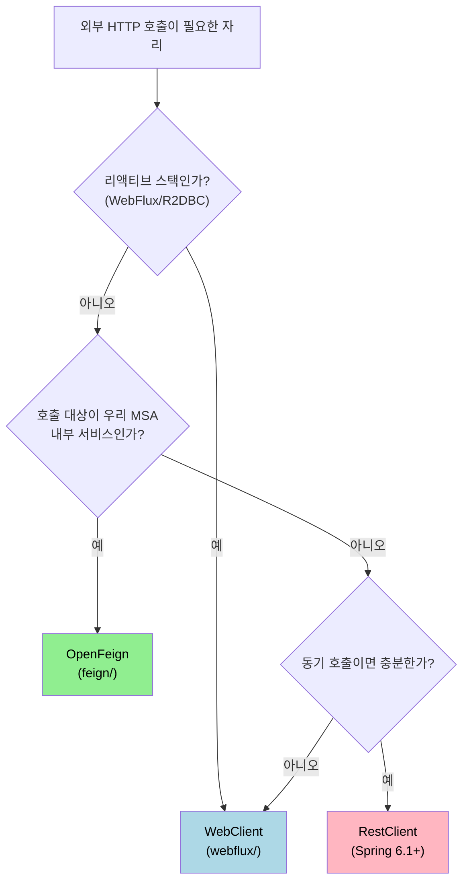

# Spring 네트워크 통신 학습 MOC

---

> Spring 환경에서 외부 HTTP 호출을 다루는 자리입니다. 같은 "외부로 요청을 보낸다" 라는 문제를 두 갈래의 다른 패러다임 — 리액티브 빌더(WebClient) 와 선언적 인터페이스(OpenFeign) — 가 어떻게 풀어내는지 한 폴더에서 비교합니다.

## 왜 두 갈래를 한 자리에 묶는가

> Spring HTTP 클라이언트가 하나뿐이라면 이 폴더는 필요 없습니다. 그런데 Spring Boot 3.3 / Spring Framework 6.2 / Spring Cloud 2023.0.x 시점에서는 RestTemplate (deprecated 진행 중), RestClient (6.1 신규), WebClient (리액티브), OpenFeign (선언적) 네 가지가 동시에 살아 있고, 어느 쪽을 골라야 하는지부터가 학습 비용의 절반을 차지합니다.

본 폴더는 그 중에서 *지금도 새 프로젝트에 권장되는 두 갈래* 를 묶어 둡니다. WebClient 는 리액티브·스트리밍·고동시성 영역을 책임지고, OpenFeign 은 MSA 간 동기 호출을 인터페이스 한 장으로 줄이는 자리를 책임집니다. 두 갈래의 결정 트리를 한 번 보고 나면, 본인 코드에서 어느 쪽을 써야 하는지 1분 안에 답할 수 있습니다.

이 결정 트리는 두 가지를 함께 알려줍니다. 첫째, 본 폴더가 다루는 두 갈래는 *상호 배타가 아니라 상호 보완* 입니다. 한 프로젝트 안에 둘이 공존하는 게 자연스러운 경우가 많습니다. 둘째, RestClient 는 본 폴더의 범위가 아니지만 결정 트리에는 등장합니다 — 동기·블로킹·내부 호출이 아닌 자리에서 RestClient 가 자주 정답이기 때문입니다.

## 두 갈래의 분업

> 각자 자리잡는 시나리오를 표로 정리합니다. "외부 호출이니 둘 다 가능합니다" 가 아니라 "어느 한 쪽이 분명히 더 잘 맞는다" 인 자리들을 짚습니다.

| 시나리오 | 권장 | 이유 |
|----------|------|------|
| 응답을 스트리밍으로 받아 부분 처리 | WebClient | `Flux<T>` 가 자연스러움 — 메모리 폭주 회피, backpressure 가 동작 |
| MSA 내부 서비스 호출 10+ 곳에서 공통 패턴 | OpenFeign | 인터페이스 한 장이면 호출 코드 0줄. 공통 헤더·재시도·서킷브레이커 일괄 적용 |
| Multipart 파일 업·다운 | WebClient | `MultipartBodyBuilder` + `ByteArrayResource` 가 풀로 받쳐줌 |
| 응답 시간 SLA 가 엄격한 동기 호출 | OpenFeign | 인터페이스 메서드 시그니처가 그대로 도메인 어휘. 호출부 가독성 우선 |
| 백오프 재시도와 fallback 을 정교하게 제어 | WebClient | `Retry.backoff(...)` + `onErrorResume` 조합이 표현력 좋음 |
| 외부 SaaS API 호출 (gateway 너머) | WebClient 또는 RestClient | OpenFeign 은 service discovery 전제가 자연스러워서 외부 API 호출은 어색함 |

## 폴더 구성

> 두 갈래는 각자 학습 묶음으로 분리합니다. 진입은 본인 코드 상황에 따라 어느 쪽이든 가능합니다.

| 폴더 | 다루는 범위 | 분량 | 비고 |
|------|------------|------|------|
| [webflux/](webflux/) | WebClient 입문·빌드·요청·응답·에러·필터·multipart·동기/비동기·테스트·TPS 사례 | 11편 | Spring Framework 6.2 / Reactor Netty 1.1 기준. 2026-05-09 작성 |
| [feign/](feign/) | OpenFeign 입문(WebClient 비교 포함) + 기본 설정과 인터페이스 선언 | 2편 (압축본) | Spring Cloud 2023.0.x 기준. 2026-05-27 작성 |

> webflux/ 는 풀 학습 묶음이고, feign/ 는 학습 시작점인 압축본 2편입니다. feign/ 풀 보강은 본인 프로젝트에서 실제로 OpenFeign 을 도입하기로 한 시점에 진행하는 편이 비용 대비 효과가 좋습니다.

## 학습 순서 추천

> 어디서부터 들어갈지는 본인의 현재 코드 상황으로 갈립니다. 세 가지 진입점을 둡니다.

1. **RestTemplate 사용자** — `webflux/01-01.WebClient 입문과 RestTemplate·RestClient 비교` 부터 시작합니다. 세 클라이언트의 결정 트리를 한 번 보고 나면 본인 코드의 어느 호출을 무엇으로 옮길지 1시간 안에 결론이 납니다.
2. **신규 MSA 프로젝트 설계 중** — `feign/01-01.OpenFeign 입문과 WebClient 비교` 부터 시작합니다. 인터페이스 한 장으로 호출 패턴을 통일하는 가치가 가장 잘 드러나는 자리이고, 본 묶음의 결정 트리도 같이 봅니다.
3. **기존 WebFlux 프로젝트에 외부 호출 추가** — `webflux/01-02.WebClient 빌드와 인프라 설정` 부터입니다. 이미 리액티브 스택이 깔려 있으면 OpenFeign 도입은 오히려 패러다임 충돌이 생기므로 WebClient 한 갈래로 일관성을 유지하는 편이 안전합니다.

## 환경과 버전

> 모든 코드 예제는 다음 조합에서 검증합니다.

| 항목 | 값 | 비고 |
|------|-----|------|
| Spring Boot | 3.3.x | 3.3.0 (2024-05) 이후 LTS 라인 |
| Spring Framework | 6.2.x | RestClient 정식 도입(6.1) + WebClient 안정화 |
| Spring Cloud | 2023.0.x | OpenFeign 4.x 라인이 묶여 있음. Boot 3.3 호환 |
| Java | 17+ | 21까지 호환 |
| Reactor Netty | 1.1.x | WebClient 의 기본 `HttpClient` |
| OpenFeign | 4.x | spring-cloud-starter-openfeign 4.x 가 가져옴 |

## 관련 문서

- [Spring 학습 통합 MOC](../README.md) — 분산 배치된 Spring 문서 전체 진입점
- [webflux/README.md](webflux/README.md) — WebClient 학습 묶음 11편 진입점
- [feign/README.md](feign/README.md) — OpenFeign 학습 묶음 진입점 (압축본 2편)
- [Spring Cloud OpenFeign Reference](https://docs.spring.io/spring-cloud-openfeign/docs/current/reference/html/) — feign/ 가 따라가는 공식 문서
- [Spring Framework — WebClient](https://docs.spring.io/spring-framework/reference/web-reactive/webclient.html) — webflux/ 가 따라가는 공식 문서
